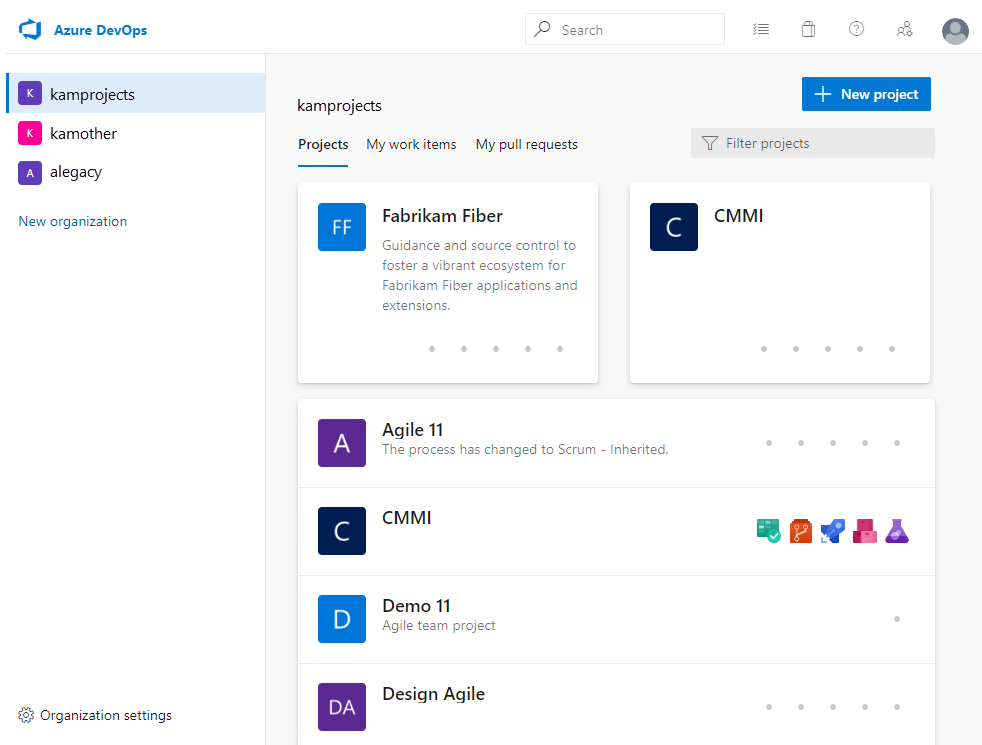
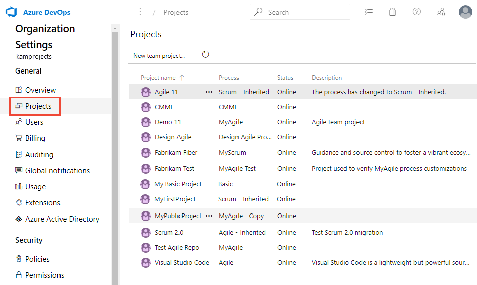

# Create a project in Azure DevOps and TFS

[!INCLUDE [temp](../../_shared/version-vsts-tfs-all-versions.md)]

Create a project to establish a repository for source code, where a group of developers and teams can plan, track progress, and collaborate on building software solutions. Each project you create provides boundaries to isolate data from other projects and must be managed and structured to support your business needs. To learn more about projects and when or when not to create one, see [About projects and scaling your organization](about-projects.md).

> [!NOTE]
> This article is about creating a project in Azure DevOps or a Team Foundation Server. If instead you want to create Azure DevOps Projects, see [Azure DevOps Projects](/azure/devops-project/).

<!---Projects differ from [software application projects or solutions](https://msdn.microsoft.com/library/zfzh36t7.aspx). -->  

If you have a project already, and want to start coding an application project, then see one of the following topics:  [Set up Git on your dev machine](../../repos/git/gitquickstart.md) or [Develop your app in Team Foundation version control](../../repos/git/gitquickstart.md).

::: moniker range=">= tfs-2013 <= tfs-2018"
> [!NOTE]
> If you don't want to manage an on-premises server, you can
[sign up for Azure DevOps Services and create a project](../accounts/create-organization.md).
::: moniker-end


## Prerequisites

::: moniker range="azure-devops" 

- You create a project within an organization. If you haven't created an organization yet, do that now. See [Sign up and invite teammates ](../../user-guide/sign-up-invite-teammates.md), which also creates a project, or [Create an organization](../accounts/create-organization.md).  
- You must be a member of the Project Collection Administrators group or have the **Create new projects** permission set to **Allow**. If you are the Organization Owner you're automatically added to the Project Collection Administrators group. If you aren't a member, get added now. For more information, see [Set permissions at the project- or collection-level](../security/set-project-collection-level-permissions.md).

::: moniker-end  

::: moniker range=">= tfs-2018 < azure-devops"  

- You create a project within a project collection. If you haven't created a project collection yet, do that now. See [Create a project collection](/azure/devops/server/admin/manage-project-collections?view=azure-devops#create-a-project-collection).
- You must be a member of the Project Collection Administrators group or have the **Create new projects** permission set to **Allow**. If you aren't a member, get added now. For more information, see [Set permissions at the project- or collection-level](../security/set-project-collection-level-permissions.md).

::: moniker-end  


::: moniker range="<= tfs-2017"  

- You create a project within a project collection. If you haven't created a project collection yet, do that now. See [Create a project collection](/azure/devops/server/admin/manage-project-collections?view=azure-devops#create-a-project-collection).
- You must be a member of the Project Collection Administrators group or have the **Create new projects** permission set to **Allow**. If you aren't a member, get added now. For more information, see [Set permissions at the project- or collection-level](/azure/devops/organizations/security/set-project-collection-level-permissions).
- Ask your TFS administrator about the following resources and get additional permissions as needed:

    - Which project collection should you connect to when you create your project? If you installed TFS using the Basic Server Configuration Wizard, you have only one project collection named **DefaultCollection**. Unless you are supporting hundreds of projects, you should create all your projects within a single project collection. If you need to create additional collections, see [Manage project collections](/azure/devops/server/admin/manage-team-project-collections).

    - Has SQL Server Analysis Services and SQL Server Reporting Services been configured for the deployment? If so, ask your administrator to [add you as a member of the Team Foundation Content Managers group](../../report/admin/grant-permissions-to-reports.md) on the server that hosts SQL Server Reporting Services. Without these permissions, you are unable to create a project.

    - Has a SharePoint Web application been configured for your deployment? If you want to configure a SharePoint portal when you create your project, ask the SharePoint administrator to give you Full Control permissions on the server that hosts SharePoint Products. Otherwise, you can skip this step and configure a portal at a later time.

::: moniker-end  	

::: moniker range="azure-devops"

> [!IMPORTANT]  
> To create a Public project, or to make a private project public, see [Create a public project](../public/create-public-project.md) or [Change the project visibility, public or private](../public/make-project-public.md). Additional policy settings must be enabled to work with public projects.

::: moniker-end

## Create a project

When you create a project, the main options you specify are:

- The organization or project collection where the project is defined.  For guidance, see [About projects and scaling your organization](about-projects.md).
- A project name. Your project name can't contain special characters (such as / : \ ~ & % ; @ ' " ? < > | # $ * } { , + = [ ]), can't begin with an underscore, can't begin or end with a period, and must be 64 characters or less. 
- A project description. Optional.
- The type of repository used for initial source control, Git or Team Foundation version control (TFVC). Git is selected as the default. You can add any type of repository later to your project. For guidance, see [Choosing the right source control for your project](../../repos/tfvc/comparison-git-tfvc.md). 
- The process used which determines the work item types available for tracking work using Azure Boards. The default process, Agile, is used if you don't specify another one. For guidance, see [Choose a process](../../boards/work-items/guidance/choose-process.md). 


#### [Browser](#tab/browser) 

::: moniker range="azure-devops"

1. Choose the  Azure DevOps logo to open the **Projects** page. Choose the organization, and then choose **Create Project**.

   > [!div class="mx-imgBorder"]  
   >   

2. Enter information into the form provided. Provide a name for your project, and choose the visibility, initial source control type, work item process. Visibility can be either public or private. With public visibility, anyone on the internet can view your project. With private visibility, only people who you give access to can view your project. For details on public projects, see [Create a public project](../public/create-public-project.md). If the **Public** option is grayed out, you need to change the policy.

   > [!div class="mx-imgBorder"]  
   >   

   See [choosing the right version control for your project](../../repos/tfvc/comparison-git-tfvc.md) and [choose a process](../../boards/work-items/guidance/choose-process.md) for guidance.  

3. When your project has been created, the welcome page appears.

   > [!div class="mx-imgBorder"]  
   > 

   Select one of the following tasks to get started:
   - **Invite** to begin [adding others to your project](../security/add-users-team-project.md). Note, you can only invite users who have already been [added to your organization](../accounts/add-team-members.md).
   - **Boards** to begin [adding work items](../../boards/work-items/view-add-work-items.md).
   - **Repos** to open [Repos>Files](../../repos/git/clone.md) page where you can clone or import a repository, or initialize a README file for your project summary page.
   - **Pipelines** to start [defining a pipeline](../../pipelines/index.yml).
   - **Test Plans** to start [defining test plans and test suites](../../test/create-a-test-plan.md).
   - [Manage your services](../settings/set-services.md) to disable the visibility of one or more services.

::: moniker-end


::: moniker range="azure-devops-2019"

1. Choose the  Azure DevOps logo to open the **Projects** page, and then choose **Create Project**.

   > [!div class="mx-imgBorder"]  
   >   

2. Enter information into the form provided. Provide a name for your project, and optionally a description. Expand **Advanced** to select the initial source control type and work item process. 

   > [!div class="mx-imgBorder"]  
   >   

   See [choosing the right version control for your project](../../repos/tfvc/comparison-git-tfvc.md) and [choose a process](../../boards/work-items/guidance/choose-process.md) for guidance.  

3. When your project has been created, the welcome page appears.

   > [!div class="mx-imgBorder"]  
   > 

   Select one of the following tasks to get started:
   - **Boards** to begin [adding work items](../../boards/work-items/view-add-work-items.md).
   - **Repos** to open [Repos>Files](../../repos/git/clone.md) page where you can clone or import a repository, or initialize a README file for your project summary page.
   - **Pipelines** to start [defining a pipeline](../../pipelines/index.yml).
   - **Test Plans** to start [defining test plans and test suites](../../test/create-a-test-plan.md).
   - [Manage your services](../settings/set-services.md) to disable the visibility of one or more services.

::: moniker-end

::: moniker range="tfs-2018"

1. Choose the  Azure DevOps logo to open the **Projects** page, and then choose **New Project**.

   > [!div class="mx-imgBorder"]  
   >   

2. Fill out the form provided. Provide a name for your new project, initial source control type, work item process. 

   > [!div class="mx-imgBorder"]  
   >  

3. Upon successful completion, the project summary displays. To learn more, see [Share your project vision](project-vision-status.md).

::: moniker-end

::: moniker range=">= tfs-2018 < azure-devops"

> [!IMPORTANT]  
> When you create a project from the web portal, several process template files are ignored. Specifically, the files that would create a Report Manager site aren't supported. You can add reports later by following the instructions provided in [Add reports to a project](../../report/admin/add-reports-to-a-team-project.md). 

::: moniker-end

::: moniker range=">= tfs-2015 <= tfs-2017"

Creating a project from the web portal is supported for TFS 2015.2 and later versions. For earlier versions, use [Team Explorer to create a project](#te). 

> [!IMPORTANT]  
> When you create a project from the web portal, several process template files are ignored. Specifically, the files that would create a Report Manager site and a SharePoint project portal aren't supported. You can still set up [Reporting](../../report/admin/add-reports-to-a-team-project.md) and [SharePoint](/azure/devops/server/admin/add-sharepoint-to-tfs) manually after project creation.
>
> If you want these features to be to be available, then create your project from Visual Studio/Team Explorer. For details, see [Process template and plug-in files, Client support for project creation](../../reference/process-templates/overview-process-template-files.md#client-support). 

1. If you have TFS 2015.2 or a later version, choose the  to open the **Projects** page, and then choose **New Project**.

   > [!div class="mx-imgBorder"]  
   >   
   
	Otherwise, for TFS 2015 or TFS 2015.1, open the administration overview page by choosing the  gear icon at the top of the page and choose **Server settings**. Then choose **New project...**.

   > [!div class="mx-imgBorder"]  
   > 

   Select the collection administration page for the collection you want to create the project in from the left pane, and choose **Create a new project...**.

2. Enter information into the form provided. Provide a name for your new project, a short description, and select its initial source control type and work item tracking process.

    > [!div class="mx-imgBorder"]  
    > 

::: moniker-end

::: moniker range="tfs-2013"

Creating a project from the web portal isn't supported for TFS 2015 and earlier versions. Use [Team Explorer to create a project](#te).  

::: moniker-end

#### [Team Explorer](#tab/team-explorer)

::: moniker range="azure-devops"

If you choose to add a team project from Visual Studio/Team Explorer, you'll be redirected to the web portal.  Creating a project from Team Explorer is not supported for Azure DevOps Services. 

::: moniker-end

::: moniker range=">= tfs-2018 <= azure-devops-2019"

> [!NOTE]
> For TFS 2018 and later versions, users are redirected to the web portal. Creating a project from Visual Studio/Team Explorer is not supported for TFS 2018 and later versions, including Azure DevOps Server 2019 and Azure DevOps Services.   
>
> TFS 2018 and later versions no longer support native integration with SharePoint products. If you're planning to upgrade to TFS 2018, read [About SharePoint integration](../../report/sharepoint-dashboards/about-sharepoint-integration.md) to learn about the options available to you.

::: moniker-end

<a id="te"> </a>


::: moniker range="<= tfs-2017"

You can create a project from Visual Studio/Team Explorer after you have connected to an on-premises Azure DevOps Server.

1. Open the same version of Visual Studio as the version of TFS that you're connecting to. If you don't see the Team Explorer pane, open **View\>Team Explorer** from the menu.

    As needed, [Download and install Visual Studio Community](https://visualstudio.microsoft.com/products/visual-studio-community-vs.aspx) to get a free copy of the latest version.

1. Connect to the server and project collection where you want to create your project.

    

    You can access Team Explorer for free by installing [Visual Studio Community](https://visualstudio.microsoft.com/downloads/download-visual-studio-vs) or any other Visual Studio version.

    You must connect from a client that is at the same version level as TFS. That is, you must connect to TFS 2015 from a version of Visual Studio 2015.

    

    > [!TIP]
    > If you are running Team Explorer from a server that hosts SharePoint Products and SQL Server Reporting Services, you might need to run Visual Studio as an administrator.

1. If it's your first time connecting to TFS, you need to add TFS to the list of recognized servers.

    

6. Open the New Project Wizard.

    

1. Name the project. Don't specify more than 64 characters.

    

1. Choose a process template. For a comparison of the default process templates, see [Choose a process](../../boards/work-items/guidance/choose-process.md).

    

1. Choose your version control, either Git distributed repositories or TFVC, one centralized repository.

    

    Not sure which system to use? Learn more about 
    [Git](../../repos/git/overview.md) or [TFVC](../../repos/tfvc/overview.md).

    After you've created your project, you can [add repositories](#add-a-repository).

1. Unless your project collection is configured to support a SharePoint project portal, you're done.

    

    If the Next button is active, you can configure your project portal.

    If the wizard encounters a problem, you receive an error message and a link to the project creation log. Review the [log file](faq-create-project.md#log-file) for specific errors and exceptions.

1. When you're finished, you can see your project in Team Explorer. You can also choose the **Web Access** link to connect to your project from the web portal.

	<tbody valign="top">
	</tbody>
	
	<table>
	<tbody valign="top">
	<tr>
    <td></td>
    <td></td>
	</tr>
	</tbody>
	</table>

::: moniker-end


#### [Azure DevOps CLI](#tab/azure-devops-cli)

::: moniker range="azure-devops"  

<a id="create-project" /> 

You can create a project defined for a project using [az devops project create](/cli/azure/ext/azure-devops/devops/project#ext-azure-devops-az-devops-project-create) command. To get started, see [Get started with Azure DevOps CLI](../../cli/index.md).  

> [!div class="tabbedCodeSnippets"]
```CLI
az devops project create --name
                         [--description]
                         [--open]
                         [--org]
                         [--process]
                         [--source-control {git, tfvc}]
                         [--visibility {private, public}]
```

#### Parameters 
- **name**: Required. Name of the project to be added.  
- **description**: Optional. Short description of the project. Enclose the description in quotes.  
- **open**: Optional. Once the project is created, open it in the default web browser.
- **org**: Optional. Azure DevOps organization URL. You can configure the default organization using `az devops configure -d organization=ORG_URL`. Required if not configured as default or picked up via git config. Example: `https://dev.azure.com/MyOrganizationName/`.
- **process**: Optional. The process model to use, such as *Agile*, *Basic*, *Scrum*, *CMMI*, or other custom process model. If not specified, the default is used. To learn more, see [About process customization and inherited processes](../settings/work/inheritance-process-model.md). 
- **source-control**: Optional. Type of source control repository to create for the project: *git* (default) or *tfvc*. If not Name or ID of the project. Example: --project "Fabrikam Fiber". 
- **visibility**: Optional. Project visibility. Accepted values: *private* (default), *public*.
   

#### Example

The following command creates a new project named *MyFirstProject* under the Fabrikam organization, with the *Agile* process, and *git* source control. For other output format options, see [Output formats for Azure CLI commands](/cli/azure/format-output-azure-cli).

> [!div class="tabbedCodeSnippets"]
```CLI
C:\WINDOWS\system32>az devops project create --name MyFirstProject --description "Test project 1" --process Agile --source-control  git --org https://dev.azure.com/fabrikam/ --output table
ID                                    Name             Visibility    Process    Source Control
------------------------------------  ---------------  ------------  ---------  ----------------
d45ea33b-c61a-4b38-bb84-eccca71de2f1  MyFirstProject1  Private       Agile      Git
```

::: moniker-end

[!INCLUDE [temp](../../_shared/note-cli-not-supported.md)]

---


## List and connect to projects

#### [Browser](#tab/browser)  

Connect to a project, collection, or server from your web browser. 

::: moniker range="azure-devops" 

1. To view the projects defined for an organization, choose the   Azure DevOps logo to open the **Projects** page.

1. Choose the organization to view the list of projects. The last two or three projects you connected to are listed at the top. Choose any project to connect to that project. 

	> [!div class="mx-imgBorder"]  
	>   

1. Or, choose **Organization settings** and then choose **Projects** to list all projects. 

	> [!div class="mx-imgBorder"]  
	>   

	From this page you can choose a project to open the [project settings](../settings/about-settings.md) for that project. Or, you can [Rename a project](rename-project.md) or [Delete a project](delete-project.md). 

::: moniker-end  

::: moniker range=">= tfs-2018 <= azure-devops-2019"  

1. To view the projects defined for a collection, choose the   Azure DevOps logo to open the **Projects** page.

1. Choose the collection to view the list of projects. The last two or three projects you connected to are listed at the top. Choose any project to connect to that project. 

	> [!div class="mx-imgBorder"]  
	>   

1. Or, choose **Admin settings** and then choose **Projects** to list all projects. 

	> [!div class="mx-imgBorder"]  
	>   

	From this page you can choose a project to open the [project settings](../settings/about-settings.md). Or, you can [Rename a project](rename-project.md) or [Delete a project](delete-project.md). 

::: moniker-end  


::: moniker range="<= tfs-2017"  

Open the administration overview page by choosing the  gear icon at the top of the page and choose **Collection settings**. 

> [!div class="mx-imgBorder"]  
> 

From this page you can choose a project to open the [project settings](../settings/about-settings.md). Or, you can [Rename a project](rename-project.md) or [Delete a project](delete-project.md). 

::: moniker-end  

#### [Team Explorer](#tab/team-explorer)

From Team Explorer, you can view a list of projects by connecting to an organization or server. For details, see [Connect to a project](connect-to-projects.md).

#### Visual Studio 2019
> [!div class="mx-imgBorder"]  
>   

#### Visual Studio 2017

> [!div class="mx-imgBorder"]  
>   

#### Visual Studio 2015

> [!div class="mx-imgBorder"]  
>   


#### [Azure DevOps CLI](#tab/azure-devops-cli)

::: moniker range="azure-devops"  

<a id="list-projects" /> 

### List projects

You can lists project defined for an organization using [az devops project list](/cli/azure/ext/azure-devops/devops/project#ext-azure-devops-az-devops-project-list) command. To get started using Azure DevOps CLI, see [Get started with Azure DevOps CLI](../../cli/index.md).  

> [!div class="tabbedCodeSnippets"]
```CLI
az devops project list [--org]
                       [--skip]
                       [--top]
```

#### Parameters 
- **org**: Optional. Azure DevOps organization URL. You can configure the default organization using `az devops configure -d organization=ORG_URL`. Required if not configured as default or picked up via git config. Example: `https://dev.azure.com/MyOrganizationName/`.
- **skip**: Optional. Number of results to skip. 
- **top**: Optional. Maximum number of results to list. 


#### Example

The following command lists the projects defined under the Fabrikam organization. For other output format options, see [Output formats for Azure CLI commands](/cli/azure/format-output-azure-cli).

> [!div class="tabbedCodeSnippets"]
```CLI
C:\WINDOWS\system32>az devops project list --org https://dev.azure.com/fabrikam/ --output table
ID                                    Name                Visibility
------------------------------------  ------------------  ------------
9a61d475-b1a7-4da7-b9db-80df15ac985c  Agile 11            Private
e743b28e-6f7c-4483-8716-224c8520dd0f  CMMI                Private
14c92f9d-9fff-48ec-8171-9d1106056ab3  Demo 11             Private
1965830d-5fc4-4412-8c71-a1c39c939a42  Design Agile        Private
56af920d-393b-4236-9a07-24439ccaa85c  Fabrikam Fiber      Private
69265579-a1e0-4a30-a141-ac9e3bb82572  Fabrikam Test       Private
131271e0-a6ad-49ba-837e-2d475ab2b169  My Basic Project    Private
5417a1c3-4b04-44d1-aead-50774b9dbf5f  MyFirstProject      Private
c932f260-5805-4ba0-9a70-b448de20dda8  MyPublicProject     Public
0611925a-b287-4b0b-90a1-90f1a96e9f1f  Scrum 2.0           Private

```

### Show project information, and open in web portal

You can list project information and optionally open the project in the web portal using [az devops project show](/cli/azure/ext/azure-devops/devops/project#ext-azure-devops-az-devops-project-show) command.  

> [!div class="tabbedCodeSnippets"]
```CLI
az devops project show --project
                       [--open]
                       [--org]
```

#### Parameters 
- **project**: OptionalRequired. Name or ID of the project. Example: --project "Fabrikam Fiber". 
- **open**: Optional. Open the project in the default web browser. 
- **org**: Optional. Azure DevOps organization URL. You can configure the default organization using `az devops configure -d organization=ORG_URL`. Required if not configured as default or picked up via git config. Example: `https://dev.azure.com/MyOrganizationName/`.


#### Example

The following command lists information for MyFirstProject under the Fabrikam organization and opens it in the web portal. For other output format options, see [Output formats for Azure CLI commands](/cli/azure/format-output-azure-cli).

> [!div class="tabbedCodeSnippets"]
```CLI
C:\WINDOWS\system32>az devops project show --project MyFirstProject --open --org https://dev.azure.com/fabrikam/ --output table
ID                                    Name            Visibility    Process            Source Control
------------------------------------  --------------  ------------  -----------------  ----------------
5417a1c3-4b04-44d1-aead-50774b9dbf5f  MyFirstProject  Private       Scrum - Inherited  Git

```

::: moniker-end

[!INCLUDE [temp](../../_shared/note-cli-not-supported.md)]

---

<a id="add-a-repository" />

::: moniker range=">= tfs-2015"

## Add a repository to your project

From the admin context of the web portal, you can add additional repositories to a project, either Git (distributed) or TFVC (centralized). While you can create many Git repositories, you can only create a single TFVC repository for a project.  Additional steps to address permissions may be required. See [Use Git and TFVC repos in the same project](../../repos/git/team-projects.md).

::: moniker-end

::: moniker range=">= tfs-2017"

> [!div class="mx-imgBorder"]  
>   

Name the repository and choose **Create**.

> [!div class="mx-imgBorder"]  
>   

::: moniker-end

::: moniker range="tfs-2015"


> [!NOTE]
> The ability to work from both Git and TFVC repositories from the same project is supported when you connect to TFS 2015.1 and later versions.

::: moniker-end

## Next steps

> [!div class="nextstepaction"]
> [Get started as an administrator](../../user-guide/project-admin-tutorial.md)

## Related articles

- [Use Git](../../repos/git/overview.md)
- [Develop your app in TFVC](../../repos/tfvc/index.md)
- [Additional project structure activities](about-projects.md#project-structure)


