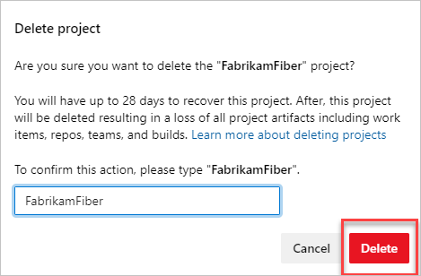

# Delete a project

[!INCLUDE [temp](../../_shared/version-vsts-tfs-all-versions.md)]    

In this article, learn how to delete a project from Azure DevOps. Deleting a project helps simplify the navigation to projects that are only in use.

> [!Caution]
> Projects are permanently deleted, if not restored within 28 days. For more information on restoring projects, see [Restore a project](restore-project.md). If you want to access project data while the project is deleted (without [restoring it](restore-project.md)) you should [save project data](save-project-data.md).

::: moniker range=">= azure-devops-2019"

## Delete project

1. Sign in to your organization (```https://dev.azure.com/{yourorganization}```).

2. Select  **Organization settings**.

   

3. Select **Projects**, and then check one or more projects to delete. Select **Delete**. 

   :::image type="content" source="_img/delete-project/delete-multiple-projects.png" alt-text="In Organization settings, select Projects, check each project, delete":::

4. Confirm deletion by entering the project name, and then select **Delete** in the popup screen.

    

Your project is deleted and can be restored up to 28 days afterward.

::: moniker-end

<a name="delete-team-proj"></a>

::: moniker range=">= tfs-2015 <= tfs-2018"


[!INCLUDE [temp](../../_shared/open-admin-organization-settings.md)]

## Delete a project from TFS

Using the administration console, you can delete a project from a project collection. Afterwards, you'll need to manually delete any associated reports and SharePoint project portal. Or, you can use the [TFSDeleteProject command line tool](/azure/devops/server/command-line/tfsdeleteproject-cmd) to delete all artifacts.

1. If you're not a member of one or more of the following administrator groups, [get permissions now](/azure/devops/server/admin/add-administrator-tfs):

    - Team Foundation Administrators group (required).

    - SQL Server System Administrators group (required).

    - Farm Administrators group for SharePoint Products (required when your deployment uses SharePoint Products).

2. Open the administration console for TFS and delete the project from its project collection.

    

3. Choose whether to delete external data associated with the project and then initiate the delete action.

    

4. (Optional) To review the status of the delete action, open the **Status** tab.

    To review the details of the delete action, you can open the log file from either the **Status** tab or **Logs** tab.

::: moniker-end


::: moniker range=">= tfs-2015 <= tfs-2018"

## Delete reports that remain after deleting a project

If your on-premises project used reporting, and you didn't choose to delete external artifacts, you can delete the reports using SQL Server Report Manager. From the project collection page, delete the folder that corresponds to the deleted project.


::: moniker-end

::: moniker range=">= tfs-2015 <= tfs-2018"

## Remove the project portal

If your on-premises project had a project portal, all links to that portal are removed from TWA and Team Explorer, but the SharePoint site or website that acted as the portal is not deleted. If you want to delete the portal, you must do so manually after the project has been deleted. See [How to: Create, Edit, and Delete Windows SharePoint Services Sites](/previous-versions/visualstudio/visual-studio-2010/ms253110(v%3dvs.100)).

::: moniker-end

::: moniker range=">= tfs-2015 <= tfs-2018"

## What to do if the delete action doesn't finish

Review the status and log files for the delete action. Open the **Status** tab and for **Deleted**, review the additional information in parentheses, and take the indicated action.

- (**Processing**) means that the process has started and is in progress.

- (**Pending**) means that the deletion process has started from a client application. The deletion might be in progress or might have failed. Because the process was started from a client application, the server cannot accurately report the status of the deletion.

    If a project deletion remains pending for a long time, try to delete the project again from the administration console.

- (**Failed**) means that the deletion process started but did not successfully finish. The log file contains specific information about the failure.

    Review the information about the failure, and then try to delete the project again.

    If partial data remains, you can also use the [TFSDeleteProject](/azure/devops/server/command-line/tfsdeleteproject-cmd) command line tool.

::: moniker-end