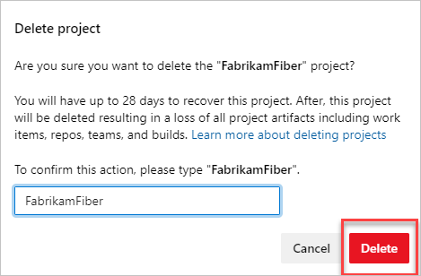

# Delete a project

[!INCLUDE [version-all](../../includes/version-all.md)]  

If you have a project that's no longer valid, you can delete it from your organization or collection in Azure DevOps. Or, if you are migrating from an on-premises Azure DevOps Server to Azure DevOps Services, you'll need to delete project(s). Deleting projects also helps to simplify navigating to only those projects that are in use. 

> [!Caution]
> Deleting projects from the web portal generate a soft-delete where projects get permanently deleted if not restored within 28 days. Projects deleted from the on-premises Azure DevOps Administration Console undergo a hard delete and cannot be restored. For more information on restoring projects, see [Restore a project](restore-project.md). If you want to access project data while the project is deleted (without [restoring it](restore-project.md)) you should [save project data](save-project-data.md).

## Prerequisites

::: moniker range="azure-devops" 

- You must be a member of the Project Collection Administrators group or have the **Delete team project** permission set to **Allow**. If you're the Organization Owner, you're automatically added to the Project Collection Administrators group. If you aren't a member, get added now. For more information, see [Set permissions at the project- or collection-level](../security/set-project-collection-level-permissions.md).

::: moniker-end

::: moniker range=">= tfs-2018 < azure-devops"  

- You must be a member of the Project Collection Administrators group or have the **Delete team project** permission set to **Allow**. If you aren't a member, get added now. For more information, see [Set permissions at the project- or collection-level](../security/set-project-collection-level-permissions.md).

::: moniker-end  

::: moniker range="<= tfs-2017"  

- You must be a member of the Project Collection Administrators group or have the **Delete team project** permission set to **Allow**. If you aren't a member, get added now. For more information, see [Set permissions at the project- or collection-level](../security/set-project-collection-level-permissions.md).

::: moniker-end

::: moniker range=">= azure-devops-2020"

## Delete project

::: moniker-end

#### [Browser](#tab/browser) 

Use your web browser to perform a soft-delete. After 28 days, projects will be  permanently deleted if not restored within that time.

::: moniker range=">= azure-devops-2019"

1. Sign in to your organization (```https://dev.azure.com/{yourorganization}```).

2. Select  **Organization settings**.

   

3. Select **Projects**, and then check one or more projects to delete. Select **Delete**. 

   :::image type="content" source="media/delete-project/delete-multiple-projects.png" alt-text="In Organization settings, select Projects, check each project, delete":::

4. Confirm deletion by entering the organization name, and then select **Delete** in the popup screen.

    

::: moniker-end


::: moniker range="<= tfs-2018"

1. Choose the :::image type="icon" source="/azure/devops/media/icons/gear-icon.png" border="false"::: gear icon to open **Collection Settings**.

	> [!div class="mx-imgBorder"]  
	> 

2. From there, you can choose a page. Settings are organized based on the service they support.

	> [!div class="mx-imgBorder"]  
	> 

::: moniker-end

Your project is deleted and can be restored up to 28 days afterward. Your deleted project is removed from your projects list.


#### [Administration Console](#tab/admin-console) 


<a name="delete-team-proj"></a>

::: moniker range="azure-devops"
The Administration Console is only supported for on-premises Azure DevOps Servers.

::: moniker-end
::: moniker range="< azure-devops"


Use the Azure DevOps Administration Console to perform a hard delete. Projects are permanently deleted and not subject to restoration.

Using the administration console, you can delete a project from a project collection. Afterwards, you'll need to manually delete any associated reports and SharePoint project portal. Or, you can use the [TFSDeleteProject command line tool](/azure/devops/server/command-line/tfsdeleteproject-cmd) to delete all artifacts.

1. If you're not a member of one or more of the following administrator groups, [get permissions now](/azure/devops/server/admin/add-administrator):

    - Team Foundation Administrators group (required).

    - SQL Server System Administrators group (required).

    - Farm Administrators group for SharePoint Products (required when your deployment uses SharePoint Products).

2. Open the administration console and delete the project from its project collection.

    :::image type="content" source="media/delete-project/delete-project-2019-1.png" alt-text="Admin Console, Delete project."::: 

3. Choose whether to delete external data associated with the project and then start the delete action.

    :::image type="content" source="media/delete-project/confirm-deletion.png" alt-text="Delete team projects dialog."::: 

4. (Optional) To review the status of the delete action, open the **Status** tab.

    To review the details of the delete action, you can open the log file from either the **Status** tab or **Logs** tab.

::: moniker-end

#### [Azure DevOps CLI](#tab/azure-devops-cli) 

::: moniker range=">= azure-devops-2020"

You can delete a team project with the [az devops project delete](/cli/azure/devops/project#ext-azure-devops-az-devops-project-delete) command. To get started, see [Get started with Azure DevOps CLI](../../cli/index.md).

```azurecli 
az devops project delete --id
                         [--org]
                         [--yes] 
``` 

#### Parameters 

- **id**: Required. The ID of the project you want to delete. To determine the ID of a project, use the [az devops project list](/cli/azure/devops/project#ext-azure-devops-az-devops-project-list) command.
- **org**: Azure DevOps organization URL. You can configure the default organization using `az devops configure -d organization=ORG_URL`. Required if not configured as default or picked up using `git config`. Example: `--org https://dev.azure.com/MyOrganizationName/`.
- **yes**: Don't prompt for confirmation.

::: moniker-end
[!INCLUDE [temp](../../includes/note-cli-supported-server.md)]  
::: moniker range=">= azure-devops-2020"

#### Example 

The following command deletes the team project with the specified ID without prompting you for confirmation.

```azurecli 
az devops project delete --id 9a61d475-b1a7-4da7-b9db-80df15ac985c --yes
``` 

::: moniker-end

[!INCLUDE [temp](../../includes/note-cli-not-supported.md)] 

* * * 

 

::: moniker range="<= azure-devops-2020"

## Delete reports that remain after deleting a project

If your project used SQL Server reporting and you didn't delete external artifacts, you can delete the reports using SQL Server Report Manager. From the project collection page, delete the folder that corresponds to the deleted project.


::: moniker-end

::: moniker range="<= tfs-2018"

## Remove the project portal

If your project had a project portal, all links to that portal get removed from TWA and Team Explorer. But, the SharePoint site or website that acted as the portal doesn't get deleted. If you want to delete the portal, you must do so manually after the project has been deleted. See [How to: Create, Edit, and Delete Windows SharePoint Services Sites](/previous-versions/visualstudio/visual-studio-2010/ms253110(v%3dvs.100)).

::: moniker-end

## FAQs

See the following frequently asked questions about deleting projects in Azure DevOps.

### Q: After deleting one project, why do work items in a remaining project still have links to the deleted project work items? 

A: Work items get deleted within 24 hours after your project is deleted.

### Q: I deleted a project in Azure DevOps, but in Visual Studio Team Explorer it's still there, what do I do?

A: Wait 28 days before the project is permanently deleted.

::: moniker range="<= tfs-2018"

### Q: What if the delete action doesn't finish?

A: Review the status and log files for the delete action. Open the **Status** tab and for **Deleted**, review the additional information in parentheses, and take the indicated action.

- (**Processing**) means that the process has started and is in progress.

- (**Pending**) means that the deletion process has started from a client application. The deletion might be in progress or might have failed. Because the process was started from a client application, the server can't accurately report the status of the deletion.

    If a project deletion remains pending for a long time, try to delete the project again from the administration console.

- (**Failed**) means that the deletion process started but didn't successfully finish. The log file contains specific information about the failure.

    Review the information about the failure, and then try to delete the project again.

    If partial data remains, you can also use the [TFSDeleteProject](/azure/devops/server/command-line/tfsdeleteproject-cmd) command-line tool.

::: moniker-end

## Related articles

- [Create a project](create-project.md)
- [Restore a project](restore-project.md)
- [Delete a project with REST API](/rest/api/azure/devops/core/projects/delete)
- [TFSDeleteProject command line tool](/azure/devops/server/command-line/tfsdeleteproject-cmd)
