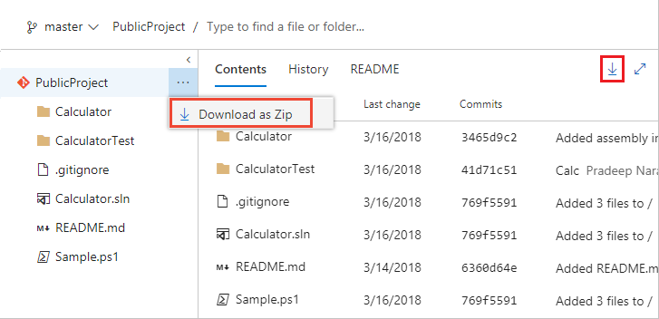
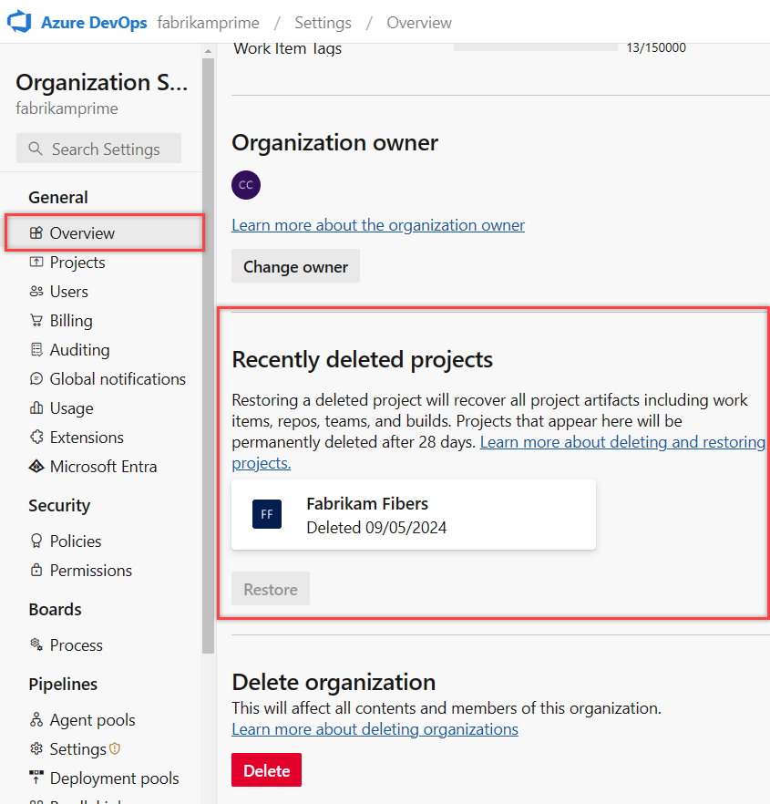

# Delete a project

[!INCLUDE [version-gt-eq-2019](../../includes/version-gt-eq-2019.md)] 

If a project becomes obsolete, you can [delete it](#delete-project) from your organization or collection in Azure DevOps. If you're migrating from an on-premises Azure DevOps Server to Azure DevOps Services, you might also need to delete the project. Removing unused projects can enhance navigation by limiting it to only those projects that are currently in use.

> [!CAUTION]
> - Soft-deleted projects from the web portal are permanently removed if not restored within 28 days.
> - In rare cases, our deletion process might take up to 70 days due to backend retries and the need to delete data from multiple sources.
> - Hard-deleted projects from the on-premises Azure DevOps Administration Console can't be restored.
> For more information, see [Restore a project](#restore-a-deleted-project) and [Save project data](#save-project-data).

## Prerequisites

::: moniker range="azure-devops"

| Category | Requirements |
|--------------|-------------|
|**Permissions**|- Member of the [Project Collection Administrators group](../security/look-up-project-collection-administrators.md). Organization owners are automatically members of this group.<br>- **Delete team project** permission set to **Allow**. For more information, see [View project-level permissions](../security/view-permissions.md#view-project-level-permissions).|
|**Optional**| [Save project data](#save-project-data) before deleting a project if you want to access project data without restoring it.|

::: moniker-end

::: moniker range=" < azure-devops"

| Category | Requirements |
|--------------|-------------|
|**Permissions**| **Delete team project** permission set to **Allow**. For more information, see [View permissions](../security/view-permissions.md).|
|**Optional**| [Save project data](#save-project-data), as deleting a project results in irreversible data loss.|

::: moniker-end  

## Save project data

Use the following procedures to save data that users most care about, such as source code, build data, and work items. This procedure is optional and something you might consider before you delete a project.

* **Source code and custom build templates:** Download your files as a zip file. Select  for the repository, file, or folder and select **Download as Zip**. Or, select :::image type="icon" source="../../boards/media/icons/download-icon.png" border="false"::: **Download** to download either all of the files in the currently selected folder, or the currently selected file.

  > [!div class="mx-imgBorder"]
  > 

  This process doesn't save any change history or links to other artifacts. If you use Git, [clone your repositories](../../repos/git/gitquickstart.md) to retain the full project history and all the branches.

* **Build data**: To save logs and data in your drop build folders, see [View build results](/previous-versions/ms181733(v=vs.140)).

* **Work item tracking data:** Create a work item query and open it [using Excel](../../boards/backlogs/office/bulk-add-modify-work-items-excel.md). Save the Excel spreadsheet.

   This process doesn't save any attachments, change history, or links to other artifacts.

For more information, see our [Data Protection Overview](../../organizations/security/data-protection.md).

::: moniker range=">= azure-devops-2020"

## Delete project

::: moniker-end

#### [Browser](#tab/browser) 

Use your web browser to perform a soft-delete. After 28 days, projects are  permanently deleted if not restored within that time.

::: moniker range="<=azure-devops"

1. Sign in to your organization (```https://dev.azure.com/{yourorganization}```).

2. Select  **Organization settings**.

   

3. Select **Projects**, check one or more projects to delete, and then select **Delete**. 

   :::image type="content" source="media/delete-project/delete-project-organization-settings.png" alt-text="Screenshot of sequence selected Projects, check each project, and delete.":::

4. Confirm deletion by entering the project name, and then select **Delete** in the popup screen.

    

::: moniker-end

Your project is deleted and can be restored up to 28 days afterward. Your deleted project is removed from your projects list.

#### [Administration Console](#tab/admin-console) 

<a name="delete-team-proj"></a>

::: moniker range="azure-devops"
The Administration Console is only supported for on-premises Azure DevOps Servers.

::: moniker-end
::: moniker range="< azure-devops"

Use the Azure DevOps Administration Console to perform a hard delete. Projects are permanently deleted and not subject to restoration.

Using the administration console, you can delete a project from a project collection. Afterwards, you need to manually delete any associated reports and SharePoint project portal. Or, you can use the [TFSDeleteProject command line tool](/azure/devops/server/command-line/tfsdeleteproject-cmd) to delete all artifacts.

1. If you're not a member of one or more of the following administrator groups, [get permissions now](/azure/devops/server/admin/add-administrator):

    - Team Foundation Administrators group (required).
    - SQL Server System Administrators group (required).
    - Farm Administrators group for SharePoint Products (required when your deployment uses SharePoint Products).

2. Open the administration console and delete the project from its project collection.

    :::image type="content" source="media/delete-project/delete-project-2019-1.png" alt-text="Screenshot of Admin Console, Delete project."::: 

3. Choose whether to delete external data associated with the project and then start the delete action.

    :::image type="content" source="media/delete-project/confirm-deletion.png" alt-text="Screenshot of Delete team projects dialog."::: 

4. (Optional) To review the status of the delete action, open the **Status** tab.

    To review the details of the delete action, you can open the log file from either the **Status** tab or **Logs** tab.

::: moniker-end

#### [Azure DevOps CLI](#tab/azure-devops-cli) 

::: moniker range="azure-devops"

You can delete a team project with the [az devops project delete](/cli/azure/devops/project#az-devops-project-delete) command. To get started, see [Get started with Azure DevOps CLI](../../cli/index.md).

```azurecli 
az devops project delete --id
                         [--org]
                         [--yes] 
```

#### Parameters 

- **id**: Required. The ID of the project you want to delete. To determine the ID of a project, use the [az devops project list](/cli/azure/devops/project#az-devops-project-list) command.
- **org**: Azure DevOps organization URL. You can configure the default organization using `az devops configure -d organization=ORG_URL`. Required if not configured as default or picked up using `git config`. Example: `--org https://dev.azure.com/MyOrganizationName/`.
- **yes**: Don't prompt for confirmation.

#### Example 

The following command deletes the team project with the specified ID without prompting you for confirmation.

```azurecli 
az devops project delete --id 9a61d475-b1a7-4da7-b9db-80df15ac985c --yes
```

::: moniker-end

[!INCLUDE [temp](../../includes/note-cli-not-supported.md)] 

***

::: moniker range="< azure-devops"

## Delete reports that remain after deleting a project

If your project used SQL Server reporting and you didn't delete external artifacts, you can delete the reports using SQL Server Report Manager. From the project collection page, delete the folder that corresponds to the deleted project.


::: moniker-end

## Restore a deleted project

If you inadvertently delete a project in Azure DevOps, you can restore it within 28 days of its deletion.

::: moniker range="azure-devops"

1. Sign in to your organization (```https://dev.azure.com/{Your_Organization}```).
2. Select  **Organization settings**.

   

3. Select **Overview**, and then scroll down to "recently deleted projects."

   

4. Highlight the project you want to restore, and then select **Restore**.

   

::: moniker-end

::: moniker range="<azure-devops"

1. Sign in to your instance (```http://{ServerName:8080/tfs/}/{CollectionName}```).
2. Choose  **Admin settings**.

   :::image type="content" source="../../media/settings/open-admin-settings-server.png" alt-text="Screenshot showing Admin settings button surrounded by red box.":::

3. Select **Projects**, and then scroll down to **Recently deleted projects**.
4. Highlight the project you want to restore, and then select **Restore**.

   

::: moniker-end

### Restore project with REST API

> [!WARNING]
> To restore a project with an existing name, rename the project first. To rename the project, enter the following text in the request body: `"name":"new name"`.

1. Open a browser window and enter a URL that uses the following form:  

    'http://ServerName:8080/tfs/DefaultCollection/ProjectName'

   For example, to connect to the server named **FabrikamPrime**, enter: 'http://FabrikamPrime:8080/tfs/'.

   The default Port is 8080. Specify the port number and directory for your server if defaults aren't used.

2. Get a list of deleted projects using the following request:

   ```
   GET http://ServerName:8080/tfs/DefaultCollection/_apis/projects?stateFilter=
   deleted&api-version=5.0-preview.3
   ```

3. Restore a deleted project using the following request:

   ```
   PATCH http://ServerName:8080/tfs/DefaultCollection/_apis/projects/{projectId}?
   api-version=5.0-preview.3
   ```
   Request body

   ```   
   {
    "state" : "wellFormed"
   }
   ```

### Restore project with PowerShell

1. Execute the following PowerShell script to get a list of deleted projects and make sure to update `$collectionUrl`.

   ```
   $collectionUrl = "https://localhost/defaultcollection"
   (irm -Uri "$collectionUrl/_apis/projects?stateFilter=
   deleted&api-version=5.0-preview.3" -UseDefaultCredentials).value
   ```

2. Use the following script to restore a project. Be sure to update `$collectionUrl` and `$projectName`.

    ```
    $collectionUrl = "https://localhost/defaultcollection"
    $projectName = 'Project1'
    $project = (irm -Uri "$collectionUrl/_apis/projects?stateFilter=
    deleted&api-version=5.0-preview.3" -UseDefaultCredentials).value
     | where {$_.name -eq $projectName}
    irm -Uri ($project.url + "?api-version=5.0-preview.3") 
    -UseDefaultCredentials -Method PATCH -Body '{"state":"wellFormed"}'
     -ContentType 'application/json'
    ```

Your project and associated data are restored.

## FAQs

See the following frequently asked questions about deleting projects in Azure DevOps.

### Q: After you delete one project, why do work items in a remaining project still have links to the deleted project work items? 

A: Work items get deleted within 24 hours after your project is deleted.

### Q: I deleted a project in Azure DevOps, but in Visual Studio Team Explorer it's still there, what do I do?

A: Wait 28 days before the project is permanently deleted.

## Related articles

- [Create a project](create-project.md)
- [Restore a project](delete-project.md#restore-a-deleted-project)
- [Delete a project with REST API](/rest/api/azure/devops/core/projects/delete)
- [ Use the TFSDeleteProject command line tool](/azure/devops/server/command-line/tfsdeleteproject-cmd)
