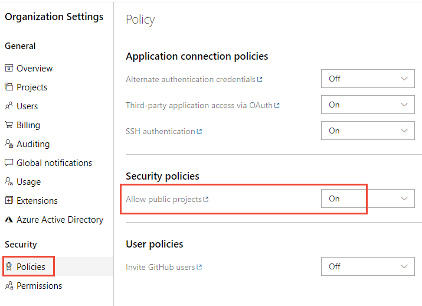
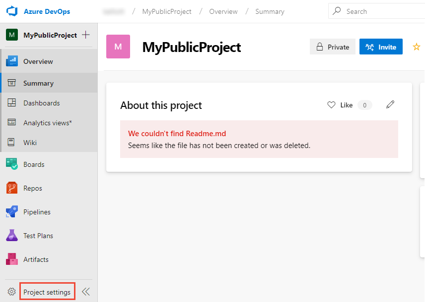
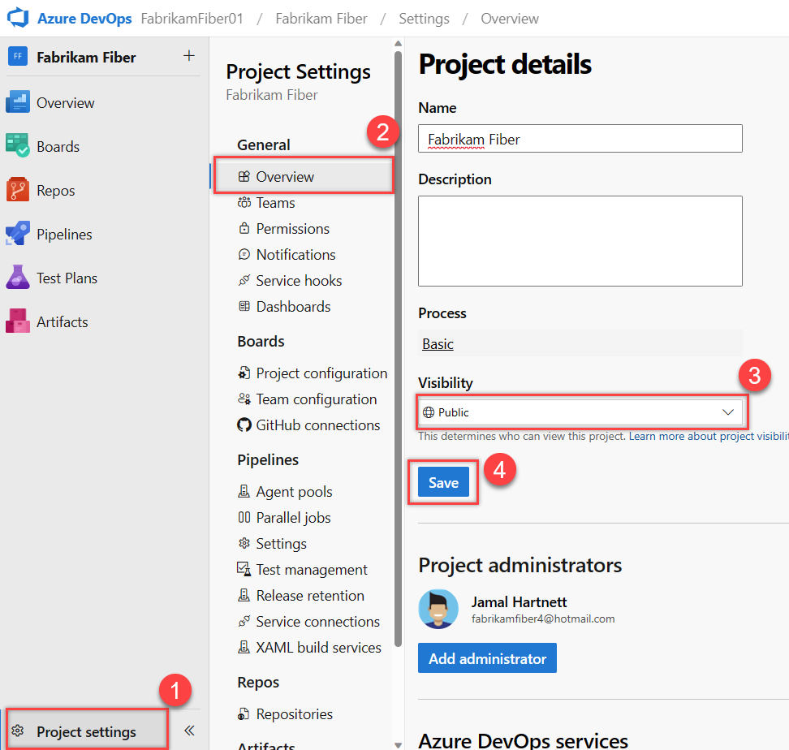

# Make your private project public

[!INCLUDE [version-eq-azure-devops](../../includes/version-eq-azure-devops.md)]  

When you choose to make a project public, all of its contents are included. You can't choose specific repositories, area paths, or build folders to keep private. 

Access is limited when the user isn't signed in. These users are also referred to as anonymous users or public users. Also, there are users, ones who are signed in to Azure DevOps, but aren't members of a project. Both of these types of users are granted limited, read-only access as indicated in the following table.

All members of the project experience the following effects when a private project is made public:

* Permissions marked **Deny** aren't honored. The permissions automatically granted to a non-member act as a "floor" on the capabilities that can be assigned to any member in the project.
* If a build pipeline specifies a Project Collection scope, it runs with Project scope instead, which reduces the risks of a malicious user obtaining the build service's authentication token.
* Stakeholders have full access to **Repos** or **Code** features in public projects, but they have no access in private projects.
* Stakeholders have full access to **Boards** or **Work** in public projects, but they have partial access in private projects. For more information, see [Stakeholder access quick reference](../security/stakeholder-access.md).
* Basic + Test Plans users can view and run tests from **Test Plans** or **Test**. Basic users need to upgrade their access level to Basic + Test Plans to get full access, which includes capability to create test plans and add test cases.

|Hub / Settings |Non-member access |Stakeholder access |Basic access|Reader access |Contributor access  |Project Admin access  |
|---------|---------|---------|---------|
|**Dashboards** | read (many widgets aren't available) | partial  | full | read | read-write | read-write-administer |
|**Wiki**     | read   | full | full | read | read-write | read-write-administer        |
|**Boards (Work)** |  read | partial | full | read | read-write | read-write-administer |
|**Repos (Code)**  | read | full | full | read | read-write |  read-write-administer   |
|**Pipelines (Build and Release)**  | read  | full | full | read    | read-write | Read-Write-Administer |
|**Test Plans**  | no access | no access | partial access (see last bullet above table) | read  |read-write | Read-Write-Administer |
|**Notifications**  | no access | Full | Full | Read | read-write | read-write-administer |
|**Search**   | full| full | full | full | full | full |
|**Settings**   | No access| Full | Full | Read | Read | Read-Write-Administer |

## Prerequisites

- You must have an organization created in Azure DevOps. If you don't have one, [do that now](../../user-guide/sign-up-invite-teammates.md).
- You must be a member of the [Project Collection Administrators group](../security/look-up-project-collection-administrators.md). Organization owners are automatically members of this group.
- Understand [access levels and unavailable features for public projects](#access-levels-and-unavailable-features-for-public-projects).
- Be aware of [partial migration options](#partial-migration).
- Review items in the [migration checklist](#migration-checklist). 

### Migration checklist

Most existing private projects contain a large amount of historical data. Old work items, early commits, and previous build pipelines might have content you don't want to share publicly.

The following checklist indicates those items you may want to review before making a project public. It also provides tips for migrating work items or files to a new project so that you can expose only current and future content.

:::row:::
   :::column span="1":::
      **Category**
   :::column-end:::
   :::column span="2":::
       **Guidance**
   :::column-end:::
:::row-end:::
:::row:::
   :::column span="1":::
**Organization identities and settings**
   :::column-end:::
   :::column span="2":::
:::image type="icon" source="../../media/icons/checkmark.png" border="false":::Understand that a user gains access to the following resources and details about the organization:
- Identities: List of all members added to the organization and email address for each member.
- Settings: Read-only view of all organization and project settings.
- Process metadata: All picklist values in all projects in the organization.
- Builds and releases: Names of people who triggered them, plus identities, including email addresses embedded in Git commits.
- Commits and work items: Embedded information, such as first name, last name, and email address. 
   :::column-end:::
:::row-end:::
:::row:::
   :::column span="1":::
**Cross-project object links**
   :::column-end:::
   :::column span="2":::
:::image type="icon" source="../../media/icons/checkmark.png" border="false":::Check whether links exist between projects, as details about the linked artifact in the private project are visible within the public project. You can use the following link types: branch, build, changeset, commit, found in build, integrated in build, pull request, and versioned item. Titles and names are exposed in the following links types: versioned item, branch, wiki page, pull request, and work item.
   :::column-end:::
:::row-end:::
:::row:::
   :::column span="1":::
**Agile tools and work items**
   :::column-end:::
   :::column span="2"::: 
:::image type="icon" source="../../media/icons/checkmark.png" border="false":::Confirm that your work items, even closed ones, don't contain sensitive details: undisclosed security flaws, credentials, and customer data. Work-items maintain their history when they're migrated from a private to public project. All discussions and descriptions are available. Check that none contains problematic speech.

:::image type="icon" source="../../media/icons/checkmark.png" border="false":::Confirm that none of your area paths have special, locked-down security settings. Denied permissions aren't enforced in a public project, so restricted area paths become public. If you aren't comfortable exposing the whole work item database, there are migration options.
For more information, see [Instructions for moving work items](#move-work-items).
   :::column-end:::
:::row-end:::
:::row:::
   :::column span="1":::
      **Code**
   :::column-end:::
   :::column span="2":::
:::image type="icon" source="../../media/icons/checkmark.png" border="false":::Confirm that you have no sensitive details in your repositories' history: unpatched security bugs, credentials, and code you don't have the right to distribute.

:::image type="icon" source="../../media/icons/checkmark.png" border="false":::Be aware that all file contents and commit messages are available. Check that none contains problematic speech. If you aren't comfortable exposing an entire repository, you can migrate the tip to another project.
For more information, see [Instructions for a tip migration](#migrate-git-tip-only).
   :::column-end:::
:::row-end:::
:::row:::
   :::column span="1":::
      **Build and release**
   :::column-end:::
   :::column span="2":::
:::image type="icon" source="../../media/icons/checkmark.png" border="false":::Confirm that none of your pipelines expose sensitive data: credentials/secrets, obscure URLs, and private environment names.

:::image type="icon" source="../../media/icons/checkmark.png" border="false":::Confirm that non-members don't require access to your private feeds. Builds can still access feeds, but non-members can't. If you need to migrate build pipelines to a new project, you can import and export them using [YAML](../../pipelines/create-first-pipeline.md).
   :::column-end:::
:::row-end:::
:::row:::
   :::column span="1":::
**Test**
   :::column-end:::
   :::column span="2":::
:::image type="icon" source="../../media/icons/checkmark.png" border="false":::Understand that manual and cloud load testing features aren't available to non-members in a public project.
   :::column-end:::
:::row-end:::
:::row:::
   :::column span="1":::
**Analytics and dashboards**
   :::column-end:::
   :::column span="2":::
:::image type="icon" source="../../media/icons/checkmark.png" border="false":::Consider building a dashboard intended for the public. Some [widgets are unavailable](about-projects.md#dashboard-widget-support) to non-members.
   :::column-end:::
:::row-end:::
:::row:::
   :::column span="1":::
**Artifacts**
   :::column-end:::
   :::column span="2":::
:::image type="icon" source="../../media/icons/checkmark.png" border="false":::Confirm that none of the packages in any of the feeds that are scoped to the project have privacy concerns. All packages in the feeds that are scoped to the project become public. All existing upstream settings of the feeds that are scoped to the project are disabled once the project becomes public.
   :::column-end:::
:::row-end:::
:::row:::
   :::column span="1":::
**Extensions**
   :::column-end:::
   :::column span="2":::
:::image type="icon" source="../../media/icons/checkmark.png" border="false":::Confirm whether there are any extensions vital to your project's experience. For instance, do you have a control on your work item form that renders data in a particular way? Are there custom extensions that expose important details?

:::image type="icon" source="../../media/icons/checkmark.png" border="false":::Confirm that each extension's author has made it available for non-members by testing it.
If not, ask the extension author to add support for non-members. For details, see [Extensions and public project support](../../extend/develop/public-project.md).
   :::column-end:::
:::row-end:::

## 1. Enable anonymous access to projects

Before you can change a private project to a public project, you must enable anonymous access for your organization.

1. From your web browser, sign in to Azure DevOps. You must be signed in to create a public project.

2. Choose :::image type="icon" source="../../media/icons/project-icon.png" border="false"::: **Azure DevOps** to open **Projects**. Then choose **Organization settings**.

	> [!div class="mx-imgBorder"]  
	>   

3. Choose the **Policies** page, and select **On** for **Allow public projects**.

	> [!div class="mx-imgBorder"]  
	> 

## 2. Make a private project public

1. Choose **Project Settings** in the sidebar.
	> [!div class="mx-imgBorder"]  
	>   

2. Choose **Overview**.  

3. To switch from private to public, choose **Public** from the **Visibility** menu of options.  

	> [!div class="mx-imgBorder"]  
	>  

	To switch from public to private, choose **Private** from the **Visibility** menu of options.

4. Choose **Save**.   

## Access levels and unavailable features for public projects

A project member has access to features based on the access level assigned. Non-members / public users are granted limited access automatically. 
To contribute to a public project, you must be added as a member of that project and assigned either Stakeholder, Basic, or Basic + Test Plans access. Access levels determine the user interfaces that you can access. The security group you're assigned to determines the features you can exercise. For more information, see [About access levels](../security/access-levels.md).

You [add project members](../accounts/add-organization-users.md) in the same way you do for private projects. Be sure you understand what it means to [invite an external user](../accounts/add-external-user.md) to have access to your project. If you created the project, you're automatically assigned to the Project Administrators group.

The following user interface elements are hidden for non-members.

:::row:::
   :::column span="1":::
      **Service**
   :::column-end:::
   :::column span="2":::
       **Hidden UI elements**
   :::column-end:::
:::row-end:::
:::row:::
   :::column span="1":::
      Boards
   :::column-end:::
   :::column span="2":::
      Work items are available, but Backlogs, Boards, Sprints, Queries, and Plans are hidden. 
   :::column-end:::
:::row-end:::
:::row:::
   :::column span="1":::
      Repos
   :::column-end:::
   :::column span="2":::
      Team Foundation Version Control (TFVC) repositories are hidden.
   :::column-end:::
:::row-end:::
:::row:::
   :::column span="1":::
      Pipelines
   :::column-end:::
   :::column span="2":::
      Builds and Releases are available, but Library, Task Groups, Deployment Groups, Packages, and XAML build system are hidden. Pipeline and task editors for build and release pipelines are unavailable. Only the new Releases page, which is in Public preview, is available.
   :::column-end:::
:::row-end:::
:::row:::
   :::column span="1":::
      Test Plans
   :::column-end:::
   :::column span="2":::
      Test Plans and the associated manual and cloud load testing features are hidden.
   :::column-end:::
:::row-end:::
:::row:::
   :::column span="1":::
      Analytics
   :::column-end:::
   :::column span="2":::
      Analytics views is hidden, and the Analytics OData feed isn't supported for non-members. Power BI integration in general isn't supported.
   :::column-end:::
:::row-end:::
:::row:::
   :::column span="1":::
      Settings
   :::column-end:::
   :::column span="2":::
      Settings and administrative pages are hidden.
   :::column-end:::
:::row-end:::

> [!NOTE]
> When you enable the **Free access to Pipelines for Stakeholders** preview feature for the organization, Stakeholders get access to all **Pipeline** features. Without this feature enabled, Stakeholders can only view and approve releases. For more information, see [Provide Stakeholders access to edit build and release pipelines](../security/provide-stakeholder-pipeline-access.md).

Also, non-members can't do the following tasks:

* Edit or create artifacts, such as files, work items, and pipelines.
* Favorite and follow existing artifacts.
* View project members' email addresses and other contact information; non-members can only see name and picture. Also, filter lists of artifacts by identity.
* Switch between two public projects in the same organization; non-members must go directly to a public project using a URL.
* Perform code or work item searches across an organization.

## Partial migration

Organizations containing sensitive material shouldn't enable the public projects policy.
In that case, we recommend that you create an entirely separate organization to host your public projects.

<a id="move-work-items" />

### Move work items to a private project

If one or a handful of work items are sensitive, you can [move them](../../boards/backlogs/move-change-type.md#move) into a separate, private project.
Cross-project links continue to work for members.
Non-members won't have access to the content since it resides in a private project.

If you have a large number of sensitive work items, consider keeping your current project private. Instead, create a new public project in another organization.
Migrating work items can be accomplished using the open source [WiMigrator](https://github.com/Microsoft/vsts-work-item-migrator) maintained by Microsoft.

### Migrate Git tip only

If a repository can't be shared due to problematic history, consider doing a tip-only migration to a new repository in a different project.
Keep the project containing the problematic repository private.
Create the new repository in a project that you don't mind making public.

> [!WARNING]
> The new repository won't have connection to the old one.
> You won't easily be able to migrate changes between them in the future.
> Also, your pull request history won't be migrated.

1. Clone the existing repository: `git clone <clone_URL>`
2. Make sure you're in the root of the repository: `cd <reponame>`
3. Ensure you're on the tip of the branch you want to start from: `git checkout main`
4. Delete the Git data: `rmdir /s .git` on Windows, `rm -rf .git` on macOS or Linux
5. Initialize a new Git repository: `git init`
6. Create a new, empty repository in your public project.
7. Add the new repository as your origin remote: `git remote add origin <new_clone_URL>`
8. Push up your new repository: `git push --set-upstream origin main`

## Next steps

> [!div class="nextstepaction"]
> [Code with Git](../../user-guide/code-with-git.md)
