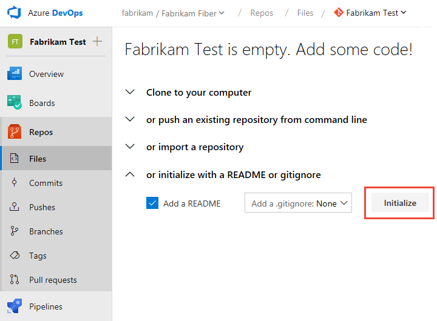
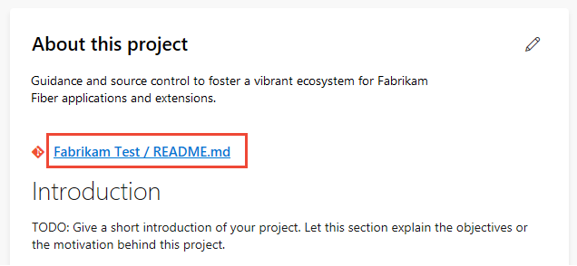
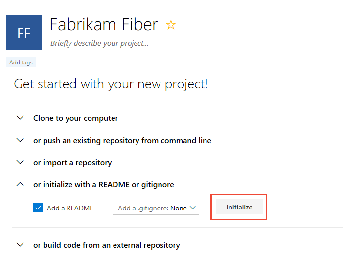
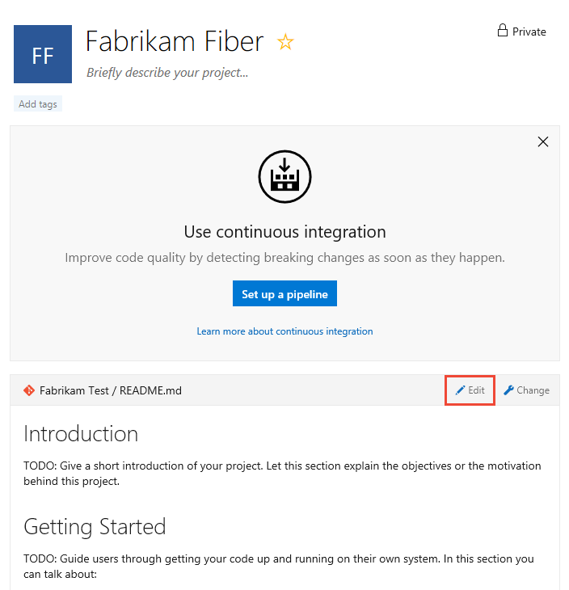
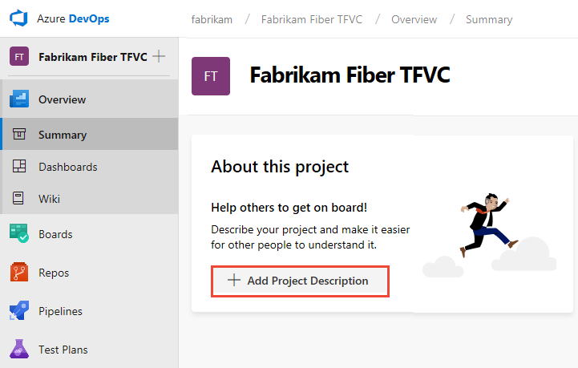
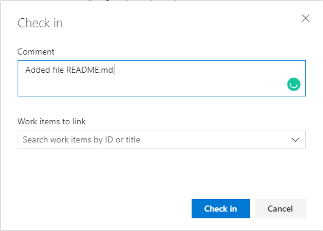
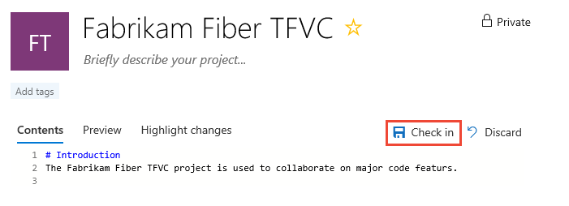
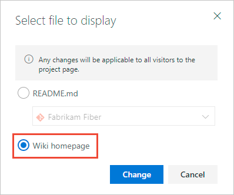

# Share your project vision, view project activity

[!INCLUDE [temp](../../includes/version-ts-tfs-2015-2016.md)]

Each project provides a **Summary** page to share information, add project members, and check the latest project activity. From this page you can also perform the following tasks depending on your administration status. 
 
:::row:::
   :::column span="1":::
      **Project Administrator tasks** 
   :::column-end:::
   :::column span="1":::
     **Project member tasks**
   :::column-end:::
   :::column-end:::
:::row-end:::
   :::column span="1":::
      ::: moniker range=">= azure-devops-2019" 
      - Add a short project description 
      - Set project tags 
      - Choose a README file or wiki for project Summary information
      - Invite people to contribute to your project 
      ::: moniker-end
      ::: moniker range="<= tfs-2018" 
      - Choose a README file for project Summary information
      - Invite people to contribute to your project  
      ::: moniker-end
   :::column-end:::
   :::column span="1":::
      ::: moniker range=">= azure-devops-2019" 
     - View project description and readme 
     - View project stats
     - Favorite a project 
     - Email or initiate a chat with a team member
     - Initiate a search across your project 
      ::: moniker-end
      ::: moniker range="<= tfs-2018" 
     - View project information
     - View project stats  
      ::: moniker-end
   :::column-end:::
:::row-end:::

:::image type="content" source="media/summary/project-summary-page-intro.png" alt-text="Screenshot of summary page.":::

::: moniker range=">= azure-devops-2019" 
If you want to use a project wiki for your project Summary information, then first [create a Wiki for your project](../../project/wiki/wiki-create-repo.md). You can then [change the project summary page to point to the wiki](#change-repo).
::: moniker-end
 
::: moniker range="azure-devops" 
> [!NOTE]   
> Hosted projects can be designated as **Private** or **Public**. For public projects, anonymous users can view the project **Summary**, except for the **Members** section. Also the **Like** and **Favorite** icons aren't visible to anonymous users. To learn more about public projects, see [What is a public project?](../public/about-public-projects.md)
::: moniker-end

## Prerequisites

- You must be a member of the [Project Administrators group](../../organizations/security/set-project-collection-level-permissions.md) or have your **Edit project-level information** permission set to **Allow** to do the following:
  - Edit information on the project page
  - Change the repository that you use to share your project mission
  - Manage project membership
- To edit a page, you must be a contributor to the repository or branch or have the **Contribute** permissions set to **Allow**.  
- To view the project **Summary**, you must be a valid member of the project. For more information, see [About security, membership, and permissions; Valid user groups](../../organizations/security/about-permissions.md#validusers).
- To add or edit project **Tags**, you must have the project-level **Manage properties** permission set to **Allow**. This permission controls the project properties REST API. The project properties REST API is used to drive the project tags experience in the product.  
 
> [!TIP]    
> If you don't have permissions to edit a page or use a feature, the corresponding icons and links aren't visible. 

## Open project Summary

::: moniker range=">= azure-devops-2019"
From your web browser, choose **Overview*>Summary**. If you don't have a  project yet, [create a project](../../organizations/projects/create-project.md).

If you haven't set up your project summary yet, you'll see this welcome page:

> [!div class="mx-imgBorder"]
>   

Select one of the following tasks to get started:

- **Invite** to begin [adding others to your project](../../organizations/security/add-users-team-project.md). You can only invite users who have already been [added to your organization](../security/add-users-team-project.md#add-users-to-a-project)).
- **Boards** to begin [adding work items](../../boards/work-items/view-add-work-items.md).
- **Repos** to open [Repos>Files](../../repos/git/clone.md) page where you can clone or import a repository, or [initialize a README file](#initialize-a-readme-file-for-a-git-repo) for your project summary page.
- **Pipelines** to start [defining a pipeline](../../pipelines/index.yml).
- **Test Plans** to start [defining test plans and test suites](../../test/create-a-test-plan.md).
- [Manage your services](../../organizations/settings/set-services.md) to disable the visibility of one or more services.

::: moniker-end

::: moniker range="< azure-devops-2019"
From your web browser, open the team project drop down menu and select the home page. If you don't have a  project, [create a team project](../../organizations/projects/create-project.md).

To define a README file for your project, see [Initialize a README file for your Git repo](#initialize-git) or  [Initialize a README file for your TFVC repo](#initialize-tfvc).

::: moniker-end

::: moniker range="tfs-2017"
> [!NOTE]
> The project page described in this section is available for TFS 2017.1 and later versions. It replaces the Welcome page used in TFS 2015 and TFS 2017.
::: moniker-end

## Update the project description and home page

The **Summary** page displays either the **README** file defined in a project repository or the home page of a project wiki. If you want to use the project wiki home page, first set that up as described in [Create a Wiki for your project](../../project/wiki/wiki-create-repo.md).

1. To edit the **Summary** page:

	- If it is the first time editing the page, choose Add Project Description.  
	:::image type="content" source="media/summary/add-project-description.png" alt-text="Screenshot of summary page, first time editing.":::

	- If editing the page after it's been set up, choose the :::image type="icon" source="../../media/icons/edit.png" border="false"::: **Edit project information**. This icon is only visible to members with permissions to edit the project **Summary** page.
 
1. Provide a brief description of the project purpose in the **Description** box.  

	:::image type="content" source="media/summary/about-this-project-dialog.png" alt-text="About this project dialog.":::

1. Optionally add one or more **Tags** for your project. These tags are similar to [work item tags](../../boards/queries/add-tags-to-work-items.md). You can add several tags at a time by using the comma or semi-colon delimiters. Tags must conform to the following rules:  
	- Tags must be 40 characters or less
	- Tags can;t contain the forward slash (/) character or end with hyphen character (-)
	- No more than 15 tags can be added to a project  
	- Tags are case-insensitive and no duplicate tags or empty tags are allowed.

	> [!NOTE]   
	> The search and filter functions can't be used to search or filter on project tags. 

1. Choose whether to reference a **README** file or the project wiki home page for the rest of the Summary page contents.  

	> [!TIP] 
	> A default README is created within the repository added when you created your project. You can choose this README or create another repository and README file for this purpose. 

	If choosing a **Readme file**, select the repository for the README. A preview of the current text for the README file is shown. 

	:::image type="content" source="media/summary/select-readme-repository.png" alt-text="About this project dialog, choose and select README repository.":::

	If choosing **Wiki**, note that the Wiki home page is referenced and must be the first file within the Wiki TOC. You can't change that reference.  

1. To update the contents of the referenced README file or wiki, edit the corresponding file. For more information, see [Create a README for your repo](../../repos/git/create-a-readme.md) or [Add and edit wiki pages](../../project/wiki/add-edit-wiki.md). 
 
	Consider including the following types of information in your **Summary** page:
	- Ways in which users can contribute to your project 
	- Who to contact to elevate permissions or add extensions  
	- Roadmap information 
	- Links to instructions for setting up their development and test environments 
	- Links to instructions for collaborating on code, tracking work, building pipelines, deploying releases 
	- Links to templates to file a bug, issue, or request 
	- Links to distribution lists to email a question or post a question on Slack or Teams channel. 
 
::: moniker range=">= tfs-2018"

## Invite people to contribute to your project 

::: moniker-end

::: moniker range=">= azure-devops-2019"
You can send an email to invite users to contribute to your project by choosing **Invite**. To learn more, see [Add users or groups to a team or project, Invite users from the Summary page](../security/add-users-team-project.md#invite-users-from-the-summary-page).

:::image type="content" source="../security/media/add-users/summary-invite-users.png" alt-text="Screenshot of Summary page, Invite button.":::

::: moniker-end

::: moniker range="tfs-2018"

To add users to the project, choose the **add** button. To learn more, see [Add users to a team project or team](../../organizations/security/add-users-team-project.md).

:::image type="content" source="media/summary/invite-members-tfs-2018.png" alt-text="Screenshot of Summary page, Add members button.":::
::: moniker-end

::: moniker range="< azure-devops"
> [!NOTE]
> For on-premises Azure DevOps, all email actions require an [SMTP server to be configured](/azure/devops/server/admin/setup-customize-alerts).  
::: moniker-end
 
::: moniker range=">= tfs-2018"

## View project activity  

From the **Project stats** section, you can view updates made to the project in the last 1, 7, and 30 days. Choose the view option as shown in the following image. 
::: moniker-end

::: moniker range=">= azure-devops-2019"
:::image type="content" source="media/summary/project-stats.png" alt-text="Screenshot of Summary page, Stats section.":::
 ::: moniker-end

::: moniker range="tfs-2018"
:::image type="content" source="media/summary/project-summary-activity-tfs-2018.png" alt-text="Screenshot of Summary page, Activity section, TFS-2018.":::
::: moniker-end

## Email or chat with a project member 

From the **Members** section, you can see how many members have been added to the project, and connect via email or chat with a member. 

:::image type="content" source="media/summary/project-stats.png" alt-text="Screenshot of Summary page, Members section.":::

> [!NOTE]   
> 100+ indicates that 100 or more members have been added to the project. 

To email or initiate a chat session, choose the team member shown and select your option. 
:::image type="content" source="media/summary/connect-with-team-member.png" alt-text="Screenshot of Summary page, Members section, options available to connect to a team member.":::

::: moniker range="< azure-devops"
> [!NOTE]
> For on-premises Azure DevOps, all email actions require an [SMTP server to be configured](/azure/devops/server/admin/setup-customize-alerts).  
::: moniker-end

::: moniker range=">= azure-devops-2019"

## Initiate a project search  

From the **Summary** page, you can initiate a search of your code, work items, and wiki. To learn more, see [Get started with search](../../project/search/get-started-search.md). 
:::image type="content" source="media/summary/project-search.png" alt-text="Screenshot of Summary page, search box.":::

::: moniker-end

## Initialize a README file for a Git repo

You can share your project and objective, as well as ways for team members to contribute to the project through a project README file. For Git projects, the README.md file needs to be at the root of each repository in the default branch. For Git based projects the left pane supports navigation to other repositories. A separate Welcome page/README.md file can be created for each repository.  

::: moniker range=">= azure-devops-2019"

1. Open **Repos>Files**. This page guides you to get started quickly by adding code to your repository when you choose one of the options to clone, push, import, or initialize a repo.  

2. With the **Add a README** check box checked, choose **Initialize**.

   > [!div class="mx-imgBorder"]  
   > 

   A default README file is added to the project repository, in this case, the **Fabrikam Test** repo.

3. Return to **Overview** > **Summary** and choose the README file for the project page. Select :::image type="icon" source="../../media/icons/edit.png" border="false"::: **Edit**.

   > [!div class="mx-imgBorder"]  
   >   

4. Select the project repository where you initialized the README file.

   > [!div class="mx-imgBorder"]  
   >   

5. To edit the README file, choose the README file link.

   > [!div class="mx-imgBorder"]  
   >   

   You're directed to the **Repos>Files** page for the README file. You can edit and modify the README Markdown file like you would any other file in a Git repository. You can use Markdown language to format the README file and add images. To learn more about adding a README file, see [Create a README for your repo](../../repos/git/create-a-readme.md) and [Markdown guidance](../../project/wiki/markdown-guidance.md).

::: moniker-end

::: moniker range="tfs-2018"

1. Open the Project home page.

2. With the **Add a README** check box checked, choose **Initialize**.

   > [!div class="mx-imgBorder"]  
   > 

   A default README file is added to the project repository, in this case, the **Fabrikam Test** repo.

3. To edit the project README.md file, choose **Edit**.

   > [!div class="mx-imgBorder"]  
   > 

   Use Markdown language to format the README file and add images. To learn more about adding a README file, see [Create a README for your repo](../../repos/git/create-a-readme.md) and [Markdown guidance](../../project/wiki/markdown-guidance.md).

::: moniker-end

::: moniker range="<= tfs-2017"  

1. You can start editing directly from the Welcome page.

   > [!div class="mx-imgBorder"]  
   >   

   > [!NOTE]
   > If you set policies on the Git repository, changes to the welcome page must be done as a pull request.  

2. To add another page, enter a link to a new Markdown file that doesn't yet exist, for example:

   `[page-1](./page-1.md)`

3. After you save the file, select the link. Respond to the prompt to edit the file and commit it to your repository.  

::: moniker-end

## Initialize a README file for a TFVC repo

For projects that selected TFVC for version control, the README.md file needs to be at the root of your team project folder (i.e. $/TeamProject/README.md).

::: moniker range=">= azure-devops-2019"

1. Open **Repos>Files**.

2. Select **Add Project Description**.

   > [!div class="mx-imgBorder"]  
   > 

3. Select the TFVC repository and choose **Save**. If no README file has been created yet in the repo, you'll see the following message.

   > [!div class="mx-imgBorder"]  
   > 

4. To create a README file, choose **Repos>Files** and choose new file to add a file to the project repository.

5. Name the file as **README.md**.

   > [!div class="mx-imgBorder"]  
   > 

6. Add the contents of your README file in Markdown format, and then choose **Check in...**.  

   > [!div class="mx-imgBorder"]  
   > 

7. Select **Check in** to complete the check in process of the README file.  

   > [!div class="mx-imgBorder"]  
   > 

8. Select **Overview>Summary** to review your project summary page with the README file displayed.  

   > [!div class="mx-imgBorder"]  
   > 

::: moniker-end

::: moniker range="< azure-devops-2019"

1. Open the Project home page.

2. Select **Create README**.  

   > [!div class="mx-imgBorder"]  
   > 

   A default README file is added to the project repository, in this case, the **Fabrikam Fiber TFVC** repo.

3. You can immediately edit the README file. When you're done, select **Check in**.

   > [!div class="mx-imgBorder"]  
   >   
Any additional Markdown files you have (ones with a *.md extension) in the root of the project folder also appear in the left pane for easy navigation between them so you can provide additional information.  

::: moniker-end

<a id="change-repo" />

## Change the repository

You can change the repository used to support your project vision, including pointing it to the home page of your [built-in Wiki](../../project/wiki/wiki-create-repo.md).

::: moniker range=">= azure-devops-2019"

1. Open **Overview > Summary** .

2. Select :::image type="icon" source="../../media/icons/edit.png" border="false"::: **Edit**.

	> [!div class="mx-imgBorder"]  
	>   

   If you don't see **Edit**, then you're not a member of the Project Administrators group. [Get added as an admin](../../organizations/security/set-project-collection-level-permissions.md) to proceed.

3. Select a different repository or choose the Wiki option.

   > [!div class="mx-imgBorder"]  
   >   

   > [!TIP]  
   > If you choose the Wiki option, only the Wiki home page displays. To access additional Wiki pages, go to the Wiki.

::: moniker-end

::: moniker range="< azure-devops-2019"

1. From your project home page, choose **Change**.

   > [!div class="mx-imgBorder"]  
   >   

   If you don't see **Change** link, then you're not a member of the Project Administrators group. [Get added as an admin](../../organizations/security/set-project-collection-level-permissions.md) to proceed.

2. From the select file dialog, choose an existing repo from the drop-down menu, or choose the Wiki option, shown as follows.

   

   > [!TIP]  
   > Only the Wiki home page displays. To access additional Wiki pages, go to the Wiki.

::: moniker-end

## Next steps

> [!div class="nextstepaction"]
> [Create a wiki for your team project](../../project/wiki/wiki-create-repo.md)

## Related articles

- [About Wikis, READMEs, and Markdown](../../project/wiki/about-readme-wiki.md)
- [Get started as an administrator](../../user-guide/project-admin-tutorial.md)
- [Web portal navigation](../../project/navigation/index.md)
- [What do I get with a project?](../../user-guide/services.md?toc=/azure/devops/organizations/projects/toc.json&bc=/azure/devops/organizations/projects/breadcrumb/toc.json)
 
 
**REST APIs**

- [Projects - Get Project Properties](/rest/api/azure/devops/core/projects/get-project-properties)
- [Projects - Set Project Properties](/rest/api/azure/devops/core/projects/set-project-properties)

 
### Git repository

 
> [!div class="mx-imgBorder"]  
> 

> [!div class="mx-imgBorder"]  
> 

Use this page to leverage all the built-in DevOps functionality of Azure DevOps and to perform the following activities.

> [!div class="mx-tdCol2BreakAll"]
> |Git repository   |TFVC repository   |  
> |-------------|----------|
> |- Clone your project to your client computer - Push an existing repository from the command line - Import a repository - Initialize a README or gitignore - Setup a build from an external repository - [Add team members](#cross-project-activity) - [View code, build, and work activity](#cross-project-activity) |- Setup a build - Add a README for your project - [Add team members](#cross-project-activity) - [View code, build, and work activity](#cross-project-activity) |
 
