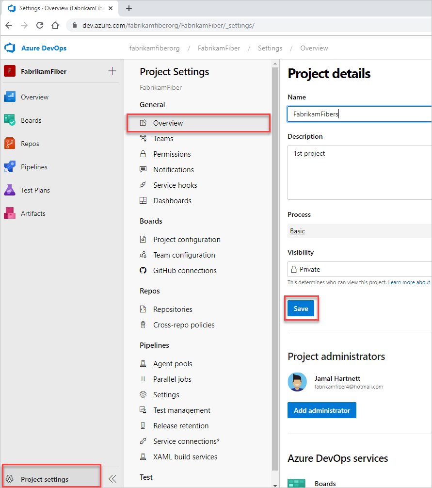
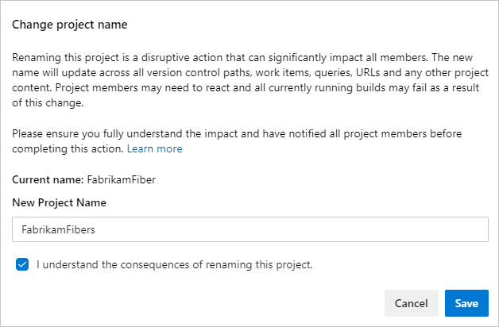
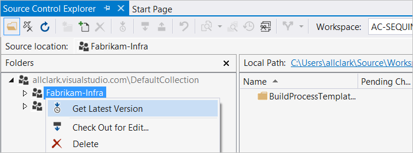

# Rename a project in Azure DevOps

[!INCLUDE [version-lt-eq-azure-devops](../../includes/version-lt-eq-azure-devops.md)] 

When you rename a project in Azure DevOps, the project name updates in version control paths, work items, queries, and other project artifacts. You can rename a single project multiple times and use old names. After you rename the project, some [actions might be required from team members](#required-user-actions-for-working-with-the-renamed-project).

> [!WARNING]
>- When you rename a project, Azure DevOps sends email notifications to all project members if the user count is less than 1,000. For projects with more than 1,000 users, only Project Collection Administrators receive these notifications.
>
>- Renaming a project breaks workload identity federation subjects in Azure Resource Manager service connections. 

[!INCLUDE [ai-assistance-mcp-server-tip](../../includes/ai-assistance-mcp-server-tip.md)]

## Prerequisites

| Category | Requirements |
|--------------|-------------|
|Permissions| Member of the Project Administrators group or project-level Rename team project permission set to Allow. For more information, see [Change project-level permissions](../security/change-project-level-permissions.md).|

## Rename a project

1. Sign in to your project (```https://dev.azure.com/{Your_Organization}/{Your_Project}```).

1. Select **Project settings** > **Overview**, enter a new name, and select **Save**. 

   

1. To confirm the rename, enter the new project name, check the box next to, "I understand the consequences of renaming this project," and then select **Save**.

   

### Results of the rename

After the rename completes:

* URLs continue to work for both the old and new project names, so existing links don't break.
* Work item links don't expire because work item IDs are unique across the organization, not scoped to a single project. Any valid project name in the URL resolves the work item:
   
   `https://dev.azure.com/MyOrg/Example1/_workitems/edit/40/` — Displays work item 40
   `https://dev.azure.com/MyOrg/Example2/_workitems/edit/40/` — Displays work item 40
   `https://dev.azure.com/MyOrg/Potato/_workitems/edit/40/` — Returns a 404 error (invalid project)

* The old project name becomes available for reuse.

## Required user actions for working with the renamed project

Each user within your team must [restart their clients](#restart-clients) and then complete whichever of the following actions apply:

- [Update Git remotes](#update-git-remotes) — if your project uses Git repositories
- [Update TFVC server workspaces](#update-tfvc-server-workspaces) — if your project uses TFVC with server workspaces
- [Update TFVC local workspaces](#update-tfvc-local-workspaces) — if your project uses TFVC with local workspaces
- [Update OData feeds](#update-odata-feeds) — if you connect Power BI reports through OData
- [Update Analytics views](#update-analytics-views) — if you created custom Analytics views

### Restart clients

Opened clients keep a cache of all project names in memory, but this cache doesn't automatically clear after a project rename. To clear the cache, restart your client so it populates the new project name. If you don't restart the client, operations that use the cached project name fail with a *project not found* exception.

For the following clients, save your work in each and then restart:

- Visual Studio Team Explorer
- Microsoft Excel, if your team uses the [Azure DevOps Office Integration 2019](https://visualstudio.microsoft.com/downloads/#other-family) 

### Update Git remotes

If your project uses Git, update your remote references for each repository from the renamed project. These updates are necessary because the remote repository URL contains the project and the repository name. Git uses remote references to fetch and push changes between your local repository and the remote version stored on the server. Each member of your team must update their local Git repositories to continue connecting from their dev machines. 

For more information, see [Update the Git remotes on your dev machines](../../repos/git/repo-rename.md#update-the-git-remotes-on-your-dev-machines).

### Update TFVC server workspaces

If your project uses TFVC with [server workspaces](../../repos/tfvc/decide-between-using-local-server-workspace.md), update these workspaces with the new project name.
For Visual Studio clients, run a get or check-in operation. The workspace mapping then updates to use the new project name.



For more information, see [Rename command (TFVC)](../../repos/tfvc/rename-command-team-foundation-version-control.md).

### Update TFVC local workspaces

If your team uses TFVC with [local workspaces](../../repos/tfvc/decide-between-using-local-server-workspace.md), update these workspaces with the new project name.
For Visual Studio, run a get or check-in operation. The workspace mapping then updates to use the new project name. 

Update your clients to the latest update or release, if possible. For all other supported Visual Studio versions, create a new local workspace mapped to the new project name.  

Local workspaces are managed locally and not on the server. Older clients without the updated rename logic can't update local workspaces to the new project name. 

### Update OData feeds

If you use OData feeds in Power BI, update the feed URL to use the new project name. Updating the feed URL is essential to maintain data connections and avoid errors in reporting. For more information, see [Overview of sample reports using OData queries](../../report/powerbi/sample-odata-overview.md).

### Update Analytics views

If you created custom Analytics views using the old project name, update the views with the new name. For more information, see [Analytics views](../../report/powerbi/analytics-views-manage.md#edit-an-existing-view).

<a id="use-ai-assistance"></a>

## Use AI to manage project renames

[!INCLUDE [ai-assistance-mcp-server-tip](../../includes/ai-assistance-mcp-server-tip.md)]

If you use GitHub Copilot, the [Azure DevOps MCP Server](../../mcp-server/mcp-server-overview.md) can help you plan and execute project renames and handle all the follow-up actions through natural language prompts.

### Example prompts for renaming projects

| Task | Example prompt |
|---|---|
| Plan a rename with impact analysis | `I need to rename my Azure DevOps project from 'ProjectAlpha' to 'Platform-Core'. List everything that breaks, including Git remotes, TFVC workspaces, OData feeds, and service connections, and give me a step-by-step remediation plan` |
| Communicate a rename to the team | `Draft an announcement for my team explaining that our Azure DevOps project is being renamed, what actions each developer needs to take to update their Git remotes and local workspaces, and a timeline for the change` |
| Fix broken service connections | `After renaming my project, my Azure Resource Manager service connections using workload identity federation stopped working. Walk me through updating the federation subjects to use the new project name` |
| Update Git remotes in bulk | `Generate a script I can share with my team that detects their current Git remote URLs pointing to the old project name and updates them to use the new project name` |
| Update reporting after a rename | `I renamed my project and now my Power BI dashboards connected through OData show errors. Guide me through updating the Analytics views and OData feed URLs to use the new project name` |
| Recover from a problematic rename | `I renamed a project but some team members can't open their TFVC local workspaces anymore. Help me understand why and walk me through the steps to fix both server and local workspaces` |

> [!TIP]
> For the best results, use these prompts in agent mode with the Azure DevOps MCP Server connected. Customize the prompts with your specific project names, team size, or version control system.

## Frequently asked questions (FAQs)

### Q: Why did my attempt to reuse a project name fail due to existing workspaces?
A: You can't reuse a project name if workspace mappings still address it. This function helps avoid the ambiguity case where a workspace could be mapped to two projects. Contact the users who have these mappings, and either delete them or [update them](#update-tfvc-server-workspaces) to use the new name.

If the user's machine containing the workspace is no longer available, delete the workspace by running the following command from Visual Studio's developer command prompt:
```tf workspace /delete [/collection:TeamProjectCollectionUrl] workspacename[;workspaceowner]```

### Q: How does renaming a project affect my browser navigation experience?

A: After you rename a project, any browsers with the project opened might encounter some errors. These errors are due to caches held by the browser, which include the old project name. 
Refresh to make these errors go away since the cache gets repopulated with the new project name.
          
### Q: Do other artifacts in the project get renamed?

A: Yes, all artifacts that share the same name get renamed along with the project. The only exceptions are for the default team and repo. The rename of these artifacts is performed as a best effort. 
For example, if a project *Foo* was renamed to *Bar*, the default team *Foo* wouldn't be renamed if a team named *Bar* already existed in the project.

## Related content

- [Delete a project](delete-project.md)
- [Git and Azure Repos](../../repos/git/index.yml)
