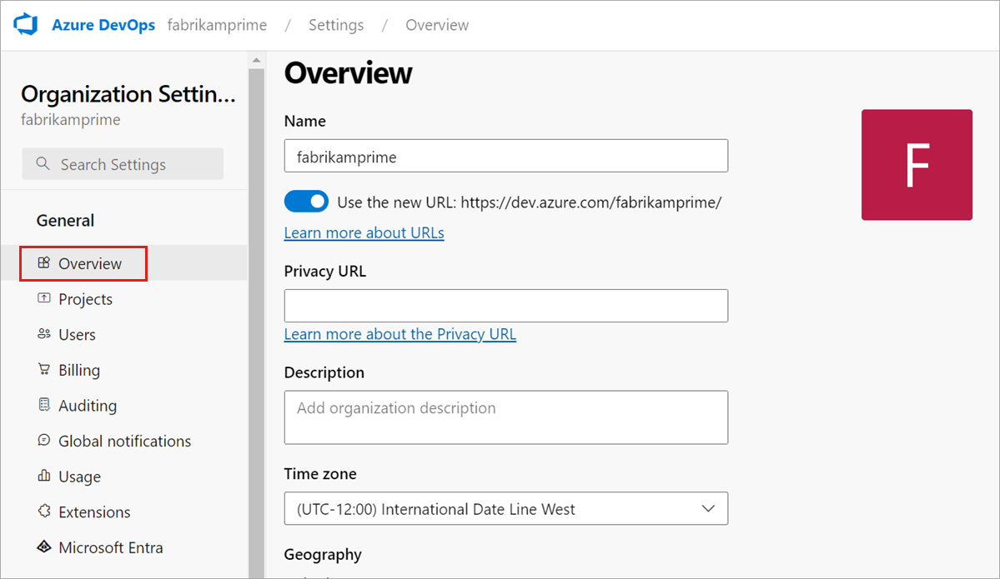
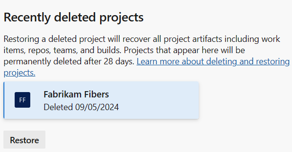
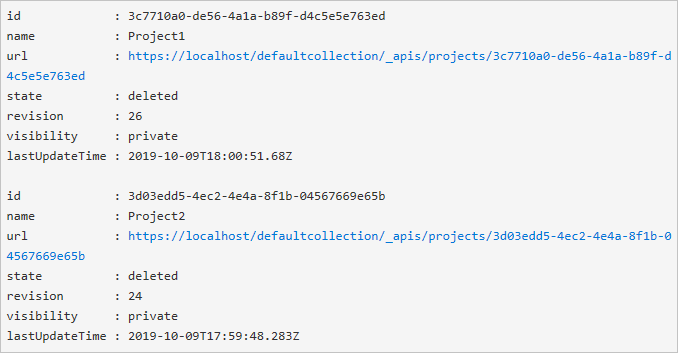

# Restore a project

[!INCLUDE [version-vsts-plus-azdevserver-2019](../../boards/includes/version-vsts-plus-azdevserver-2019.md)]

Sometimes we might delete a project in Azure DevOps by mistake. You can restore a deleted project up to 28 days after it was deleted. This article shows you how.

## Prerequisites

::: moniker range="azure-devops"

To restore a project, you must have Project Collection Administrator or organization Owner permissions in Azure DevOps.

You must also have the "delete project" permission set to **Allow**. To learn how to check your permissions, see [View permissions](../security/view-permissions.md).

::: moniker-end

::: moniker range=">= azure-devops-2019 < azure-devops"

To restore a project, you must have the "delete project" permission set to **Allow**. To learn how to check your permissions, see [View permissions](../security/view-permissions.md).

::: moniker-end

> [!NOTE]
> You can only restore a project that's been deleted from an organization within the last 28 days.

## Restore project

::: moniker range="azure-devops"

1. Sign in to your organization (```https://dev.azure.com/{yourorganization}```).

2. Choose  **Organization settings**.

   

3. Select **Overview**, and then scroll down to "recently deleted projects."

   

4. Highlight the project you want to restore, and then select **Restore**.

   

::: moniker-end

::: moniker range="< azure-devops"

1. Sign in to your organization (```https://dev.azure.com/{yourorganization}```).

2. Choose  **Admin settings**.

   :::image type="content" source="../../media/settings/open-admin-settings-server.png" alt-text="Screenshot showing Admin settings button surrounded by red box.":::

3. Select **Projects**, and then scroll down to "recently deleted projects."

4. Highlight the project you want to restore, and then select **Restore**.

   

::: moniker-end

### Using REST API

> [!WARNING]
> If you're trying to restore a project with a name that's already taken, you need to rename the project before it can be restored. To rename the project, enter the following in the request body: `"name":"new name"`

1. Open a browser window and enter a URL that uses the following form:  

    'http://ServerName:8080/tfs/DefaultCollection/ProjectName'

   For example, to connect to the server named **FabrikamPrime**, enter: 'http://FabrikamPrime:8080/tfs/'.

   The default Port is 8080. Specify the port number and directory for your server if defaults aren't used.

2. Get a list of deleted projects using the following request:

   ```
   GET <http://ServerName:8080/tfs/DefaultCollection/_apis/projects?stateFilter=deleted&api-version=5.0-preview.3>
   ```

3. Restore a deleted project using the following request:

   ```
   PATCH <http://ServerName:8080/tfs/DefaultCollection/_apis/projects/{projectId}?api-version=5.0-preview.3>
   ```
   Request body

   ```   
   {
    "state" : "wellFormed"
   }
   ```

### Using PowerShell

1. Execute the following PowerShell script to get a list of deleted projects and make sure to update `$collectionUrl`.

   ```
   $collectionUrl = "https://localhost/defaultcollection"
   (irm -Uri "$collectionUrl/_apis/projects?stateFilter=deleted&api-version=5.0-preview.3" -UseDefaultCredentials).value
   ```

   Something similar to the following screenshot appears:
   

2. Use the following script to restore a project. Be sure to update `$collectionUrl` and `$projectName`.


   ```
   $collectionUrl = "https://localhost/defaultcollection"
   $projectName = 'Project1'
   $project = (irm -Uri "$collectionUrl/_apis/projects?stateFilter=deleted&api-version=5.0-preview.3" -UseDefaultCredentials).value | where {$_.name -eq $projectName}
   irm -Uri ($project.url + "?api-version=5.0-preview.3") -UseDefaultCredentials -Method PATCH -Body '{"state":"wellFormed"}' -ContentType 'application/json'
   ```

Your project and associated data are restored.

## Related articles

* [Delete a project](delete-project.md)
* [Save project data](save-project-data.md)
* [Create a project](create-project.md)
* [Disconnect your organization from Azure Active Directory (Azure AD)](../accounts/disconnect-organization-from-azure-ad.md)
