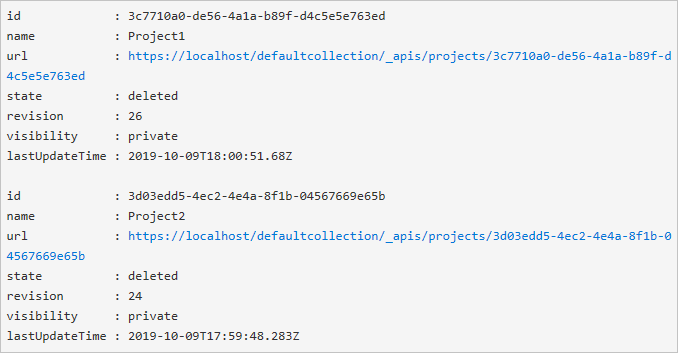

# Restore a project

[!INCLUDE [version-vsts-plus-azdevserver-2019](../../boards/_shared/version-vsts-plus-azdevserver-2019.md)]

You can restore a deleted project up to 28 days after it was deleted. This article shows you how.

> [!IMPORTANT]
> A project can only be restored if it was deleted from the Web or REST API.

## Prerequisites

::: moniker range="azure-devops"

To restore a project, you must have the "delete project" permission set to **Allow**. To learn how to check your permissions, see [View permissions](../security/view-permissions.md).

::: monker-end

::: moniker range="azure-devops-2019"

To restore a project, you must delete project permissions and have the "delete project" permission set to **Allow**. To learn how to check your permissions, see [View permissions](../security/view-permissions.md).

::: monker-end

> [!NOTE]
> A recently deleted project is only viewable when there's a project that's been deleted from an organization within the last 28 days.

## Restore project

::: moniker range="azure-devops"

1. Sign in to your organization (```https://dev.azure.com/{yourorganization}```).

2. Choose  **Organization settings**.

   
3. Select **Overview** and scroll down to "recently deleted projects."

   

4. Highlight the project you want to restore, and then select **Restore**.

   

::: moniker-end

::: moniker range="azure-devops-2019"

### PowerShell

1. Execute the following PowerShell script to get a list of deleted projects and make sure to update `$collectionUrl`.
```
$collectionUrl = "https://localhost/defaultcollection" 
(irm -Uri "$collectionUrl/_apis/projects?stateFilter=deleted&api-version=5.0-preview.3" -UseDefaultCredentials).value
```

   You see something similar to the following screenshot:

   

2. Use the following script to restore a project. Be sure to update `$collectionUrl` and `$projectName`.
```
$collectionUrl = "https://localhost/defaultcollection"
$projectName = 'Project1'
$project = (irm -Uri "$collectionUrl/_apis/projects?stateFilter=deleted&api-version=5.0-preview.3" -UseDefaultCredentials).value | where name -eq $projectName
irm -Uri ($project.url + "?api-version=5.0-preview.3") -UseDefaultCredentials -Method PATCH -Body '{"state":"wellFormed"}' -Headers @{'Content-Type' = 'application/json'}
```

### REST API

1. Sign in to your project API `https://{instance}/{collection}/_apis/projects`.

2. Get a list of deleted projects using the following request:
```
GET https://dev.azure.com/{organization}/_apis/projects?stateFilter=deleted&api-version=5.0-preview.3
```

3. Restore a deleted project using the following request:
```
PATCH https://dev.azure.com/{organization}/_apis/projects/{projectId}?api-version=5.0-preview.3
```

Request body
```
{
    "state" : "wellFormed"
}
```

::: moniker-end

Your project and associated data are restored.

## Related articles

* [Save project data](save-project-data.md)
* [Create a project](create-project.md)