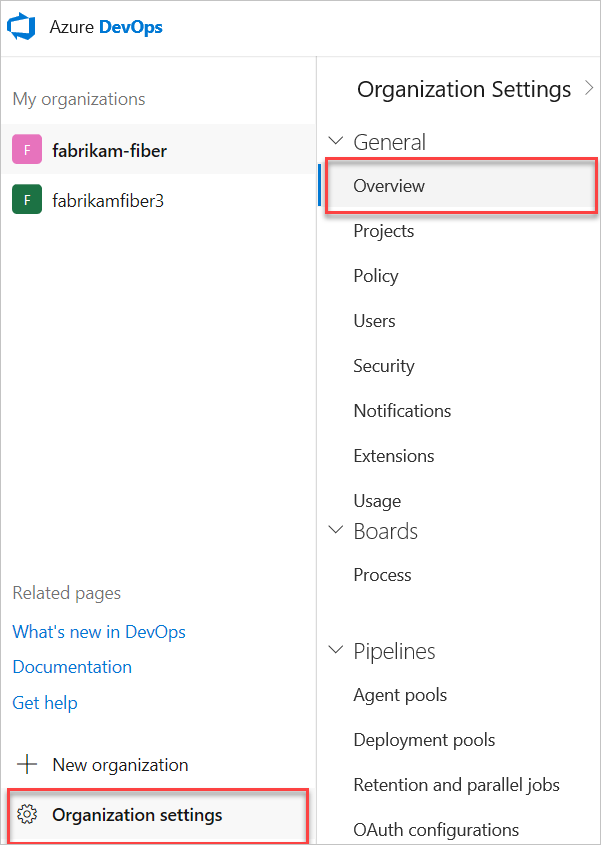
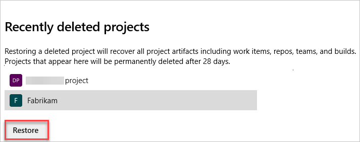

# Restore a project

[!INCLUDE [version-vsts-only](../../_shared/version-vsts-only.md)]

You can restore a deleted project up to 28 days after it was deleted.

## Prerequisites

To restore a project, you must have the "delete project" permission set to **Allow**. To learn how to check you permissions, see [View permissions](../security/view-permissions.md).

> [!NOTE]
> A recently deleted project is only viewable when there is a project that has been deleted from an organization and it is within the last 28 days.

## Restore project

1. Sign in to your organization (```https://dev.azure.com/{yourorganization}```).

2. Choose  **Organization settings**.

   
3. Select **Overview** and scroll down to "recently deleted projects."

   

4. Highlight the project you want to restore, and then select **Restore**.



Your project and associated data are restored.

## Related articles

* [Save project data](save-project-data.md)
* [Create a project](create-project.md)