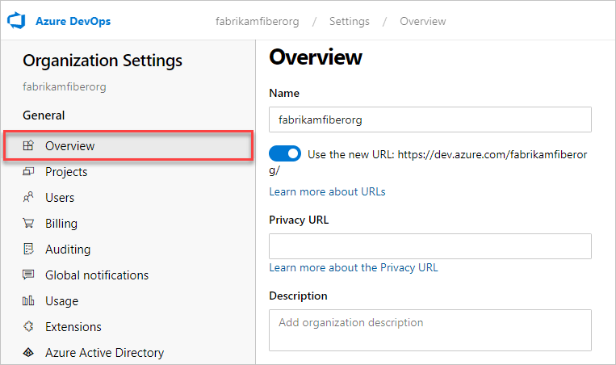

# Restore a project

[!INCLUDE [version-azure-devops-all](../../report/_shared/version-azure-devops-all.md)]

You can restore a deleted project up to 28 days after it was deleted. This article shows you how.

> [!IMPORTANT]
> A project can only be restored if it was deleted from the Web or REST API.

## Prerequisites

::: moniker range="azure-devops"

To restore a project, you must have the "delete project" permission set to **Allow**. To learn how to check your permissions, see [View permissions](../security/view-permissions.md).

::: moniker-end

::: moniker range="azure-devops-2019"

To restore a project, you must delete project permissions and have the "delete project" permission set to **Allow**. To learn how to check your permissions, see [View permissions](../security/view-permissions.md).

::: monker-end

> [!NOTE]
> A recently deleted project is only viewable when there's a project that's been deleted from an organization within the last 28 days.

## Restore project

::: moniker range="azure-devops"

1. Sign in to your organization (```https://dev.azure.com/{yourorganization}```).

2. Choose  **Organization settings**.

   
3. Select **Overview** and scroll down to "recently deleted projects."

   

4. Highlight the project you want to restore, and then select **Restore**.

   

::: moniker-end

::: moniker range="azure-devops-2019"

1. Execute the following PowerShell script to get the list of deleted projects:

`$collectionUrl = "https://localhost/defaultcollection" 
(irm -Uri "$collectionUrl/_apis/projects?stateFilter=deleted&api-version=5.0-preview.3" -UseDefaultCredentials).value`
2. Update $collectionUrl.

   You'll see something similar to the following screenshot:

   

3. Use the following script to restore a project. Be sure to update `$collectionUrl` and `$projectName`.

::: moniker-end

Your project and associated data are restored.

## Related articles

* [Save project data](save-project-data.md)
* [Create a project](create-project.md)