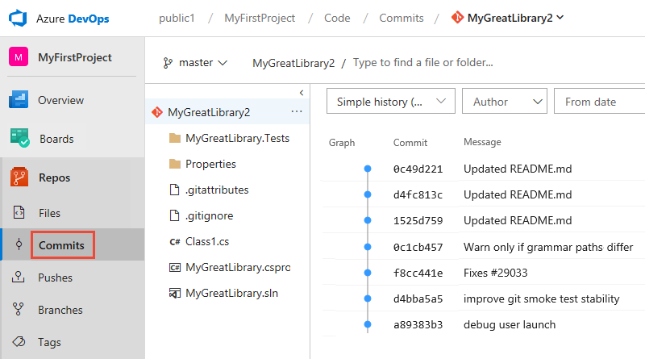

# Browse code, download code  

[!INCLUDE [temp](_shared/version-public-projects.md)]

When you're viewing a public project, you're able to browse and download the code stored within the repositories, and view code-related objects such as commits, branches, and pull requests.

> [!NOTE]
> By default you have read-only access to the code in the repository. To perform operations such as forking, creating branches, and making pull requests, you must be [invited to contribute](invite-users-public.md).

[!INCLUDE [temp](_shared/anon-user.md)]

## Open Repos > Files or Code > Files

Choose **Repos > Files**.

> [!div class="mx-imgBorder"]
> 

## Select the repository  

Select the repository of interest from the repository selector.  

> [!div class="mx-imgBorder"]
> 

## Download code

Open the  actions icon for the repository, file, or folder and choose **Download as Zip** (or **Download** if you are downloading a single file). You can also choose the **Download** icon at the right side of the screen to download either all of the files in the currently selected folder, or the currently selected file.

> [!div class="mx-imgBorder"]
> 

## View Files, Commits, Pushes, Branches, Tags, and Pull Requests  

Within a Git repository, you can view any of the following items: **Files**, **Commits**, **Pushes**, **Branches**, **Tags**, or **Pull Requests**.

In the following example, we view **Commits**.

> [!div class="mx-imgBorder"]
> 

## Next steps

> [!div class="nextstepaction"]
> [View and filter work items](view-filter-work-items-public.md)

## Related articles

- [Find a file or folder in a Git repository](../../repos/git/find-a-file.md)
- [Commit details](../../repos/git/commit-details.md)
- [Manage branches](../../repos/git/manage-your-branches.md)
- [Working with tags](../../repos/git/git-tags.md)
- [Review code with pull requests](../../repos/git/pull-requests.md)