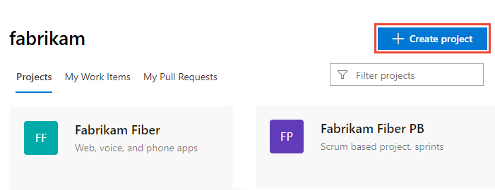

# Create a public project in your organization

[!INCLUDE [temp](_shared/version-public-projects.md)]  

A public project is similar to any other project that you add to your organization. Every project provides a repository for source code and a place for a group of people to plan, track progress, and collaborate on building software solutions.

A public project allows non-members of a project and users who aren't signed in read-only, limited access to the project's artifacts and services. For details, see [Default roles & access for public projects](default-roles-access-public.md).

You can add a public project to your existing organization, or create an organization and create a public project at that time. If you want to make an existing private project public, you can [change the project's visibility](make-project-public.md).

## Prerequisites

- You must have an organization created in Azure DevOps. If you don't have one, [do that now](../../user-guide/sign-up-invite-teammates.md).
- As an organization owner, you can create projects. If you're not the owner, then you must be [a member of the Project Collection Administrators Group](../security/set-project-collection-level-permissions.md#collection-level) or have your [**Create new projects** permission](../security/set-project-collection-level-permissions.md#collection-level) set to **Allow**.

## Enable anonymous access to projects for your organization

Before you can create a public project, you must enable anonymous access for your organization.

1. From your web browser, sign in to Azure DevOps. You must be signed in to create a public project.
2. Choose the  Azure DevOps logo to open **Projects**. Then choose **Admin settings**.

	> [!div class="mx-imgBorder"]  
	>   

3. Choose the **Policy** page, and select **On** for **Anonymous access to projects**.

	> [!div class="mx-imgBorder"]  
	> 

## Add a public project to your organization

1. Choose the  Azure DevOps logo to open **Projects**. 

	> [!div class="mx-imgBorder"]  
	>   

2. Choose **Create Project**.

	> [!div class="mx-imgBorder"]  
	>   

3. Provide a name for your project and choose **Public**. Keep the defaults, or select the initial source control type and process for work item tracking.

	> [!div class="mx-imgBorder"]  
	> 

4. Upon successful completion, the welcome page displays.

	> [!div class="mx-imgBorder"]  
	> 

	Select one of the following tasks to get started:  
	- **Invite** to begin [adding others to your project](../security/add-users-team-project.md). Note, if this is your first project, then you must first [invite users to your organization](../accounts/add-team-members.md).
	- **Boards** to begin [adding work items](../../boards/work-items/view-add-work-items.md).
	- **Repos** to open [Repos>Files](../../repos/git/clone.md) page where you can clone or import a repository, or initialize a README file for your project summary page.
	- **Pipelines** to start [defining a pipeline](../../pipelines/index.md).
	- **Test Plans** to start [defining test plans and test suites](../../test/create-a-test-plan.md).
	- [Manage your services](../settings/set-services.md) to disable the visibility of one or more services.

To get started managing your project, see [Get started as an administrator](../../user-guide/project-admin-tutorial.md).

## Share the URL of your public project

Once created, an [anonymous user](glossary-public.md#anonymous-user) or [public user](glossary-public.md#public-user) can view the contents of your public project.

To provide instant access, share the URL of your public project, which provides read-only access. For example, you can share the following portion of the URL shown under **Clone to your computer**.  

`https://dev.azure.com/OrganizationName/ProjectName/`

## Next steps

> [!div class="nextstepaction"]
> [Invite users to contribute to your public project](invite-users-public.md)

## Related articles

- [Differences and limitations for non-members of a public project](feature-differences.md)