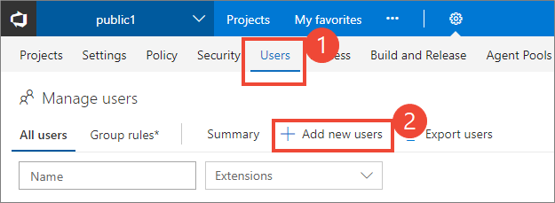
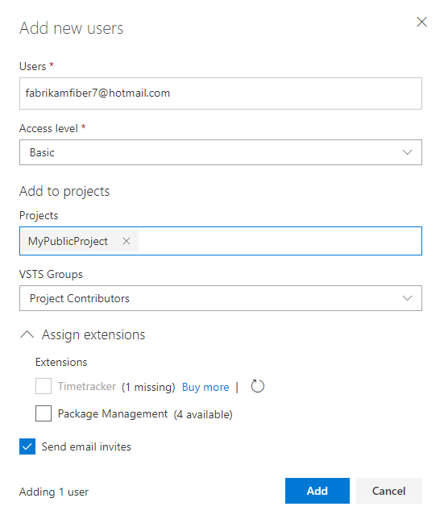

<a id="invite-others" />

# Invite users to contribute to your public project

[!INCLUDE [temp](_shared/version-public-projects.md)]  

To enable users to contribute to your project, you must add them as a member.

> [!IMPORTANT]
> Before you add a member, review the notes provided in [private-to-public migration checklist](migration-checklist.md) as well as
> the [additional cross-project resources](../accounts/resources-granted-to-project-members.md) this grants.

## Open Organization Settings>Users

[!INCLUDE [temp](../../_shared/new-navigation-cloud.md)] 

# [New navigation](#tab/new-nav)

0. From your web browser, sign-in to Azure DevOps. You must be signed in to create a public project. 

0. Choose the  Azure DevOps logo to open **Projects**. Then choose **Admin settings**. 

	> [!div class="mx-imgBorder"]  
	>   

0. Then, choose **Users** to open **Manage users**. Choose **Add new users** to open the dialog.

	> [!div class="mx-imgBorder"]  
	> 

# [Previous navigation](#tab/previous-nav)

0. From your web browser, sign-in to Azure DevOps. You must be signed in to create a public project. You also must be the owner, belong to the Project Collection Administrators security group, or have been granted the necessary permissions to manage users.  

0. Choose the  gear icon to open **Account Settings**.

	> [!div class="mx-imgBorder"]  
	>  

0. Then, choose **Users** to open **Manage users**. Choose **Add new users** to open the dialog.

	> [!div class="mx-imgBorder"]  
	> 

---

## Add user accounts to a project

0. Fill out the form based on the guidance provided.

	> [!div class="mx-imgBorder"]  
	> 

	- **Users**: Enter the email address for the user account. You can add several email addresses by separating them with a semicolon (;). Note that for Microsoft accouts (MSAs), the email addresses display in red.
	- **Access level**: You can add up to 5 users (total including your own user account) with *Basic* access. Otherwise, you can add an unlimited number of users with *Stakeholder* access. In public projects, both the Stakeholder and the Basic access level grant full access to **Code**, **Work**, and **Build and Release**, but Stakeholders only get partial access to **Test** and **Dashboards**.  To learn more, see [Default roles & access for public projects](default-roles-access-public.md).
	- **Add to projects**: Select the public project that you created, or select **Add All** to add the user to all projects defined for the organization.  
	- **Azure DevOps Groups**: Leave this entry at Project Contributors, the default security group for people who will contribute to your project. To learn more, see [Default permissions and access assignments](../security/permissions-access.md).

5. When done, choose **Add** to complete your invitation.

<!---
## Add members to your public project from your project page 

 Are admins able to add new users from this page, or only users who have been previously added to the organization?  

0. Add members from your project page.   
	> [!div class="mx-imgBorder"]  
	> 

0. Fill out the form. 
	> [!div class="mx-imgBorder"]  
	> 
-->

## Try this next
> [!div class="nextstepaction"]
> [Clone an existing Git repo](clone-git-repo-public.md)