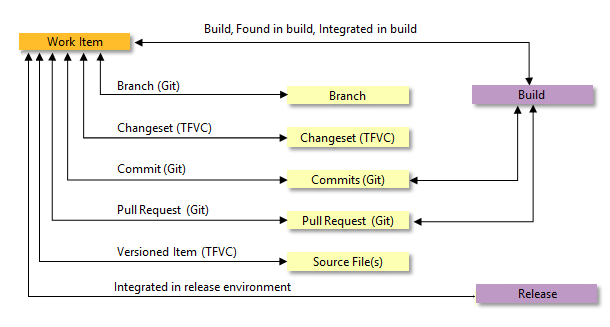

# Private-to-public migration checklist

[!INCLUDE [temp](_shared/version-public-projects.md)]  

Before changing the visibility of your private project to public, you'll want to consider what data may be exposed to non-members. Most existing private projects contain a large amount of historical data. Old work items, early commits, and previous build pipelines might have content you don't want to share publicly.

The checklist provided in this article indicates those items you may want to review before making a project public. It also provides tips for migrating work items or files to a new project so that you can expose only current and future content.

## Account identities and settings

When you invite someone to become a member of a project, that person gains access to additional resources and details about the account. Specifically, they have access to the following information.

> [!div class="mx-tdCol2BreakAll"]  
> | Area             | Additional details a member receives                |
> |------------------|-----------------------------------------------------|
> | Identities       | List of all members added to the organization       |
> | Identities       | Email contact information for each project member   |
> | Settings         | Read-only view of all organization and project settings  |
> | Process metadata | All picklist values in all projects in the account  |

## Cross-project linked objects

In Azure DevOps, you can link objects that exist in different projects defined in the same organization. For example, you can link a bug in Project A to a pull request in Project B. If links exist between a public and a private project, details about the linked artifact in the private project are visible within the public project.

The link types used to construct these links, as illustrated in the following image, are: Branch, Build, Changeset, Commit, Found in build, Integrated in build, Pull Request, and Versioned Item.

 

Five kinds of cross-project links expose content from the private project.

> [!div class="mx-tdCol2BreakAll"]  
> | Link type            | Exposed content         |
> |----------------------|-------------------------|
> | Versioned Item       | Project name, file name |
> | Branch               | Branch name             |
> | Wiki page            | File name               |
> | Pull Request         | Pull request title      |
> | Work item            | Work item title         |

## Agile tools and work items

Because work-items maintain their history when migrated from a private to public project, you'll want to check the following: 

* Confirm that your work items, even closed ones, don't contain sensitive details: undisclosed security flaws, credentials, and customer data.
* Be aware that all discussions and descriptions are available. Check that none contain embarrassing or problematic speech.
* Confirm that none of your area paths have special, locked-down security settings. Denied permissions are not enforced in a public project, so restricted area paths become public.

> [!TIP]
> If you aren't comfortable exposing the whole work item database, you have migration options.
> See the [instructions for moving work items](#move-work-items).

## Code

* Confirm that you have no sensitive details in your repositories' history: unpatched security bugs, credentials, and code you don't have the right to distribute.
* Be aware that all file contents and commit messages are available. Check that none contain embarrassing or problematic speech.

> [!TIP]
> If you aren't comfortable exposing an entire repository, you can migrate the tip to another project.
> See the [instructions for a tip migration](#git-tip-only-migration).

## Build and release 

* Confirm that none of your pipelines expose sensitive data: credentials/secrets, obscure URLs, and private environment names.
* Confirm that non-members don't require access to your private feeds. Builds can still access feeds, but non-members cannot.

If you need to migrate build pipelines to a new project (perhaps because you're moving code or work items), you can import and export them using [YAML](../../pipelines/get-started-yaml.md).

## Test

* Understand that manual and cloud load testing features won't be available to non-members in a public project.

## Analytics and dashboards

* Consider building a dashboard intended for the public. Some [widgets are unavailable](feature-differences.md#dashboard-widget-support) to non-members, so don't rely on these.

## Extensions

Are any extensions vital to your project's experience?
For instance, do you have a control on your work item form which renders data in a particular way?
Are there custom extensions which expose important details?

* Confirm that each extension's author has made it available for non-members by testing it.
* If not, ask the extension author to add support for non-members. For details, see [Extensions and public project support](../../extend/develop/public-project.md).

## Partial migration tips

Accounts containing sensitive material should not enable the public projects policy.
In that case, we recommend creating an entirely separate account to host your public projects.

<a id="move-work-items" />

### Move work items to a private project

If one or a handful of work items are sensitive, you can [move them](../../boards/backlogs/remove-delete-work-items.md#move) into a separate, private project.
Cross-project links continue to work for members.
Non-members won't have access to the content since it resides in a private project.

If you have a large number of sensitive work items, consider keeping your current project private.
Instead, create a new public project in another account.
Migrating work items can be accomplished using the open source [WiMigrator](https://github.com/Microsoft/vsts-work-item-migrator) maintained by Microsoft.

### Git tip-only migration

If a repository cannot be shared due to problematic history, consider doing a tip-only migration to a new repository in a different project.
The project containing the problematic repository should remain private.
The new repository should be created in a project you don't mind making public.

> [!WARNING]
> The new repository won't have connection to the old one.
> You won't easily be able to migrate changes between them in the future.
> Also, your pull request history won't be migrated.

- Clone the existing repository: `git clone <clone_URL>`
- Make sure you're in the root of the repository: `cd <reponame>`
- Ensure you're on the tip of the branch you want to start from, usually master: `git checkout master`
- Delete the Git data: `rmdir /s .git` on Windows, `rm -rf .git` on macOS or Linux
- Initialize a new Git repository: `git init`
- Create a new, empty repository in your public project.
- Add the new repository as your origin remote: `git remote add origin <new_clone_URL>`
- Push up your new repository: `git push --set-upstream origin master`

## Related articles

- [Make a project public](make-project-public.md) 

<!---
[!INCLUDE [warning](_shared/warning-cross-link.md)]

-->