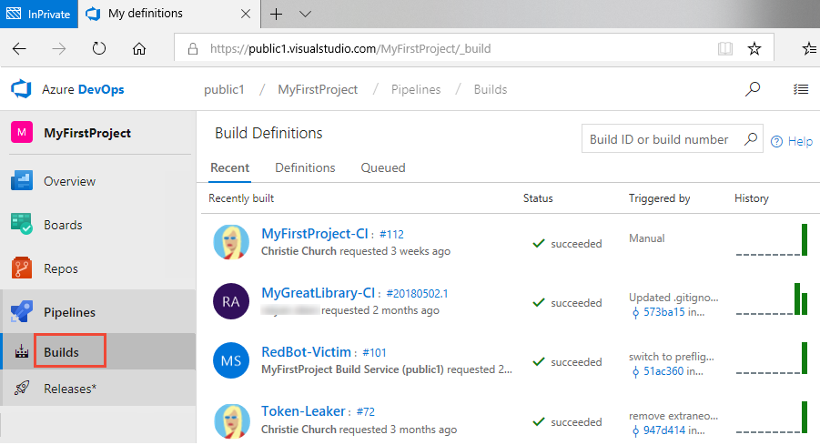
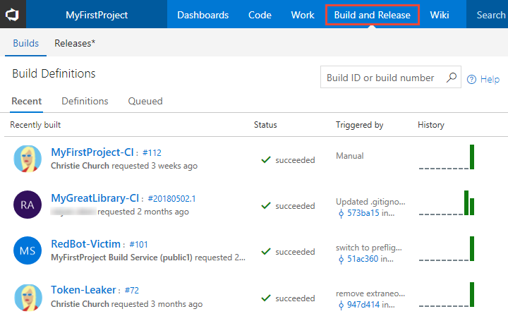
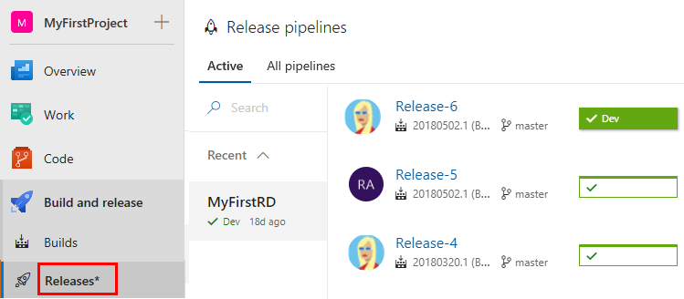
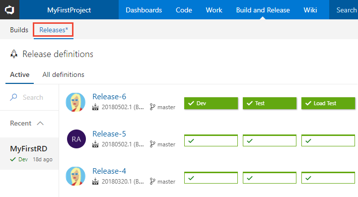

# View build and release pipelines

[!INCLUDE [temp](_shared/version-public-projects.md)]  

When viewing a public project, you can view the status of build and release pipelines. If you're a contributor, you can also [define build pipelines](../../pipelines/get-started-yaml.md?toc=/azure/devops/organizations/public/toc.json&bc=/azure/devops/organizations/public/breadcrumb/toc.json).  

[!INCLUDE [temp](_shared/anon-user.md)]

## View recent builds and build pipelines  

[!INCLUDE [temp](../../_shared/new-navigation.md)]

# [New navigation](#tab/new-nav)

To view the status of recent builds, select  **Pipelines > Builds**. To view a summary or history of any build, choose a build.

> 

# [Previous navigation](#tab/previous-nav)  

To view the status of recent builds, choose **Build and Release>Builds**. To view a summary or history of any build, choose a build.

> 

---

## View active release pipelines

# [New navigation](#tab/new-nav)

To view active release pipelines, select **Pipelines > Releases**.

> 

From there, you can drill into the details of a release. For example, here we show  the **Release-3** pipeline.

> 

# [Previous navigation](#tab/previous-nav)

To view active release pipelines, choose **Build and Release>Releases**.

> 

From there, you can drill into the details of a release. For example, here we show the **Release-3** pipeline.

> 

---

## Related articles

- [Release pipelines](../../pipelines/release/index.md)