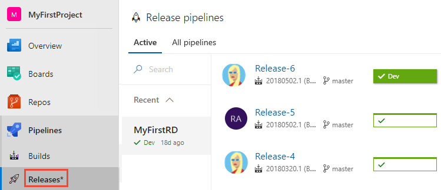

# View build and release pipelines

[!INCLUDE [temp](includes/version-public-projects.md)]  

In this article, learn how to view the status of build and release pipelines for public projects. If you're a contributor, you can also [define build pipelines](../../pipelines/build/ci-public.md?toc=/azure/devops/organizations/public/toc.json&bc=/azure/devops/organizations/public/breadcrumb/toc.json).  

[!INCLUDE [temp](includes/anon-user.md)]

## View recent builds and build pipelines  

To view the status of recent builds, select  **Pipelines > Builds**. To view a summary or history of any build, choose a build.

> 

## View active release pipelines

To view active release pipelines, select **Pipelines > Releases**.

> 

From there, you can drill into the details of a release. For example, here we show  the **Release-3** pipeline.

> 

## Next steps

> [!div class="nextstepaction"]
> [Review release pipelines](../../pipelines/release/index.md)