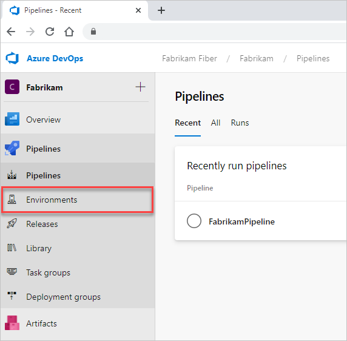
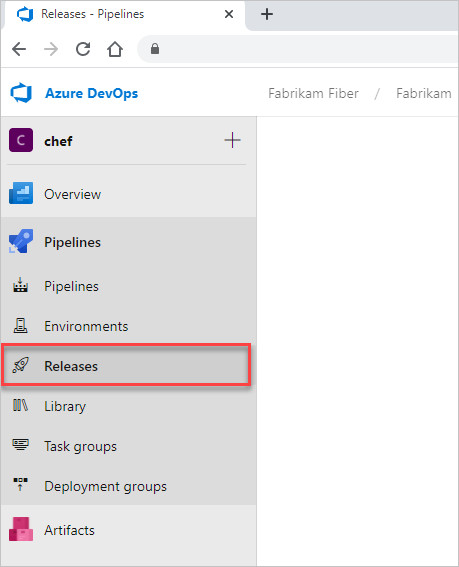
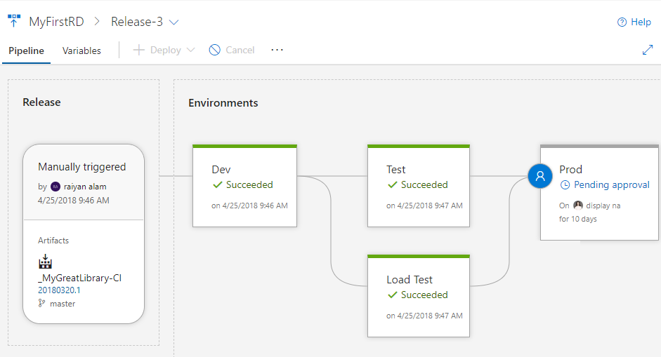

# View environments and releases in pipelines

[!INCLUDE [temp](includes/version-public-projects.md)]  

Learn how to view the status of environment and release pipelines for public projects. If you're a contributor, you can also [define environment pipelines](../../pipelines/repos/index.md?bc=%252fazure%252fdevops%252forganizations%252fpublic%252fbreadcrumb%252ftoc.json&toc=%252fazure%252fdevops%252forganizations%252fpublic%252ftoc.json).  

[!INCLUDE [temp](includes/anon-user.md)]

## View recent environments and environments pipelines  

To view the status of recent environments, select  **Pipelines > Environments**. To view a summary or history of any environment, choose an environment.

## View active release pipelines

To view active release pipelines, select **Pipelines > Releases**.

From there, you can drill into the details of a release. For example, here we show  the **Release-3** pipeline.

## Next steps

> [!div class="nextstepaction"]
> [Review release pipelines](../../pipelines/release/index.md)