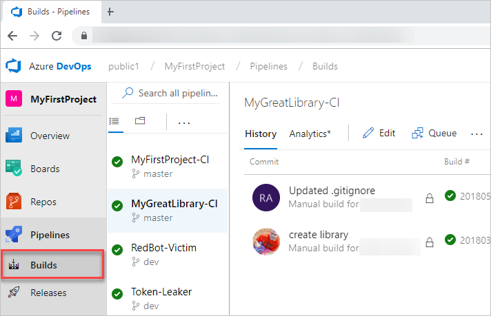

# View build and release pipelines 

[!INCLUDE [temp](_shared/version-public-projects.md)]  

When viewing a public project, you can view the status of build and release pipelines and their definitions. If you're a contributor, you can also [define build pipelines](../../pipelines/build/ci-public.md?toc=/vsts/organizations/public/toc.json&bc=/vsts/organizations/public/breadcrumb/toc.json).  

[!INCLUDE [temp](_shared/anon-user.md)]   

## View recent builds and build pipelines  

[!INCLUDE [temp](_shared/navigation.md)] 

# [Horizontal navigation](#tab/horizontal)  

To view the status of recent builds, choose **Build and Release**.  To view a summary or history of any build, choose a build. 

> [!div class="mx-imgBorder"]
> 

# [Vertical navigation](#tab/vertical)

To view the status of recent builds, choose **Builds** under **Build and release**. To view a summary or history of any build, choose a build. 

> [!div class="mx-imgBorder"]
> 

---

## View active release pipelines and definitions 

# [Horizontal navigation](#tab/horizontal)  

To view active release pipelines, choose **Build and Release>Releases**. 

> [!div class="mx-imgBorder"]
> 

From there, you can drill into the details of a release. For example, here we show the **Release-3** pipeline.   

> [!div class="mx-imgBorder"]
> 

 
# [Vertical navigation](#tab/vertical)  

To view active release pipelines, choose **Releases** under **Build and release**. 

> [!div class="mx-imgBorder"]
> 

From there, you can drill into the details of a release. For example, here we show  the **Release-3** pipeline.   

> [!div class="mx-imgBorder"]
> 

---

## Related articles 

- [Release definitions](../../pipelines/release/index.md)