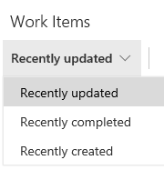
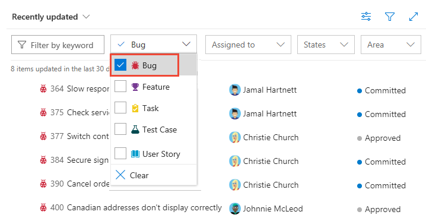

# View and filter work items  

[!INCLUDE [version-eq-azure-devops](../../includes/version-eq-azure-devops.md)]

Learn how to view work items that are defined for a public project. If you're a contributor or Stakeholder, you can also [add and edit work items](../../boards/work-items/view-add-work-items.md).  

[!INCLUDE [temp](includes/anon-user.md)]

## View work items

To view **Work Items**, choose **Boards**. You can view recently created, updated, and completed work items.  

> [!div class="mx-imgBorder"]
> 

By default, completed work items are hidden. To show them, choose :::image type="icon" source="../../media/icons/view-options-icon.png" border="false"::: **view options**, and switch the slider to show **Completed Work Items**.
  
To view a work item, choose its title. As an anonymous user (one not signed into the project), you can only view the details shown. You can't modify or add information to the work item.

## Choose your work item view

Using the drop-down menu, you can focus on relevant items using one of the three pivots described next. Additionally, you can [filter](#filter) and [sort](#sort) each pivot view.  

:::row:::
   :::column span="1":::
   
   
   :::column-end:::
   :::column span="3":::   
   
   - **Recently updated**: lists work items recently updated in the project. 
   - **Recently completed**: lists work items completed or closed in the project.
   - **Recently created**: lists work items created within the last 30 days in the project.
   
   :::column-end:::
:::row-end:::

<a id="filter" />

## Filter the list of work items

Choose :::image type="icon" source="../../media/icons/filter-icon.png" border="false"::: **filter** to view the filters available to you. You can filter each view by entering a keyword or using one or more of the fields provided, such as work item type (Types), State, Area Path, and Tags. The page remembers the filters you set for each pivot, supporting personalized views across all pivots.

> [!div class="mx-imgBorder"]
> 
> 
> [!NOTE]
> Depending on the process chosen when the project was created&mdash;[Agile](../../boards/work-items/guidance/agile-process-workflow.md), [Scrum](../../boards/work-items/guidance/scrum-process-workflow.md), or [CMMI](../../boards/work-items/guidance/cmmi-process-workflow.md)&mdash;the types of work items shown differ. For example, backlog items may be called product backlog items (Scrum), user stories (Agile), or requirements (CMMI). All three are similar: they describe the customer value to deliver and the work to be performed.
> 
> For an overview of all processes, see [Choose a process](../../boards/work-items/guidance/choose-process.md).

<a id="sort" />

## Sort your view  

You can sort your view by one of the column fields shown on the page.  

To sort on a column, select the column title. To reverse the sort order, select the column title again. 

> [!NOTE]
> Column sort is only supported from the **Work Items** and **Queries** pages. You can't sort on a **Backlog** or a **Board**. 
 

## Next steps

> [!div class="nextstepaction"]
> [View project homepage or a dashboard](view-project-dashboard-public.md)

## Related articles
 
- [View and add work items using the Work Items page](../../boards/work-items/view-add-work-items.md) 
- [Remove, delete, or restore work items](../../boards/backlogs/remove-delete-work-items.md)

 