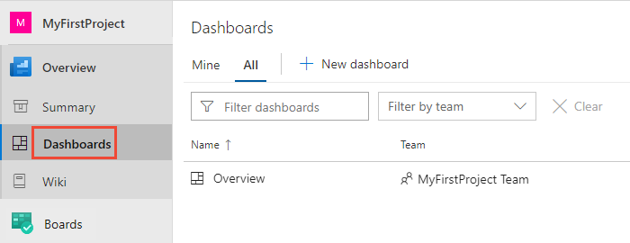

# View project homepage or a dashboard

[!INCLUDE [temp](_shared/version-public-projects.md)]  

The project homepage typically provides information about the project, and dashboards provide charts, links, or focused information for a team or project.

If you're a contributor, you can also [edit README files for a project](../projects/project-vision-status.md) and [add and edit dashboards](../../report/dashboards/dashboards.md).  

[!INCLUDE [temp](_shared/anon-user.md)]

## Open the project home page

From your web browser, open the public project.

To open the project home page, choose **Summary** from the sidebar.

> [!div class="mx-imgBorder"]
> 

You're invited to clone the project's main Git repository to your computer. To learn more about cloning, see [Clone a Git repository](clone-git-repo-public.md).

> [!NOTE]
> You can clone a Git repository via HTTPS, however not with SSH and GVFS endpoints. Clients like Visual Studio and IntelliJ work with the HTTPS clone URL.

## View dashboards

To view a dashboard, choose **Dashboards**. You see the set of dashboards defined for the default team. Choose one of the dashboards to open it.

> [!div class="mx-imgBorder"]
> 

## Unavailable dashboard widgets

Anonymous users won't be able to view or interact with select widgets. In place of the widget display, you'll see an image similar to the one as shown.  

> [!div class="mx-imgBorder"]
> 

The following dashboard widgets aren't available to anonymous users:

[!INCLUDE [temp](_shared/unavailable-widgets.md)]  

## Next steps

> [!div class="nextstepaction"]
> [View the wiki for your project](view-wiki-public.md)

