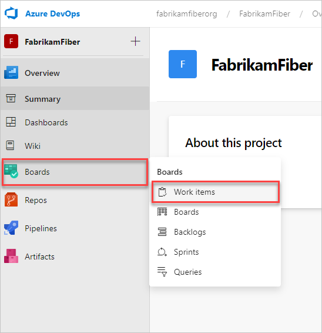
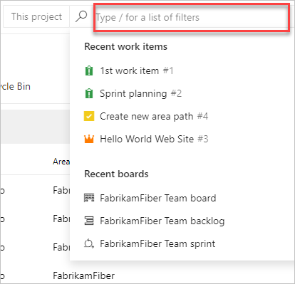
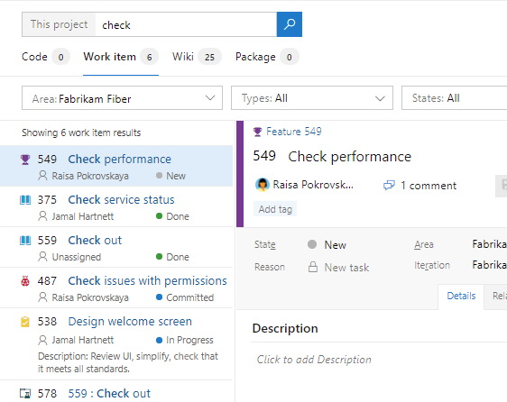

# Search for work items defined in a public project

[!INCLUDE [temp](includes/version-public-projects.md)]  

Learn how to perform a work item search to quickly find work items defined within a public project.

<a name="start-search"></a>

## Initiate a search

> [!NOTE]   
> To enable the new user interface for Enable modern search, see [Enable preview features](../../project/navigation/preview-features.md).

#### [Preview page](#tab/preview-page) 

1. Sign in to your organization: ```https://dev.azure.com/{yourorganization}```.

2. Select  **Organization settings**.

   

3. Select **Boards**, and then **Work items**.

   

4. Enter your search.

   

#### [Current page](#tab/current-page)

1. Choose **Work > Work Items**, enter a keyword or phrase in the search box, and press *Enter* or choose  **start search**.

	> [!div class="mx-imgBorder"]
	> 

2. Search results are displayed in a snippet view where the matches found are shown in bold.

   

   This is a full text search that uses simple search strings for words or phrases.
   Work item search matches derived forms of your search terms; for example, a search for
   "updating" also finds instances of the word "updated" and "update". Note that searches are _not_ case-sensitive.

3. Select a snippet of a work item to display it in the right window.
  
   >Open the search results in a new browser tab from a search box by
   pressing _Ctrl_ + _Enter_ or by holding _Ctrl_ and selecting 
    **start search**.
   In Google Chrome, press _Ctrl_ + _Shift_ + _Enter_ to switch the focus
   to the new browser tab.

## Fine-tune your search

1. Fine tune your search by specifying the fields to search. Enter `a:` and a user name
   to search for all items assigned to that user.

	> [!div class="mx-imgBorder"]  
	> 

   The quick filters you can use are:

   * `a:` for **Assigned to:** 
   * `c:` for **Created by:** 
   * `s:` for **State** 
   * `t:` for **Work item type**<p />

2. Start to enter the name of a field in your work items; for example, enter `ta`.

   

   The dropdown list shows work item field name suggestions
   that match user input thereby helping the user to complete the search faster. For example, a search such as
   **tags:Critical** finds all work items tagged 'Critical'.

3. Add more filters to further narrow your search, and use Boolean operators
   to combine terms if required. For example,
   **a: Chris t: Bug s: Active** finds all active bugs assigned
   to a user named Chris.

4. Narrow your search to specific types
   and states, by using the drop-down selector lists at the upper portion of the results page.

## Next steps

> [!div class="nextstepaction"]
> [Search the code base](code-search-public.md)


