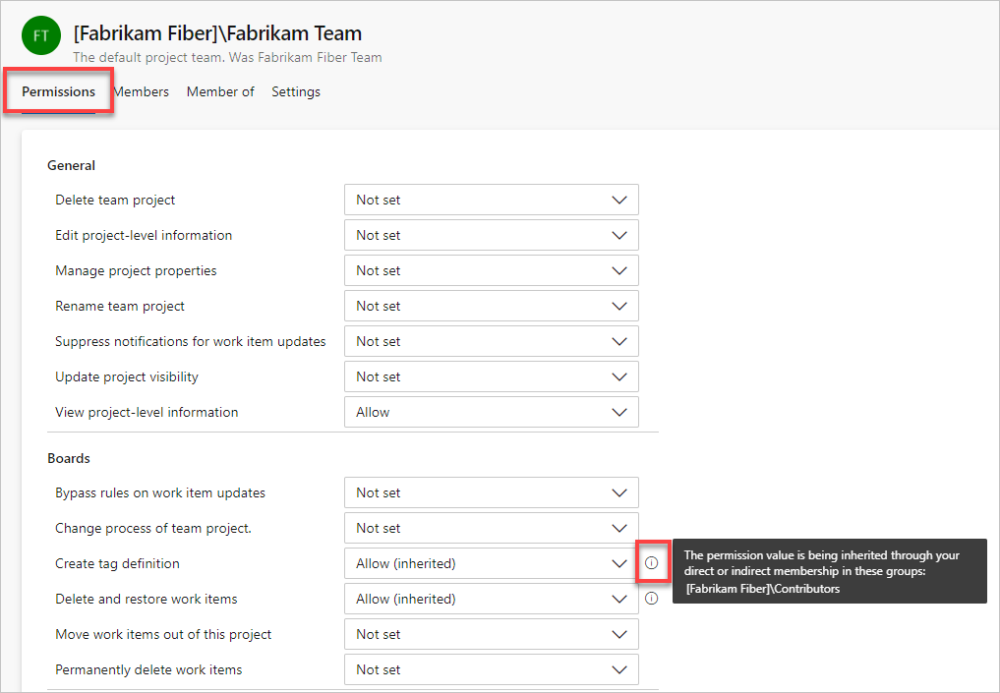
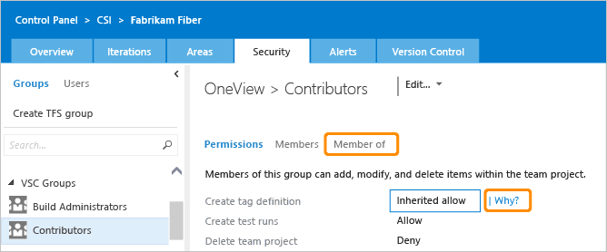

# Get started with permissions, access, and security groups  

[!INCLUDE [version-all](../../includes/version-all.md)]

When it comes to accessing an Azure DevOps feature, it's helpful to understand the following key concepts. 

- All users added to Azure DevOps are typically added to one or more *security groups*. 
- Security groups are assigned *permissions* which either allow or deny access to a feature. 
- Members of the security group *inherit the permissions* assigned to the group.
- Each user is also assigned an *access level* which grants or restricts access to select web portal features. 
- Permissions are set at various levels for most objects, such as repositories, pipelines, area paths, and so on. 
- Other permissions are managed through *role-based assignments*, such as team administrator role, extension management role, and various pipeline resource roles.  
- And finally, as new features are introduced you may need to enable their *feature flag* to access them. 

For example, individual contributors are added to the Contributors security group which provides read and write access to repositories, work tracking, pipelines, and more. Also, Contributors are primarily granted Basic access. If they need access to test services, then they may be granted Advanced or Basic + Test Plans access. Permissions may apply to a specific project or objects within the project, such as Git repositories, branches, pipelines, area paths, and more. Or, they can apply to an entire organization or collection. Each functional area uses security groups to simplify management across the deployment.

Administrators manage security groups and permissions from the web portal administration context. Contributors manage permissions for objects they create or own from the web portal as well. Permissions are automatically set based on the group that you add users to, or based on the object, project, collection, or server-level to which you add users or groups.  

To learn more, review the information provided in this article and the following articles:  

- [Default permissions and access](permissions-access.md)  
- [Troubleshoot permissions](troubleshoot-permissions.md)

<a id="security-group-membership" /> 

## Security groups and membership  

With the creation of an organization, collection, or project&mdash;Azure DevOps creates a set of default security groups which are automatically assigned default permissions. Additional security groups are defined with the following actions: 
- When you add a custom security group. You can create custom security groups at the following levels: 
	- Object-level, such as for pipelines, repositories, area paths, and more
	- Project-level
	- Organization- or collection-level
	- Server-level (on-premises only)
- When you add a team, a team security group is created 

Azure DevOps controls access through these three inter-connected functional areas:

-   **Membership management** supports adding individual user accounts and groups to default security groups. Each default group is associated with a set of default permissions. All users added to any security group are added to the Valid Users group. A valid user is someone who can connect to a project, collection, or organization.

-   **Permission management** controls access to specific functional tasks at different levels of the system. Object-level permissions set permissions on a file, folder, build pipeline, or a shared query. Permission settings correspond to **Allow**, **Deny**, **Inherited allow**, **Inherited deny**, and **Not set**. To learn more about inheritance, see [Permission inheritance and security groups](#inheritance) later in this article.

-   **Access level management** controls access to features provided via the web portal, the web application for Azure DevOps. Based on  what has been purchased for a user, administrators set the user's access level to Basic, Basic + Test, VS Enterprise (previously Advanced), or Stakeholder. 

Each functional area uses security groups to simplify management across the deployment. You add users and groups through the web administration context. Permissions are automatically set based on the security group that you add users to, or based on the object, project, collection, or server level to which you add groups.  

::: moniker range="azure-devops"
Security group members can be a combination of users, other groups, and Azure Active Directory groups.  
::: moniker-end
::: moniker range="< azure-devops"
Security group members can be a combination of users, other groups, and Active Directory groups or a Workgroup. 

You can create local groups or Active Directory (AD) [groups to manage your users](/azure/devops/server/admin/setup-ad-groups). If you decide to use groups, make sure that membership in those groups is limited to valid users. Because group membership can be altered by their owners at any time, if those owners did not consider Azure DevOps Server access when they created those groups, their changes to membership can cause unwanted side effects within the server.
::: moniker-end

Most users are assigned to the Contributors group for a project to provide them access to the features they need to access. Administrators should be added to the Project Collection Administrators or Project Administrators group. 

<a id="aad" /> 

### Active Directory and Azure Active Directory security groups

You can populate security groups by adding individual users. However, for ease of management, it's easier if you populate these groups by using Azure Active Directory (Azure AD) for Azure DevOps Services and Active Directory (AD) or Windows user groups for Azure DevOps Server.  This method enables you to manage group membership and permissions more efficiently across multiple computers. 
 
If you only have to manage a small set of users, then you can skip this step. However, if you foresee that your organization may grow, you may want to set up AD or Azure AD. Also, if you plan on paying for extra services, you'll need to set up Azure AD for use with Azure DevOps to support billing.
 
> [!NOTE]
> Without Azure AD, all Azure DevOps users must sign in using Microsoft accounts, and you must manage account access by individual user accounts. Even if you manage account access using Microsoft accounts, you need to set up an [Azure subscription in order to manage billing](../billing/set-up-billing-for-your-organization-vs.md).

::: moniker range="azure-devops"

To set up Azure Active Directory for use with Azure DevOps Services, see [Connect your organization to Azure Active Directory](../accounts/connect-organization-to-azure-ad.md).

> [!NOTE]  
> When your organization is connected to Azure Active Directory, there are a number of organization policies which you can enable or disabled to secure your organization. To learn more, see [About security, authentication, and authorization, Security-policies](about-security-identity.md#security-policies). 

To manage organizational access with Azure AD, refer to the following articles: 

* [Add or delete users using Azure Active Directory](/azure/active-directory/fundamentals/add-users-azure-active-directory)
* [Troubleshoot access with Azure Active Directory](../accounts/faq-azure-access.yml) 

::: moniker-end

::: moniker range="< azure-devops"

To set up Active Directory for use with Azure DevOps Server, see the following articles:

* [Install Active Directory Domain Services (Level 100)](/windows-server/identity/ad-ds/deploy/install-active-directory-domain-services--level-100-)
* [Active Directory Domain Services Getting Started](/windows-server/identity/ad-ds/ad-ds-getting-started).

Typically, you should install Active Directory prior to installing Azure DevOps Server.

::: moniker-end

 

### Valid user groups

When you add accounts of users directly to a security group, they are automatically added to one of the valid user groups.

::: moniker range="azure-devops"
- Project Collection Valid Users: All members added to an organization-level groups.
- Project Valid Users: All members added to a project-level group.
::: moniker-end
::: moniker range="azure-devops-2019 || azure-devops-2020"
- *Server*\\Azure DevOps Valid Users: All members added to server-level groups.
- *ProjectCollectionName*\\Project Collection Valid Users: All members added to collection-level groups.
- *ProjectName*\\Project Valid Users: All members added to project-level groups.
::: moniker-end
::: moniker range="< azure-devops-2019"
- *Server*\\Team Foundation Valid Users: All members added to server-level groups.
- *ProjectCollectionName*\\Project Collection Valid Users: All members added to collection-level groups.
- *ProjectName*\\Project Valid Users: All members added to project-level groups.
::: moniker-end

The default permissions assigned to these groups are primarily limited to
read access, such as **View build resources**, **View project-level information**, and **View collection-level information**.

This means that all users that you add to one project can view the objects in other projects within a collection.
If you need to restrict view access, then you can [set restrictions through the area path node](../../organizations/security/set-permissions-access-work-tracking.md).

If you remove or deny the **View instance-level information** permission for one of the valid users groups,
no members of the group are able to access the project, collection, or deployment, depending on the group you set.
<a id="grant-permissions" />  
<a id="access-levels" />

<a id="project-scoped-user-group" /> 

::: moniker range="azure-devops"

### Project-scoped User group 

By default, users added to an organization can view all organization and project information and settings. This includes viewing list of users, list of projects, billing details, usage data, and more that is accessed through **Organization Settings**. 

To restrict select users, such as Stakeholders, Azure Active Directory guest users, or members of a particular security group, you can enable the **Limit user visibility for projects** preview feature for the organization. Once that is enabled, any user or group added to the **Project-Scoped Users** group, are restricted from accessing the **Organization Settings** pages, except for **Overview** and **Projects**; and are restricted to accessing only those projects to which they've been added to. 

To enable this feature, see [Manage or enable features](../../project/navigation/preview-features.md#account-level). 

[!INCLUDE [version-all](./includes/hidden-security-groups.md)]

::: moniker-end

## Access levels 

Access levels control what features are visible to users in the web portal,
and are dependent on user licenses; permissions control a user's ability to connect to Azure DevOps and use features across Azure DevOps. 
If you're trying to give someone access to Agile portfolio management 
or test case management features, 
you'll want to [change access levels](change-access-levels.md), not permissions. 
 
Setting the access level for users or groups doesn't provide them access to a project or the web portal. Only users or groups added to a team or security group can connect to a project and the web portal. Make sure your users have both the permissions and the access level they need. You do this by making sure they're [added to the project or a team](add-users-team-project.md).

<a name="permission-settings" />

## Permissions   

::: moniker range="azure-devops"

As shown in the following image, security groups defined at the project and collection-level can be assigned to permissions assigned at the object, project, and organization-level.
 
:::image type="content" source="media/about-security/security-groups-permission-management-cloud.png" alt-text="Conceptual image mapping default security groups to permission levels, cloud":::

::: moniker-end

::: moniker range="<= azure-devops-2020"

As shown in the following image, security groups defined at the project and collection-level can be assigned to permissions assigned at the object, project, and collection level. You can only define server-level security groups to server-level permissions. 
::: moniker-end

::: moniker range=">= azure-devops-2019 <= azure-devops-2020"
:::image type="content" source="media/about-security/security-groups-permission-management-on-premises.png" alt-text="Conceptual image mapping default security groups to permission levels, on-premises":::

::: moniker-end

::: moniker range="< azure-devops-2019"
 
::: moniker-end
 
For a description of each default security group, see [Security groups, service accounts, and permissions](permissions.md#groups).

### Permission states 

There are five possible assignments made to a permission. They grant or restrict access as indicated. 
- User or group has permissions to perform a task: 
	- **Allow** 
	- **Inherited allow** 
- User or group doesn't have permission to perform a task: 
	- **Deny** 
	- **Inherited deny** 
	- **Not set** 

Here's what you need to know about permission settings:

- **Allow** or **Deny** explicitly grants or restricts users from performing specific tasks, and are usually inherited from group membership.

- **Not set** implicitly denies users the ability to perform tasks that require that permission, but allows membership in a group that does have that permission set to take precedence, also known as **Allow (inherited)** or **Inherited allow** and **Deny (inherited)** or **Inherited deny**.

- For most groups and almost all permissions, **Deny** overrides **Allow**. If a user belongs to two groups, and one of them has a specific permission set to **Deny**, that user is not able to perform tasks that require that permission even if they belong to a group that has that permission set to **Allow**.

	In some cases, members of the **Project Collection Administrators** or **Team Foundation Administrators** groups may always get the permission even if they are denied that permission in a different group. In other cases such as work item deletion or pipelines, being a member of project collection administrators does not bypass **Deny** permissions set elsewhere.
	
- Changing a permission for a group changes that permission for all users who are members of that group. In other words, depending on the size of the group, you might affect the ability of hundreds of users to do their jobs by changing just one permission. So make sure you understand the impact before you make a change.

## Permission inheritance and security groups 

Some permissions are managed through a hierarchy. Within this hierarchy,
permissions can be inherited from the parent or overridden. Security groups assign a set of permissions to those members of the group. For example, members of the **Contributors** group or **Project Administrators** group are assigned the permissions that are set as **Allowed** to those groups. 

If a permission isn't directly allowed or denied for a user, then it may be inherited in two ways.

- Users inherit permissions from the groups to which they belong.
When a permission is allowed for a user directly or through membership in a group that has that permission,
and it is denied, either directly or through group membership,
the permission is denied.

   Members of **Project Collection Administrators** or **Team Foundation Administrators** retain most allowed permissions, even if they belong to other groups that deny those permissions. Work item operation permissions are the exception to this rule.

- Object-level permissions that are assigned for nodes of a hierarchy -
areas, iterations, version control folders, work item query folders -
are inherited down the hierarchy.
That is, a user's permissions that are set at `area-1` are inherited by `area-1/sub-area-1`,
if the same permission is not explicitly allowed or denied for `area-1/sub-area-1`.
If a permission is set explicitly for an object, like `area-1/sub-area-1`,
then the parent node is not inherited, regardless of whether it is denied or allowed.
If it's not set, then the permissions for that node are inherited from the closest ancestor
that has the permission explicitly set. Lastly, in the object hierarchy, specificity trumps inheritance. For example, a user whose permissions are explicitly set to **Deny** on 'area-1' but are also explicitly set to **Allow** for 'area-1/sub-area-1' will ultimately receive an **Allow** on 'area-1/sub-area-1'. 

To understand why a permission is inherited, you can pause over a permission setting, and then choose **Why?** To open a  **Security** page, see [View permissions](view-permissions.md).

::: moniker range="= azure-devops"

> [!NOTE]   
> To enable the new user interface for the Project Permissions Settings Page, see [Enable preview features](../../project/navigation/preview-features.md).

::: moniker-end

#### [Preview page](#tab/preview-page) 

::: moniker range="= azure-devops"

> [!div class="mx-imgBorder"]  
> 

A new dialog opens that shows the inheritance information for that permission.  

::: moniker-end

::: moniker range="< azure-devops"

The preview user interface for the Project Permissions Settings Page isn't available for Azure DevOps Server 2020 and earlier versions.  

::: moniker-end

#### [Current page](#tab/current-page) 

::: moniker range=">= tfs-2017"

> [!div class="mx-imgBorder"]  
> 

A new window opens that shows the inheritance information for that permission.  

::: moniker-end

::: moniker range=">= tfs-2013 <= tfs-2015"

  

Some object level Security dialog boxes provide an Inheritance on/off option.
Use this option to disable inheritance for folders, shared queries, and other objects.

::: moniker-end

* * *

### When assigning permissions
 
**Do:**  
- Use Azure Active Directory, Active Directory, or Windows security groups when managing lots of users.  
- When adding teams, consider what permissions you want to assign to team leads, scrum masters, and other team members who may need to create and modify area paths, iteration paths, and queries.  
- When adding many teams, consider creating a **Team Administrators** custom group where you allocate a subset of the permissions available to **Project Administrators**.  
- Consider granting the [work item query folders **Contribute**](../../boards/queries/set-query-permissions.md) permission to users or groups that require the ability to create and share work item queries for the project.  

**Don't:**  
- Don't assign a **Deny** permission to the Project Collection Administrators group or Project Administrators group at any level 
- Don't add users to multiple security groups which contain different permission levels. In certain cases, a **Deny** permission level may override an **Allow** permission level.  
- Don't change the default assignments made to the valid users groups. If you remove or set the **View instance-level information** permission to **Deny** for one of the Valid Users groups, no users in the group are able to access the project, collection, or deployment, depending on the group you set.  
- Don't assign permissions that are noted as 'Assign only to service accounts' to user accounts.

<a id="security-roles" />

## Role-based permissions   

With Role-based permissions, user accounts are assigned to a role, with each role assigned one or more permissions. Here are the primary roles and links to learn more.   

- [Artifact or package feed security roles](../../artifacts/feeds/feed-permissions.md): Roles support various permission levels to edit and manage package feeds.   
- [Marketplace extension Manager role](../../marketplace/how-to/grant-permissions.md): Members of the Manager role can install extensions and respond to requests for extensions to be installed.  
- [Pipeline security roles](about-security-roles.md): Several role are used to manage library resources, project-level and collection-level pipeline resources. 
- [Team administrator role](../settings/manage-teams.md)  Team administrators are able to manage all team tools.   

	> [!NOTE]
	> Members of the Project Administrators or Project Collection Administrators groups can manage all team tools for all teams.

## Feature flags 
 
Access to select, new features are controlled by feature flags. Periodically, Azure DevOps Services introduces new features by placing them behind a feature flag. Features under a private preview require the organization owner to request that the feature be turned on. Other features may be introduced as a preview feature which general users can enable or disable. 

To learn more, see [Manage or enable features](../../project/navigation/preview-features.md).
 
## Next steps

> [!div class="nextstepaction"]
> [Default permissions and access](permissions-access.md)

## Related articles

::: moniker range="= azure-devops"

- [Troubleshoot access and permission issues](troubleshoot-permissions.md)
- [About security, authentication, and authorization](about-security-identity.md)
- [What is Azure Active Directory?](/azure/active-directory/active-directory-whatis)
- [Get started with Azure AD](/azure/active-directory/get-started-azure-ad)
- [Permissions and groups reference](permissions.md)  
- [Security and permission management tools](security-tools-reference.md)  
- [Add users to an organization](../accounts/add-organization-users.md) 
- [Add and manage security groups](add-manage-security-groups.md)   
- [Manage tokens, namespaces, permissions](manage-tokens-namespaces.md) 
- [How billing works](../billing/overview.md)
- [Set up billing to pay for users, pipelines, and cloud-based load testing in Azure DevOps](../billing/set-up-billing-for-your-organization-vs.md)   
::: moniker-end  

::: moniker range="< azure-devops" 

- [Troubleshoot access and permission issues](troubleshoot-permissions.md)[About security, authentication, and authorization](about-security-identity.md)
- [Active Directory Domain Services Overview](/windows-server/identity/ad-ds/get-started/virtual-dc/active-directory-domain-services-overview)  
- [AD DS Getting Started](/windows-server/identity/ad-ds/ad-ds-getting-started)
- [Permissions and groups reference](permissions.md)  
- [Security and permission management tools](security-tools-reference.md)  
- [Add users to a team or a project](../../organizations/security/add-users-team-project.md)   
- [Add and manage security groups](add-manage-security-groups.md)   
- [Manage tokens, namespaces, permissions](manage-tokens-namespaces.md)   
- [Permissions and groups reference](permissions.md)  
- [Security and permission management tools](security-tools-reference.md)  
::: moniker-end
 
