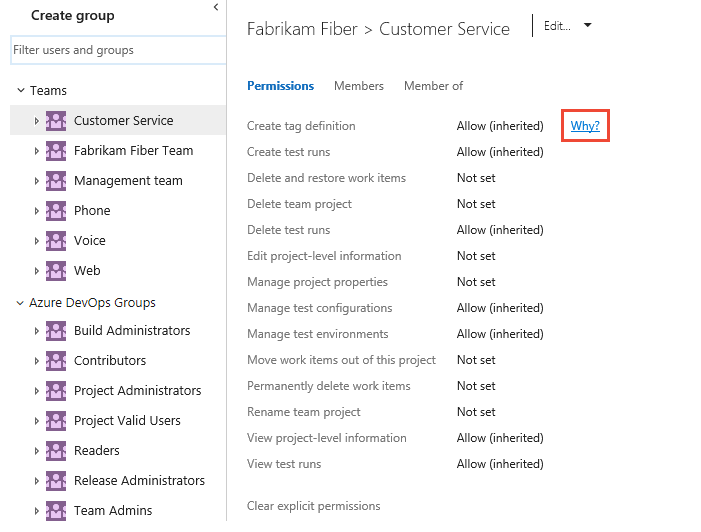

# About permissions and groups

[!INCLUDE [temp](../../_shared/version-vsts-tfs-all-versions.md)]

To access the resources you manage in Azure DevOps&mdash;such as your code, builds, and work tracking&mdash;you must have permissions for those specific resources. Most permissions are granted through built-in security groups as described in [Permissions and access](permissions-access.md). You can grant or deny permissions to specific users, built-in security groups, or groups defined in Azure Active Directory (Azure AD) if integrated with Azure DevOps, or Active Directory if integrated with TFS. 

Permissions may apply to a specific project or objects within the project, such as Git or TFVC repositories, branches, build pipelines, area paths, and more. Or, they can apply to an entire Azure DevOps organization or TFS collection, or to a TFS instance. Each functional area uses groups to simplify management across the deployment.

You manage security groups and permissions from the web portal administration context. Permissions are automatically set based on the group that you add users to, or based on the object, project, collection, or server level to which you add groups.

## Permission settings

Here's what you need to know about permission settings:

- **Allow** or **Deny** explicitly grants or restricts users from performing specific tasks, and are usually inherited from group membership.

- **Not set** implicitly denies users the ability to perform tasks that require that permission, but allows membership in a group that does have that permission set to take precedence, also known as **Allow (inherited)** or **Inherited allow** and **Deny (inherited)** or **Inherited deny**.

- For most groups and almost all permissions, **Deny** overrides **Allow**. If a user belongs to two groups, and one of them has a specific permission set to **Deny**, that user is not able to perform tasks that require that permission even if they belong to a group that has that permission set to **Allow**.

    For members of the **Project Collection Administrators** or **Team Foundation Administrators** groups, Deny doesn't trump Allow. Permissions assigned to these groups take precedent over any Deny set within any other group to which that member might belong.

- Changing a permission for a group changes that permission for all users who are members of that group. In other words, depending on the size of the group, you might affect the ability of hundreds of users to do their jobs by changing just one permission. So make sure you understand the impact before you make a change.

## Inheritance and security groups

Some permissions are managed through a hierarchy. Within this hierarchy,
permissions can be inherited from the parent or overridden. Security groups assign a set of permissions to those members of the group. For example, members of the **Contributors** group or **Project Administrators** group are assigned the permissions that are set as **Allowed** to those groups. 

If a permission isn't directly allowed or denied for a user, then it may be inherited in two ways.

- Users inherit permissions from the groups to which they belong.
When a permission is allowed for a user directly or through membership in a group that has that permission,
and it is denied, either directly or through group membership,
the permission is denied.

	> Members of **Project Collection Administrators** or **Team Foundation Administrators**
	> retain any allowed permissions, even if they belong to other groups that deny those permissions.

- Object-level permissions that are assigned for nodes of a hierarchy -
areas, iterations, version control folders, work item query folders -
are inherited down the hierarchy.
That is, a user's permissions that are set at `area-1` are inherited by `area-1/sub-area-1`,
if the same permission is not explicitly allowed or denied for `area-1/sub-area-1`.
If a permission is set explicitly for an object, like `area-1/sub-area-1`,
then the parent node is not inherited, regardless of whether it is denied or allowed.
If it's not set, then the permissions for that node are inherited from the closest ancestor
that has the permission explicitly set.

To understand why a permission is inherited, you can pause over a permission setting, and then choose **Why?** To open a  **Security** page, see [View permissions](view-permissions.md).

::: moniker range=">= tfs-2017"

> [!div class="mx-imgBorder"]  
> 

A new window opens that shows the inheritance information for that permission.  

::: moniker-end

::: moniker range=">= tfs-2013 <= tfs-2015"

  

Some object level Security dialog boxes provide an Inheritance on/off option.
Use this option to disable inheritance for folders, shared queries, and other objects.

::: moniker-end

### When assigning permissions
 
**Do:**  
- Use Windows groups when managing lots of users.  
- Consider granting the [work item query folders **Contribute**](../../boards/queries/set-query-permissions.md) permission to users or groups that require the ability to create and share work item queries for the project.  
- When adding many teams, consider creating a **Team Administrators** custom group where you allocate a subset of the permissions available to **Project Administrators**.  
- When adding teams, consider what permissions you want to assign to team leads, scrum masters, and other team members who may need to create and modify area paths, iteration paths, and queries.  

**Don't:**  
- Don't add users to the project **Readers** group that you've added to the **Project Administrators** group. Because the Readers group denies several permissions that the Project Administrators group allows, and deny takes precedence.  
- Don't change the default assignments made to the valid users groups. If you remove or set the **View instance-level information** permission to Deny for one of the Valid Users groups, no users in the group are able to access the project, collection, or deployment, depending on the group you set.  
- Don't assign permissions that are noted as 'Assign only to service accounts' to user accounts.

  

## Permissions versus access levels 

Permissions are different from access levels. Access levels control what features are 
visible to users in the web portal, and are dependent on user licenses; permissions control a user's ability to use web portal features. 
If you're just trying to give someone access to a team room or to Agile portfolio management 
and test case management features, 
you'll want to [change access levels](change-access-levels.md), not permissions.

Setting the access level for  users or groups doesn't provide them access to a project or the web portal. Only users or groups added to a team or security group can connect to a project and the web portal. Make sure your users have both the permissions and the access level they need. You do this by making sure they're [added to the project or a team](add-users-team-project.md).

## Manage large numbers of users 

If you need to set permissions for large numbers of users,
create a group in Windows, Active Directory, or Azure Active Directory,
add these groups to a default or custom security group,
and add the same groups to grant access to additional resources.

::: moniker range=">= tfs-2013 <= tfs-2018"
Of course, you don't need to grant permissions for reports or the project portal if your project doesn't use SQL Server Reporting Services or a SharePoint site.
::: moniker-end

## Valid user groups

When you add accounts of users directly to a built-in group or through a Windows group, they are automatically added to one of the valid user groups.

-   *Server*\\Team Foundation Valid Users: All members added to server-level groups.
-   *ProjectCollectionName*\\Project Collection Valid Users: All members added to collection-level groups.
-   *TeamProjectName*\\Project Valid Users: All members added to project-level groups.

The default permissions assigned to these groups are primarily limited to
read access, such as **View build resources**, **View project-level
information**, and **View collection-level information**.

This means that all users that you add to one project can view the objects in other projects within a collection.
If you need to restrict view access, then you can [set restrictions through the area path node](../../organizations/security/set-permissions-access-work-tracking.md).

If you remove or deny the **View instance-level information** permission for one of the Valid Users groups,
no users in the group are able to access the project, collection, or deployment, depending on the group you set.

## Tools used to set permissions

You set most permissions through the web portal. You can use the tools listed in the following table to set permissions.
Different tools are used depending on whether you are setting permissions at a server, collection, or project level.
You use the [web portal administration context](../../organizations/security/add-users-team-project.md) to set most permissions.

|Permission level|Web portal security pages |Team Foundation Administration Console|TFSSecurity command-line tool|Tf command-line tool|TFSLabConfig command-line tool|
|---|:---:|:---:|:---:|:---:|:---:|
|[Server-level](permissions.md#server)||||||
|[Collection-level](permissions.md#collection)||||||
|[Project and test level](permissions.md#project_test)||||||
|[Build level](permissions.md#build)||||||
|[Git repository](permissions.md#git-repo)||||||
|[Team Foundation Version Control](permissions.md#tfvc)||||||
|[Area level for work item tracking](permissions.md#area-permissions)||||||
|[Iteration level for work item tracking](permissions.md#iteration-path-permissions)||||||
|[Work item query](permissions.md#query)||||||
|[Work item tags](permissions.md#tags)||||||
|[Alerts](permissions.md#alerts)||||||
|[Releases](permissions.md#release_management) |||||| |
|[Lab Management](permissions.md#lab)||||||

::: moniker range=">= tfs-2013 <= tfs-2018"  
## Setting permissions for SQL Server reports 

For information about how to set permissions in Reporting Services,
see [Grant permissions to view or create SQL Server reports in TFS](../../report/admin/grant-permissions-to-reports.md).
::: moniker-end  

::: moniker range=">= tfs-2013 <= tfs-2017"  

## Setting permissions for SharePoint integration     

For information about how to set permissions for SharePoint Products integrated with TFS,
see [Set SharePoint site permissions](../../organizations/security/set-sharepoint-permissions.md).

For more information, see [Determine permission levels and groups in SharePoint 2013](https://technet.microsoft.com/library/cc262690.aspx).

::: moniker-end  

