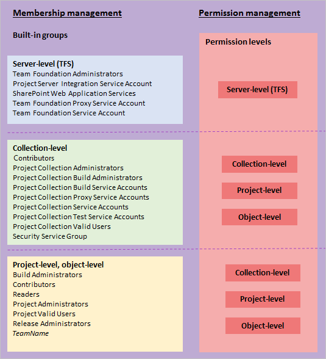

# About security and identity

[!INCLUDE [temp](../../_shared/version-vsts-tfs-all-versions.md)]

Azure DevOps Services, our cloud-hosted application, is based on the capabilities of Azure DevOps Server 2019 (formerly known as Team Foundation Server), with additional cloud services. Both support software development projects, from planning through deployment. 
Azure DevOps uses Microsoft Azure's Platform as a Service infrastructure and many of Azure's services, including Azure SQL databases, to deliver a reliable, globally available service for your development projects. 

This article introduces the main security concepts employed by Azure DevOps. To learn more about the steps Microsoft takes to keep your projects in Azure DevOps safe, available, secure, and private, see this white paper, [Azure DevOps Services Data Protection Overview](../../organizations/security/data-protection.md).

The main security concepts to understand are

- Authentication
- Authorization 
- Security groups
- Security roles
- Permission levels and permissions 
- Access levels  

## Authentication

Authentication verifies a user's identify based on the credentials provided when they sign into Azure DevOps. These systems integrate with and rely upon the security features provided by these additional systems:
- Azure Active Directory (Azure AD)
- Microsoft account (MSA)
- Active Directory (AD)

Azure AD and MSA support cloud authentication. We recommend Azure AD when you need to manage a large group of users. Otherwise, if you have a small user base accessing your organization in Azure DevOps, you can simply use Microsoft accounts. For additional information, see [Access Azure DevOps with Azure Active Directory (Azure AD)](../accounts/access-with-azure-ad.md).

For on-premises deployments, AD is recommended when managing a large group of users. For additional information, see [Set up groups for use in on-premises deployments](/azure/devops/server/admin/setup-ad-groups).

### Authentication methods, integrating with other services and apps

Other applications and services can integrate with Azure DevOps services and resources. To access your account without asking for user credentials multiple times, apps can use these authentication methods:

*	[Alternate credentials](../../repos/git/auth-overview.md#alternate-credentials) 
as a single set of credentials across all tools that don't have 
plug-in, extension, or native support. For example, 
you can use basic authentication to access 
[REST APIs for Azure DevOps](../../integrate/get-started/rest/basics.md), 
but you must turn on alternate credentials.

*	[Personal access tokens](../accounts/use-personal-access-tokens-to-authenticate.md) 
to generate tokens for: 

	*	Accessing specific resources or activities, like builds or work items
	*	Clients like Xcode and Nuget that require usernames and passwords 
		as basic credentials and don't support Microsoft account 
		and Azure Active Directory features like multi-factor authentication 
	*	Accessing [Azure DevOps REST APIs](../../integrate/get-started/rest/basics.md)

*	[OAuth](/azure/devops/integrate/get-started/Authentication/oauth) 
to generate tokens for accessing [REST APIs](/azure/devops/integrate/get-started/rest/basics). The [Accounts](/azure/devops/integrate/api/shared/accounts) 
and [Profiles](/azure/devops/integrate/api/shared/profiles) 
APIs support only OAuth. 

*	[SSH authentication](../../repos/git/use-ssh-keys-to-authenticate.md) 
to generate encryption keys when you use Linux, macOS, 
or Windows running [Git for Windows](http://www.git-scm.com/download/win) 
and can't use 
[Git credential managers](../../repos/git/set-up-credential-managers.md) 
or [personal access tokens](../accounts/use-personal-access-tokens-to-authenticate.md) 
for HTTPS authentication.

By default, your account or collection allows access for all authentication methods. 
You can limit access, but you must specifically restrict access for each method. 
When you deny access to an authentication method, 
no app can use that method to access your account. 
Any app that previously had access gets an 
authentication error and can't access your account.

To learn more about how we store your credentials, see [Credential storage for Azure DevOps](credential-storage.md).

To learn more about how to choose the right authentication mechanism, see [Guidance for authentication](../../integrate/get-started/authentication/authentication-guidance.md).

## Authorization
Authorization verifies that the identity which is attempting to connect has the necessary permissions to access a service, feature, function, object, or method.

Authorization always occurs after successful authentication. If a connection is not authenticated, it fails before any authorization checking is performed. If authentication of a connection succeeds, a specific action might still be disallowed because the user or group did not have authorization to perform that action.

Authorization is based on users and groups, and the permissions assigned directly to both those users and groups and permissions those users and groups might inherit by belonging to one or more Azure DevOps security groups. These users and groups can be Azure AD or AD users and groups. For on-premises deployments, they can also be local Windows users and groups.

Also, for select features, users and groups may need to belong to an access level that grants them access to a feature. 

## Security groups and permissions

Azure DevOps is pre-configured with default security groups. Default permissions are assigned to the default security groups.   

<table width="80%">
<tbody valign="top">
<tr>
<th width="35%">Security area</th>
<th width="65%">Groups, levels, and states</th>
</tr>
<tr>
<td>Security groups</td>
<td>
<ul>
<li>Project-level</li>
<li>Organization or collection level</li>
<li>Server-level (Azure DevOps Server and TFS only) 
</ul>
</td>
</tr>
<tr>
<td>Permission levels</td>
<td>
<ul>
<li>Object-level</li>
<li>Project-level</li>
<li>Organization or collection level</li>
<li>Server-level (Azure DevOps Server and TFS only)
</ul>
</td>
</tr>
<tr>
<td>Permission states</td>
<td>

User or group has permissions to perform a task:

<ul>
<li>**Allow**</li>
<li>**Inherited allow**</li>
</ul>

User or group doesn't have permission to perform a task:

<ul>
<li>**Deny**</li>
<li>**Inherited deny**</li>
<li>**Not set** </li>
</ul>
</td>
</tr>
</tbody>
</table>

You can populate these groups by using individual users. However, for ease of management, it's easier if you populate these groups by using Azure AD or AD security groups. This method enables you to manage group membership and permissions more efficiently across multiple computers.

 

Azure DevOps controls access through these three inter-connected functional areas:

-   **Membership management** supports adding individual Windows user accounts and groups to default security groups. Also, you can create Azure DevOps security groups. Each default group is associated with a set of default permissions. All users added to any security group are added to the Valid Users group. A valid user is someone who can connect to the project.

-   **Permission management** controls access to specific functional tasks at different levels of the system. Object-level permissions set permissions on a file, folder, build pipeline, or a shared query. Permission settings correspond to **Allow**, **Deny**, **Inherited allow**, **Inherited deny**, and **Not set**. To learn more about inheritance, see [About permissions and groups](about-permissions.md#inheritance).

-   **Access level management** controls access to features provided via the web portal, the web application for Azure DevOps. Based on  what has been purchased for a user, administrators set the user's access  level to Basic, VS Enterprise (previously Advanced), or Stakeholder. 

Each functional area uses groups to simplify management across the deployment. You add users and groups through the web administration context. Permissions are automatically set based on the security group that you add users to, or based on the object, project, collection, or server level to which you add groups. On the other hand, access level management controls access for all users and groups at the server level.

  

You can create local groups or Active Directory (AD) [groups to manage your users](/azure/devops/server/admin/setup-ad-groups). If you decide to use groups, make sure that membership in those groups is limited to valid users. Because group membership can be altered by their owners at any time, if those owners did not consider Azure DevOps Server access when they created those groups, their changes to membership can cause unwanted side effects within the server.

### Default permissions set for the Contributors group 

The following image shows the default permission assignments made to the Contributors group.

To learn more about other groups and their permission assignments,
see [Permissions and groups reference](permissions.md).

<a id="security-roles" />

## Security roles

There are a number of artifacts whose permissions are managed by role. These include the following artifacts and features.  

<table width="80%">
<tbody valign="top">
<tr>
<th width="35%">Security level</th>
<th width="65%">Functional area</th>
</tr>
<tr>
<td>Object-level</td>
<td>
<ul>
<li>Deployment groups</li>
<li>Secure files</li>
<li>Variable groups</li>
</ul>
</td>
</tr>
<tr>
<td>Project-level</td>
<td>
<ul>
<li>Agent queues</li>
<li>Service connections
<li>Team administration</li> 
</ul>
</td>
</tr>
<tr>
<td>Collection-level</td>
<td>
<ul>
<li>Agent pools</li>
<li>Deployment pools</li>
<li>Marketplace extensions</li> 
</ul>
</td>
</tr>
</tbody>
</table>

To learn more, see [About security roles](about-security-roles.md).

<a id="access-levels" />

## Access levels

Certain features are only available to users who have the appropriate licensing level for those features. Access to those features is not controlled by permissions but by membership in an access level. To learn more, see [Access levels](access-levels.md). 

## Related articles

- [Permissions and groups reference](permissions.md)
- [Default permissions and access for Azure DevOps](permissions-access.md)
- [Access with Azure Active Directory (Azure AD)](../accounts/add-users-to-azure-ad.md)
- [Set up groups for use in on-premises deployments](/azure/devops/server/admin/setup-ad-groups)
- [Setting up HTTPS with Secure Sockets Layer (SSL)](/azure/devops/server/admin/setup-secure-sockets-layer)

<!-- TODO: Cover how to set permissions for Reporting Services and SharePoint as mainline sections.

Azure DevOps security concepts fall into three general categories: topology, authentication, and authorization. Topology includes where and how on-premises servers are deployed, the network traffic that passes between Azure DevOps servers and clients, and the services that must run on Azure DevOps. Authentication includes the determination of the validity of Azure DevOps users, groups, and services. Authorization includes the determination of whether valid Azure DevOps users, groups, and services have the appropriate permissions to perform actions. Also, you must consider Azure DevOps Server dependencies on other components and services in order to optimize the security of your on-premises network.
When you consider Azure DevOps Server security, you must understand the difference between authentication and authorization.

 > [!NOTE] 
 > Permissions are different than access levels.
 > Access levels control what features are visible to users in the web portal,
 > and are dependent on user licenses; permissions control a user's ability to use features across Azure DevOps.
 > If you're just trying to give someone access to a team room or to Agile portfolio management
 > and test case management features,
 > you'll want to [change access levels](change-access-levels.md), not permissions.

## Permissions 

Besides configuring permissions for authorization, you might need authorization within source code control and within work items. These permissions are managed separately at the command line, but are integrated as part of the Team Explorer interface. For more information about source control permissions, see Team Foundation Version Control. For more information about work item customization, see Working with Team Foundation Work Items.

   
 -->  
