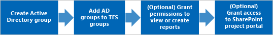
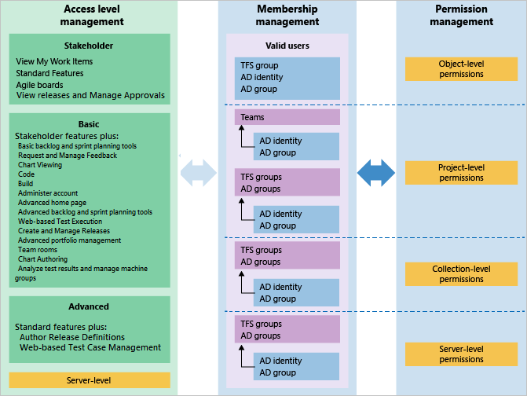
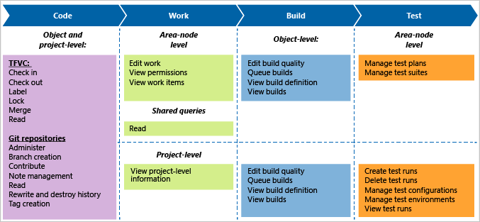

# About security, membership, and permissions

[!INCLUDE [version-all](../../includes/version-all.md)]

Azure DevOps employs a number of security concepts to ensure only those who should have access to features, functions, and data have access. Both our cloud service, Azure DevOps Services, and on-premises server, Azure DevOps Server, support software development projects, from planning through deployment. Azure DevOps uses Microsoft Azure's Platform as a Service infrastructure and many of Azure's services, including Azure SQL databases, to deliver a reliable, globally available service for your development projects.

Accounts get access to Azure Devops through authentication of their security credentials and authorization of their account entitlements to access a feature or function. The following table summarizes the  various account types supported and the methods used to manage authentication and authorization.

| Accounts | Authentication |Authorization |
|----------------|----------------|----------------|
|&#8226;&nbsp;Users &#8226;&nbsp;Organization owner &#8226;&nbsp;Service accounts &#8226;&nbsp;Service principals &#8226;&nbsp;Job agents|&#8226;&nbsp;User credentials &#8226;&nbsp;Windows authentication &#8226;&nbsp;Two-factor authentication (2FA) &#8226;&nbsp;SSH key authentication &#8226;&nbsp;Personal access tokens &#8226;&nbsp;Oauth &#8226;&nbsp;Active Directory authentication library  |&#8226;&nbsp;Security group membership &#8226;&nbsp;Role-based access control &#8226;&nbsp;Access levels  &#8226;&nbsp;Feature flags &#8226;&nbsp;Security namespaces & permissions|

[!INCLUDE [alt-creds-deprecation-notice](../../includes/alt-creds-deprecation-notice.md)]

::: moniker range="azure-devops"
To learn more about the steps Microsoft takes to keep your projects in Azure DevOps Services safe, available, secure, and private, see this white paper, [Azure DevOps Services Data Protection Overview](../../organizations/security/data-protection.md).
::: moniker-end

## Accounts 

While the main types of accounts of interest are the user accounts that you add to your organization or project, Azure DevOps supports other types of accounts to perform various operations. These include the following account types:  

- **Organization owner**: The creator of an Azure DevOps Services organization or assigned owner.  
- **Service accounts**: Internal Azure DevOps accounts used to support a specific service, such as Agent Pool Service, PipelinesSDK.  
- **Service principals**: Internal Azure DevOps accounts to to support internal operations. 
- **Job agents**: Internal accounts used to run specific jobs on a regular schedule.
- **Third party accounts**: Accounts that require access to support Web hooks, service connections, or other third-party applications.

The most effective means for managing accounts is by adding them to security groups. 

> [!NOTE]  
> The organization owner and members of the Project Collection Administrators group are granted full access to most all features and functions. 

### To learn more 

- [Create your organization](../accounts/create-organization.md)
- [Change the organization owner](../accounts/change-organization-ownership.md)
- [Add users and manage access](../accounts/add-organization-users.md) 
- [Service accounts](permissions.md) 
 

## Authentication

Authentication verifies an account identity based on the credentials provided when they sign into Azure DevOps. These systems integrate with and rely upon the security features provided by these additional systems:
- Azure Active Directory (Azure AD)
- Microsoft account (MSA)
- Active Directory (AD)

Azure AD and MSA support cloud authentication. We recommend Azure AD when you need to manage a large group of users. Otherwise, if you have a small user base accessing your organization in Azure DevOps, you can simply use Microsoft accounts. For additional information, see [About accessing Azure DevOps with Azure Active Directory (Azure AD)](../accounts/access-with-azure-ad.md).

For on-premises deployments, AD is recommended when managing a large group of users. For additional information, see [Set up groups for use in on-premises deployments](/azure/devops/server/admin/setup-ad-groups).

### Authentication methods, integrating with other services and apps

Other applications and services can integrate with services and resources in Azure DevOps. To access your account without asking for user credentials multiple times, apps can use the following  authentication methods.

- [Personal access tokens](../accounts/use-personal-access-tokens-to-authenticate.md) to generate tokens for:  
	- Accessing specific resources or activities, like builds or work items
	- Clients like Xcode and Nuget that require usernames and passwords as basic credentials and don't support Microsoft account and Azure Active Directory features like multi-factor authentication 
	- Accessing [Azure DevOps REST APIs](/rest/api/azure/devops/)

- [OAuth](../../integrate/get-started/authentication/oauth.md) 
to generate tokens for accessing [REST APIs](/rest/api/azure/devops/). The [Accounts](/rest/api/azure/devops/account) 
and [Profiles](/rest/api/azure/devops/profile) 
APIs support only OAuth. 

- [SSH authentication](../../repos/git/use-ssh-keys-to-authenticate.md) 
to generate encryption keys when you use Linux, macOS, 
or Windows running [Git for Windows](https://www.git-scm.com/download/win) 
and can't use 
[Git credential managers](../../repos/git/set-up-credential-managers.md) 
or [personal access tokens](../accounts/use-personal-access-tokens-to-authenticate.md) 
for HTTPS authentication.

By default, your account or collection allows access for all authentication methods. 
You can limit access, but you must specifically restrict access for each method. 
When you deny access to an authentication method, 
no app can use that method to access your account. 
Any app that previously had access gets an 
authentication error and can't access your account.

To learn more about how we store your credentials, see [Credential storage for Azure DevOps](credential-storage.md).

To learn more about how to choose the right authentication mechanism, see [Guidance for authentication](../../integrate/get-started/authentication/authentication-guidance.md).

## Authorization

Authorization verifies that the identity which is attempting to connect has the necessary permissions to access a service, feature, function, object, or method. Authorization always occurs after successful authentication. If a connection is not authenticated, it fails before any authorization checking is performed. If authentication of a connection succeeds, a specific action might still be disallowed because the user or group did not have authorization to perform that action.

Authorization depends on the permissions assigned to the account. Permissions are granted either directly to an account, or through membership in a security group or security role. Access levels and feature flags can also grant or restrict access to a feature. 

<!--- 
Permissions can be inherited based on assignments made to a project  
Authorization is based on users and groups, and the permissions assigned directly to both those users and groups and permissions those users and groups might inherit by belonging to one or more Azure DevOps security groups. These users and groups can be Azure AD or AD users and groups. For on-premises deployments, they can also be local Windows users and groups.

Also, for select features, users and groups may need to belong to an access level that grants them access to a feature. 

- Default security groups
- Custom security groups
- Security groups 
- Team groups 
- Azure Active Directory 
- Active Directory (on-premises) 
- Workgroups (on-premises) 
- Windows group 
--> 

<a id="security-group-membership" /> 

### Security group membership 

With the creation of an organization, collection, or project&mdash;Azure DevOps creates a set of default security groups which are automatically assigned default permissions. Additional security groups are defined with the following actions: 
- When you add a custom security group. You can create custom security groups at the following levels: 
	- Project-level
	- Organization- or collection-level
	- Server-level (on-premises only)
- When you add a team, a team security group is created 

::: moniker range="azure-devops"
Security group members can be a combination of users, other groups, and Azure Active Directory groups.  
::: moniker-end
::: moniker range="< azure-devops"
Security group members can be a combination of users, other groups, and Active Directory groups or a Workgroup.  
::: moniker-end

Most users are assigned to the Contributors group for a project to provide them access to the features they need to access. Administrators should be added to the Project Collection Administrators or Project Administrators group. 

> [!TIP]    
> Accounts that are assigned to more than one security group are restricted to those permissions granting the least access. For example, if you add a user to the Readers group and the Project Administrators group, the effective permissions of the Readers group are enforced for the user. 

### Populate security groups

You can populate these groups by adding individual users. However, for ease of management, it's easier if you populate these groups by using Azure Active Directory (ADD), Active Directory (AD), or Windows security groups. This method enables you to manage group membership and permissions more efficiently across multiple computers.

::: moniker range="azure-devops"

:::image type="content" source="media/about-security/add-active-directory-groups.png" alt-text="Conceptual image showing adding Azure Active Directory groups to Azure DevOps security groups, cloud":::

::: moniker-end

::: moniker range=">= azure-devops-2019 <= azure-devops-2020"

:::image type="content" source="media/about-security/add-active-directory-groups.png" alt-text="Conceptual image showing adding Active Directory groups to Azure DevOps security groups , on-premises":::

::: moniker-end

::: moniker range="<= tfs-2018"

Of course, you don't need to grant permissions for reports or the project portal if your project doesn't use SQL Server Reporting Services or a SharePoint site.
::: moniker-end

### Permission levels 

::: moniker range="azure-devops"

As shown in the following image, security groups defined at the project and collection-level can be assigned to permissions assigned at the object, project, and collection level. 

:::image type="content" source="media/about-security/security-groups-permission-management-cloud.png" alt-text="Conceptual image mapping default security groups to permission levels, cloud":::

::: moniker-end

::: moniker range=">= azure-devops-2019 <= azure-devops-2020"

As shown in the following image, security groups defined at the project and collection-level can be assigned to permissions assigned at the object, project, and collection level. You can only define server-level security groups to server-level permissions. 

:::image type="content" source="media/about-security/security-groups-permission-management-on-premises.png" alt-text="Conceptual image mapping default security groups to permission levels, on-premises":::

::: moniker-end

::: moniker range="< azure-devops-2019"

 

::: moniker-end
 
For a description of each default security group, see [Security groups, service accounts, and permissions](permissions.md#groups).
<a id="security-roles" />

 

### Valid user groups

When you add accounts of users directly to a security group, they are automatically added to one of the valid user groups.

::: moniker range="azure-devops"
- *OrganizationName*\\Project Collection Valid Users: All members added to organization-level groups.
- *ProjectName*\\Project Valid Users: All members added to project-level groups.
::: moniker-end
::: moniker range="azure-devops-2019 || azure-devops-2020"
- *Server*\\Azure DevOps Valid Users: All members added to server-level groups.
- *ProjectCollectionName*\\Project Collection Valid Users: All members added to collection-level groups.
- *ProjectName*\\Project Valid Users: All members added to project-level groups.
::: moniker-end
::: moniker range="< azure-devops-2019"
- *Server*\\Team Foundation Valid Users: All members added to server-level groups.
- *ProjectCollectionName*\\Project Collection Valid Users: All members added to collection-level groups.
- *TeamProjectName*\\Project Valid Users: All members added to project-level groups.
::: moniker-end

The default permissions assigned to these groups are primarily limited to
read access, such as **View build resources**, **View project-level information**, and **View collection-level information**.

This means that all users that you add to one project can view the objects in other projects within a collection.
If you need to restrict view access, then you can [set restrictions through the area path node](../../organizations/security/set-permissions-access-work-tracking.md).

If you remove or deny the **View instance-level information** permission for one of the valid users groups,
no members of the group are able to access the project, collection, or deployment, depending on the group you set.

### Role-based access control  

With Role-based access control, accounts are assigned to a role, with each role assigned one or more permissions. The following table lists the artifacts whose   permissions are managed by role.  

| Object-level  | Project-level |Collection-level |
|----------------|----------------|----------------|
|&#8226;&nbsp; Secure files &#8226;&nbsp; Variable groups|&#8226;&nbsp; Agent pools &#8226;&nbsp; Agent queues &#8226;&nbsp; Service connections &#8226;&nbsp; Team administrator|&#8226;&nbsp;Agent pools &#8226;&nbsp; Deployment pools &#8226;&nbsp; Marketplace extensions|
 

<a id="access-levels" />

### Access levels

Certain features are only available to users who have the appropriate licensing level. Administrators control access by assigning users or security groups to an access level. To learn more, see [Access levels](access-levels.md). 

### Feature flags 
 
Access to select, new features are controlled by feature flags. Periodically, Azure DevOps Services introduces new features by placing them behind a feature flag. Features under a private preview require the organization owner to request that the feature be turned on. Other features may be introduced as a preview feature which general users can enable or disable. To learn more, see [Manage or enable features](../../project/navigation/preview-features.md).
 
### Security namespaces and permissions 

Security namespaces store data that determines the level of access that Azure DevOps accounts have to perform a specific action on a specific resource. Each family of resources, such as work items or Git repositories, is secured through a unique namespace. Each security namespace contains zero or more access control lists (ACLs). Each ACL contains a token, an inherit flag, and a set of zero or more access control entries (ACEs). Each ACE contains an identity descriptor, an allowed permissions bitmask, and a denied permissions bitmask. 

#### Permission levels 

Permissions are assigned at various levels based on the structure of the Azure DevOps instance. 

::: moniker range="azure-devops"
- **Object-level** 
- **Project-level** 
- **Organization-level**  
::: moniker-end

::: moniker range="< azure-devops"
- **Object-level** 
- **Project-level**
- **Collection-level**
- **Server-level**  
::: moniker-end

#### Permission states 

There are five possible assignments made to a permission. They grant or restrict access as indicated. 
- User or group has permissions to perform a task: 
	- **Allow** 
	- **Inherited allow** 
- User or group doesn't have permission to perform a task: 
	- **Deny** 
	- **Inherited deny** 
	- **Not set** 

#### To learn more
- [About permissions and inheritance](about-permissions.md)
<!--- [Security namespaces and permission reference](access-levels.md) --> 

 
 
<!--- 
Azure DevOps controls access through these three inter-connected functional areas:

-   **Membership management** supports adding individual Windows user accounts and groups to default security groups. Also, you can create Azure DevOps security groups. Each default group is associated with a set of default permissions. All users added to any security group are added to the Valid Users group. A valid user is someone who can connect to the project.

-   **Permission management** controls access to specific functional tasks at different levels of the system. Object-level permissions set permissions on a file, folder, build pipeline, or a shared query. Permission settings correspond to **Allow**, **Deny**, **Inherited allow**, **Inherited deny**, and **Not set**. To learn more about inheritance, see [About permissions and groups](about-permissions.md#inheritance).

-   **Access level management** controls access to features provided via the web portal, the web application for Azure DevOps. Based on  what has been purchased for a user, administrators set the user's access  level to Basic, VS Enterprise (previously Advanced), or Stakeholder. 

Each functional area uses groups to simplify management across the deployment. You add users and groups through the web administration context. Permissions are automatically set based on the security group that you add users to, or based on the object, project, collection, or server level to which you add groups. On the other hand, access level management controls access for all users at the server level.

  

You can create local groups or Active Directory (AD) [groups to manage your users](/azure/devops/server/admin/setup-ad-groups). If you decide to use groups, make sure that membership in those groups is limited to valid users. Because group membership can be altered by their owners at any time, if those owners did not consider Azure DevOps Server access when they created those groups, their changes to membership can cause unwanted side effects within the server.

### Default permissions set for the Contributors group 

The following image shows the default permission assignments made to the Contributors group.

To learn more about other groups and their permission assignments,
see [Permissions and groups reference](permissions.md).

-->
## Try this next
> [!div class="nextstepaction"]
> [About permissions and inheritance](about-permissions.md)

## Related articles

- [Securing Azure Pipelines](../../pipelines/security/overview.md) 

To learn more, see [About security roles](about-security-roles.md).
- [Default permissions and access assignments](permissions-access.md)
- [Permissions and groups reference](permissions.md)
- [Default permissions and access for Azure DevOps](permissions-access.md)
- [Add or delete users using Azure Active Directory](/azure/active-directory/fundamentals/add-users-azure-active-directory)
- [Set up groups for use in on-premises deployments](/azure/devops/server/admin/setup-ad-groups)
- [Setting up HTTPS with Secure Sockets Layer (SSL)](/azure/devops/server/admin/setup-secure-sockets-layer)
- [Default permissions and access assignments](permissions-access.md)

<!-- TODO: Cover how to set permissions for Reporting Services and SharePoint as mainline sections.

Azure DevOps security concepts fall into three general categories: topology, authentication, and authorization. Topology includes where and how on-premises servers are deployed, the network traffic that passes between Azure DevOps servers and clients, and the services that must run on Azure DevOps. Authentication includes the determination of the validity of Azure DevOps users, groups, and services. Authorization includes the determination of whether valid Azure DevOps users, groups, and services have the appropriate permissions to perform actions. Also, you must consider Azure DevOps Server dependencies on other components and services in order to optimize the security of your on-premises network.
When you consider Azure DevOps Server security, you must understand the difference between authentication and authorization.

 > [!NOTE] 
 > Permissions are different than access levels.
 > Access levels control what features are visible to users in the web portal,
 > and are dependent on user licenses; permissions control a user's ability to use features across Azure DevOps.
 > If you're just trying to give someone access to a team room or to Agile portfolio management
 > and test case management features,
 > you'll want to [change access levels](change-access-levels.md), not permissions.

## Permissions 

Besides configuring permissions for authorization, you might need authorization within source code control and within work items. These permissions are managed separately at the command line, but are integrated as part of the Team Explorer interface. For more information about source control permissions, see Team Foundation Version Control. For more information about work item customization, see Working with Team Foundation Work Items.

   
 -->