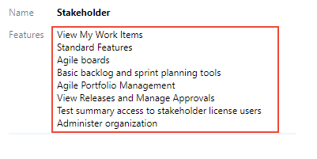
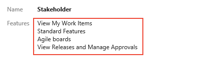
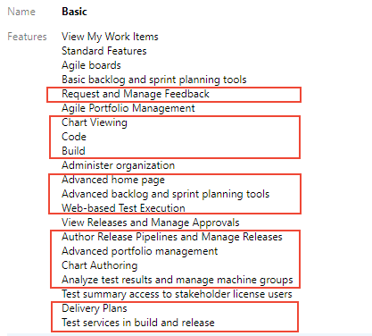
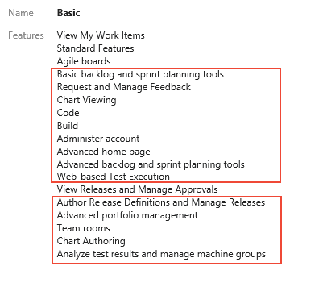
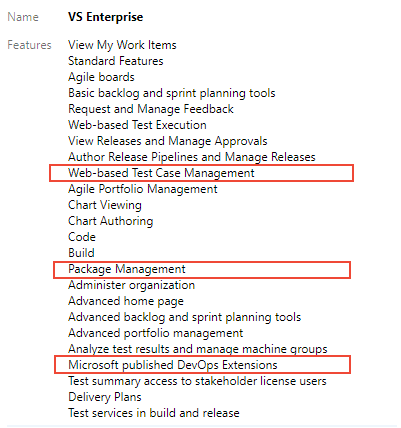
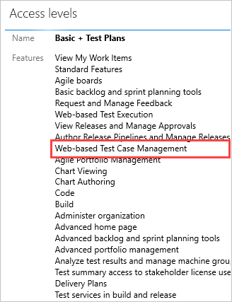
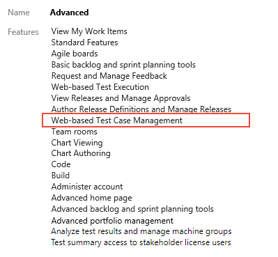

# About access levels

[!INCLUDE [temp](../../_shared/version-vsts-tfs-all-versions.md)]

Access levels grant or restrict access to select web portal features. This is in addition to permissions granted through security groups which provide or restrict specific tasks. Access levels enable administrators to provide their user base access to the features they need and only pay for those features. 

[!INCLUDE [temp](../../_shared/version-selector.md)]

When you add a user or group to a team or project, they're automatically granted access to those features supported by the default access level and those supported by the security group to which they are added. Most users can access most features by being assigned to the **Basic** access level and **Contributors** security group. For a simplified overview of the permissions assigned to the most common groups&#151;**Readers**, **Contributors**, and **Project Administrators**&#151;as well as the **Stakeholder** access group, see [Permissions and access](permissions-access.md).  

::: moniker range="azure-devops"
To add user accounts or groups to specific access levels, see [Manage users and access](../accounts/add-organization-users.md). Make sure to set each user's access level based on what you've purchased for that user.
::: moniker-end

::: moniker range="<= azure-devops-2019"
To add user accounts or groups to specific access levels, see [Change access levels](change-access-levels.md). Make sure to set each user's access level based on what you've purchased for that user. 
::: moniker-end

## Supported access levels

You assign users or groups of users to one of the following access levels:

::: moniker range="azure-devops"
- **Stakeholder**: Provides partial access, can be assigned to unlimited users for free. Assign to users with no license or subscriptions who need access to a limited set of features.
- **Basic**: Provides access to most features. Assign to users with an Azure DevOps Server CAL, with a Visual Studio Professional subscription, and to users for whom you are paying for Azure Boards & Repos in an organization.
- **Visual Studio subscription**: Assign to users who already have a Visual Studio subscription. The system automatically recognizes their subscription and enables any other features that are included, based on their subscription level. If you assign Basic or Stakeholder, they also receive their Visual Studio subscription benefits upon sign-in.
::: moniker-end

::: moniker range="azure-devops-2019"
- **Stakeholder**: Provides partial access, can be assigned to unlimited users for free. Assign to users with no license or subscriptions who need access to a limited set of features.
- **Basic**: Provides access to most features. Assign  to users with an Azure DevOps Server CAL, with a Visual Studio Professional subscription, and to users for whom you are paying for Azure Boards & Repos.
- **Basic + Test Plans**: Provides access for users who have a monthly Test Manager subscription, Visual Studio Test Professional, or MSDN Platforms subscription.
- **VS Enterprise**: Provides access to premium features. Assign to users with a subscription to Visual Studio Enterprise.
::: moniker-end

::: moniker range="tfs-2018"
- **Stakeholder**: Provides partial access, can be assigned to unlimited users for free. Assign to users with no license or subscriptions who need access to a limited set of features.
- **Basic**: Provides access to most features. Assign to users with a CAL or with a Visual Studio Professional subscription. 
- **VS Enterprise**: Provides access to premium features. Assign to users with a subscription to Visual Studio Enterprise.
- **Advanced** (legacy access level, to be deprecated): Provides access to premium features. Only assign to users with a subscription to MSDN Platforms or Visual Studio Test Professional.
::: moniker-end

::: moniker range="tfs-2017"
- **Stakeholder**: Provides partial access, can be assigned to unlimited users for free. Assign to users with no license or subscriptions who need access to a limited set of features.
- **Basic**: Provides access to most features. Assign to users with a CAL or with a Visual Studio subscription. 
- **VS Enterprise** (TFS 2017.1): Provides access to premium features. Assign to users with a subscription to Visual Studio Enterprise.
- **Advanced** (TFS 2017): Provides access to premium features. Only assign to users with a subscription to MSDN Platforms or Visual Studio Test Professional.

::: moniker-end

::: moniker range="<= tfs-2015"
- **Stakeholder**: Provides partial access, can be assigned to unlimited users for free. Assign to users with no license or subscriptions who need access to a limited set of features.
- **Basic**: Provides access to most features.  Assign to users with a CAL or with a Visual Studio subscription.
- **Advanced**: Provides access to premium features. Assign to users with a subscription to Visual Studio Enterprise, Visual Studio Test Professional or MSDN Platforms.

::: moniker-end

For details on benefits each subscription provides, see [Azure DevOps benefits for Visual Studio subscribers](https://docs.microsoft.com/visualstudio/subscriptions/vs-azure-devops).

As the following images illustrate, **Basic** access includes all **Stakeholder** features and **Advanced** and **Visual Studio Enterprise** subscriber access levels include all **Basic** features. The red boxes show the features added with each access level. 

# [Stakeholder](#tab/stakeholder) 

::: moniker range=">= azure-devops-2019"
> [!div class="mx-imgBorder"]  
>  
::: moniker-end

::: moniker range="<= tfs-2018"
> [!div class="mx-imgBorder"]  
>  
::: moniker-end

# [Basic](#tab/basic) 

::: moniker range=">= azure-devops-2019"
> [!div class="mx-imgBorder"]
> 
::: moniker-end

::: moniker range="<= tfs-2018"
> [!div class="mx-imgBorder"]  
> 
::: moniker-end

# [Visual Studio subscription](#tab/vs-subscription) 

::: moniker range="azure-devops"
> [!div class="mx-imgBorder"]  
> 
::: moniker-end

::: moniker range="<= azure-devops-2019"
Not supported for on-premises versions.
::: moniker-end

# [Basic + Test Plans](#tab/advanced)

::: moniker range="azure-devops"
Not supported for Azure DevOps Services.
::: moniker-end

::: moniker range="azure-devops-2019"
> [!div class="mx-imgBorder"]  
> 
::: moniker-end

::: moniker range="<= tfs-2018"
> [!div class="mx-imgBorder"]  
> 
::: moniker-end

# [VS Enterprise](#tab/vs-enterprise)

::: moniker range="azure-devops"
Not supported for Azure DevOps Services.
::: moniker-end

::: moniker range="azure-devops-2019"
> [!div class="mx-imgBorder"]  
> 
::: moniker-end

::: moniker range=">= tfs-2017 <= tfs-2018"
> [!div class="mx-imgBorder"]  
> 
::: moniker-end

::: moniker range="<= tfs-2015"
Not supported for TFS 2015 or earlier versions.
::: moniker-end

---

## Stakeholder access

::: moniker range=">= azure-devops-2019"

With Stakeholder access, users can create and modify work items, and can create and save queries. They have limited access to many of the Azure Boards features. They also can view and approve release pipelines and perform some administrative tasks. 
::: moniker-end

::: moniker range="<=tfs-2018"

With Stakeholder access, users can create and modify all work items, and can create and save queries. They have limited access to many of the Agile tool features. They also can view and approve releases. 

::: moniker-end

::: moniker range="azure-devops"
### Public versus private feature access
**Stakeholder** access grants access to features differently depending on whether you're working from a private or a public project. To learn more about public projects, see [What is a public project?](../public/about-public-projects.md).  

| Service, application, or setting | Private project | Public project|
|------------|-----------------|---------------|
|**Dashboards** | Partial access | Full access | 
|**Wiki** | Partial access | Full access | 
|**Boards (Work)** | Partial access | Full access | 
|**Repos (Code)**| No access | Full access | 
|**Pipelines (Build and Release)** | Full access | Full access | 
|**Test Plans (Test)** | No access | No access | 
|**Notifications** | Full access | Full access | 
|**Semantic search** | Full access | Full access | 
|**Project settings** | Partial access | Partial access | 
|**Organization settings** | Partial access | Partial access | 

::: moniker-end

### Stakeholder feature access

::: moniker range="azure-devops"
The following features are available to Stakeholders from the web portal for both public and private projects. For private projects, there are some limitations as noted. To get started as a Stakeholder, see [Get started as a Stakeholder](get-started-stakeholder.md).

<table width="80%">
<tbody valign="top">
<tr>
<th width="30%">Feature</th>
<th width="35%">Task</th>
<th width="35%">Private project limitations</th>
</tr>
<tr>
<td>Boards/Work tracking:
<ul>
<li>View My Work Items</li>
<li>Agile boards</li>
<li>Basic backlog and sprint planning tools</li>
<li>Agile Portfolio Management
</ul>
</td>
<td>
<ul>
<li>[View, create, & modify work items](../../boards/work-items/about-work-items.md). </li>
<li>[View, add, & modify items on backlogs](../../boards/backlogs/backlogs-overview.md). </li>
<li>[View sprint backlogs & taskboards](../../boards/sprints/scrum-overview.md) </li>
<li>[View the Kanban board](../../boards/boards/kanban-overview.md).   </li>
<li>[Add tasks to a checklist](../../boards/boards/add-task-checklists.md).</li>
<li>[View & create managed queries](../../boards/queries/view-run-query.md) </li>
<li>[Submit feedback responses](../../project/feedback/give-feedback.md)</li>
<li>[Change work item type](../../boards/backlogs/remove-delete-work-items.md)</li>
</ul>

Private projects only:

<ul>
<li>[Move work item to another project](../../boards/backlogs/remove-delete-work-items.md) </li>
<li>[Delete and restore work items](../../boards/backlogs/remove-delete-work-items.md) </li>
<li>[Permanently delete work items](../../boards/backlogs/remove-delete-work-items.md) </li>
</ul>
</td>
<td>
<ul>
<li>Can assign existing tags to work items, but can't add new tags. </li>
<li>Can't change the backlog priority order (all items are added at the end of the backlog), and can't assign items to an iteration, use the mapping pane, or forecasting. </li>
<li>Can't set or view team capacity for a sprint. </li>
<li>Can't move cards on a board to update status, can't change the priority order, and can't set the values of fields shown on cards.  </li>
<li>Can't change priority order of tasks within a task checklist. </li>
<li>Can save queries under My Queries but cannot save under Shared Queries. </li>
</ul>
</td>

</tr>
<tr>
<td>Standard Features: Organization, Charts, Dashboards, Wiki, and Notifications</td>
<td>
<ul>
<li>[Work across projects](../../project/navigation/work-across-projects.md)</li>
<li>[View project welcome pages](../projects/project-vision-status.md)</li>
<li>[View team dashboards](../../report/dashboards.md) </li>
<li>[Manage personal notifications](../../notifications/manage-personal-notifications.md)</li>
<li>[View wiki pages](../../project/wiki/filter-print-wiki.md).</li>
</ul>
</td>
<td>
<ul>
<li>Can't view query charts from the Queries page, however can view them when added to a team dashboard.</li>
<li>Can't view markdown README files defined for repositories. </li>
<li>Have read-only permissions to wiki pages. These permissions can't be changed.</li>
</ul>
</td>
</tr>
<tr>
<td>View Releases and Manage Approvals Pipelines/Build & Release</td>
<td>
<ul>
<li>[View releases](../../pipelines/release/approvals/index.md)</li>
<li>[Approve releases](../../pipelines/release/approvals/index.md)</li>
<li>For public projects, Stakeholders have access to all **Pipeline (Build and Release)** features.</li>
</ul>
</td>
<td>
<ul>
<li>When the [**Free access to Pipelines Preview** feature is enabled](provide-stakeholder-pipeline-access.md), Stakeholders gain access to all **Pipeline (Build and Release)** features.</li>
</ul>
</td>
</tr>
<tr>
<td>
Test summary access to stakeholder license users
</td>
<td>
<ul>
<li>[Perform user acceptance testing](../../test/user-acceptance-testing.md)</li>
<li>[Request stakeholder feedback using the Test & Feedback extension](../../test/request-stakeholder-feedback.md)</li>
<li>[Request feedback using the Microsoft Feedback client](../../project/feedback/get-feedback.md)</li>
</ul>
</td>
<td>

</td>
</tr>
<tr>
<td>Administer organization</td>
<td>
<ul>
<li>[Invite users and assign licenses](../accounts/add-organization-users.md).  </li>
<li>[Create, delete, and edit child Area Paths](../settings/set-area-paths.md)</li>
<li>[Create, delete, and edit child Iteration Paths](../settings/set-iteration-paths-sprints.md)</li>
<li>[Administer process permissions](permissions.md#administer-process-permissions-permission)</li>
<li>[Create, delete, edit processes](../settings/work/manage-process.md)</li>
<li>[Delete field from account](../settings/work/customize-process-field.md)</li> 
<li>[Bypass rules on work item updates](permissions.md#bypass-rules-permission) </li>
<li>[Suppress notifications for work item updates](permissions.md#suppress-notifications-for-work-item-updates-permission) </li> 
</ul>

You can restrict access to one or more of the above features by changing the permissions granted to a user granted Stakeholder access. See [Grant or restrict access to select features and functions](restrict-access.md).

</td>
<td>
<ul>
<li>Can add users and assign licenses when added to the [Project Collection Administrators](set-project-collection-level-permissions.md) group. </li>
</ul>

</td>
</tr>
</tbody>
</table>

::: moniker-end  

::: moniker range="azure-devops-2019"
<table width="80%">
<tbody valign="top">
<tr>
<th width="30%">Feature</th>
<th width="70%">Task</th>
</tr>
<tr>
<td>Boards/Work tracking:
<ul>
<li>View My Work Items</li>
<li>Agile boards</li>
<li>Basic backlog and sprint planning tools</li>
<li>Agile Portfolio Management</li>
</ul>
</td>
<td>
<ul>
<li>[View, create, & modify work items](../../boards/work-items/about-work-items.md) Can assign existing tags to work items, but can't add new tags. </li>
<li>[View, add, & modify items on backlogs](../../boards/backlogs/backlogs-overview.md) Can't change the backlog priority order (all items are added at the end of the backlog), and can't assign items to an iteration, use the mapping pane, or forecasting. </li>
<li>[View & modify items on sprint backlogs and taskboards](../../boards/sprints/scrum-overview.md) Can't set or view  team capacity. </li>
<li>[View Kanban boards](../../boards/boards/kanban-overview.md) Can't move cards on the board to update status, can't change the priority order, and can't set the values of fields shown on cards.  </li>
<li>[Add tasks to Kanban board task checklists](../../boards/boards/add-task-checklists.md) Can't change priority order of tasks. </li>
<li>[View & create managed queries](../../boards/queries/view-run-query.md) Can save queries under My Queries but cannot save under Shared Queries. </li>
<li>[Submit feedback responses](../../project/feedback/give-feedback.md)</li>
<li>[Change work item type](../../boards/backlogs/remove-delete-work-items.md)</li>
</ul>
</td>
</tr>
<tr>
<td>Standard Features: Organization, Dashboards, Wiki, and Notifications</td>
<td>
<ul>
<li>[Work across projects](../../project/navigation/work-across-projects.md)</li>
<li>[View project welcome pages](../projects/project-vision-status.md) Can't view markdown README files defined for repositories. </li>
<li>[View team dashboards](../../report/dashboards.md) </li>
<li>[Manage personal notifications](../../notifications/manage-personal-notifications.md)</li>
<li>[View wiki pages](../../project/wiki/filter-print-wiki.md) Have read-only permissions to wiki pages. These permissions can't be changed.</li>
</ul>
</td>
</tr>
<tr>
<td>View Releases and Manage Approvals Pipelines/Build & Release</td>
<td>
<ul>
<li>[View releases](../../pipelines/release/approvals/index.md)</li>
<li>[Approve releases](../../pipelines/release/approvals/index.md)</li>
<li>When the [**Free access to Pipelines Preview** feature is enabled](provide-stakeholder-pipeline-access.md), Stakeholders gain access to all **Pipeline (Build and Release)** features.</li>
</ul>
</td>
</tr>
<tr>
<td>
Test summary access to stakeholder license users
</td>
<td>
<ul>
<li>[Perform user acceptance testing](../../test/user-acceptance-testing.md)</li>
<li>[Request stakeholder feedback using the Test & Feedback extension](../../test/request-stakeholder-feedback.md)</li>
<li>[Request feedback using the Microsoft Feedback client](../../project/feedback/get-feedback.md)</li>
</ul>
</td>
<td>
</td>
</tr>

<tr>
<td>Administer organization</td>
<td>
<ul>
<li>[Add users to team projects](add-users-team-project.md) Can add users and set access levels when added to the [Administrators](/azure/devops/server/admin/add-administrator-tfs) group. </li>
<li>[Create, delete, and edit child Area Paths](../settings/set-area-paths.md)</li> 
<li>[Create, delete, and edit child Iteration Paths](../settings/set-iteration-paths-sprints.md)</li>
<li>[Administer process permissions](permissions.md#administer-process-permissions-permission)</li>  
<li>[Create, delete, edit processes](../settings/work/manage-process.md)</li>
<li>[Delete field from account](../settings/work/customize-process-field.md)</li>
<li>[Bypass rules on work item updates](permissions.md#bypass-rules-permission) </li>
<li>[Suppress notifications for work item updates](permissions.md#suppress-notifications-for-work-item-updates-permission) </li>
</ul>

You can restrict access to one or more of the above features by changing the permissions granted to Stakeholders. See [Grant or restrict access to select features and functions](restrict-access.md).

</td>
</tr>
</tbody>
</table>

::: moniker-end  

::: moniker range=">= tfs-2017 <= tfs-2018"
<table width="80%">
<tbody valign="top">
<tr>
<th width="30%">Feature</th>
<th width="70%">Task</th>
</tr>
<tr>
<td>Work tracking:
<ul>
<li>View My Work Items</li>
<li>Agile boards</li>
<li>Basic backlog and sprint planning tools</li>
<li>Agile Portfolio Management</li>
</ul>
</td>
<td>
<ul>
<li>[View, create, and modify work items](../../boards/work-items/about-work-items.md) Can assign existing tags to work items, but can't add new tags. </li>
<li>[View, add, and modify items on backlogs](../../boards/backlogs/backlogs-overview.md) Can't change the backlog priority order (all items are added at the end of the backlog), and can't assign items to an iteration, use the mapping pane, or forecasting. </li>
<li>[View, and modify items on sprint backlogs and taskboards](../../boards/sprints/scrum-overview.md) Can't set or view  team capacity. </li>
<li>[View, and modify items (Kanban)](../../boards/boards/kanban-overview.md) Can't move cards on the board to update status, can't change the priority order, and can't set the values of fields shown on cards.  </li>
<li>[Add tasks to the checklist (Kanban)](../../boards/boards/add-task-checklists.md) Can't change priority order of tasks. </li>
<li>[Follow changes made to work items](../../boards/work-items/follow-work-items.md) </li>
<li>[View the cumulative flow diagram](../../report/dashboards/cumulative-flow.md)</li>
<li>[View and create managed queries](../../boards/queries/view-run-query.md) Can save queries under My Queries but cannot save under Shared Queries. </li>
<li>[Submit, view, and change feedback responses](../../project/feedback/give-feedback.md)</li>
</ul>
</td>
</tr>
<tr>
<td>Standard Features: Organization, Dashboards, Wiki, and Notifications</td>
<td>
<ul>
<li>[Work across projects](../../project/navigation/work-across-projects.md)</li>
<li>[View project welcome pages](../projects/project-vision-status.md) Can't view markdown README files defined for repositories. </li>
<li>[View team dashboards](../../report/dashboards.md) </li>
<li>[Manage personal notifications](../../notifications/manage-personal-notifications.md)</li>
<li>[View wiki pages](../../project/wiki/filter-print-wiki.md) Have read-only permissions to wiki pages. These permissions can't be changed.</li>
</ul>
</td>
</tr>
<tr>
<td>View Releases and Manage Approvals Pipelines/Build & Release</td>
<td>
<ul>
<li>[View releases](../../pipelines/release/approvals/index.md)</li>
<li>[Approve releases](../../pipelines/release/approvals/index.md)</li>
</ul>
</td>
</tr>
</tbody>
</table>

::: moniker-end  

::: moniker range="<= tfs-2015"
<table width="80%">
<tbody valign="top">
<tr>
<th width="30%">Feature</th>
<th width="70%">Task</th>
</tr>
<tr>
<td>Work tracking:
<ul>
<li>View My Work Items</li>
<li>Agile boards</li>
<li>Basic backlog and sprint planning tools</li>
<li>Agile Portfolio Management</li>
</ul>
</td>
<td>
<ul>
<li>[View, create, and modify work items](../../boards/work-items/about-work-items.md) Can assign existing tags to work items, but can't add new tags. </li>
<li>[View, add, and modify items on backlogs](../../boards/backlogs/backlogs-overview.md) Can't change the backlog priority order (all items are added at the end of the backlog), and can't assign items to an iteration, use the mapping pane, or forecasting. </li>
<li>[View, and modify items on sprint backlogs and taskboards](../../boards/sprints/scrum-overview.md) Can't set or view  team capacity. </li>
<li>[View, and modify items (Kanban)](../../boards/boards/kanban-overview.md) Can't move cards on the board to update status, can't change the priority order, and can't set the values of fields shown on cards.  </li>
<li>[Add tasks to the checklist (Kanban)](../../boards/boards/add-task-checklists.md) Can't change priority order of tasks. (Requires TFS 2015 or later version) </li>
<li>[View the cumulative flow diagram](../../report/dashboards/cumulative-flow.md)</li>
<li>[View and create managed queries](../../boards/queries/view-run-query.md) Can save queries under My Queries but cannot save under Shared Queries. </li>
<li>[Submit, view, and change feedback responses](../../project/feedback/give-feedback.md)</li>
</ul>
</td>
</tr>
<tr>
<td>Standard Features: Dashboards and Notifications</td>
<td>
<ul>
<li>[View project welcome pages](../projects/project-vision-status.md) Can't view markdown README files defined for repositories. </li>
<li>[View team dashboards (TFS 2015)](../../report/dashboards/dashboards.md) or [team home page (TFS 2013)](../../report/dashboards/team-dashboard.md) </li>
<li>[Set personal alerts for changes to work items](../../boards/queries/alerts-and-notifications.md)</li>
</ul>
</td>
</tr>
</tbody>
</table>

::: moniker-end  

### Features not available to users with Stakeholder access 

If a Stakeholder needs access to one or more of the following features&mdash;which support the daily work of product owners, team leads, developers, testers, and project administrators&mdash;you need to grant them **Basic** access.  

::: moniker range="azure-devops"
**For Private projects:**
- Change the priority of an item within a backlog  
- Delete work items or move work items to another project
- Create shared queries, view charts, and modify the home page  
- View Delivery Plans (a Marketplace extension)    
- Access the full set of features under **Pipelines (Build and Release)**, **Repos (Code)** or **Test Plans (Test)**.  

**For Public projects:**
- View Delivery Plans (a Marketplace extension)    
- Access the full set of features under **Repos (Code)** or **Test Plans (Test)**.
::: moniker-end

::: moniker range="azure-devops-2019"

- Change the priority of an item within a backlog  
- Delete work items or move work items to another project
- Create shared queries, view charts, and modify the home page  
- View Delivery Plans (a Marketplace extension)
- Access the full set of features under **Pipelines**, **Repos** or **Test Plans**.  

::: moniker-end

::: moniker range="tfs-2018"
- Change the priority of an item within a backlog
- Delete work items 
- Create shared queries, view charts, and modify the home page  
- View Delivery Plans (a Marketplace extension)    
- Access the full set of features provided under **Code**, **Build and Release**, and **Test**
::: moniker-end

::: moniker range="<= tfs-2017"
- Change the priority of an item within a backlog
- Delete work items 
- Create shared queries, view charts, and modify the home page  
- View Delivery Plans (a Marketplace extension)
- Access the full set of features provided under **Code**, **Build and Release**, and **Test**
- Participate in team rooms, which capture interactive, detailed conversations about the project.  
::: moniker-end

> [!NOTE]
> Stakeholders that choose a feature that's not available to them  receive an error message indicating that they don't have permissions to complete the task.

<a id="basic" />

::: moniker range=">= azure-devops-2019"

## Basic access, Azure Boards and Azure Repos

In addition to the features listed for **Stakeholder** access, the following features are available to users with **Basic** access. Basic access allows users to access features provided in the **Repos**, **Pipelines**, and **Test Plans** hubs in addition to **Dashboards** and **Boards**.

<table width="80%">
<tbody valign="top">
<tr>
<th width="30%">Feature</th>
<th width="70%">Supported tasks</th>
</tr>
<tr>
<td>Request and Manage Feedback</td>
<td>
<ul>
<li>[Request feedback](../../project/feedback/get-feedback.md)</li>
</td>
</tr>
<tr>
<td>Chart Viewing and Chart Authoring</td>
<td>
<ul>
<li>[Create status and trend query-based charts](../../report/dashboards/charts.md)</li>
<li>[Add charts to dashboards](../../report/dashboards/add-charts-to-dashboard.md)</li>
</ul>
</td>
</tr>
<tr>
<td>Code</td>
<td>
<ul>
<li>[Full access to all features to manage code using Git repositories](../../repos/git/overview.md)</li>
<li>[Full access to all features to manage code using Team Foundation Version Control (TFVC)](../../repos/tfvc/overview.md)</li>
</ul>
</td>
</tr>
<tr>
<td>Build</td>
<td><ul>
<li>[Full access to all features to manage continuous integration and continuous delivery of software](../../pipelines/overview.md)</li>
</ul>
</td>
</tr>
<tr>
<td>Administer account</td>
<td>
<ul>
<li>[Full access to manage settings](../settings/about-settings.md) To modify a setting, you must be a member of the corresponding security group or role: team administrator, Project Administrator, or Project Collection Administrator. Otherwise, you have read-only access to settings.</li>
</ul>
</td>
</tr>
<tr>
<td>Advanced home page</td>
<td>
<ul>
<li>[Access to projects, work items, and pull requests defined across projects you work in](../../project/navigation/work-across-projects.md)  Advanced home page allows you to configure and view the Project summary page in addition to team dashboards.  </li>
</td>
</tr>
<tr>
<td>Advanced backlog and sprint planning tools</td>
<td> 
<ul>
<li>[View, add, and modify items on backlogs](../../boards/backlogs/backlogs-overview.md)  Full access to all backlog tools. Can change the backlog priority order, assign items to an iteration using drag-and-drop, use the mapping pane to parent or reparent items, and use the forecasting tool.</li>
<li>[View, and modify items on sprint backlogs and taskboards](../../boards/sprints/scrum-overview.md) Full access to all sprint planning tools. Can view and set team capacity for a sprint.</li>
</ul>
</td>
</tr>
<tr>
<td>Web-based Test Execution</td>
<td>
<ul>
<li>[Run manual tests](../../test/run-manual-tests.md)</li>
<li>[Run automated tests from test plans](../../test/run-automated-tests-from-test-hub.md)</li>
</ul>
</td>
</tr>
<tr>
<td>Author Release Pipelines and Manage Releases</td>
<td><ul>
<li>[Author release pipelines](../../pipelines/release/index.md)</li>
<li>[Define your multi-stage continuous deployment (CD) pipeline](../../pipelines/release/define-multistage-release-process.md) </li>
<li>[Use approvals and gates to control your deployment](../../pipelines/release/deploy-using-approvals.md) </li>
</ul>
</td>
</tr>
<tr>
<td>Advanced portfolio management</td>
<td><ul>
<li>[Define features and epics](../../boards/boards/kanban-epics-features-stories.md) Full access to all portfolio backlog and board tools. Can add features and epics from the Kanban board. Can change the backlog priority order or portfolio items, and use the mapping pane to parent or reparent items.
</li>
</ul>
</td>
</tr>
<tr>
<td>Analyze test results and manage machine groups</td>
<td>
<ul>
<li>[Track test status](../../test/track-test-status.md) </li>
<li>[Test different configurations](../../test/test-different-configurations.md) </li>
</ul>
</td>
</tr>
<tr>
<td>Delivery Plans</td>
<td><ul>
<li>[View and configure team delivery plans](../../boards/plans/review-team-plans.md)</li>
</ul></td>
</tr>
<tr>
<td>Test services in build and release</td>
<td>
<ul>
<li>[Run unit tests with your builds](../../pipelines/languages/dotnet-core.md#run-your-tests)</li>
<li>[Review test results](../../pipelines/test/review-continuous-test-results-after-build.md)</li>
<li>[Analyze test results](../../pipelines/test/test-analytics.md) </li>
</ul>
</td>
</tr>
</tbody>
</table>

::: moniker-end  

::: moniker range=">= tfs-2017 <= tfs-2018"

## Basic access

In addition to the features listed for **Stakeholder** access, the following features are available to users with **Basic** access. Basic access allows users to access features provided in the **Code**, **Build and Release**, and **Test** hubs in addition to **Dashboards/Home** and **Work**.

<table width="80%">
<tbody valign="top">
<tr>
<th width="30%">Feature</th>
<th width="70%">Supported tasks</th>
</tr>
<tr>
<td>Basic backlog and sprint planning tools</td>
<td> 
<ul>
<li>[View, add, & modify items on backlogs](../../boards/backlogs/backlogs-overview.md) Can change the backlog priority order, assign items to an iteration using drag-and-drop, use the mapping pane to parent or reparent items, and forecasting tool.</li>
<li>[View & modify items on sprint backlogs and taskboards](../../boards/sprints/scrum-overview.md) Can view and set team capacity for a sprint. </li>
</ul>
</td>
</tr>
<tr>
<td>Request and Manage Feedback</td>
<td>
<ul>
<li>[Request feedback](../../project/feedback/get-feedback.md) </li>
</td>
</tr>
<tr>
<td>Chart Viewing and Chart Authoring</td>
<td>
<ul>
<li>[Create status and trend query-based charts](../../report/dashboards/charts.md)</li>
<li>[Add charts to dashboards](../../report/dashboards/add-charts-to-dashboard.md)</li>
</ul>
</td>
</tr>
<tr>
<td>Code</td>
<td>
<ul>
<li>[Full access to all features to manage code using Git repositories](../../repos/git/overview.md)</li>
<li>[Full access to all features to manage code using Team Foundation Version Control (TFVC)](../../repos/tfvc/overview.md)</li>
</ul>
</td>
</tr>
<tr>
<td>Build</td>
<td><ul>
<li>[Full access to all features to manage continuous integration and continuous delivery of software](../../pipelines/overview.md)</li>
</ul>
</td>
</tr>
<tr>
<td>Administer account</td>
<td><ul>
<li>[Full access to manage settings](../settings/about-settings.md) To modify a setting, you must be a member of the corresponding security group or role: team administrator, Project Administrator, or Project Collection Administrator. Otherwise, you have read-only access to settings.
</li>
</ul>
</td>
</tr>
<tr>
<td>Advanced home page</td>
<td><ul>
<li>[Access to projects, work items, and pull requests defined across projects you work in](../../project/navigation/work-across-projects.md) Advanced home page allows you to configure and view the Project summary page in addition to team dashboards. </li>
</ul></td>
</tr>
<tr>
<td>Advanced backlog and sprint planning tools</td>
<td> 
<ul>
<li>[View, add, and modify items on backlogs](../../boards/backlogs/backlogs-overview.md) Can change the backlog priority order, assign items to an iteration using drag-and-drop, use the mapping pane to parent or reparent items, and forecasting tool. </li>
<li>[View, and modify items on sprint backlogs and taskboards](../../boards/sprints/scrum-overview.md) Can view and set team capacity for a sprint.</li>
</ul>
</td>
</tr>
<tr>
<td>Web-based Test Execution</td>
<td>
<ul>
<li>[Run manual tests](../../test/run-manual-tests.md)</li>
<li>[Run automated tests from test plans](../../test/run-automated-tests-from-test-hub.md)</li>
</ul>
</td>
</tr>
<tr>
<td>Author Release Pipelines and Manage Releases</td>
<td><ul>
<li>[Author release pipelines](../../pipelines/release/index.md)</li>
<li>[Define your multi-stage continuous deployment (CD) pipeline](../../pipelines/release/define-multistage-release-process.md) </li>
<li>[Use approvals and gates to control your deployment](../../pipelines/release/deploy-using-approvals.md) </li>
</ul>
</td>
</tr>
<tr>
<td>Advanced portfolio management</td>
<td><ul>
<li>[Define features and epics](../../boards/boards/kanban-epics-features-stories.md) Can add features and epics from the Kanban board. Can change the backlog priority order or portfolio items, and use the mapping pane to parent or reparent items.</li>
</ul>
</td>
</tr>
<tr>
<td>Team rooms</td>
<td><ul>
<li>[Collaborate within a team room](../../notifications/collaborate-in-a-team-room.md) Requires TFS 2017 or earlier versions. Deprecated for TFS 2018 and later versions.</td>
</tr>
<tr>
<td>Analyze test results and manage machine groups</td>
<td>
<ul>
<li>[Track test status](../../test/track-test-status.md) </li>
<li>[Test different configurations](../../test/test-different-configurations.md) </li>
</ul>
</td>
</tr>
<tr>
<td> Delivery Plans</td>
<td><ul>
<li>[View and configure team delivery plans](../../boards/plans/review-team-plans.md) Requires 2017.2 or later version</li>
</ul> </td>
</tr>
</tbody>
</table>

::: moniker-end  

::: moniker range="<= tfs-2015"

## Basic access

In addition to the features listed for **Stakeholder** access, the following features are available to users with **Basic** access. Basic access allows users to access features provided in the **Code**, **Build and Release**, and **Test** hubs in addition to **Dashboards/Home** and **Work**.

<table width="80%">
<tbody valign="top">
<tr>
<th width="30%">Feature</th>
<th width="70%">Supported tasks</th>
</tr>
<tr>
<td>Basic backlog and sprint planning tools</td>
<td> 
<ul>
<li>[View, add, and modify items on backlogs](../../boards/backlogs/backlogs-overview.md). Can change the backlog priority order, assign items to an iteration using drag-and-drop, use the mapping pane to parent or reparent items, and forecasting tool.</li>
<li>[View, and modify items on sprint backlogs and taskboards](../../boards/sprints/scrum-overview.md) Can view and set team capacity for a sprint.</li>
</ul>
</td>
</tr>
<tr>
<td>Request and Manage Feedback</td>
<td>
<ul>
<li>[Request feedback](../../project/feedback/get-feedback.md) Requires 2015.1 or later version. </li>
</td>
</tr>
<tr>
<td>Chart Viewing and Chart Authoring</td>
<td>
<ul>
<li>[Create status and trend query-based charts](../../report/dashboards/charts.md)</li>
<li>[Add charts to dashboards](../../report/dashboards/add-charts-to-dashboard.md)</li>
</ul>
</td>
</tr>
<tr>
<td>Code</td>
<td>
<ul>
<li>[Full access to all features to manage code using Git repositories](../../repos/git/overview.md)</li>
<li>[Full access to all features to manage code using Team Foundation Version Control (TFVC)](../../repos/tfvc/overview.md)</li>
</ul>
</td>
</tr>
<tr>
<td>Build</td>
<td><ul>
<li>[Full access to all features to manage continuous integration and continuous delivery of software](../../pipelines/overview.md) </li>
</ul>
</td>
</tr>
<tr>
<td>Administer account</td>
<td>
<ul>
<li>[Full access to manage settings](../settings/about-settings.md) To modify a setting, you must be a member of the corresponding security group or role: team administrator, Project Administrator, or Project Collection Administrator. Otherwise, you have read-only access to settings.</li>
</ul>
</td>
</tr>
<tr>
<td>Advanced home page</td>
<td><ul>
<li>[Access to projects, work items, and pull requests defined across projects you work in](../../project/navigation/work-across-projects.md) Advanced home page allows you to configure and view the Project summary page in addition to team dashboards. </li>
</ul>
</td>
</tr>
<tr>
<td>Advanced backlog and sprint planning tools</td>
<td> 
<ul>
<li>[View, add, and modify items on backlogs](../../boards/backlogs/backlogs-overview.md) Full access to all backlog tools. Can change the backlog priority order, assign items to an iteration using drag-and-drop, use the mapping pane to parent or reparent items, and use the forecasting tool. </li>
<li>[View, and modify items on sprint backlogs and taskboards](../../boards/sprints/scrum-overview.md) Full access to all sprint planning tools. Can view and set team capacity for a sprint.</li>
</ul>
</td>
</tr>
<tr>
<td>Advanced portfolio management</td>
<td>
<ul>
<li>[Define features and epics](../../boards/boards/kanban-epics-features-stories.md) 
Can add features and epics from the Kanban board. Can change the backlog priority order or portfolio items, and use the mapping pane to parent or reparent items.
</li>
</ul>
</td>
</tr>
<tr>
<td>Team rooms</td>
<td>
<ul>
<li>[Collaborate within a team room](../../notifications/collaborate-in-a-team-room.md)</li>
</ul></td>
</tr>
<tr>
<td>Analyze test results and manage machine groups</td>
<td>
<ul>
<li>[Track test status](../../test/track-test-status.md) </li>
<li>[Test different configurations](../../test/test-different-configurations.md) </li>
</ul>
</td>
</tr>
</tbody>
</table>

::: moniker-end  

::: moniker range="azure-devops"

## Visual Studio subscription access

Visual Studio subscribers are entitled to **Visual Studio subscription** features as a subscriber benefit. When you add those users, be sure to assign them the **Visual Studio subscription** access level. The system automatically recognizes their subscription and enables any other features that are included, based on their subscription level.

::: moniker-end  

::: moniker range=">= tfs-2017 <= azure-devops-2019"

## VS Enterprise access

In addition to the features listed for **Basic** access, the following features are available to users with **VS Enterprise** access from the web portal.

::: moniker-end

::: moniker range=">= azure-devops-2019"

<table width="80%">
<tbody valign="top">
<tr>
<th width="30%">Feature</th>
<th width="70%">Supported tasks</th>
</tr>
<tr>
<td>Web-based Test Case Management</td>
<td>
<ul>
<li>[Create a test plan and test suite](../../test/create-a-test-plan.md) </li>
<li>[Create manual test cases](../../test/create-test-cases.md) </li>
<li>[Delete test artifacts](../../boards/backlogs/delete-test-artifacts.md) </li>
</ul>
</td>
</tr>
<tr>
<td>Package Management</td>
<td>
<ul>
<li>[Azure Artifacts](../../artifacts/overview.md)</li>
</td>
</tr>
<tr>
<td>Microsoft published DevOps Extensions</td>
<td>
<ul>
<li>All Microsoft published DevOps [Marketplace extensions](https://marketplace.visualstudio.com/azuredevops) are included for Visual Studio Enterprise, MSDN Platforms, and Visual Studio Test Professional subscribers.</li>
</ul>
</td>
</tr>
</tbody>
</table>

::: moniker-end  

::: moniker range=">= tfs-2017 <= tfs-2018"

<table width="80%">
<tbody valign="top">
<tr>
<th width="30%">Feature</th>
<th width="70%">Supported tasks</th>
</tr>
<tr>
<td>Web-based Test Case Management</td>
<td>
<ul>
<li>[Create a test plan and test suite](../../test/create-a-test-plan.md) </li>
<li>[Create manual test cases](../../test/create-test-cases.md) </li>
<li>[Delete test artifacts](../../boards/backlogs/delete-test-artifacts.md) </li>
</ul>
</td>
</tr>
<tr>
<td>Microsoft published TFS Extensions</td>
<td>
<ul>
<li>All Microsoft published TFS [Marketplace extensions](https://marketplace.visualstudio.com/azuredevops) are included for Visual Studio Enterprise, MSDN Platforms, and Visual Studio Test Professional subscribers.</li>
</ul>
</td>
</tr>
</tbody>
</table>

::: moniker-end  

::: moniker range=">= tfs-2017 <= azure-devops-2019"
With VS Enterprise access, users have access to any fee-based, Marketplace extension published by Microsoft Marketplace extension published by Microsoft that is included for active Visual Studio Enterprise subscribers. Examples include [Azure Artifacts](https://marketplace.visualstudio.com/items?itemName=ms.feed) (which is also free for 5 users who are not Visual Studio Enterprise subscribers) and [Test Manager](https://marketplace.visualstudio.com/items?itemName=ms.vss-testmanager-web). 

::: moniker-end
::: moniker range="tfs-2017"
For TFS 2017.2 and later versions, assign **VS Enterprise** to those users for whom you've purchased Visual Studio Enterprise. These include a TFS CAL plus the rights to access VS Enterprise features. (For users with MSDN Platforms subscriptions or Test Professional, assign the Basic access level and the Test Manager extension for Azure Test Plans.) To learn more, see [Assign paid extension access to users](../../marketplace/how-to/assign-paid-extension-access.md). For example, for users with Visual Studio Test Professional or Visual Studio Enterprise, assign them [access to the Test Manager extension for Azure Test Plans](../../marketplace/how-to/assign-paid-extension-access.md).

::: moniker-end

::: moniker range="<= azure-devops-2019"
## Advanced access
Users assigned Advanced access can manage test cases when you have [purchased Test Manager extension for Azure Test Plans and assigned to the user accounts](access-levels.md#test-manager) to gain full access to [Web-based test case management tools](../../test/create-a-test-plan.md).

::: moniker-end

::: moniker range=">= tfs-2017 <= azure-devops-2019"

> [!NOTE]   
> The **Advanced** access level is deprecated for TFS 2017 and later versions of TFS. Use the **VS Enterprise** access level only for active Visual Studio Enterprise subscribers. For MSDN Platforms and Visual Studio Test Professional with MSDN subscribers needing access to **Test**, assign them to the **Advanced** access level and the Test Manager extension for Azure Test Plans.  
 
::: moniker-end

::: moniker range="<= azure-devops-2019"

In addition to the features listed for **Basic** access, the following features are available to users with **Advanced** access from the web portal. 

<table width="80%">
<tbody valign="top">
<tr>
<th width="30%">Feature</th>
<th width="70%">Supported tasks</th>
</tr>
<tr>
<td>Web-based Test Case Management</td>
<td>
<ul>
<li>[Create a test plan and test suite](../../test/create-a-test-plan.md) </li>
<li>[Create manual test cases](../../test/create-test-cases.md) </li>
</ul>
</td>
</tr>
</tr>
</tbody>
</table>

::: moniker-end  

::: moniker range="tfs-2017"
For TFS 2017 and earlier versions, you should assign the **Advanced** level to those users for whom you've purchased the full Test feature set. Here are the purchasing options:  
- Higher-level Visual Studio subscriptions: Visual Studio Test Professional, Visual Studio Enterprise, or MSDN Platforms subscriptions.
These include a TFS CAL plus the rights to access the full set of Test features.  
- A paid Azure DevOps user (which includes a TFS CAL) plus the [Test Manager extension for Azure Test Plans](#test-manager). 

For TFS 2017.2, Assign **Advanced** access to those users for whom you've purchased MSDN Platforms or Visual Studio Test Professional subscriptions. These include a TFS CAL plus the rights to access Test Manager. To learn more, see [Get extensions for TFS, Assign paid extension access to users](../../marketplace/how-to/assign-paid-extension-access.md).
	

> [!NOTE]   
> With TFS 2017.1, the Advanced access level was temporarily disabled. Updating to TFS 2017.2 re-enables it. If you are on TFS 2017.1 and have users with Visual Studio Test Professional or MSDN Platforms subscriptions, you should assign them Basic access level. In addition, you need to open **Users** for the project collections in which they are a member and [assign them the Test Manager extension for Azure Test Plans](../../marketplace/assign-paid-extensions.md). To learn more, see [Buy access to TFS or TFS Test](../../billing/buy-access-tfs-test-hub.md). 

::: moniker-end

<!--- This section will change based on RC2 or RTW -->

::: moniker range=">= azure-devops-2019"
## Test Plans, load testing, and Marketplace extensions

Full access to **Test Plans** and load testing features requires **VS Enterprise** access. Visual Studio Test Professional plus the test features in the web portal are managed through Azure DevOps, Azure billing services, and purchase of Test Manager extension for Azure Test Plans from the Marketplace.  

To learn more, see [Start free trials for paid Azure DevOps Services features and extensions](../billing/try-additional-features-vs.md). 

::: moniker-end

::: moniker range=">=tfs-2015 <= tfs-2018"
## Test features and Marketplace extensions

Full access to **Test** features requires **Advanced** (TFS 2017 or earlier versions) or **VS Enterprise** (TFS 2017.1 or later version) access. Visual Studio Test Professional plus the test features in the web portal are managed through Azure DevOps, Azure billing services, and purchase of Test Manager extension for Azure Test Plans from the Marketplace.  

To learn how to grant access to an extension, see [Get extensions for TFS](../../marketplace/get-tfs-extensions.md).  

::: moniker-end

::: moniker range="<= azure-devops-2019"

## What features can users access who are added to two different groups?

If a user belongs to a group that has **Basic** access and another group that has **VS Enterprise** access, the user has access to all features available through **VS Enterprise**, which is a superset of **Basic**.

## Service account access

Azure DevOps Server [service accounts](/tfs/tfs-server/admin/service-accounts-dependencies-tfs) are added to the default access level. If you make Stakeholder the default access level, you must add the service accounts to Basic or Advanced/VS Enterprise access.  

Service accounts don't require a CAL or other purchase.  

::: moniker-end

## Related articles  

::: moniker range="azure-devops"

- [Manage users and access](../accounts/add-organization-users.md)
- [Export a list of users and their access levels](export-users-audit-log.md)
- [Default permissions and access](permissions-access.md)
::: moniker-end

::: moniker range="<= azure-devops-2019"

- [Change access levels](change-access-levels.md)
- [Export a list of users and their access levels](export-users-audit-log.md)
- [Default permissions and access](permissions-access.md)
::: moniker-end

