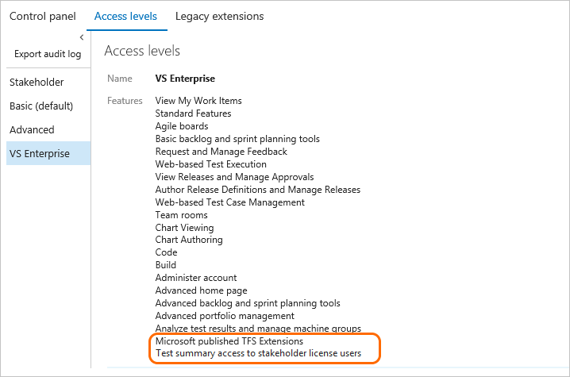
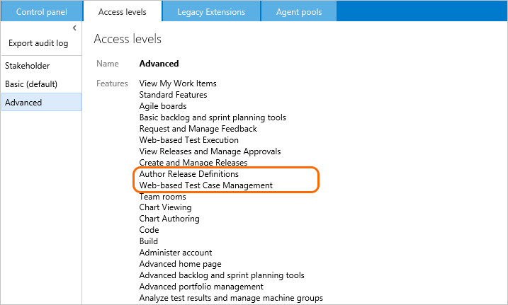

# About access levels

[!INCLUDE [temp](../../_shared/version-vsts-tfs-all-versions.md)]

Access levels enable administrators the ability to provide their user base access to the features they need and only pay for those features. To connect and use the functions and features that Azure DevOpsprovides, users must be added to a group with the appropriate permissions. To use select web portal features, they must also belong to the access level that enables access to that feature.

Make sure to set each user's access level based on what you've purchased for that user. Basic access includes all Stakeholder features. Advanced and Visual Studio Enterprise subscriber access levels include all Basic features. 

::: moniker range="vsts"
To add user accounts or groups to specific access levels, see [Manage users and access](../accounts/add-organization-users.md).
::: moniker-end

::: moniker range="<= azdevserver-2019"
To add user accounts or groups to specific access levels, see [Change access levels](change-access-levels.md). 
::: moniker-end

When you add a user or group to a team or project, they're automatically granted access to those features supported by the default access level, which is Basic. This provides most users all the features they need. For a simplified overview of the permissions assigned to the most common groups&#151;Readers, Contributors, and Project Administrators&#151;as well as the Stakeholder access group, see [Permissions and access](permissions-access.md).  

You assign users or groups of users to one of the following access levels:

::: moniker range=">= tfs-2018"
- **Basic**: provides access to most features  
- **VS Enterprise**: provides access to premium features
- **Stakeholders**: provides partial access, can be assigned to unlimited users for free
::: moniker-end

::: moniker range="tfs-2017"
- **Basic**: provides access to most features  
- **VS Enterprise** (TFS 2017.1 and later versions): provides access to premium features
- **Advanced** (TFS 2017 and earlier versions): provides access to premium features 
- **Stakeholders**: provides partial access, can be assigned to unlimited users for free
::: moniker-end

::: moniker range="<= tfs-2015"
- **Basic**: provides access to most features  
- **Advanced** : provides access to premium features 
- **Stakeholders**: provides partial access, can be assigned to unlimited users for free
::: moniker-end

Assign **Basic** to users with a TFS CAL, with a Visual Studio Professional subscription, and to users for whom you are paying for Azure Boards & Repos in an Azure DevOps organization. 

::: moniker range=">= tfs-2018"

Assign **VS Enterprise** to users with a subscription to Visual Studio Enterprise.This enables the Test Manager feature.
::: moniker-end

::: moniker range="tfs-2017"
Assign **Advanced** (TFS 2017) to users with a subscription to Visual Studio Enterprise, Visual Studio Test Professional or MSDN Platforms. Assign **VS Enterprise** (TFS 2017.1 and later versions) to users with a subscription to Visual Studio Enterprise. This enables the Test Manager feature.  
::: moniker-end

::: moniker range=">= tfs-2013 <= tfs-2015"
Assign **Advanced** to users with a subscription to Visual Studio Enterprise, Visual Studio Test Professional or MSDN Platforms.
::: moniker-end

Assign **Stakeholders** to users with no license or subscriptions who need access to a limited set of features.

See [what benefits come with each subscription level](https://docs.microsoft.com/visualstudio/subscriptions/vs-azure-devops).

## Basic, Azure Boards & Repos

Assign **Basic**  to users in your Azure DevOps organization who need to manage backlogs or sprints, or who need access to Git or TFVC code repos. You get 5 free users with your organization, and then pay per user per month for additional users.

::: moniker range="<= azdevserver-2019"

::: moniker-end

Basic access allows users to access **Code**, **Build**, and **Test**  in addition to **Dashboards/Home** and **Work**.
- [Basic & Advanced backlog and sprint planning tools](../../boards/sprints/assign-work-sprint.md)  
- [Request and manage feedback](../../project/feedback/get-feedback.md) 1  
- [Chart viewing & Chart authoring](../../report/charts.md)  
- **Code**: [Git](../../repos/git/overview.md) and [TFVC](../../repos/tfvc/overview.md)  
- [Build](../../pipelines/overview.md)  
- [Administer account](#administer-account) 2
- [Advanced home page](../../project/wiki/project-vision-status.md) 3
- [Author release pipelines](../../pipelines/release/index.md) 4
- [Advanced portfolio management](../../boards/backlogs/define-features-epics.md) 
- [Team rooms](../../notifications/collaborate-in-a-team-room.md) 5
- [Analyze test results and manage machine groups](../../test/test-different-configurations.md) 

**Notes:**

1. Requires TFS 2015.1 or later version.
2. You can open Team settings, Project settings, and Collection level settings to view and modify settings provided you are a team, project, or project collection administrator. See [Administer account features](#administer-account).
3. Advanced home page allows you to configure and view the Project summary page in addition to team dashboards.  
4. Requires TFS 2015.2 or later version.    
5. Requires TFS 2017 or earlier versions. Deprecated for TFS 2018 and later versions.

Within the admin context, there are several pages which support administrating features at the team, project, project collection/organization level. To learn more, see [About user, team, project, and organization-level settings](../settings/about-settings.md).

::: moniker range=">= tfs-2017"
## VS Enterprise

Visual Studio subscribers are entitled to **Basic** features (Azure Boards & Repos) as a subscriber benefit, so when you add those users be sure to assign them **VS Enterprise** access level and the system will automatically recognize their subscription and enable any other features that are included based on their subscription level. For instance, the Test Plans feature is included for Visual Studio Enterprise, MSDN Platforms, and Visual Studio Test Professional subscribers.

With VS Enterprise access, users have access to any fee-based, Marketplace extension published by Microsoft Marketplace extension published by Microsoft that is included for active Visual Studio Enterprise subscribers. Examples include [Azure Artifacts](https://marketplace.visualstudio.com/items?itemName=ms.feed) (which is also free for 5 users who are not Visual Studio Enterprise subscribers) and [Test Manager](https://marketplace.visualstudio.com/items?itemName=ms.vss-testmanager-web). 
::: moniker-end

::: moniker range=">= tfs-2017 <= azdevserver-2019"
For TFS 2017.2 and later versions, assign **VS Enterprise** to those users for whom you've purchased Visual Studio Enterprise. These include a TFS CAL plus the rights to access VS Enterprise features. (For users with MSDN Platforms subscriptions or Test Professional, assign the Basic access level and the Test Manager extension.) To learn more, see [Assign paid extension access to users](../../marketplace/how-to/assign-paid-extension-access.md). For example, for users with Visual Studio Test Professional or Visual Studio Enterprise, assign them [access to the Test Manager extension](../../marketplace/how-to/assign-paid-extension-access.md).

<!--- **TFS 2017.2** -->

  

::: moniker-end

::: moniker range=">= tfs-2013 <= tfs-2017"
## Advanced 
Users assigned Advanced access can manage test cases when you have [purchased Test Manager extensions and assigned to the user accounts](access-levels.md#test-manager) to gain full access to [Web-based test case management tools](../../test/create-a-test-plan.md).

For TFS 2017 and earlier versions, you should assign the **Advanced** level to those users for whom you've purchased the full Test feature set. Here are the purchasing options:  
- Higher-level Visual Studio subscriptions: Visual Studio Test Professional, Visual Studio Enterprise, or MSDN Platforms subscriptions.
These include a TFS CAL plus the rights to access the full set of Test features.  
- A paid Azure DevOps user (which includes a TFS CAL) plus the [Test Manager extension](#test-manager). 

::: moniker-end

::: moniker range="tfs-2017"
For TFS 2017.2, Assign **Advanced** access to those users for whom you've purchased MSDN Platforms or Visual Studio Test Professional subscriptions. These include a TFS CAL plus the rights to access Test Manager. To learn more, see [Get extensions for TFS, Assign paid extension access to users](../../marketplace/how-to/assign-paid-extension-access.md).
	

**TFS 2017.2**

**TFS 2017.1**

> [!NOTE]   
> With TFS 2017.1, the Advanced access level was temporarily disabled. Updating to TFS 2017.2 will re-enable it. If you are on TFS 2017.1 and have users with Visual Studio Test Professional or MSDN Platforms subscriptions, you should assign them Basic access level. In addition, you need to open **Users** for the project collections in which they are a member and [assign them the Test Manager extension](../../marketplace/assign-paid-extensions.md). To learn more, see [Buy access to TFS or TFS Test](../../billing/buy-access-tfs-test-hub.md). 

::: moniker-end

::: moniker range=">= tfs-2013 <= tfs-2017"
**TFS 2017, TFS 2015, TFS 2013**

  

> [!NOTE]   
> The **Advanced** access level is deprecated for TFS 2017 and later versions of TFS. Use the **VS Enterprise** access level only for active Visual Studio Enterprise subscribers. For MSDN Platforms and Visual Studio Test Professional with MSDN subscribers needing access to **Test**, assign them to the **Advanced** access level and the Test Manager extension.  
 
::: moniker-end

 

::: moniker range=">= azdevserver-2019"
## Test Plans/Test features and Marketplace extensions

Full access to **Test Plans/Test** features requires **VS Enterprise** access. Visual Studio Test Professional plus the test features in the web portal are managed through Azure DevOps, Azure billing services, and purchase of Test Manager extensions from the Marketplace.  

To learn more, see [Start free trials for paid Azure DevOps Services features and extensions](../billing/try-additional-features-vs.md). 

::: moniker-end

::: moniker range=">= tfs-2013 <= tfs-2018"
## Test features and Marketplace extensions

Full access to **Test Plans/Test** features requires **Advanced** (TFS 2015 or earlier versions) or **VS Enterprise** (TFS 2017 or later version) access. Visual Studio Test Professional plus the test features in the TFS web portal are managed through Azure DevOps, Azure billing services, and purchase of Test Manager extensions from the Marketplace.  

To learn how to grant access to an extension, see [Get extensions for TFS](../../marketplace/get-tfs-extensions.md).  

::: moniker-end

## Stakeholder access

With Stakeholder access, users can create and modify all work items, and can create and save queries on all work items under their My Queries folder. Also, stakeholders can create and modify work items using Team Foundation clients such as Visual Studio Community, Microsoft Excel, Microsoft Project, and Microsoft Feedback Client.

<!---
To learn more, 

- View My [Work items](../../boards/backlogs/add-work-items.md)
- Standard features: [Dashboards](../../report/dashboards.md) & [Queries](../../boards/queries/using-queries.md) 1
- Agile boards: [Backlogs](../../boards/backlogs/create-your-backlog.md), [Kanban](../../boards/boards/kanban-basics.md) & [Task](../../boards/sprints/task-board.md)  2
- [View releases and manage approvals](../../pipelines/release/index.md) 3 

**Notes:**
1. Standard features include access to **Dashboards** or **Home** and **Work**.
2. Includes all backlogs and boards, including product, portfolio, and sprint backlogs and Kanban and sprint task boards. Can add work items to backlogs, which appear at the bottom of the list. Can't reorder items on the page or use some other features. See [Stakeholder access](../../organizations/security/get-started-stakeholder.md) for details.
3. Requires TFS 2015.2 or later version.   
-->

::: moniker range="vsts"
Assign **Stakeholder** access to an unlimited number of users for free.

Stakeholder access grants access to features differently depending on whether you're working from a private or a public project. To learn more about public projects, see [What is a public project?](../public/about-public-projects.md).  

| Service, application, or setting | Private project | Public project|
|------------|-----------------|---------------|
|**Dashboards** | Partial access | Full access | 
|**Wiki** | Partial access | Full access | 
|**Boards (Work)** | Partial access | Full access | 
|**Repos (Code)**| No access | Full access | 
|**Pipelines (Build and Release)** | Full access | Full access | 
|**Test Plans (Test)** | No access | No access | 
|**Notifications** | Full access | Full access | 
|**Semantic search** | Full access | Full access | 
|**Project settings** | Partial access | Partial access | 
|**Organization settings** | Partial access | Partial access | 

::: moniker-end

::: moniker range="<= azdevserver-2019"
Assign **Stakeholder** access to those users who need to enter bugs, view backlogs, boards, charts, and dashboards, but who don't have a TFS CAL. Stakeholders can also view releases and manage release approvals. Stakeholder access is free.

  
::: moniker-end

::: moniker range="vsts"
### Stakeholder access to user features for private projects

The following features are available to Stakeholders from the web portal for private projects.

<table width="80%">
<tbody valign="top">
<tr>
<th width="35%">Area</th>
<th width="65%">Task</th>
</tr>
<tr>
<td>Boards/Work tracking</td>
<td>
<ul>
<li>[View, create, and modify work items](#create-work-item) 1</li>
<li>[View, add, and modify items on backlogs](#check-backlog) 2</li>
<li>[View, and modify items on sprint backlogs](../../boards/sprints/assign-work-sprint.md) 2</li>
<li>[View, and modify items on the task board](../../boards/sprints/task-board.md) 2, 3</li>
<li>[View, and modify items (Kanban)](../../boards/boards/kanban-basics.md)  2, 3</li>
<li>[Add tasks to the checklist (Kanban)](../../boards/boards/add-task-checklists.md) 2, 3</li>
<li>[Follow changes made to work items](../../boards/work-items/follow-work-items.md) </li>
<li>[View the cumulative flow diagram](../../report/dashboards/cumulative-flow.md)</li>
<li>[View, create, and save queries](#query) 4 </li>
<li>[Submit, view, and change feedback responses](../../project/feedback/give-feedback.md)</li>
<li>[Change work item type](../../boards/backlogs/remove-delete-work-items.md)</li>
</ul>
</td>
</tr>
<tr>
<td>Organization, dashboards, Wiki, and notifications</td>
<td>
<ul>
<li>[Work across projects](../../project/navigation/work-across-projects.md)</li>
<li>[View project welcome pages](../../project/wiki/project-vision-status.md) 5</li>
<li>[View team dashboards](../../report/dashboards.md) </li>
<li>[Manage personal notifications](../../notifications/manage-personal-notifications.md)</li>
<li>[Invite users and assign licenses](../accounts/add-organization-users.md) 6</li>
<li>[View wiki pages](../../project/wiki/filter-print-wiki.md) 7</li>
</ul>
</td>
</tr>
<tr>
<td>Pipelines/Build & Release</td>
<td>
<ul>
<li>All features 8 </li>
</ul>
</td>
</tr>
</tbody>
</table>

**Notes:**

1. Can assign existing tags to work items, but not create new tags. 
2. Cannot change the backlog priority order (all items are added at the end of the backlog), assign items to an iteration using drag and drop, use the mapping pane or forecasting. 
3. Cannot move cards on the board to update status, set the values of fields shown on cards, or set or view  team capacity.
4. Can save queries under My Queries but cannot save under Shared Queries. 
5. Cannot view markdown README files defined for repositories. 
6. Can add users and assign licenses when added to the [Project Collection Administrators](/tfs/server/admin/add-administrator-tfs) group. To learn more, see [Manage users and access](../accounts/add-organization-users.md).
7. Have read-only permissions to wiki pages. These permissions can't be changed. 
8. When the [**Free access to Pipelines Preview** feature is enabled](provide-stakeholder-pipeline-access.md), Stakeholders gain access to all **Pipeline (Build and Release)** features. If it is disabled, Stakeholders have access to [View releases](../../pipelines/release/approvals/index.md) and [Approve releases](../../pipelines/release/approvals/index.md) only.

### Stakeholder access to user features for public projects
From the web portal for private projects, Stakeholders have access to the following features in full, similar to those granted to users who were granted Basic access.  

<table width="80%">
<tbody valign="top">
<tr>
<th width="35%">Area</th>
<th width="65%">Task</th>
</tr>
<tr>
<td>Boards/Work tracking</td>
<td>
<ul>
<li>[View, create, and modify work items](#create-work-item) </li>
<li>[View, add, and modify items on backlogs](#check-backlog)</li>
<li>[View, and modify items on sprint backlogs](../../boards/sprints/assign-work-sprint.md)</li>
<li>[View, and modify items on the task board](../../boards/sprints/task-board.md)</li>
<li>[View, and modify items (Kanban)](../../boards/boards/kanban-basics.md)  </li>
<li>[Add tasks to the checklist (Kanban)](../../boards/boards/add-task-checklists.md)</li>
<li>[Follow changes made to work items](../../boards/work-items/follow-work-items.md) </li>
<li>[View the cumulative flow diagram](../../report/dashboards/cumulative-flow.md)</li>
<li>[View, create, and save queries](#query)</li>
<li>[Submit, view, and change feedback responses](../../project/feedback/give-feedback.md)</li>
<li>[Change work item type](../../boards/backlogs/remove-delete-work-items.md)</li>
</ul>
</td>
</tr>
<tr>
<td>Organization, dashboards, Wiki, and notifications</td>
<td>
<ul>
<li>[Work across projects](../../project/navigation/work-across-projects.md)</li>
<li>[View and edit project welcome pages](../../project/wiki/project-vision-status.md)</li>
<li>[View and manage team dashboards](../../report/dashboards.md)</li>
<li>[Manage personal notifications](../../notifications/manage-personal-notifications.md)</li>
<li>[Invite users and assign licenses](../accounts/add-organization-users.md) 1</li>
<li>[View and edit wiki pages](../../project/wiki/filter-print-wiki.md)</li>
</ul>
</td>
</tr>
<tr>
<td>Pipelines/Build & Release</td>
<td>
<ul>
<li>All features 2</li>
</ul>
</td>
</tr>
</tbody>
</table>

**Notes:**

1. To add users and assign licenses, stakeholders must be added to the [Project Collection Administrators](/tfs/server/admin/add-administrator-tfs) group. To learn more, see [Manage users and access](../accounts/add-organization-users.md).
2. When the [**Free access to Pipelines Preview** feature is enabled](provide-stakeholder-pipeline-access.md), Stakeholders gain access to all **Pipeline (Build and Release)** features. If it is disabled, Stakeholders have access to [View releases](../../pipelines/release/approvals/index.md) and [Approve releases](../../pipelines/release/approvals/index.md) only.

### Stakeholder access to administrative features

The following administrative features are granted or denied to users with Stakeholder access by default. Additional features are granted to Stakeholders in public projects. 

Items with a  checkmark are granted permission by default. Items with an  indicate that permissions aren't granted and can't be granted to Stakeholders. Members of the Project Collection Administrators or Project Administrators group can grant or deny these permissions for Stakeholders. 

**Project settings**
| Permission | Private project | Public project|
|------------|-----------------|---------------|
|Bypass rules on work item updates | |  |
|Change process of project | |  |
|Create work item tag definition | |  |
|Delete and restore work items | |  |
|Move work items out of a project | |  |
|Permanently delete work items | |  |
|Suppress notifications for work item updates | |  |
|Agile backlog tools management| |  | 

The following permissions to manage area and iteration path settings are granted to Stakeholders by default in both private and public projects: 
- Create, delete, and edit child nodes 
- Edit work items in this node (area path only) 
- View work items in this node (area path only)  

The following permissions to manage organization settings are granted to Stakeholders in both private and public projects: 

- Administer process permissions 
- Create, delete, edit processes  
- Delete field from account 
- Add and manage users  

You can change the permissions granted to Stakeholders. See [Grant or restrict access to select features and functions](restrict-access.md).

::: moniker-end

::: moniker range="tfs-2018 || azdevserver-2019"
### Stakeholder access to user features
The following features are available to Stakeholders from the web portal.

<table width="80%">
<tbody valign="top">
<tr>
<th width="35%">Area</th>
<th width="65%">Task</th>
</tr>
<tr>
<td>Work tracking</td>
<td>
<ul>
<li>[View, create, and modify work items](#create-work-item) 1</li>
<li>[View, add, and modify items on backlogs](#check-backlog) 2</li>
<li>[View, and modify items on sprint backlogs](../../boards/sprints/assign-work-sprint.md) 2</li>
<li>[View, and modify items on the task board](../../boards/sprints/task-board.md) 2, 3</li>
<li>[View, and modify items (Kanban)](../../boards/boards/kanban-basics.md)  2, 3</li>
<li>[Add tasks to the checklist (Kanban)](../../boards/boards/add-task-checklists.md) 5, 3</li>
<li>[Follow changes made to work items](../../boards/work-items/follow-work-items.md) </li>
<li>[View the cumulative flow diagram](../../report/dashboards/cumulative-flow.md)</li>
<li>[View, create, and save queries](#query) 4 </li>
<li>[Submit, view, and change feedback responses](../../project/feedback/give-feedback.md)</li>
</ul>
</td>
</tr>
<tr>
<td>Dashboards, Wiki, and notifications</td>
<td>
<ul>
<li>[Work across projects](../../project/navigation/work-across-projects.md)</li>
<li>[View project welcome pages](../../project/wiki/project-vision-status.md) 6</li>
<li>[View team dashboards](../../report/dashboards.md) </li>
<li>[Manage personal notifications](../../notifications/manage-personal-notifications.md)</li>
<li>[View wiki pages](../../project/wiki/add-edit-wiki.md) 7</li>
</ul>
</td>
</tr>
<tr>
<td>Pipelines (Build & Release)</td>
<td>
<ul>
<li>[View releases](../../pipelines/release/approvals/index.md) 5</li>
<li>[Approve a release](../../pipelines/release/approvals/index.md)</li>
</ul>
</td>
</tr>
</tbody>
</table>

**Notes:**

1. Stakeholders can assign existing tags to work items, but not create new tags.
2. Stakeholders cannot change the backlog priority order (all items are added at the end of the backlog), assign items to an iteration using drag and drop, use the mapping pane or forecasting.
3. Stakeholders cannot move cards on the board to update status, set the values of fields shown on cards, or set or view  team capacity.
4. Stakeholders can save queries under My Queries but cannot save under Shared Queries.
5. Stakeholders can only view and approve releases.
6. Stakeholders cannot view markdown README files defined for repositories.
7. Stakeholders have read-only permissions to wiki pages. These permissions can't be changed.

::: moniker-end

::: moniker range="tfs-2017"
### Stakeholder access to user features
The following features are available to Stakeholders from the web portal.   

<table width="80%">
<tbody valign="top">
<tr>
<th width="35%">Area</th>
<th width="65%">Task</th>
</tr>
<tr>
<td>Work tracking</td>
<td>
<ul>
<li>[View, create, and modify work items](#create-work-item) 1</li>
<li>[View, add, and modify items on backlogs](#check-backlog) 2</li>
<li>[View, and modify items on sprint backlogs](../../boards/sprints/assign-work-sprint.md) 2</li>
<li>[View, and modify items on the task board](../../boards/sprints/task-board.md) 2, 3</li>
<li>[View, and modify items (Kanban)](../../boards/boards/kanban-basics.md)  2, 3</li>
<li>[Add tasks to the checklist (Kanban)](../../boards/boards/add-task-checklists.md) 2, 3</li>
<li>[Follow changes made to work items](../../boards/work-items/follow-work-items.md) </li>
<li>[View the cumulative flow diagram](../../report/dashboards/cumulative-flow.md)</li>
<li>[View, create, and save queries](#query)4</li>
<li>[Submit, view, and change feedback responses](../../project/feedback/give-feedback.md)</li> 
</ul>
</td>
</tr>
<tr>
<td>Dashboards and notifications</td>
<td>
<ul>
<li>[Work across projects](../../project/navigation/work-across-projects.md)</li>
<li>[View project welcome pages](../../project/wiki/project-vision-status.md) 6 </li>
<li>[View team dashboards](../../report/dashboards/dashboards.md)</li>
<li>[Manage personal notifications](../../notifications/manage-personal-notifications.md) </li>
<li>[Set personal alerts for changes to work items](../../boards/queries/alerts-and-notifications.md)</li>
</ul>
</td>
</tr>
<tr>
<td>Build and release</td>
<td>
<ul>
<li>[View releases](../../pipelines/release/approvals/index.md) 5 </li>
<li>[Approve a release](../../pipelines/release/approvals/index.md) 5</li>
</ul>
</td>
</tr>
</tbody>
</table>

**Notes:**   
1. Stakeholders can assign existing tags to work items, but not create new tags.  
2. Stakeholders cannot change the backlog priority order (all items are added at the end of the backlog), assign items to an iteration using drag and drop, use the mapping pane or forecasting.
3. Stakeholders cannot move cards on the board to update status, set the values of fields shown on cards, or set or view  team capacity.
4. Stakeholders can save queries under My Queries but cannot save under Shared Queries.
5. Stakeholders can only view and approve releases.  
6. Stakeholders cannot view markdown README files defined for repositories.  

::: moniker-end

::: moniker range=">= tfs-2013 <= tfs-2015"
### Stakeholder access to user features
The following features are available to Stakeholders from the web portal of the listed TFS or later version. Those not annotated are available from all versions. To determine your platform or TFS version, see [Platform and version support](../../user-guide/provide-feedback.md#platform-version).   

<table width="80%">
<tbody valign="top">
<tr>
<th width="35%">Area</th>
<th width="65%">Task</th>
</tr>
<tr>
<td>Work tracking</td>
<td>
<ul>
<li>[View, create, and modify work items](#create-work-item) 1</li>
<li>[View, add, and modify items on backlogs](#check-backlog) 2</li>
<li>[View, and modify items on sprint backlogs](../../boards/sprints/assign-work-sprint.md) 2</li>
<li>[View, and modify items on the task board](../../boards/sprints/task-board.md) 2, 3</li>
<li>[View, and modify items (Kanban)](../../boards/boards/kanban-basics.md)  2, 3</li>
<li>[Add tasks to the checklist (Kanban)](../../boards/boards/add-task-checklists.md) 2, 3 (TFS 2015.1)</li>
<li>[View the cumulative flow diagram](../../report/dashboards/cumulative-flow.md)</li>
<li>[View, create, and save queries](#query) 4</li>
<li>[Submit, view, and change feedback responses](../../project/feedback/give-feedback.md)</li> 
</ul>
</td>
</tr>
<tr>
<td>Dashboards and notifications</td>
<td>
<ul>
<li>[View team dashboards](../../report/dashboards/dashboards.md) (TFS 2015)</li>
<li>[Set personal alerts for changes to work items](../../boards/queries/alerts-and-notifications.md)</li>
</ul>
</td>
</tr>
<tr>
<td>Build and release</td>
<td>
<ul>
<li>[View releases](../../pipelines/release/approvals/index.md) 5 (TFS 2015.2)</li>
<li>[Approve a release](../../pipelines/release/approvals/index.md) 5 (TFS 2015.2) </li>
</ul>
</td>
</tr>
</tbody>
</table>

**Notes:**   
1. Stakeholders can assign existing tags to work items, but not create new tags.  
2. Stakeholders cannot change the backlog priority order (all items are added at the end of the backlog), assign items to an iteration using drag and drop, use the mapping pane or forecasting.
3. Stakeholders cannot move cards on the board to update status, set the values of fields shown on cards, or set or view  team capacity.
4. Stakeholders can save queries under My Queries but cannot save under Shared Queries.
5. Stakeholders can only view and approve releases.  

::: moniker-end

### Features stakeholders can't access 

If you need access to the following features&mdash;which support the daily work of product owners, team leads, developers, testers, and project administrators&mdash;you need to be have **Basic** access.  

> [!NOTE]   
> Stakeholders that choose a feature that's not available to them  receive an error message indicating that they don't have permissions to complete the task.

::: moniker range="vsts"
**For Private projects:**
- Change the priority of an item within a backlog  
- Delete work items or move work items to another project
- Create shared queries, view charts, and modify the home page  
- View Delivery Plans (a Marketplace extension)    
- Access the full set of features under **Pipelines (Build and Release)**, **Repos (Code)** or **Test Plans (Test)**.  

**For Public projects:**
- View Delivery Plans (a Marketplace extension)    
- Access the full set of features under **Repos (Code)** or **Test Plans (Test)**. 
::: moniker-end

::: moniker range="tfs-2018 || azdevserver-2019"
- Change the priority of an item within a backlog  
- Delete work items 
- Create shared queries, view charts, and modify the home page  
- View Delivery Plans (a Marketplace extension)    
- Access the full set of features provided under **Code**, **Build and Release**, and **Test**   
::: moniker-end

::: moniker range=">= tfs-2013 <= tfs-2017"
- Change the priority of an item within a backlog  
- Delete work items 
- Create shared queries, view charts, and modify the home page  
- View Delivery Plans (a Marketplace extension)    
- Access the full set of features provided under **Code**, **Build and Release**, and **Test**   
- Participate in team rooms, which capture interactive, detailed conversations about the project.  
::: moniker-end

## What features can users access who are added to two different groups?
If a user belongs to a group that has **Basic** access and another group that has **VS Enterprise** access, the user has access to all features available through **VS Enterprise**, which is a superset of **Basic**.

::: moniker range=">= tfs-2013 <= azdevserver-2019"

## Azure DevOps Server and TFS Service account access  
[TFS service accounts](/tfs/tfs-server/admin/service-accounts-dependencies-tfs) are added to the default access level. If you make Stakeholder the default access level, you must set the TFS service accounts to Basic or Advanced/VS Enterprise access.  

Service accounts don't require a TFS CAL or other purchase.  

::: moniker-end

## Related articles  

::: moniker range="vsts"
- [Manage users and access](../accounts/add-organization-users.md)
- [Export a list of users and their access levels](export-users-audit-log.md)
- [Default permissions and access](permissions-access.md)
::: moniker-end

::: moniker range="<= azdevserver-2019"
- [Change access levels](change-access-levels.md)
- [Export a list of users and their access levels](export-users-audit-log.md)
- [Default permissions and access](permissions-access.md) 
::: moniker-end

