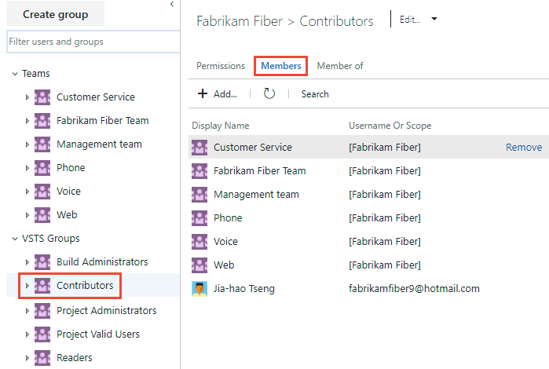

# Add AD/Azure AD users or groups to a built-in security group

[!INCLUDE [temp](../../_shared/version-vsts-tfs-all-versions.md)]

As described in [About security and identity](about-security-identity.md), there are two main types of built-in security groups: project-level and collection-level. In general, you add users and groups to a project-level group such as Contributors and Readers. For users that need to administrate select features and functions, add them or associated groups to the Build Administrators or Project Administrators groups.

Review [Default permissions and access](permissions-access.md) to gain insight into the default permissions provided to the built-in, project-level security groups.  

In this topic you'll learn how to:
> [!div class="checklist"]
> * Add an AD/Azure AD user or group to a built-in security group

The method for adding a user or group to a built-in security group is the same, no matter at what level you add them.

## Add an AD/Azure AD user or group to a built-in security group 

::: moniker range="azure-devops"
> [!IMPORTANT]  
> If you are adding a user to Azure DevOps for the first time, see [Add users for Azure DevOps](../accounts/add-organization-users.md?toc=/azure/devops/organizations/security/toc.json&bc=/azure/devops/organizations/security/breadcrumb/toc.json).
::: moniker-end    

::: moniker range=">= azure-devops-2019"

1. Open the web portal and choose the project where you want to add users or groups. To choose another project, see [Switch project, repository, team](../../project/navigation/go-to-project-repo.md).

2. Choose **Project Settings** and then **Security**.

	  

0. Open **Security** and under the **Groups** section, choose one of the following:
    - To add users who require read-only access to the project, choose **Readers**.
    - To add users who need to contribute fully to the project or who have been granted stakeholder access, choose **Contributors**.
    - For users who need to administrate the project, choose **Project Administrators**.

0. Next, choose the **Members** tab.

	Here we choose the **Contributors** group.

	> [!div class="mx-imgBorder"]  
	>   

	By default, the default team group and all other teams you add to the project are included as members of the Contributors group. So, you can choose to [add a new user as a member of a team](add-users-team-project.md#add-team-members) instead, and the user would automatically inherit Contributor permissions. 

0. Choose **Add** to add a user or a user group.

0. Enter the name of the user into the text box. You can enter several identities into the text box, separated by commas. The system automatically searches for matches. Choose the match(es) that meets your choice.

	  

	> [!NOTE]
	> The first time you add a user or group, 
	> you can't browse to it or check the friendly name.
	> After the identity has been added, you can just enter the friendly name.

::: moniker-end    

::: moniker range="<= tfs-2018"

0. Open the web portal and choose the project where you want to add users or groups. To choose another project, see [Switch project, repository, team](../../project/navigation/go-to-project-repo.md).  

0.  Choose the  gear icon to open **Project Settings**.

      

0. Open **Security** and under the **Groups** section, choose one of the following:
    - To add users who require read-only access to the project, choose **Readers**.
    - To add users who need to contribute fully to the project or who have been granted stakeholder access, choose **Contributors**.
    - For users who need to administrate the project, choose **Project Administrators**. 

0. Next, choose the **Members** tab.

	Here we choose the **Contributors** group.

	> [!div class="mx-imgBorder"]  
	>   

	By default, the default team group and all other teams you add to the project are included as members of the Contributors group. So, you can choose to [add a new user as a member of a team](add-users-team-project.md#add-team-members) instead, and the user would automatically inherit Contributor permissions.

1. Choose **Add** to add a user or a user group.

2. Enter the name of the user into the text box. You can enter several identities into the text box, separated by commas. The system automatically searches for matches. Choose the match(es) that meet your choice.

	  

	> [!NOTE]
	> The first time you add a user or group, 
	> you can't browse to it or check the friendly name.
	> After the identity has been added, you can just enter the friendly name.

::: moniker-end

## Next steps

> [!div class="nextstepaction"]
> [Change individual permissions, grant select access to specific functions](change-individual-permissions.md)

## Related articles

- [About permissions and groups](about-permissions.md)
- [Set permissions at the project-level or project collection-level](set-project-collection-level-permissions.md)
- [About security and identity](about-security-identity.md)
