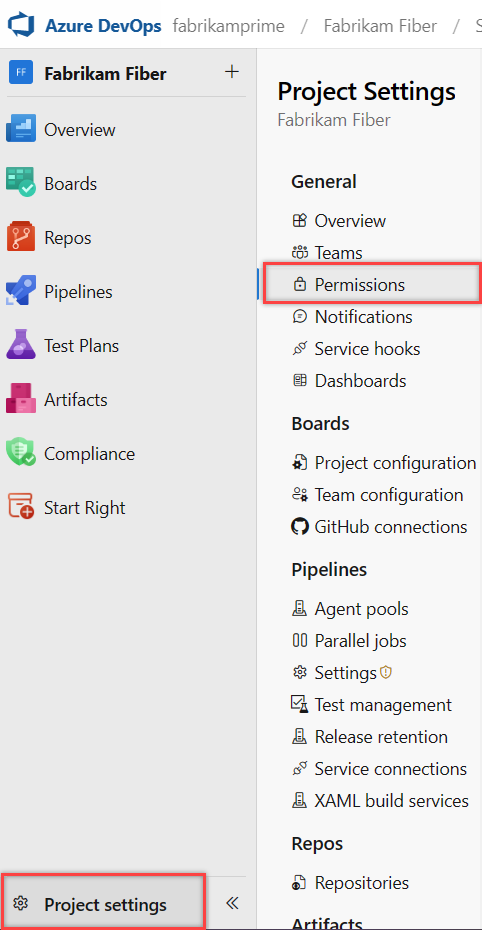
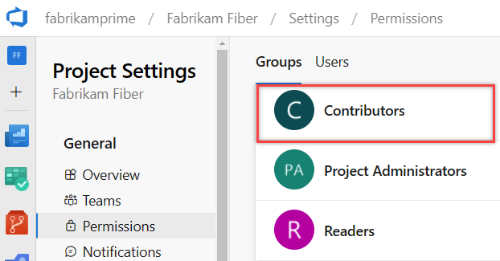
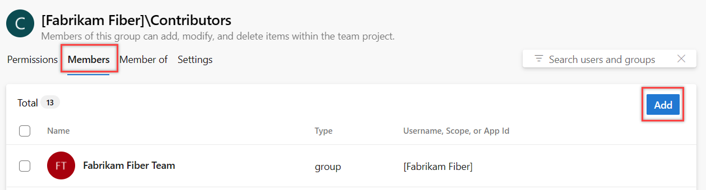
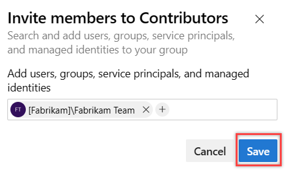
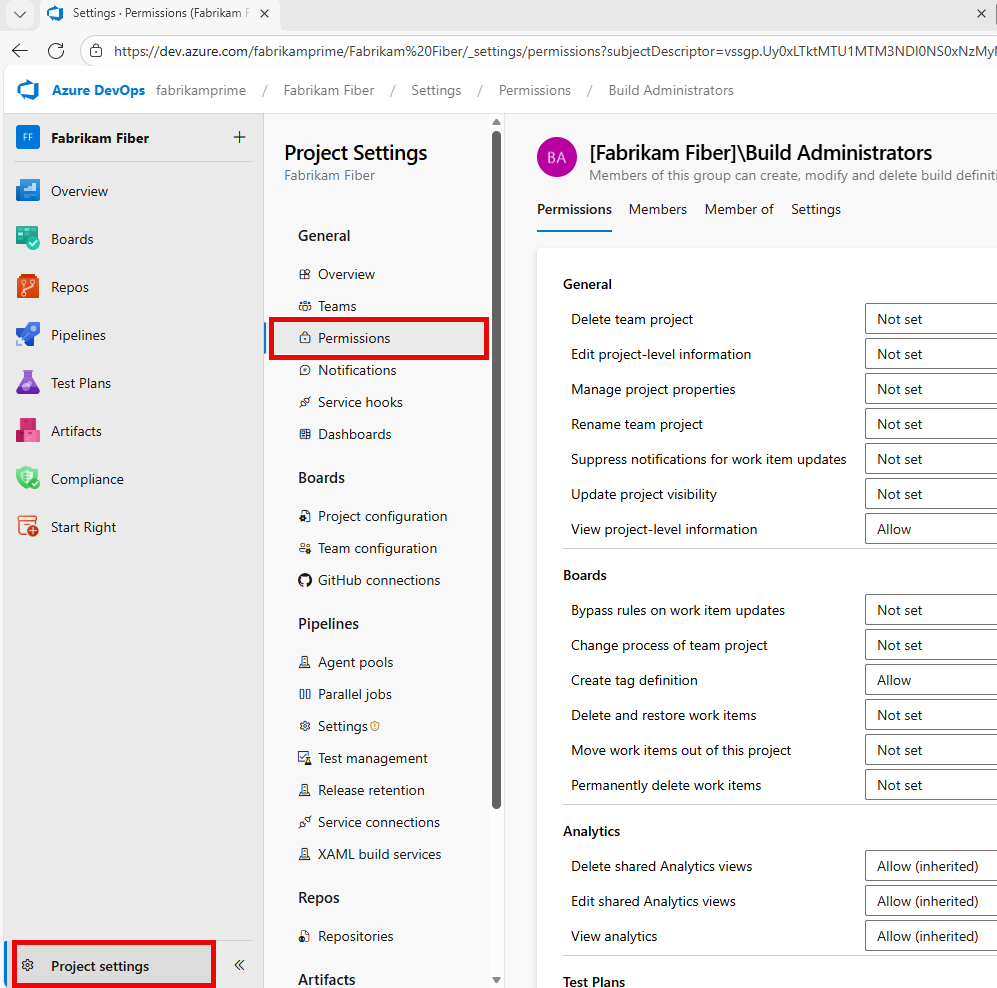
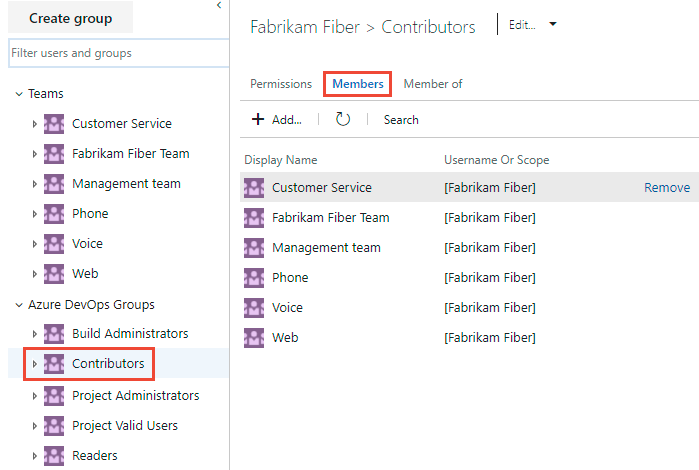
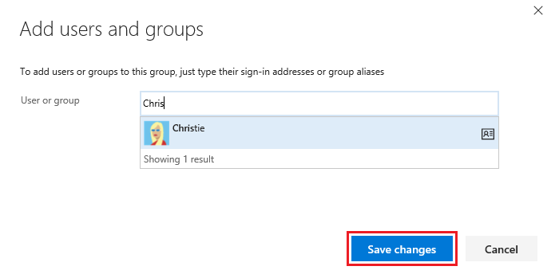

---
title: Add an Active Directory / Microsoft Entra group to a built-in security group
titleSuffix: Azure DevOps
description: Efficiently manage large user groups by adding Active Directory / Microsoft Entra groups to built-in security groups.
ms.subservice: azure-devops-security
ms.assetid: 
ms.author: chcomley
author: chcomley
ms.topic: tutorial
monikerRange: '<= azure-devops'
ai-usage: ai-assisted
ms.date: 03/09/2026
ms.custom: sfi-image-nochange
--- 

# Add a Microsoft Entra group to a built-in security group

[!INCLUDE [version-lt-eq-azure-devops](../../includes/version-lt-eq-azure-devops.md)]

::: moniker range="azure-devops"

To manage large user groups, add Microsoft Entra groups to built-in security groups in Azure DevOps. As outlined in [About security, authentication, and authorization](about-security-identity.md), there are two main types of built-in security groups: project-level and collection-level. Typically, you add groups to project-level groups like Contributors and Readers. For more information, see [Default permissions and access](permissions-access.md).

The process for adding a Microsoft Entra group to a built-in security group is the same, no matter the access level at which you add them.

::: moniker-end

::: moniker range=" < azure-devops"

To manage large user groups, add Active Directory groups to built-in security groups in Azure DevOps. As outlined in [About security, authentication, and authorization](about-security-identity.md), there are two main types of built-in security groups: project-level and collection-level. Typically, you add groups to project-level groups like Contributors and Readers. For more information, see [Default permissions and access](permissions-access.md).

The process for adding an Active Directory group to a built-in security group is the same, no matter the access level at which you add them.

::: moniker-end

::: moniker range="azure-devops"

## Prerequisites

| Category | Requirements |
|--------------|-------------|
|**Permissions**| Member of the [Project Collection Administrators group](../security/look-up-project-collection-administrators.md). Organization owners are automatically members of this group.|
|**Access levels**| At least **Basic** access.|
|**Organization connection**| Organization [connected to Microsoft Entra ID](../accounts/connect-organization-to-azure-ad.md).|

::: moniker-end

::: moniker range="azure-devops"

## Add Microsoft Entra group to a built-in security group 

1. Sign in to your project (`https://dev.azure.com/{Your_Organization/Your_Project}`).

2. Select **Project settings** > **Permissions**.

   > [!div class="mx-imgBorder"]
   > 

3. Select one of the following groups:
    - Select **Readers** to add users who need read-only access to the project.
    - Select **Contributors** to add users who need full contribution access or Stakeholder access.
    - Select **Project Administrators** to add users who need administrative access to the project.
   
   In the following example, select the **Contributors** group.
   > [!div class="mx-imgBorder"]  
   >   

4. Select **Members** > **Add**.

   > [!div class="mx-imgBorder"]  
   >   

	The Contributors group includes the default team group and all other teams you add to the project as members. So, you can [add a new user as a member of a team](add-users-team-project.md#add-team-members) instead, and the user automatically inherits Contributor permissions.

5. Enter the group name into the text box. You can enter multiple identities, separated by commas. The system automatically searches for matches. Select the matching identity or identities that meet your criteria.

   > [!div class="mx-imgBorder"]
   >   

	> [!NOTE]
	> The first time you add a group, you can't browse for it or check the friendly name. After adding the identity, you can enter the friendly name directly.

::: moniker-end

::: moniker range="< azure-devops"

## Add an Active Directory group to a built-in security group

1. Open the web portal and choose the project where you want to add users or groups. To choose another project, see [Switch project, repository, team](../../project/navigation/go-to-project-repo.md).

2. Choose **Project Settings**, and then **Security**.

	  

3. Under **Groups**, select one of the following options:
    - Select **Readers** to add users who need read-only access to the project.
    - Select **Contributors** to add users who need full contribution access or Stakeholder access.
    - Select **Project Administrators** to add users who need administrative access to the project.

4. Next, choose the **Members** tab.

	In the following example, we choose the **Contributors** group.

	> [!div class="mx-imgBorder"]  
	>   

	The Contributors group includes the default team group and all other teams you add to the project as members. So, you can [add a new user as a member of a team](add-users-team-project.md#add-team-members) instead, and the user automatically inherits Contributor permissions. 

5. Select :::image type="icon" source="../../media/icons/add-light-icon.png" border="false":::**Add** to add a group.

6. Enter the group name in the text box. You can enter multiple groups, separated by commas. The system automatically searches for matches. Select the match that meets your criteria.

	  

	> [!TIP]
	> The first time you add a group, you can't browse or check the friendly name.
	> After you add the identity, you can enter the friendly name directly.

::: moniker-end

## Next step

> [!div class="nextstepaction"]
> [Request an increase in permission levels](request-changes-permissions.md)

## Related content

- [Get started with permissions, access, and security groups](about-permissions.md)
- [Change project-level permissions](change-project-level-permissions.md)
- [Change project collection-level permissions](change-organization-collection-level-permissions.md)
- [Learn about security, authentication, and authorization](about-security-identity.md)
