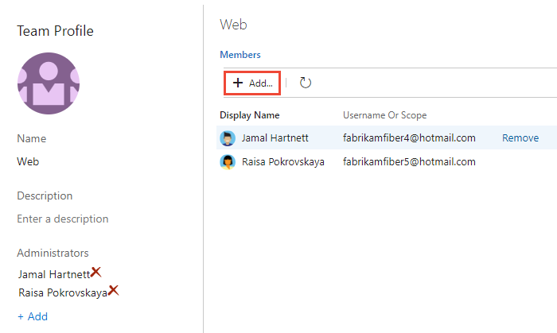
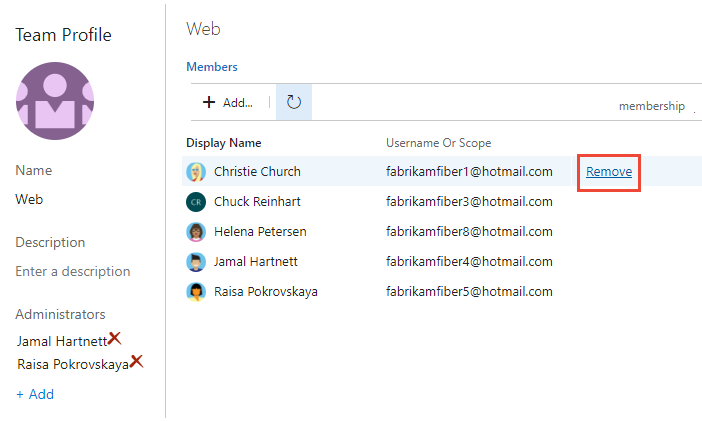
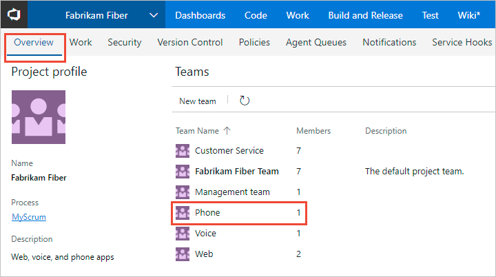

# Quickstart: Add users to a project or specific team

[!INCLUDE [temp](../../_shared/version-vsts-tfs-all-versions.md)]

In this quickstart, you learn how to add users to a project or specific team. For anyone to access a project, they must be added to one of the default security groups or a custom group. Usually you add them to the Contributors group. For a quick look at what permissions are assigned to the default groups, see [Permissions and access](permissions-access.md).

The easiest way to add a number of users to a project is to add groups defined in [Azure Active Directory (Azure AD) or Active Directory (AD)](setup-ad-aad.md).

::: moniker range="azure-devops"

> [!IMPORTANT]
> If you're adding users to an organization in Azure DevOps and you don't use Azure AD, then you need to [add their "personal" Microsoft accounts to your account or project](../../user-guide/sign-up-invite-teammates.md#invite-others). After you've added them to one project, you can add them to additional projects using the procedures provided in this article.

::: moniker-end

Once users have been added to a project, you can browse for that name by display name as well as their user name (email alias). Also, you can [add them to a specific team](#add-team-members). To add a team, see [Add a team](../../organizations/settings/add-teams.md).

## Prerequisites

* You must have a project. If you don't have a project yet, [create one](../projects/create-project.md).
* To add users to a project, you must be a member of the [Project Administrators group or have your **Edit project-level information** set to Allow](set-project-collection-level-permissions.md). Note that you can add Stakeholders to the Project Administrators group and then they can add users to an organization or project. 
* To add users to a team, you must have been [added as a team administrator for the team](../../organizations/settings/add-team-administrator.md), or you must be a member of the Project Administrators Group or have your **Edit project-level information** set to Allow.

## Add users to a project

::: moniker range="azure-devops"  
If you are adding a user to Azure DevOps for the first time, see [Add account users for Azure DevOps](../accounts/add-organization-users.md?toc=/azure/devops/organizations/security/toc.json&bc=/azure/devops/organizations/security/breadcrumb/toc.json).
::: moniker-end

::: moniker range=">= azure-devops-2019"

1. Open the web portal and choose the project where you want to add users or groups. To choose another project, see [Switch project, repository, team](../../project/navigation/go-to-project-repo.md).

2. Choose **Project Settings** and then **Security**.

	*To see the full image, click to expand*.

	 

0. Under **Groups**, choose one of the following:
   * To add users who require read-only access to the project, choose **Readers**.
   * To add users who contribute fully to this project or who have been granted stakeholder access, choose **Contributors**.
   * For users who eed to administrate the project, choose **Project Administrators**. To learn more, see  [Set permissions at the project-level or project collection-level](set-project-collection-level-permissions.md).

0. Next, choose the **Members** tab.

   Here we choose the **Contributors** group.

	> [!div class="mx-imgBorder"]  
	>   

   By default, the default team group and all other teams you add to the project are included as members of the **Contributors** group. So, you can choose to add a new user as a member of a team instead, and the user would automatically inherit Contributor permissions. 

    > [!TIP]
    > Managing users is much easier [using groups](../../organizations/security/about-permissions.md), not individual users.

0. Choose **Add** to add a user or a user group.

1. Type the name of the user account into the text box. You can enter several identities into the text box, separated by commas. The system automatically searches for matches. choose the match(es) that meet your requirements.

	  

   > [!NOTE]
   > The first time you add a user or group to Azure DevOps,
   > you can't browse to it or check the friendly name.
   > After the identity has been added, you can just enter the friendly name.

2. In **Identities**, specify the name of the user or group you want to add.

3. Depending on the user, you might want to customize their permissions for other functionality in the project, such as [areas and iterations](set-permissions-access-work-tracking.md) or [shared queries](../../boards/queries/set-query-permissions.md).

   > [!NOTE]
   > Users that have limited access, such as Stakeholders, won't be able to access select features even if granted permissions to those features. To learn more, see [Permissions and access](permissions-access.md).

::: moniker-end

::: moniker range="<= tfs-2018"
0. Open the web portal and choose the project where you want to add users or groups. To choose another project, see [Switch project, repository, team](../../project/navigation/go-to-project-repo.md).  

0.  Choose the  gear icon to open the administrative context.

     

0. Choose **Security** and under **Groups**, choose one of the following:
   * To add users who require read-only access to the project, choose **Readers**.
   * To add users who contribute fully to this project, choose **Contributors**.
   * For users who need to administrate the project, choose **Project Administrators**. To learn more, see  [Set permissions at the project-level or project collection-level](set-project-collection-level-permissions.md).

0. Next, choose the **Members** tab.

   Here we choose the Contributors group.

	> [!div class="mx-imgBorder"]  
	>   

    > [!TIP]
    > Managing users is much easier [using groups](../../organizations/security/about-permissions.md), not individual users.

   By default, the default team group and all other teams you add to the project are included as members of the Contributors group. So, you can choose to add a new user as a member of a team instead, and the user would automatically inherit Contributor permissions. 

0. Choose **Add** to add a user or a user group.

1. Type the name of the user account into the text box. You can enter several identities into the text box, separated by commas. The system automatically searches for matches. choose the match(es) that meets your choice.

	 

   > [!NOTE]
   > The first time you add a user or group to Azure DevOps,
   > you can't browse to it or check the friendly name.
   > After the identity has been added, you can just enter the friendly name.

2. In **Identities**, specify the name of the user or group you want to add.

3. Depending on the user, you might want to customize their permissions for other functionality in the project, such as [areas and iterations](set-permissions-access-work-tracking.md) or [shared queries](../../boards/queries/set-query-permissions.md).

   > [!NOTE]
   > Users that have limited access, such as Stakeholders, won't be able to access select features even if granted permissions to those features. To learn more, see [Permissions and access](permissions-access.md).

::: moniker-end

## Add users to a team

Several Agile tools, like capacity planning, team alerts, and dashboard widgets are team-scoped. That is, they automatically reference the user accounts added as members of a team to support planning activities or sending alerts. To learn more, see [About teams and Agile tools](../settings/about-teams-and-settings.md).

<a id="add-team-members-team-services" />

::: moniker range=">= azure-devops-2019"

You add team members from **Project Settings>Work>Team configuration**. You can quickly navigate to it from a team work tracking backlog, board, or dashboard. 

0.  Open a backlog or board for a team and choose the  team profile icon. Then choose **Team Settings**. 

	Here we open the Board for the Web team and from there the team profile.  

	> [!div class="mx-imgBorder"]  
	>   

0. If you need to switch the team context, use the team selector within the breadcrumbs.  

	> [!div class="mx-imgBorder"]  
	>  

0. Choose **Add**. 

	> [!div class="mx-imgBorder"]  
	>    

0. Enter the sign-in addresses or display name for each account you want to add. Add them one at a time or all at the same time. You can enter several identities into the text box, separated by commas.

	

   > [!TIP]
   > You must enter user and group names one at a time. However, after entering a name, the account is added to the list, and you can enter another name in the Identities text box before choosing to save your changes.

	You may need to choose the  refresh icon to see your updates. 

0. To remove members, return to this page, highlight the user name and choose **Remove**.

	> [!div class="mx-imgBorder"]  
	>    

   > [!NOTE]
   > To remove a team administrator as a team member, you must first remove them as an administrator. 

0. To add an account as a team administrator, choose **Add** located in the Team Profile page. For details, see [Add a team administrator](../../organizations/settings/add-team-administrator.md).
	
::: moniker-end

::: moniker range="<= tfs-2018"

0. From the project admin context, open the **Overview** page, and then choose the team you want to add team members to.   

	 

0. Choose the **Add** to add a user or a user group.

0. Enter the sign-in addresses or display name for each account you want to add. Add them one at a time or all at the same time. You can enter several identities into the text box, separated by commas.

	

   > [!TIP]
   > You must enter user and group names one at a time. However, after entering a name, the account is added to the list, and you can enter another name in the Identities text box before choosing to save your changes.

	You may need to choose the  refresh icon to see your updates. 

0. To remove members, return to this page, highlight the user name and choose **Remove**.

	

   > [!NOTE]
   > To remove a team administrator as a team member, you must first remove them as an administrator. 

0. To add an account as a team administrator, choose **Add** located in the Team Profile page. For details, see [Add a team administrator](../../organizations/settings/add-team-administrator.md).

::: moniker-end

::: moniker range="<= azure-devops-2019"
## Add users or groups to an access level   

For on-premises deployments, you may need to set the access level for a user or group, particularly if those groups don't belong to the default access level. To learn more, see [Change access levels](change-access-levels.md).

::: moniker-end 

::: moniker range=">= tfs-2018 < azure-devops"
## Add users or groups to SQL Server Reports 

If your on-premises deployment is integrated with SQL Server Reports, you'll need to manage membership for those products separately from their websites. See [Grant permissions to view or create SQL Server reports in TFS](../../report/admin/grant-permissions-to-reports.md).

::: moniker-end 

::: moniker range="<= tfs-2017"
## Add users or groups to SharePoint or SQL Server Reports 

If your on-premises deployment is integrated with a SharePoint product or SQL Server Reports, you'll need to manage membership for those products separately from their websites.

* [Set SharePoint site permissions](../../organizations/security/set-sharepoint-permissions.md)
* [Grant permissions to view or create SQL Server reports in TFS](../../report/admin/grant-permissions-to-reports.md)

::: moniker-end 

## Next steps

> [!div class="nextstepaction"]
> [Add administrators or set permissions at the project or collection level](set-project-collection-level-permissions.md) 

To view permissions for yourself or another user, see [View permissions](view-permissions.md).

## Related articles
You can also control access to projects, version control, build, and work items. 

* [Set Git or TFVC repository permissions](set-git-tfvc-repository-permissions.md)
* [Set Git branch permissions](../../repos/git/branch-permissions.md)
* [Set build and release permissions](../../pipelines/policies/set-permissions.md)
* [Set permissions and access for work tracking](set-permissions-access-work-tracking.md)

