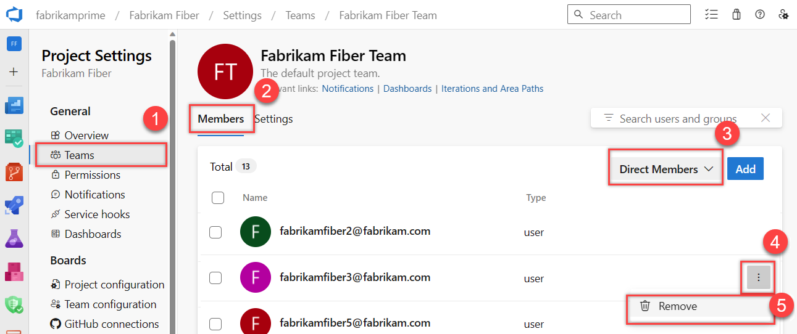

# Add users or groups to a team or project

[!INCLUDE [version-all](../../includes/version-all.md)]

::: moniker range="azure-devops"

You add users to a team or project so they can contribute to the team and project. For enterprise organizations with large user bases, we recommend you use Azure Active Directory to add and manage new users through security groups. However, to enable flexibility for all size organizations, the following operations are supported: 
 
- Team and project administrators can add new users to their team or project, unless the policy [Allow team and project administrators to invite new users](restrict-invitations.md) is disabled. New users are ones that haven't been added to the organization. 
- When adding new users through the team and project user interfaces, the system automatically assigns an access level to the user. 
- Adding users to a team or project automatically adds them to the Contributors group for the project. Members of the Contributors group have permissions to most features needed to contribute.
- By adding users to a team, you make team-specific tools aware of them, such as the team security group, Team Members widget, and sprint capacity planning tools. 
- Once users have been added to a project or organization, you can browse for their display name or user name (email alias) from any people-picker tool.

::: moniker-end

::: moniker range="< azure-devops"
You add users to a team or project so they can contribute to the team and project. For enterprise organizations with large user bases, we recommend you use Active Directory or Windows Group to manage users through security groups. However, to enable flexibility for all size organizations, the following operations are supported: 

- Team and project administrators can add existing users to their team or project. Existing users are ones known to the project collection through Active Directory or Windows group. 
- Adding users to a team or project automatically adds them to the Contributors group for the project. Members of the Contributors group have permissions to most features needed to contribute.
- By adding users to a team, you make team-specific tools aware of them, such as the team security group, Team Members widget, and sprint capacity planning tools. 
- Once users have been added to a project or organization, you can browse for their display name or user name (email alias) from any people-picker tool.
 
::: moniker-end

You add projects to an organization or project collection and you add teams to projects. To learn more, see: 
- [Create a project](../projects/create-project.md) 
- [Add team, go from one default team to others](../settings/add-teams.md)

[!INCLUDE [version-all](../../includes/version-selector-minimize.md)]


## Supported options for adding users 

::: moniker range="azure-devops"

Depending on the interface you use, you can exercise different options for adding new or existing users to teams or projects. 

::: moniker-end

::: moniker range="< azure-devops"

Team and project administrators can add existing users to their team or project. Existing users are ones that are known to a project collection through the Active Directory or Windows Group created for the server that hosts the on-premises Azure DevOps Server.  
 
::: moniker-end
 
 
:::row:::
   :::column span="1":::
      **Administrator level**
   :::column-end:::
   :::column span="2":::
      **Interface**
   :::column-end:::
   :::column span="2":::
      **Supported tasks**
   :::column-end:::
:::row-end:::
::: moniker range="azure-devops"
:::row:::
   :::column span="1":::
      Team administrators
   :::column-end:::
   :::column span="2":::
      [Team Members dashboard widget](#widget)
   :::column-end:::
   :::column span="2":::
      Add new or existing users to a team. Send new users an invite.
   :::column-end:::
:::row-end:::
::: moniker-end
:::row:::
   :::column span="1":::
      Team administrators
   :::column-end:::
   :::column span="2":::
      [**Project Settings>Teams>Team>Members**](#teams-page)  
   :::column-end:::
   :::column span="2":::
      Add existing users or groups to a team, or remove a member. 
   :::column-end:::
:::row-end:::
::: moniker range="azure-devops"
:::row:::
   :::column span="1":::
      Project Administrators
   :::column-end:::
   :::column span="2":::
      [Project **Summary** page, **Invite**](#summary-page)  
   :::column-end:::
   :::column span="2":::
      Add new or existing users. Send new users an invite. Optionally add users to one or more teams.   
   :::column-end:::
:::row-end:::
::: moniker-end
:::row:::
   :::column span="1":::
      Project Administrators
   :::column-end:::
   :::column span="2":::
      [**Project Settings>Permissions>Groups>Group** **Members**](#project-permissions)  
   :::column-end:::
   :::column span="2":::
      Add existing users or groups to a security group. By adding to a team group, you effectively add them to the team. Optionally remove a user from a group.   
   :::column-end:::
:::row-end:::
::: moniker range="azure-devops"
:::row:::
   :::column span="1":::
      Project Collection Administrators
   :::column-end:::
   :::column span="2":::
      [**Organization Settings>Users**](../accounts/add-organization-users.md)   
   :::column-end:::
   :::column span="2":::
      Add new users to an organization and send an invite. Must specify the access level. Optionally add them to select projects. Can use Group rules to further manage groups being added.  
   :::column-end:::
:::row-end:::
:::row:::
   :::column span="1":::
      Project Collection Administrators
   :::column-end:::
   :::column span="2":::
      [`az devops user` CLI](../accounts/add-organization-users.md#add-users-to-your-organization)
   :::column-end:::
   :::column span="2":::
      Add new users to an organization and send an invite. Must specify the access level.  
   :::column-end:::
:::row-end:::
::: moniker-end
::: moniker range="azure-devops"
:::row:::
   :::column span="1":::
      Azure Active Directory Administrators
   :::column-end:::
   :::column span="2":::
      Azure Active Directory
   :::column-end:::
   :::column span="2":::
      Users you add to Azure Active Directory connected to Azure DevOps Services are added to the Project Collection Valid Users group. To learn more, see [Connect your organization to Azure Active Directory](../accounts/connect-organization-to-azure-ad.md). 
   :::column-end:::
:::row-end:::
::: moniker-end
::: moniker range="< azure-devops"
:::row:::
   :::column span="1":::
      Active Directory Administrators
   :::column-end:::
   :::column span="2":::
      Active Directory or Windows Group
   :::column-end:::
   :::column span="2":::
      Users you add to Active Directory or Windows Group connected to Azure DevOps are added as members of the Project Collection Valid Users group. They have access to all projects within a project collection. To learn more, see [Set up groups for use in Azure DevOps on-premises](/azure/devops/server/admin/setup-ad-groups?view=azure-devops-2020&preserve-view=true). 
   :::column-end:::
:::row-end:::
::: moniker-end


## Prerequisites

[!INCLUDE [temp](../../includes/prerequisites-add-users-org.md)]

[!INCLUDE [temp](../../includes/prerequisites-add-users-server.md)]

If you're new to Azure DevOps, you may want to familiarize yourself with the information provided in these articles: 

- [Get started with permissions, access levels, and security groups](about-permissions.md)  
- [About projects and scaling your organization](../projects/about-projects.md)  
- [Default permissions and access quick reference](permissions-access.md)  
- [About teams and Azure Boards tools](../settings/about-teams-and-settings.md) 


<a id="widget"> </a>

::: moniker range="azure-devops"

## Add a user from the Team Members widget  

As a team administrator, you can add new or existing members from the **Team Members** dashboard widget. To add this widget to a dashboard, see [Add widgets to a dashboard](../../report/dashboards/add-widget-to-dashboard.md). 
 
1. To invite someone to your team, choose the plus button on the Team Members widget. 

	:::image type="content" source="media/add-users/team-member-widget.png" alt-text="Screenshot of Team Members widget added to a dashboard, plus icon.":::

2. For new users, enter their email address. For existing users, type their name until it resolves as a known name to the system. You can add several email addresses or account names by separating them with a semicolon (;). 
	:::row:::
	   :::column span="":::
	      Choose the entry listed under **Add users** to complete the entry.  
	      > [!NOTE]  
	      > Any valid email address is acceptable. When the user accepts the invitation and signs into Azure DevOps, they register their email address as a Microsoft account and choose a password.   
	   :::column-end:::
	   :::column span="":::
	      Choose the name that appears to complete the entry.   
	   :::column-end:::
	:::row-end:::
	:::row:::
	   :::column span="":::
	      :::image type="content" source="media/add-users/invite-members-dialog.png" alt-text="Invite members to a team dialog, enter an unknown user email address.":::
	   :::column-end:::
	   :::column span="":::
	      :::image type="content" source="media/add-users/invite-members-known-user.png" alt-text="Invite members to a team dialog, enter a known user account.":::
	   :::column-end:::
	:::row-end:::

2. Complete the addition.  
	:::row:::
	   :::column span="":::
	      When the user is unknown, you'll get a notification that an access level must be assigned. To complete the invitation, choose **Add**.    
	   :::column-end:::
	   :::column span="":::
	      Choose **Add** to complete adding the user. Known users don't receive an invitation.     
	   :::column-end:::
	:::row-end:::
	:::row:::
	   :::column span="":::
	      :::image type="content" source="media/add-users/invite-members-dialog-add-info.png" alt-text="Invite members to a team dialog, Add new user account. ":::
	   :::column-end:::
	   :::column span="":::
	      :::image type="content" source="media/add-users/invite-members-dialog-complete-add.png" alt-text="Invite members to a team dialog, Add button.":::
	   :::column-end:::
	:::row-end:::

	 When adding a new user, the system assigns Stakeholder as the access level when all free five Basic access levels have been assigned. Active contributors to a project need to have Basic access as a minimum. A Project Collection Administrator can change the access level and resend invitations from the [**Organization Settings>Users** page](#manage-users).  

	 > [!NOTE]
	 > Users that have limited access, such as Stakeholders, won't be able to access select features even if granted permissions to those features. To learn more, see [Permissions and access](permissions-access.md).

1. (Optional) A message will briefly display on the screen to indicate success or failure. Choose **Details** to open the notification and review details. 

	:::row:::
	   :::column span="":::
	      :::image type="content" source="media/add-users/notification-success.png" alt-text="Screenshot of notification success message. ":::  
	   :::column-end:::
	   :::column span="":::
	      :::image type="content" source="media/add-users/notification-failure.png" alt-text="Screenshot of notification failure message. ":::  
	   :::column-end:::
	:::row-end:::
	:::row:::
	   :::column span="":::
	     A success message indicates the status of adding the user to the system. 
	   :::column-end:::
	   :::column span="":::
	      A failure message indicates why the addition of the user failed. 
	   :::column-end:::
	:::row-end:::
	:::row:::
	   :::column span="":::
	      :::image type="content" source="media/add-users/summary-invite-notifications-success.png" alt-text="Notification dialog of Success. "::: ":::  
	   :::column-end:::
	   :::column span="":::
	      :::image type="content" source="media/add-users/notification-failure-outside-directory.png" alt-text="Notification dialog of failure. ":::
	   :::column-end:::
	:::row-end:::

1. New users receive an email inviting them to sign in to the project. Existing users don't receive any formal notification. 

::: moniker-end

<a id="teams-page"> </a>
<a id="add-team-members"> </a>
<a id="add-team-members-team-services" />
<a id="add-users-to-a-team"> </a>

## Add users or groups to a team 

Add existing users or security groups to a team from the **Project settings> Teams** page. From this interface you can view, add, or remove users and security groups to/from a team. To add a custom security group, see [Set permissions at the project- or collection-level](set-project-collection-level-permissions.md).   
 
::: moniker range="= azure-devops"

> [!NOTE]   
> To enable the preview feature, **New Teams Page**, see [Enable preview features](../../project/navigation/preview-features.md).

::: moniker-end

#### [Preview page](#tab/preview-page)

::: moniker range="azure-devops"

You can toggle between direct or expanded membership views. The **Direct Members** view displays users and groups that have been added to the team. The **Expanded Members** view replaces any Azure DevOps groups with the members that belong to those groups. Azure Active Directory or Active Directory groups aren't expanded.  

1. Open a backlog or board for a team and choose the :::image type="icon" source="../../media/icons/team.png" border="false"::: team profile icon. Then choose **Team Settings**. 

   Here we open the Board for the Web team and from there the team profile.  

   > [!div class="mx-imgBorder"]  
   >   

2. If you need to switch the team context, use the team selector within the breadcrumbs.  

	:::image type="content" source="media/add-users/change-team-context.png" alt-text="Screenshot of Project Settings>Teams>Team and Teams breadcrumb.":::

3. Choose **Add**. 

	> [!div class="mx-imgBorder"]  
	>    

4. Enter the sign-in addresses or display name for each account you want to add. You can also add a project security group&mdash;such as another team group, custom group, or Azure Active Directory group when used by the organization. Add them one at a time or all at the same time. You can enter several identities into the text box, separated by commas.

	:::image type="content" source="media/add-users/change-team-context.png" alt-text="Invite members to team dialog, choose user account.  ":::

   > [!TIP]
   > You must enter user and group names one at a time. However, after entering a name, the account is added to the list, and you can enter another name in the Identities text box before choosing to save your changes.

	You may need to choose the :::image type="icon" source="../../media/icons/refresh.png" border="false"::: refresh icon to see your updates. 

6. To add an account as a team administrator, choose the Settings page and then choose **Add** under the Administrators section. For details, see [Add a team administrator](../../organizations/settings/add-team-administrator.md)

::: moniker-end

::: moniker range="< azure-devops"
Choose the **Current page** tab for information on adding a user to a team. The **New Teams Page** preview feature is only available for Azure DevOps Services at this time. 
::: moniker-end

#### [Current page](#tab/current-page)

::: moniker range=">= azure-devops-2019"

You can toggle between direct or expanded membership views. The **direct** view displays users and groups that have been added to the team. The **expanded** view replaces any Azure DevOps groups with the members that belong to those groups. Azure Active Directory or Active Directory groups aren't expanded.   

You add team members from **Project Settings>Work>Team configuration**. You can quickly navigate to it from a team work tracking backlog, board, or dashboard. 

1. Open a backlog or board for a team and choose the **Show Team Profile** :::image type="icon" source="../../media/icons/team.png" border="false":::. Then choose **Team Settings**. 

   Here we open the Board for the Web team and from there the team profile.  

   > [!div class="mx-imgBorder"]  
   >   

2. If you need to switch the team context, use the team selector within the breadcrumbs.  

	> [!div class="mx-imgBorder"]  
	>  

3. Choose **Add**. 

	> [!div class="mx-imgBorder"]  
	>    

4. Enter the sign-in addresses or display name for each account you want to add. Add them one at a time or all at the same time. You can enter several identities into the text box, separated by commas.

	

   > [!TIP]
   > You must enter user and group names one at a time. However, after entering a name, the account is added to the list, and you can enter another name in the Identities text box before choosing to save your changes.

	You may need to choose the :::image type="icon" source="../../media/icons/refresh.png" border="false"::: refresh icon to see your updates. 

6. To add an account as a team administrator, choose **Add** located in the Team Profile page. For details, see [Add a team administrator](../../organizations/settings/add-team-administrator.md)

::: moniker-end

::: moniker range="<= tfs-2018"

1. From the project admin context, open the **Overview** page, and then choose the team you want to add team members to.   

	 

2. Choose the **Add** to add a user or a user group.

3. Enter the sign-in addresses or display name for each user you want to add. Add them one at a time or all at the same time. You can enter several identities into the text box, separated by commas.

	

   > [!TIP]
   > You must enter user and group names one at a time. However, after entering a name, it is added to the list, and you can enter another name in the Identities text box before choosing to save your changes.

	You may need to choose the :::image type="icon" source="../../media/icons/refresh.png" border="false"::: refresh icon to see your updates. 

5. To add an account as a team administrator, choose **Add** located in the Team Profile page. For details, see [Add a team administrator](../../organizations/settings/add-team-administrator.md).

::: moniker-end

---


## Remove users or groups from a team 

From the team's **Members** page, you can remove members. 
 
#### [Preview page](#tab/preview-page)

::: moniker range="azure-devops"

1. To remove members, open the team's **Members** page, choose **Direct Members**, check the checkbox of the user you want to remove, choose :::image type="icon" source="../../media/icons/more-actions.png" border="false"::: **More options**, and then choose **Remove**.

	> [!div class="mx-imgBorder"]  
	>    

   > [!TIP]
   > To remove a team administrator as a team member, you must first remove them as an administrator. 

1. Confirm the removal by choosing **Delete** in the confirmation message.  

	:::image type="content" source="media/add-users/remove-user-confirmation.png" alt-text="Delete member dialog confirmation.":::

::: moniker-end

::: moniker range="< azure-devops"
Choose the **Current page** tab for information on adding a user to a team. The **New Teams Page** preview feature is only available for Azure DevOps Services at this time. 
::: moniker-end

#### [Current page](#tab/current-page)

::: moniker range=">= azure-devops-2019"

5. To remove members, open the team's **Members** page, choose **direct** membership, return to this page, highlight the user name and choose **Remove**.

	> [!div class="mx-imgBorder"]  
	>    

   > [!NOTE]
   > To remove a team administrator as a team member, you must first remove them as an administrator. 

::: moniker-end

::: moniker range="<= tfs-2018"
 
1. To remove members, return to this page, highlight the user name, and then choose **Remove**.

	

   > [!NOTE]
   > To remove a team administrator as a team member, you must first remove them as an administrator. 

::: moniker-end

---


<a name="summary-page"></a>

::: moniker range="azure-devops"

## Invite users from the Summary page 

As a member of the Project Administrators group, you can add members to a project from the **Summary** page and optionally add them to one or more teams. 


1. Open the **Project>Summary** page, and choose **Invite**.  

	:::image type="content" source="media/add-users/summary-invite-users.png" alt-text="Screenshot of Summary page, Invite button.":::

2. For new users, enter their email address. For existing users, type their name until it resolves as a known name to the system. You can add several email addresses or account names by separating them with a semicolon (;). 

	:::row:::
	   :::column span="":::
	      Choose the entry listed under **Add users** to complete the entry.   
	   :::column-end:::
	   :::column span="":::
	      If you're adding a user known by the organization or collection, type the name or email address and then choose the name that appears to complete the entry.   
	   :::column-end:::
	:::row-end:::
	:::row:::
	   :::column span="":::
	      :::image type="content" source="media/add-users/summary-page-invite-dialog-new-unknown-user.png" alt-text="Invite members to a project dialog, unknown user.":::
	   :::column-end:::
	   :::column span="":::
	      :::image type="content" source="media/add-users/summary-invite-known-user.png" alt-text="Invite members to a project dialog, enter a known user account.":::
	   :::column-end:::
	:::row-end:::

	> [!NOTE]  
	> Any valid email address is acceptable. When the user accepts the invitation and signs into Azure DevOps, they register their email address as a Microsoft account and choose a password.  


2. Optionally, select the teams you want to add the user to and then choose **Add** to complete the invitation.

	:::row:::
	   :::column span="":::
	      When the user is unknown, you'll get a notification that an access level must be assigned. To complete the invitation, choose **Add**.    
	   :::column-end:::
	   :::column span="":::
	      Choose **Add** to complete the invitation.     
	   :::column-end:::
	:::row-end:::
	:::row:::
	   :::column span="":::
	      :::image type="content" source="media/add-users/summary-invite-dialog-new-user-selected-team.png" alt-text="Invite members to a project dialog, unknown user, select teams to add.":::
	   :::column-end:::
	   :::column span="":::
	      :::image type="content" source="media/add-users/summary-page-invite-project-members.png" alt-text="Invite members to a project dialog, known user, select teams to add.":::
	   :::column-end:::
	:::row-end:::

	 When adding a new user, the system assigns Stakeholder as the access level when all free five Basic access levels have been assigned. Active contributors to a project need to have Basic access as a minimum. A Project Collection Administrator can change the access level from the [**Organization Settings>Users** page](#manage-users).  

	 > [!NOTE]
	 > Users that have limited access, such as Stakeholders, won't be able to access select features even if granted permissions to those features. To learn more, see [Permissions and access](permissions-access.md).
 
1. (Optional) A message will briefly display on the screen to indicate success or failure. Choose **Details** to open the notification and review details. 

	:::row:::
	   :::column span="":::
	      :::image type="content" source="media/add-users/notification-success.png" alt-text="Screenshot of notification success message. ":::  
	   :::column-end:::
	   :::column span="":::
	      :::image type="content" source="media/add-users/notification-failure.png" alt-text="Screenshot of notification failure message. ":::  
	   :::column-end:::
	:::row-end:::
	:::row:::
	   :::column span="":::
	      A success message indicates the status of adding the user to the system. 
	   :::column-end:::
	   :::column span="":::
	      A failure message indicates why the addition of the user failed. 
	   :::column-end:::
	:::row-end:::
	:::row:::
	   :::column span="":::
	      :::image type="content" source="media/add-users/summary-invite-notifications-success.png" alt-text="Notification dialog of Success. "::: ":::  
	   :::column-end:::
	   :::column span="":::
	      :::image type="content" source="media/add-users/notification-failure-outside-directory.png" alt-text="Notification dialog of failure. ":::
	   :::column-end:::
	:::row-end:::
 
1. New users receive an email inviting them to sign in to the project. Existing users don't receive any formal notification. 

::: moniker-end

 
<a name="add-users-team-project"></a>
<a name="add-users-to-a-project"></a>


## Add users or groups to a project

As a member of the Project Administrators group, you can add users or groups to a project from the **Project settings> Permissions** page by adding them to a security group. To add a custom security group, see [Set permissions at the project- or collection-level](set-project-collection-level-permissions.md).   


::: moniker range="azure-devops"
> [!NOTE]   
> To enable the new user interface for the **Project Permissions Settings Page**, see [Enable preview features](../../project/navigation/preview-features.md).
::: moniker-end 

<a id="project-permissions" />

#### [Preview page](#tab/preview-page)


::: moniker range="azure-devops"

1. Open the web portal and choose the project where you want to add users or groups. To choose another project, see [Switch project, repository, team](../../project/navigation/go-to-project-repo.md).

2. Choose **Project settings**, and then **Permissions**. 

	

3. Under **Groups**, choose one of the following options:
   - **Readers**: To add users who require read-only access to the project, choose.
   - **Contributors**: To add users who contribute fully to this project or who have been granted Stakeholder access.
   - **Project Administrators**: To add users who need to administrate the project. To learn more, see [Set permissions at the project-level or project collection-level](set-project-collection-level-permissions.md).

	Or, you can choose any team group to add users to a specific team. 

   Here we choose the **Contributors** group.

	> [!div class="mx-imgBorder"]  
	>  

4. Next, choose the **Members** tab.

   The default team group, and any other teams you add to the project, get included as members of the **Contributors** group. Add a new user as a member of a team instead, and the user automatically inherits Contributor permissions. 

    > [!TIP]
    > Managing users is much easier [using groups](../../organizations/security/about-permissions.md), not individual users.

5. Choose **Add** to add a user or a user group.

	> [!div class="mx-imgBorder"]  
	>  

6. Enter the name of the user account into the text box. You can enter several identities into the text box, separated by commas. The system automatically searches for matches. Choose the match(es) that meets your requirements.

	  

   > [!NOTE]
   > The first time you add a user or group to Azure DevOps,
   > you can't browse to it or check the friendly name.
   > After the identity has been added, you can just enter the friendly name.

	Choose **Save** when done. 

7. You may customize user permissions for other functionality in the project. For example, in [areas and iterations](set-permissions-access-work-tracking.md) or [shared queries](../../boards/queries/set-query-permissions.md).


::: moniker-end

::: moniker range="< azure-devops"

Choose the **Current page** tab for information on adding a user to a project. The Project Permissions Settings Page preview feature is only available for Azure DevOps Services at this time. 

::: moniker-end

#### [Current page](#tab/current-page) 

::: moniker range=">= azure-devops-2019"

1. Open the web portal and choose the project where you want to add users or groups. To choose another project, see [Switch project, repository, team](../../project/navigation/go-to-project-repo.md).

2. Choose **Project Settings** and then **Security**.

	*To see the full image, select to expand*.

	[](media/view-permissions/open-security-project-level-vert-expanded.png#lightbox) 

3. Under **Groups**, choose one of the following options:
   - **Readers**: To add users who require read-only access to the project, choose.
   - **Contributors**: To add users who contribute fully to this project or who have been granted Stakeholder access.
   - **Project Administrators**: To add users who need to administrate the project. To learn more, see [Set permissions at the project-level or project collection-level](set-project-collection-level-permissions.md).

4. Next, choose the **Members** tab.

   Here we choose the **Contributors** group.

	> [!div class="mx-imgBorder"]  
	>   

   The default team group, and any other teams you add to the project, get included as members of the **Contributors** group. Add a new user as a member of a team instead, and the user automatically inherits Contributor permissions. 

    > [!TIP]
    > Managing users is much easier [using groups](../../organizations/security/about-permissions.md), not individual users.

5. Choose **Add** to add a user or a user group.

6. Enter the name of the user account into the text box. You can enter several identities into the text box, separated by commas. The system automatically searches for matches. choose the match(es) that meets your requirements.

	  

   > [!NOTE]
   > The first time you add a user or group to Azure DevOps,
   > you can't browse to it or check the friendly name.
   > After the identity has been added, you can just enter the friendly name.

	Choose **Save changes** when complete. 

7. (Optional) You can customize a user's permission for other functionality in the project. For example, in [areas and iterations](set-permissions-access-work-tracking.md) or [shared queries](../../boards/queries/set-query-permissions.md).

   > [!NOTE]
   > Users that have limited access, such as Stakeholders, won't be able to access select features even if granted permissions to those features. To learn more, see [Permissions and access](permissions-access.md).

::: moniker-end

::: moniker range="<= tfs-2018"

1. Open the web portal and choose the project where you want to add users or groups. To choose another project, see [Switch project, repository, team](../../project/navigation/go-to-project-repo.md).  

2. Choose the :::image type="icon" source="../../media/icons/gear-icon.png" border="false"::: gear icon to open the administrative context.

     

3. Choose **Security** and under **Groups**, choose one of the following options:
   - **Readers**: To add users who require read-only access to the project, choose.
   - **Contributors**: To add users who contribute fully to this project or who have been granted Stakeholder access.
   - **Project Administrators**: To add users who need to administrate the project. To learn more, see [Set permissions at the project-level or project collection-level](set-project-collection-level-permissions.md).

4. Next, choose the **Members** tab.

   Here we choose the Contributors group.

	> [!div class="mx-imgBorder"]  
	>   

    > [!TIP]
    > Managing users is much easier [using groups](../../organizations/security/about-permissions.md), not individual users.

   By default, the default team group and any other teams you add to the project, are included as members of the **Contributors** group. Add a new user as a member of a team instead, and the user automatically inherits Contributor permissions. 

5. Choose **Add** to add a user or a user group.

6. Enter the name of the user account into the text box. You can enter several identities into the text box, separated by commas. The system automatically searches for matches.

	

   > [!NOTE]
   > The first time you add a user or group to Azure DevOps,
   > you can't browse to it or check the friendly name.
   > After the identity has been added, you can just enter the friendly name.

7. (Optional) You can customize user permissions for other functionality within the project, such as [areas and iterations](set-permissions-access-work-tracking.md) or [shared queries](../../boards/queries/set-query-permissions.md).

   > [!NOTE]
   > Users that have limited access, such as Stakeholders, won't be able to access select features even if granted permissions to those features. To learn more, see [Permissions and access](permissions-access.md).

::: moniker-end

---

::: moniker range="azure-devops"

<a id="manage-users" /> 

##  Manage users or resend invitations 

Project Collection Administrators can update user assignments and resend invitations. The various options they have are:
- Change the access level
- Manage user - add them to select projects 
- Resend invite
- Remove direct assignments
- Remove from organization  

To learn more, see [Add account users for Azure DevOps](../accounts/add-organization-users.md).

:::image type="content" source="media/add-users/users-page-manage-options.png" alt-text="Screenshot of Organization Settings>Users page, Manage user options. ":::


::: moniker-end


::: moniker range=">= azure-devops-2020"

## List team members or team details  

From the Azure DevOps CLI command, you can see details about a team or list the individual members of that team. To first see a list of all teams in your organization, use the [az devops team list](/cli/azure/devops/team#ext-azure-devops-az-devops-team-list) command.

[List team members](#list-members) &#124; [Show team details](#show-details)

> [!NOTE]   
> You can use the [`az devops user`](../accounts/add-organization-users.md#add-users-to-your-organization) command to add users to an organization. There is no comparable command for adding users to a team or project. 

<a id="list-members" /> 

### List team members

You can list the individual members of a team in your organization with the [az devops team list-member](/cli/azure/devops/team#ext-azure-devops-az-devops-team-list-member) command. To get started, see [Get started with Azure DevOps CLI](../../cli/index.md). 

```azurecli
az devops team list-member --team
                           [--org]
                           [--project]
                           [--skip]
                           [--top]
```

#### Parameters

- **team**: Required. Name or ID of the team to show.
- **org**: Azure DevOps organization URL. You can configure the default organization using `az devops configure -d organization=ORG_URL`. Required if not configured as default or picked up using `git config`. Example: `--org https://dev.azure.com/MyOrganizationName/`.
- **project**: Name or ID of the project. You can configure the default project using `az devops configure -d project=NAME_OR_ID`. Required if not configured as default or picked up using `git config`.
- **skip**: Optional. Number of members to skip.
- **top**: Optional. Maximum number of members to return.

#### Example

The following command lists the first five members of the team named **Fabrikam Team** and returns the details in table format.  

```azurecli 
az devops team list-member --team "Fabrikam Team" --top 5 --output table

ID                                    Name               Email
------------------------------------  -----------------  --------------------------
3b5f0c34-4aec-4bf4-8708-1d36f0dbc468  Christie Church    fabrikamfiber1@hotmail.com
19d9411e-9a34-45bb-b985-d24d9d87c0c9  Johnnie McLeod     fabrikamfiber2@hotmail.com
8c8c7d32-6b1b-47f4-b2e9-30b477b5ab3d  Chuck Reinhart     fabrikamfiber3@hotmail.com
d291b0c4-a05c-4ea6-8df1-4b41d5f39eff  Jamal Hartnett     fabrikamfiber4@hotmail.com
bd30c189-db0f-4dd6-9418-5d8b41dc1754  Raisa Pokrovskaya  fabrikamfiber5@hotmail.com
``` 

<a id="show-details" /> 

### Show team details

You can view details about a team in your organization with the [az devops team show](/cli/azure/devops/team#ext-azure-devops-az-devops-team-show) command. To get started, see [Get started with Azure DevOps CLI](../../cli/index.md).

```azurecli
az devops team show --team
                    [--org]
                    [--project]
```

#### Parameters

- **team**: Required. Name or ID of the team to show.
- **org**: Azure DevOps organization URL. You can configure the default organization using `az devops configure -d organization=ORG_URL`. Required if not configured as default or picked up using `git config`. Example: `--org https://dev.azure.com/MyOrganizationName/`.
- **project**: Name or ID of the project. You can configure the default project using `az devops configure -d project=NAME_OR_ID`. Required if not configured as default or picked up using `git config`.

#### Example

The following command shows information about the team in your organization named **Fabrikam Team** and returns the details in table format.  

```azurecli
az devops team show --team "Fabrikam Team" --output table

ID                                    Name          Description
------------------------------------  ------------  -------------------------------------------------
a48cb46f-7366-4f4b-baf5-b3632398ed1e  Fabrikam Team  The default project team. Was Fabrikam Fiber Team
``` 

::: moniker-end 
 
 


::: moniker range="< azure-devops"

## Add users or groups to an access level

For on-premises deployments, you may need to set the access level for a user or group, particularly if those groups don't belong to the default access level. To learn more, see [Change access levels](change-access-levels.md).

::: moniker-end

::: moniker range=">= tfs-2018 < azure-devops"

## Add users or groups to SQL Server Reports

If your on-premises deployment is integrated with SQL Server Reports, you need to manage membership for those products separately from their websites. See [Grant permissions to view or create SQL Server reports in Azure DevOps](../../report/admin/grant-permissions-to-reports.md).

::: moniker-end

::: moniker range="<= tfs-2017"

## Add users or groups to SharePoint or SQL Server Reports 

If your on-premises deployment is integrated with a SharePoint product or SQL Server Reports, you need to manage membership for those products separately from their websites.

* [Set SharePoint site permissions](../../organizations/security/set-sharepoint-permissions.md)
* [Grant permissions to view or create SQL Server reports in Azure DevOps Server](../../report/admin/grant-permissions-to-reports.md)

::: moniker-end

## Next steps

> [!div class="nextstepaction"]
> [Manage your project](../../user-guide/project-admin-tutorial.md) 

## Related articles

::: moniker range="azure-devops"

* [Add users and manage access](../accounts/add-organization-users.md)   
* [Resources granted to project members](../projects/resources-granted-to-project-members.md)
* [Limit identity search and selection](../../user-guide/project-admin-tutorial.md#limit-identity-search-and-selection)
* [Limit user visibility for projects using the Project-Scoped Users group](../projects/about-projects.md#project-scoped-user-group)
* [Grant or restrict access using permissions](restrict-access.md).
::: moniker-end
 

::: moniker range="< azure-devops"
* [Resources granted to project members](../projects/resources-granted-to-project-members.md)
* [Grant or restrict access using permissions](restrict-access.md).
::: moniker-end

 