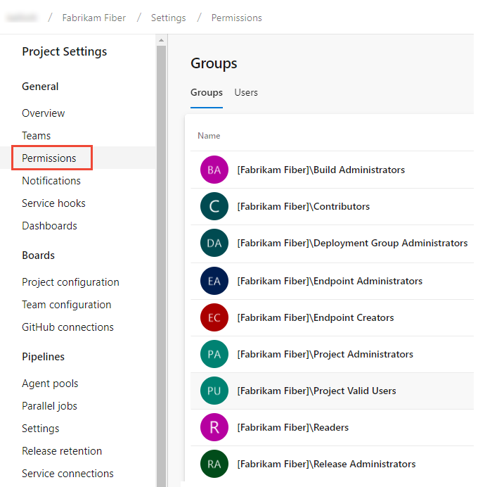
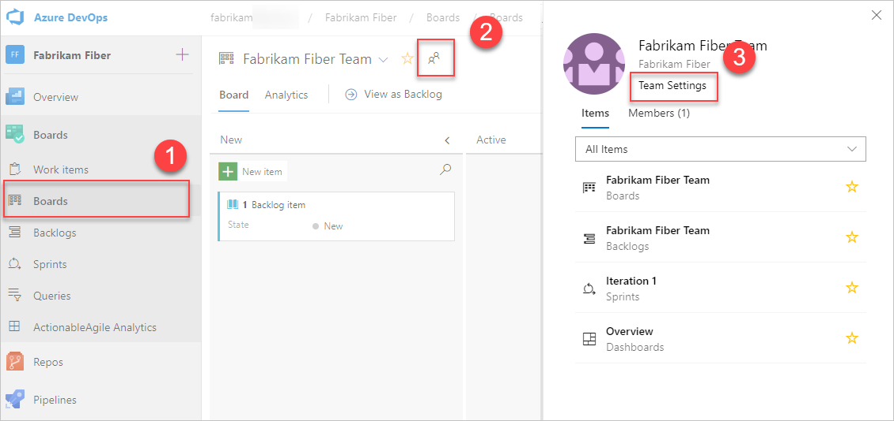

# Add users to a project or team

[!INCLUDE [temp](../../_shared/version-vsts-tfs-all-versions.md)]

In this quickstart, you learn how to add users to a project or specific team. For anyone to access a project, they must be added to one of the default security groups or a custom group. Usually you add them to the Contributors group. For a quick look at what permissions are assigned to the default groups, see [Permissions and access](permissions-access.md).

The easiest way to add a number of users to a project is to add groups defined in [Azure Active Directory (Azure AD) or Active Directory (AD)](setup-ad-aad.md).


::: moniker range="azure-devops"

> [!IMPORTANT]
> If you're adding users to an organization in Azure DevOps and you don't use Azure AD, then you need to [add their "personal" Microsoft accounts to your account or project](../../user-guide/sign-up-invite-teammates.md#invite-others). After you've added them to one project, you can add them to additional projects using the procedures provided in this article.

::: moniker-end

Once users have been added to a project, you can browse for their display name or user name (email alias). Also, you can [add them to a specific team](#add-team-members). To add a team, see [Add a team](../../organizations/settings/add-teams.md).

## Prerequisites

* You must have a project. If you don't have a project yet, [create one](../projects/create-project.md).
* To add users to a project, you must be a member of the [Project Administrators group or have your **Edit project-level information** set to Allow](set-project-collection-level-permissions.md). You can add Stakeholders to the Project Administrators group and then they can add users to an organization or project. 
* To add users to a team, you must be [added as a team administrator](../../organizations/settings/add-team-administrator.md), or you must be a member of the Project Administrators Group, or have your **Edit project-level information** set to Allow.

<a name="add-users-team-project"></a>

## Add users to a project

::: moniker range="azure-devops"  
If you are adding a user to Azure DevOps for the first time, see [Add account users for Azure DevOps](../accounts/add-organization-users.md?toc=/azure/devops/organizations/security/toc.json&bc=/azure/devops/organizations/security/breadcrumb/toc.json).
::: moniker-end


::: moniker range="azure-devops"

> [!NOTE]   
> To enable the new user interface for the Project Permissions Settings Page, see [Enable preview features](../../project/navigation/preview-features.md).


#### [Preview page](#tab/preview-page) 

1. Open the web portal and choose the project where you want to add users or groups. To choose another project, see [Switch project, repository, team](../../project/navigation/go-to-project-repo.md).

2. Choose **Project Settings** and then **Permissions**.

	> [!div class="mx-imgBorder"]  
	> 

1. Under **Groups**, choose one of the following options:
   - **Readers**: To add users who require read-only access to the project, choose .
   - **Contributors**: To add users who contribute fully to this project or who have been granted Stakeholder access.
   - **Project Administrators**: To add users who need to administrate the project. To learn more, see [Set permissions at the project-level or project collection-level](set-project-collection-level-permissions.md).

   Here we choose the **Contributors** group.

	> [!div class="mx-imgBorder"]  
	>  

1. Next, choose the **Members** tab.

   By default, the default team group and any other teams you add to the project, are included as members of the **Contributors** group. Add a new user as a member of a team instead, and the user automatically inherits Contributor permissions. 

    > [!TIP]
    > Managing users is much easier [using groups](../../organizations/security/about-permissions.md), not individual users.

1. Choose **Add** to add a user or a user group.

	> [!div class="mx-imgBorder"]  
	>  

2. Enter the name of the user account into the text box. You can enter several identities into the text box, separated by commas. The system automatically searches for matches. Choose the match(es) that meet your requirements.

	  

   > [!NOTE]
   > The first time you add a user or group to Azure DevOps,
   > you can't browse to it or check the friendly name.
   > After the identity has been added, you can just enter the friendly name.

	Choose **Save** when done. 

3. You may customize user permissions for other functionality in the project. For example, in [areas and iterations](set-permissions-access-work-tracking.md) or [shared queries](../../boards/queries/set-query-permissions.md).

   > [!NOTE]
   > Users that have limited access, such as Stakeholders, won't be able to access select features even if granted permissions to those features. To learn more, see [Permissions and access](permissions-access.md).


#### [Current page](#tab/current-page) 

1. Open the web portal and choose the project where you want to add users or groups. To choose another project, see [Switch project, repository, team](../../project/navigation/go-to-project-repo.md).

2. Choose **Project Settings** and then **Security**.

	*To see the full image, click to expand*.

	[](_img/view-permissions/open-security-project-level-vert-expanded.png#lightbox) 

1. Under **Groups**, choose one of the following options:
   - **Readers**: To add users who require read-only access to the project, choose .
   - **Contributors**: To add users who contribute fully to this project or who have been granted Stakeholder access.
   - **Project Administrators**: To add users who need to administrate the project. To learn more, see [Set permissions at the project-level or project collection-level](set-project-collection-level-permissions.md).

1. Next, choose the **Members** tab.

   Here we choose the **Contributors** group.

	> [!div class="mx-imgBorder"]  
	>   

   By default, the default team group and any other teams you add to the project, are included as members of the **Contributors** group. Add a new user as a member of a team instead, and the user automatically inherits Contributor permissions. 

    > [!TIP]
    > Managing users is much easier [using groups](../../organizations/security/about-permissions.md), not individual users.

1. Choose **Add** to add a user or a user group.

2. Enter the name of the user account into the text box. You can enter several identities into the text box, separated by commas. The system automatically searches for matches. choose the match(es) that meet your requirements.

	  

   > [!NOTE]
   > The first time you add a user or group to Azure DevOps,
   > you can't browse to it or check the friendly name.
   > After the identity has been added, you can just enter the friendly name.

	Choose **Save changes** when complete. 

3. (Optional) You can customize a users permissions for other functionality in the project. For example, in [areas and iterations](set-permissions-access-work-tracking.md) or [shared queries](../../boards/queries/set-query-permissions.md).

   > [!NOTE]
   > Users that have limited access, such as Stakeholders, won't be able to access select features even if granted permissions to those features. To learn more, see [Permissions and access](permissions-access.md).

::: moniker-end


::: moniker range="azure-devops-2019"

1. Open the web portal and choose the project where you want to add users or groups. To choose another project, see [Switch project, repository, team](../../project/navigation/go-to-project-repo.md).

2. Choose **Project Settings** and then **Security**.

	*To see the full image, click to expand*.

	[](_img/view-permissions/open-security-project-level-vert-expanded.png#lightbox) 

1. Under **Groups**, choose one of the following options:
   - **Readers**: To add users who require read-only access to the project, choose .
   - **Contributors**: To add users who contribute fully to this project or who have been granted Stakeholder access.
   - **Project Administrators**: To add users who need to administrate the project. To learn more, see [Set permissions at the project-level or project collection-level](set-project-collection-level-permissions.md).

1. Next, choose the **Members** tab.

   Here we choose the **Contributors** group.

	> [!div class="mx-imgBorder"]  
	>   

   By default, the default team group and any other teams you add to the project, are included as members of the **Contributors** group. Add a new user as a member of a team instead, and the user automatically inherits Contributor permissions. 

    > [!TIP]
    > Managing users is much easier [using groups](../../organizations/security/about-permissions.md), not individual users.

1. Choose **Add** to add a user or a user group.

2. Enter the name of the user account into the text box. You can enter several identities into the text box, separated by commas. The system automatically searches for matches. choose the match(es) that meet your requirements.

	  

   > [!NOTE]
   > The first time you add a user or group to Azure DevOps,
   > you can't browse to it or check the friendly name.
   > After the identity has been added, you can just enter the friendly name.

	Choose **Save changes** when complete. 

3. (Optional) You can customize a users permissions for other functionality in the project. For example, in [areas and iterations](set-permissions-access-work-tracking.md) or [shared queries](../../boards/queries/set-query-permissions.md).

   > [!NOTE]
   > Users that have limited access, such as Stakeholders, won't be able to access select features even if granted permissions to those features. To learn more, see [Permissions and access](permissions-access.md).

::: moniker-end


::: moniker range="<= tfs-2018"

1. Open the web portal and choose the project where you want to add users or groups. To choose another project, see [Switch project, repository, team](../../project/navigation/go-to-project-repo.md).  

1. Choose the  gear icon to open the administrative context.

     

2. Choose **Security** and under **Groups**, choose one of the following options:
   - **Readers**: To add users who require read-only access to the project, choose .
   - **Contributors**: To add users who contribute fully to this project or who have been granted Stakeholder access.
   - **Project Administrators**: To add users who need to administrate the project. To learn more, see [Set permissions at the project-level or project collection-level](set-project-collection-level-permissions.md).

3. Next, choose the **Members** tab.

   Here we choose the Contributors group.

	> [!div class="mx-imgBorder"]  
	>   

    > [!TIP]
    > Managing users is much easier [using groups](../../organizations/security/about-permissions.md), not individual users.

   By default, the default team group and any other teams you add to the project, are included as members of the **Contributors** group. Add a new user as a member of a team instead, and the user automatically inherits Contributor permissions. 

4. Choose **Add** to add a user or a user group.

5. Enter the name of the user account into the text box. You can enter several identities into the text box, separated by commas. The system automatically searches for matches.

	 

   > [!NOTE]
   > The first time you add a user or group to Azure DevOps,
   > you can't browse to it or check the friendly name.
   > After the identity has been added, you can just enter the friendly name.

7. (Optional) You may want to customize user permissions for other functionality within the project, such as [areas and iterations](set-permissions-access-work-tracking.md) or [shared queries](../../boards/queries/set-query-permissions.md).

   > [!NOTE]
   > Users that have limited access, such as Stakeholders, won't be able to access select features even if granted permissions to those features. To learn more, see [Permissions and access](permissions-access.md).

::: moniker-end

<a id="add-team-members"> </a>

## Add users to a team

Several Agile tools, like capacity planning, team alerts, and dashboard widgets are team-scoped. That is, they automatically reference the user accounts added as members of a team to support planning activities or sending alerts. To learn more, see [About teams and Agile tools](../settings/about-teams-and-settings.md).

<a id="add-team-members-team-services" />

::: moniker range=">= azure-devops-2019"

You add team members from **Project Settings>Work>Team configuration**. You can quickly navigate to it from a team work tracking backlog, board, or dashboard. 

1. Open a backlog or board for a team and choose the  team profile icon. Then choose **Team Settings**. 

   Here we open the Board for the Web team and from there the team profile.  

   > [!div class="mx-imgBorder"]  
   >   

1. If you need to switch the team context, use the team selector within the breadcrumbs.  

	> [!div class="mx-imgBorder"]  
	>  

2. Choose **Add**. 

	> [!div class="mx-imgBorder"]  
	>    

3. Enter the sign-in addresses or display name for each account you want to add. Add them one at a time or all at the same time. You can enter several identities into the text box, separated by commas.

	

   > [!TIP]
   > You must enter user and group names one at a time. However, after entering a name, the account is added to the list, and you can enter another name in the Identities text box before choosing to save your changes.

	You may need to choose the  refresh icon to see your updates. 

4. To remove members, return to this page, highlight the user name and choose **Remove**.

	> [!div class="mx-imgBorder"]  
	>    

   > [!NOTE]
   > To remove a team administrator as a team member, you must first remove them as an administrator. 

5. To add an account as a team administrator, choose **Add** located in the Team Profile page. For details, see [Add a team administrator](../../organizations/settings/add-team-administrator.md).
	
::: moniker-end

::: moniker range="<= tfs-2018"

1. From the project admin context, open the **Overview** page, and then choose the team you want to add team members to.   

	 

1. Choose the **Add** to add a user or a user group.

2. Enter the sign-in addresses or display name for each user you want to add. Add them one at a time or all at the same time. You can enter several identities into the text box, separated by commas.

	

   > [!TIP]
   > You must enter user and group names one at a time. However, after entering a name, it is added to the list, and you can enter another name in the Identities text box before choosing to save your changes.

	You may need to choose the  refresh icon to see your updates. 

3. To remove members, return to this page, highlight the user name, and then choose **Remove**.

	

   > [!NOTE]
   > To remove a team administrator as a team member, you must first remove them as an administrator. 

4. To add an account as a team administrator, choose **Add** located in the Team Profile page. For details, see [Add a team administrator](../../organizations/settings/add-team-administrator.md).

::: moniker-end

::: moniker range="<= azure-devops-2019"
## Add users or groups to an access level   

For on-premises deployments, you may need to set the access level for a user or group, particularly if those groups don't belong to the default access level. To learn more, see [Change access levels](change-access-levels.md).

::: moniker-end 

::: moniker range=">= tfs-2018 < azure-devops"
## Add users or groups to SQL Server Reports 

If your on-premises deployment is integrated with SQL Server Reports, you need to manage membership for those products separately from their websites. See [Grant permissions to view or create SQL Server reports in Azure DevOps](../../report/admin/grant-permissions-to-reports.md).

::: moniker-end 


::: moniker range="<= tfs-2017"
## Add users or groups to SharePoint or SQL Server Reports 

If your on-premises deployment is integrated with a SharePoint product or SQL Server Reports, you need to manage membership for those products separately from their websites.

* [Set SharePoint site permissions](../../organizations/security/set-sharepoint-permissions.md)
* [Grant permissions to view or create SQL Server reports in Azure DevOps Server](../../report/admin/grant-permissions-to-reports.md)

::: moniker-end 

::: moniker range="azure-devops"

## List team members

From the Azure DevOps CLI command, you can see details about a team or list the individual members of that team. To first see a list of all teams in your organization, use the [az devops team list](/cli/azure/ext/azure-devops/devops/team#ext-azure-devops-az-devops-team-list) command.

| [List team members](#list-members) | [Show team details](#show-details)

<a id="list-members" /> 

### List team members

You can list the individual members of a team in your organization with the [az devops team list-member](/cli/azure/ext/azure-devops/devops/team#ext-azure-devops-az-devops-team-list-member) command. To get started, see [Get started with Azure DevOps CLI](../../cli/index.md). 

```CLI
az devops team list-member --team
                           [--org]
                           [--project]
                           [--skip]
                           [--top]
```

#### Parameters

- **team**: Required. Name or ID of the team to show.
- **org**: Azure DevOps organization URL. You can configure the default organization using `az devops configure -d organization=ORG_URL`. Required if not configured as default or picked up using `git config`. Example: `--org https://dev.azure.com/MyOrganizationName/`.
- **project**: Name or ID of the project. You can configure the default project using `az devops configure -d project=NAME_OR_ID`. Required if not configured as default or picked up using `git config`.
- **skip**: Optional. Number of members to skip.
- **top**: Optional. Maximum number of members to return.

#### Example

The following command lists the first five members of the team named **FabrikamTeam** and returns the details in table format.  

```CLI 
az devops team list-member --team "Fabrikam Team" --top 5 --output table

ID                                    Name               Email
------------------------------------  -----------------  --------------------------
3b5f0c34-4aec-4bf4-8708-1d36f0dbc468  Maria Antunes 	 fabrikamfiber1@hotmail.com
8c8c7d32-6b1b-47f4-b2e9-30b477b5ab3d  Dmytro Melnik	 fabrikamfiber3@hotmail.com
d291b0c4-a05c-4ea6-8df1-4b41d5f39eff  Sarah Ferreira	 fabrikamfiber4@hotmail.com
bd30c189-db0f-4dd6-9418-5d8b41dc1754  Maksims Perkons	 fabrikamfiber5@hotmail.com
35b1952b-ca8c-45b5-a60c-d6b0086aa584  Hugo Karklins	 contoso@contoso.com
``` 

<a id="show-details" /> 

### Show team details

You can view details about a team in your organization with the [az devops team show](/cli/azure/ext/azure-devops/devops/team#ext-azure-devops-az-devops-team-show) command. To get started, see [Get started with Azure DevOps CLI](../../cli/index.md).

```CLI
az devops team show --team
                    [--org]
                    [--project]
```

#### Parameters

- **team**: Required. Name or ID of the team to show.
- **org**: Azure DevOps organization URL. You can configure the default organization using `az devops configure -d organization=ORG_URL`. Required if not configured as default or picked up using `git config`. Example: `--org https://dev.azure.com/MyOrganizationName/`.
- **project**: Name or ID of the project. You can configure the default project using `az devops configure -d project=NAME_OR_ID`. Required if not configured as default or picked up using `git config`.

#### Example

The following command shows information about the team in your organization named **Fabrikam Team** and returns the details in table format.  

```CLI
az devops team show --team "Fabrikam Team" --output table

ID                                    Name          Description
------------------------------------  ------------  -------------------------------------------------
a48cb46f-7366-4f4b-baf5-b3632398ed1e  Fabrikam Team  The default project team. Was Fabrikam Fiber Team
``` 

::: moniker-end 

[!INCLUDE [temp](../../_shared/note-cli-not-supported.md)] 

## Next steps

> [!div class="nextstepaction"]
> [Add administrators or set permissions at the project or collection level](set-project-collection-level-permissions.md) 


## Related articles


* To view permissions for yourself or another user, see [View permissions](view-permissions.md).
* [Set Git or TFVC repository permissions](set-git-tfvc-repository-permissions.md)
* [Set Git branch permissions](../../repos/git/branch-permissions.md)
* [Set build and release permissions](../../pipelines/policies/set-permissions.md)
* [Set permissions and access for work tracking](set-permissions-access-work-tracking.md)

