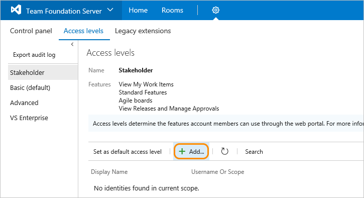

# Change access levels

[!INCLUDE [temp](../../_shared/version-vsts-tfs-all-versions.md)]

> [!IMPORTANT]
> This topic applies to managing access levels for projects defined on an on-premises Team Foundation Server (TFS). To manage access levels for Azure DevOps, see [Manage users and access in Azure DevOps](../accounts/add-organization-users.md). For Azure DevOps feature availability, see the [Azure DevOps Feature Matrix](https://visualstudio.microsoft.com/pricing/visual-studio-online-feature-matrix-vs).

To connect and use the functions and features that TFS provides, [users must be added to a group with the appropriate permissions](add-users-team-project.md). To use select web portal features, they must also belong to the access level that enables access to that feature. For a description and usage information for each access level, see [Access levels](access-levels.md).

For a simplified overview of the permissions assigned to the most common groups&#151;Readers, Contributors, and Project Administrators&#151;as well as the Stakeholder access group, see [Permissions and access](permissions-access.md).  

>[!IMPORTANT]  
>Even if you set a user or group's access level, you must add them to a project collection or project for them to connect to TFS and access features available through a supported client or the web portal. 

Make sure to set each user's access level based on what you've purchased for that user. Basic access includes all Stakeholder features. Advanced and Visual Enterprise access levels include all Basic features. In the images provided below, the circled features indicate the features made available from the previous access level.

<a id="manage-access" >  </a>

## Open the administrative context, Access levels

You manage access levels for all collections defined on the application tier for TFS. The default access level you set applies to all projects defined for all collections. Users or groups that you add to teams, projects, or collections are granted the access level that you set as the default. To change the access level for a specific group or user, you add them specifically to one of the other, non-default access levels.

>[!NOTE]  
>The images you see from your web portal may differ from the images you see in this topic. These differences result from updates made to your on-premises TFS. However, the basic functionality available to you remains the same unless explicitly mentioned.  

From a user context, open admin settings by choosing the  gear icon. The tabs and pages available differ depending on which settings level you access.
 
::: moniker range=">= tfs-2017 <= tfs-2018"

1. From the web portal home page for a project (for example, ```http://MyServer:8080/tfs/DefaultCollection/MyProject/```), open **Server settings**. 

	  

0. From **Access levels**, select the access level you want to manage. For example, here we choose **Stakeholder**, and then **Add** to add a group to Stakeholder access. 

	

	If you don't see **Access levels**, you aren't a TFS administrator and don't have permission. [Here's how to get permissions](/tfs/server/admin/add-administrator-tfs). 

::: moniker-end

::: moniker range=">= tfs-2013 <= tfs-2015"

1. From the web portal home page for a project (for example, ```http://MyServer:8080/tfs/DefaultCollection/MyProject/```), open administration settings. 

	

2. From the Access levels page, select the access level you want to manage. For example, here we add a group to Stakeholder access.</p>  

	

	If you don't see **Access levels**, you aren't a TFS administrator and don't have permission. [Here's how to get permissions](/tfs/server/admin/add-administrator-tfs). 

::: moniker-end

<a id="set-default" >  </a>

## Change the default access level

Change the default access level to match the access you have licenses for. If you change the default access level to Stakeholder, all users not explicitly added to the Basic or Advanced level will be limited to the features provided through Stakeholder access.

>[!IMPORTANT]  
>Service accounts are added to the default access level. If you set Stakeholder as the default access level, you must add the TFS service accounts to the Basic or Advanced group.    

You set an access level from its page. Choose **Set as default access level** as shown.

  


<a id="add-user" >  </a>

## Set the access level for a user or group

If you're managing access for a large group of users, a best practice is to first create either a [Windows group or TFS group](/tfs/server/admin/setup-ad-groups) and add individuals to those groups.

<a id="guide-features-access" >  </a>

## Guide to features and access levels

You can learn more about each of the features you have access to from the following topics. Basic  includes all features supported by Stakeholder, and Advanced includes access to all features supported by Basic.

### Stakeholder access
With Stakeholder access, users can create and modify all work items, and can create and save queries on all work items under their My Queries folder. (This is a change from Limited access in which users could create and modify only those work items that they created and query and view work items they created.) Also, stakeholders can create and modify work items using Team Foundation clients such as Visual Studio Community, Microsoft Excel, Microsoft Project, and Microsoft Feedback Client.

To learn more, see [About access levels](access-levels.md).

- View My [Work items](../../boards/backlogs/add-work-items.md)
- Standard features: [Dashboards](../../report/dashboards.md) & [Queries](../../boards/queries/using-queries.md)<sup> 1</sup>
- Agile boards: [Backlogs](../../boards/backlogs/create-your-backlog.md), [Kanban](../../boards/boards/kanban-basics.md) & [Task](../../boards/sprints/task-board.md) <sup> 2</sup>
- [View releases and manage approvals](../../pipelines/release/index.md)<sup> 3</sup> 

**Notes:**
1. Standard features include access to **Dashboards** or **Home** and **Work**.
2. Includes all backlogs and boards, including product, portfolio, and sprint backlogs and Kanban and sprint task boards. Can add work items to backlogs, which appear at the bottom of the list. Can't reorder items on the page or use some other features. See [Stakeholder access](../../organizations/security/get-started-stakeholder.md) for details.
3. Requires TFS 2015.2 or later version.   

### Basic access
Basic access allows users to access **Code**, **Build**, and **Test**  in addition to **Dashboards/Home** and **Work**.
- [Basic & Advanced backlog and sprint planning tools](../../boards/sprints/assign-work-sprint.md)  
- [Request and manage feedback](../../project/feedback/get-feedback.md)<sup> 1</sup>  
- [Chart viewing & Chart authoring](../../report/charts.md)  
- **Code**: [Git](../../repos/git/overview.md) and [TFVC](../../repos/tfvc/overview.md)  
- [Build](../../pipelines/overview.md)  
- [Administer account](#administer-account)<sup> 2</sup>
- [Advanced home page](../../project/wiki/project-vision-status.md)<sup> 3</sup>
- [Author release pipelines](../../pipelines/release/index.md)<sup> 4</sup>
- [Advanced portfolio management](../../boards/backlogs/define-features-epics.md) 
- [Team rooms](../../notifications/collaborate-in-a-team-room.md)
- [Analyze test results and manage machine groups](../../test/test-different-configurations.md) 

**Notes:**

1.	Requires TFS 2015.1 or later version.
2.	You can open Team settings, Project settings, and Collection level settings to view and modify settings provided you are a team, project, or project collection administrator. See [Administer account features](#administer-account).
3.	Advanced home page allows you to configure and view the Project summary page in addition to team dashboards.  
4.	Requires TFS 2015.2 or later version.    

Within the admin context, there are several pages which support administrating features at the team, project, project collection/organization level. To learn more, see [About user, team, project, and organization-level settings](../settings/about-settings.md).


::: moniker range=">= tfs-2013  <= tfs-2017"  
###Advanced access (TFS 2017, TFS 2015, TFS 2013)

- [Web-based test case management](../../test/create-a-test-plan.md)  
	Users assigned Advanced access can manage test cases when you have [purchased Test Manager extensions and assigned to the user accounts](access-levels.md#test-manager) to gain full access to web-based Test case management tools.

::: moniker-end  
::: moniker range=">= tfs-2017  <= tfs-2018"  
###VS Enterprise (TFS 2017.2, TFS 2018)
- Microsoft published TFS Extensions  
	With VS Enterprise access, users have access to any fee-based, Marketplace extension published by Microsoft Marketplace extension published by Microsoft that is included for active Visual Studio Enterprise subscribers. Examples include [Azure Artifacts](https://marketplace.visualstudio.com/items?itemName=ms.feed) (which is also free for 5 users who are not Visual Studio Enterprise subscribers) and [Test Manager](https://marketplace.visualstudio.com/items?itemName=ms.vss-testmanager-web). 
::: moniker-end  

<a id="administer-account" >  </a>


## Related articles

<a id="test-manager"  >  </a>

- [About access levels](access-levels.md)
- [Export a list of users and their access levels](export-users-audit-log.md)
- [Default permissions and access](permissions-access.md)  
- [Web portal navigation](../../project/navigation/index.md)  

