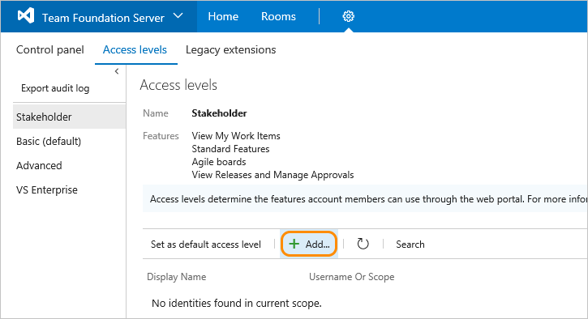

# Change access levels

[!INCLUDE [temp](../../_shared/version-vsts-tfs-all-versions.md)]


::: moniker range="vsts"
> [!IMPORTANT]
> This topic applies to managing access levels for projects defined on an on-premises Team Foundation Server (TFS). To manage access levels for Azure DevOps, see [Manage users and access in Azure DevOps](../accounts/add-organization-users.md). For Azure DevOps feature availability, see the [Azure DevOps Feature Matrix](https://visualstudio.microsoft.com/pricing/visual-studio-online-feature-matrix-vs).

::: moniker-end

::: moniker range="<= tfs-2018" 
To connect and use the functions and features that TFS provides, [users must be added to a group with the appropriate permissions](add-users-team-project.md). To use select web portal features, they must also belong to the access level that enables access to that feature. For a description and usage information for each access level, see [Access levels](access-levels.md).

For a simplified overview of the permissions assigned to the most common groups&#151;Readers, Contributors, and Project Administrators&#151;as well as the Stakeholder access group, see [Permissions and access](permissions-access.md).  For feature availability, see the [Azure DevOps Feature Matrix](https://visualstudio.microsoft.com/pricing/visual-studio-online-feature-matrix-vs). 

> [!IMPORTANT]  
> Even if you set a user or group's access level, you must add them to a project collection or project for them to connect to TFS and access features available through a supported client or the web portal. 

Make sure to set each user's access level based on what you've purchased for that user. Basic access includes all Stakeholder features. Advanced and Visual Enterprise access levels include all Basic features. In the images provided below, the circled features indicate the features made available from the previous access level.

<a id="manage-access" >  </a>

## Prerequisites
 
* You must be a member of the Team Foundation Administrators group. If you aren't a member, get added now. See [Add administrators to TFS](/tfs/server/admin/add-administrator-tfs).
* <a id="add-user" />If you're managing access for a large group of users, a best practice is to first create either a [Windows group, a group in Active Directory, or TFS group](/tfs/server/admin/setup-ad-groups) and add individuals to those groups.

## Open the administrative context, Access levels

You manage access levels for all collections defined on the application tier for TFS. The default access level you set applies to all projects defined for all collections. Users or groups that you add to teams, projects, or collections are granted the access level that you set as the default. To change the access level for a specific group or user, you add them specifically to one of the other, non-default access levels.

>[!NOTE]  
>The images you see from your web portal may differ from the images you see in this topic. These differences result from updates made to your on-premises TFS. However, the basic functionality available to you remains the same unless explicitly mentioned.  

From a user context, open admin settings by choosing the  gear icon. The tabs and pages available differ depending on which settings level you access.
 
::: moniker-end

::: moniker range=">= tfs-2017 <= tfs-2018"

1. From the web portal home page for a project (for example, ```http://MyServer:8080/tfs/DefaultCollection/MyProject/```), open **Server settings**. 

	  

0. From **Access levels**, select the access level you want to manage. For example, here we choose **Stakeholder**, and then **Add** to add a group to Stakeholder access. 

	

	If you don't see **Access levels**, you aren't a TFS administrator and don't have permission. [Here's how to get permissions](/tfs/server/admin/add-administrator-tfs). 

::: moniker-end

::: moniker range=">= tfs-2013 <= tfs-2015"

1. From the web portal home page for a project (for example, ```http://MyServer:8080/tfs/DefaultCollection/MyProject/```), open administration settings. 

	

2. From the Access levels page, select the access level you want to manage. For example, here we add a group to Stakeholder access.</p>  

	

	If you don't see **Access levels**, you aren't a TFS administrator and don't have permission. [Here's how to get permissions](/tfs/server/admin/add-administrator-tfs). 

::: moniker-end

<a id="set-default" >  </a>

::: moniker range="<= tfs-2018"
## Change the default access level

Change the default access level to match the access you have licenses for. If you change the default access level to Stakeholder, all users not explicitly added to the Basic or Advanced level will be limited to the features provided through Stakeholder access.

>[!IMPORTANT]  
>Service accounts are added to the default access level. If you set Stakeholder as the default access level, you must add the TFS service accounts to the Basic or Advanced group.   
You set an access level from its page. Choose **Set as default access level** as shown.

  


<a id="guide-features-access" >  </a>

## Guide to features and access levels

For details on the features available to each access level, see [About access levels](access-levels.md). 


## Related articles

- [About access levels](access-levels.md)
- [Export a list of users and their access levels](export-users-audit-log.md)
- [Default permissions and access](permissions-access.md)  
- [Web portal navigation](../../project/navigation/index.md)  

::: moniker-end
