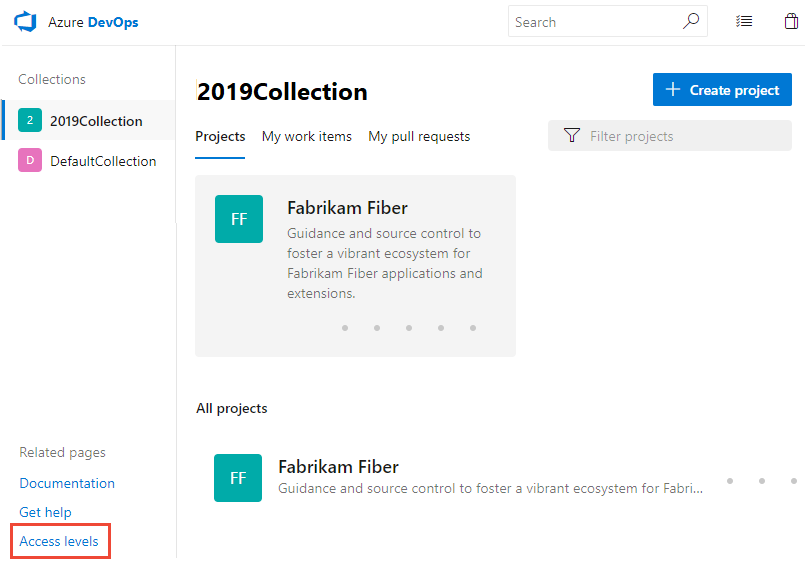
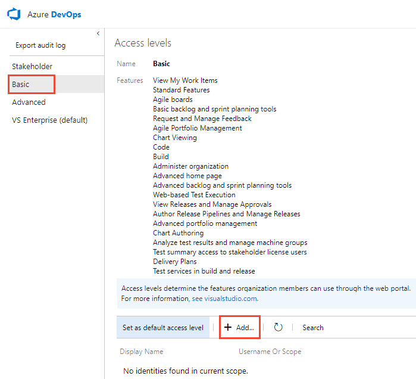
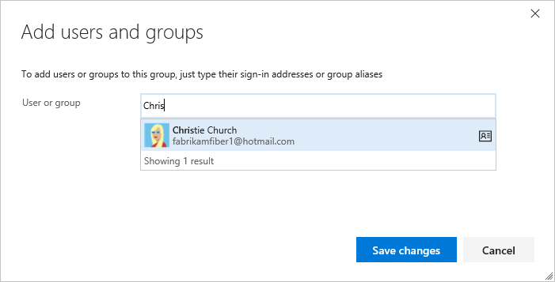
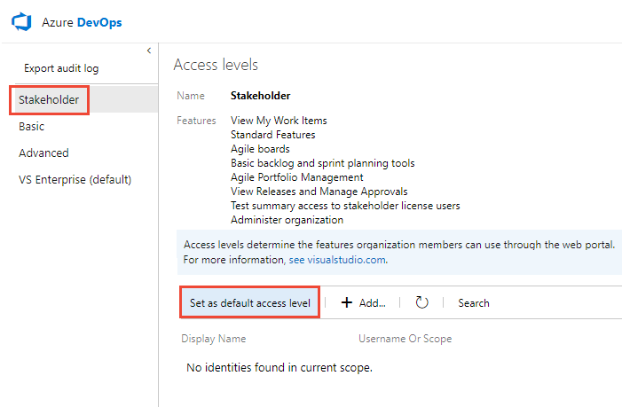

# Change access levels

[!INCLUDE [temp](../../_shared/version-tfs-all-versions.md)]

Users must be added to a group with the appropriate permissions, to connect and use the functions and features that Azure DevOps Server provides. To use select web portal features, they must also belong to the access level that enables access to that feature. For an overview of each access level, see [About access levels](access-levels.md).

This article applies to managing access levels for project collections defined on an on-premises Azure DevOps. To manage access levels for the Azure DevOps cloud service, see [Add users to your organization or project](../accounts/add-organization-users.md). For Azure DevOps feature availability, see the [Azure DevOps Feature Matrix](https://visualstudio.microsoft.com/pricing/visual-studio-online-feature-matrix-vs).

> [!IMPORTANT]  
> Make sure that you select the correct version of this article for Azure DevOps Services or Azure DevOps Server, renamed from Team Foundation Server (TFS). The version selector is located above the table of contents. <br/>
> 

For a simplified overview of the permissions that are assigned to the most common groups&#151;Readers, Contributors, and Project Administrators&#151;and the Stakeholder access group, see [Permissions and access](permissions-access.md).  

::: moniker range="<= azure-devops-2019"

> [!NOTE]  
> Even if you set a user or group's access level, you must [add them to a project](add-users-team-project.md) for them to connect to a project and access features available through a supported client or the web portal.

Make sure to set each user's access level based on what you've purchased for that user. Basic access includes all Stakeholder features. Advanced and Visual Studio Enterprise subscriber access levels include all Basic features. In the images provided below, the circled features indicate the features made available from the previous access level.

<a id="manage-access" >  </a>

## Prerequisites

* You must be a member of the Administrators group. If you aren't a member, [get added now](https://docs.microsoft.com/en-us/azure/devops/server/admin/add-administrator?view=azure-devops).
* <a id="add-user" />If you're managing access for a large group of users, it's a best practice to first create either a [Windows group, a group in Active Directory, or Azure DevOps group](/azure/devops/server/admin/setup-ad-groups), and then add individuals to those groups.

> [!NOTE]  
> The images you see from your web portal may differ from the images you see in this article. These differences result from updates made to your on-premises Azure DevOps. Make sure you have selected the version of this article using the content version selector. However, the basic functionality available to you remains the same unless explicitly mentioned.  

::: moniker-end

::: moniker range="<= azure-devops-2019"

## Open Access levels

You manage access levels for the collections defined on the application tier. The default access level you set applies to all projects defined for all collections. Users or groups that you add to teams, projects, or collections are granted the access level that you set as the default. To change the access level for a specific group or user, add them specifically to a non-default access level.
::: moniker-end

::: moniker range="azure-devops-2019"

1. From the web portal home page for a project collection (for example, ```http://MyServer:8080/tfs/DefaultCollection/```), open **Access levels**. If you are at a project level, choose the  Azure DevOps logo and then choose **Access levels**.

	> [!div class="mx-imgBorder"]  
	> 

	If you don't see **Access levels**, you aren't an administrator and don't have permission. [Here's how to get permissions](/azure/devops/server/admin/add-administrator-tfs).

0. Select the access level you want to manage.

	For example, here we choose **Basic**, and then **Add** to add a group to Basic access.
 
	> [!div class="mx-imgBorder"]  
	> 

0. Enter the name of the user or group into the text box. You can enter several identities into the text box, separated by commas. The system automatically searches for matches. Choose the matches that meet your choice.
	> [!div class="mx-imgBorder"]  
	>   
0. Choose **Save changes**. 

::: moniker-end

::: moniker range=">= tfs-2017 <= tfs-2018"

From a user context, open **Server Settings** by choosing the  gear icon. The tabs and pages available differ depending on which settings level you access.

0. From the web portal home page for a project (for example, ```http://MyServer:8080/tfs/DefaultCollection/MyProject/```), open **Server settings**.

	  

0. From **Access levels**, select the access level you want to manage. For example, here we choose **Stakeholder**, and then **Add** to add a group to Stakeholder access.

	

	If you don't see **Access levels**, you aren't a TFS administrator and don't have permission. [Here's how to get permissions](/azure/devops/server/admin/add-administrator-tfs).

1. Enter the name of the user or group into the text box. You can enter several identities into the text box, separated by commas. The system automatically searches for matches. Choose the matches that meet your choice.

	> [!div class="mx-imgBorder"]  
	>   
0. Choose **Save changes**.

::: moniker-end

::: moniker range=">= tfs-2013 <= tfs-2015"

0. From the web portal home page for a project (for example, ```http://MyServer:8080/tfs/DefaultCollection/MyProject/```), open administration settings.

	

0. From the Access levels page, select the access level you want to manage. For example, here we add a group to Stakeholder access.

	

	If you don't see **Access levels**, you aren't an administrator and don't have permission. Learn more about [how to get permissions](/azure/devops/server/admin/add-administrator-tfs).

::: moniker-end

<a id="set-default" >  </a>

::: moniker range="<= azure-devops-2019"
## Change the default access level

Change the default access level to match the access you have licenses for. If you change the default access level to Stakeholder, all users not explicitly added to the Basic or an advanced level are limited to the features provided through Stakeholder access.

You set an access level from its page. Choose **Set as default access level** as shown.
::: moniker-end

::: moniker range="azure-devops-2019"
> [!div class="mx-imgBorder"]  
> 
::: moniker-end

::: moniker range="<= tfs-2018"
  
::: moniker-end

::: moniker range="<= azure-devops-2019"
> [!IMPORTANT]  
> Service accounts are added to the default access level. If you set Stakeholder as the default access level, you must add the Azure DevOps service accounts to the Basic or an advanced access level  group.
::: moniker-end

<a id="guide-features-access" >  </a>

## Guide to features and access levels

For details on the features available to each access level, see [About access levels](access-levels.md).

## Related articles

- [About access levels](access-levels.md)
- [Export a list of users and their access levels](export-users-audit-log.md)
- [Default permissions and access](permissions-access.md)  
- [Web portal navigation](../../project/navigation/index.md)  

