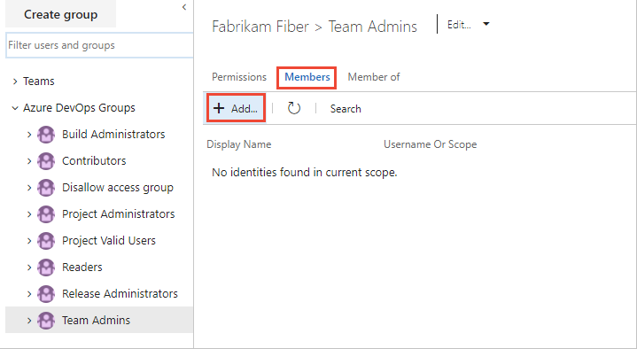

# Change individual or group permissions

[!INCLUDE [temp](../../_shared/version-vsts-tfs-all-versions.md)]

The standard way to set permissions is by adding them to one or more built-in security groups. However, sometimes you may want to grant additional permissions to select users, where not all permissions are assigned to the security group. For example, if you want to give some users the ability to add or edit area and iteration paths, but don't want them to have all permissions available to members of the Project Administrators group.

You can change individual permissions in one of the following three ways:

- Create a custom Azure DevOps security group, define permissions for that group, add the user account to the group
- For object-level permissions: Add the user account and set permissions
- For project or collection-level permissions: Search for the user account and selectively change their permission assignments

In this article you learn how to do the following tasks:
> [!div class="checklist"]
> * Create a custom security group 
> * Set permissions for a custom security group 
> * Add members to a custom security group 
> * Change the permission assignments for an individual user 

If you're new to managing permissions and groups, review [About permissions and groups](about-permissions.md) to learn about permission states and inheritance.

[!INCLUDE [temp](../../_shared/image-differences.md)]

<a id="create-custom-group" />

## Create a custom security group

Create a custom security group at the project-level or the collection-level. The method for creating a custom security group is the same, no matter at what level you add it. 

To create a project-level security group, open the web portal and choose the project where you want to add users or groups. 

::: moniker range=">= azure-devops-2019"

1. Choose **Project Settings** > **Security**.

    *To see the full image, click to expand*.

      

2. Choose **Create group** to open the dialog for adding a group.

    > [!div class="mx-imgBorder"]
    > " 

3. Enter a name for the group, and optionally a description.

    For example, here we define a Team Admins group.

    

4. Choose **Create group**.
::: moniker-end

::: moniker range="<= tfs-2018"

1. Open **Project Settings**. Choose the  gear settings icon, and choose **Security**. 

    > [!div class="mx-imgBorder"]
    > 

2. Choose **Create group** to open the dialog for adding a group.

    > [!div class="mx-imgBorder"]
    > " 

3. Enter a name for the group, and optionally a description.

    For example, here we define a Team Admins group.

    

4. Choose **Create group**.

::: moniker-end

<a id="set-permissions-custom-group" />

## Set permissions for a custom security group

1. To set permissions for the custom group you  created, choose the group name and then set one or more permissions.

    > [!div class="mx-imgBorder"]
    >   

    For a description of each permission, see [Permissions and groups reference, project-level permissions](permissions.md#project-level-permissions).

2. Choose **Save changes**.

<a id="add-members-custom-group" />

## Add members to a custom security group

You add members to a custom security group in the same way you add users to a built-in group. 

1. Choose the security group, choose **Members**, and then choose **Add**.

    > [!div class="mx-imgBorder"]
    >   

1. Enter the user identity into the text box. You can enter several identities into the text box, separated by commas. The system automatically searches for matches. Choose the match(es) that meets your choice.

     

    > [!NOTE]
    > Users that have limited access, such as Stakeholders, won't be able to access select features even if granted permissions to those features. To learn more, see [Permissions and access](permissions-access.md).

## Change individual permission at the project-level

1. From the project-level **Security** page, enter the user identity in the **Filter users and groups** box. Then, select the account whose permissions you want to change.

    > [!div class="mx-imgBorder"]
    >   

2. Change the permission, setting a permission as **Allow** or **Deny**.

      

    For a description of each permission, see [Permissions and groups reference, project-level permissions](permissions.md#project-level-permissions).

3. Choose **Save changes**.

### Change individual permission at the collection-level

1. Open the user-level or collection-level **Security** admin page and follow the instructions provided in the previous section for project-level permissions.

    For a description of each collection-level permission, see [Permissions and groups reference, collection-level permissions](permissions.md#collection-level).

### Change individual permission at an object-level

From the web portal, open the Security dialog for the object whose permissions you want to set. For specific instructions, see the following articles:

<table width="80%">
<tbody valign="top">
<tr>
<th width="35%">Area</th>
<th width="65%">Task</th>
</tr>
<tr>
<td>Wiki &amp; Dashboard permissions</td>
<td>
<ul>
<li><a href="../../project/wiki/manage-readme-wiki-permissions.md" data-raw-source="[README &amp; Wiki](../../project/wiki/manage-readme-wiki-permissions.md)">README &amp; Wiki</a></li>
<li><a href="../../report/dashboards/dashboard-permissions.md" data-raw-source="[Dashboards](../../report/dashboards/dashboard-permissions.md)">Dashboards</a></li>
</ul>
</td>
</tr>
<tr>
<td>DevOps (code, build, test, release) permissions </td>
<td>
<ul>
<li><a href="../../repos/git/branch-permissions.md" data-raw-source="[Git branch](../../repos/git/branch-permissions.md)">Git branch</a></li>
<li><a href="set-git-tfvc-repository-permissions.md" data-raw-source="[Git repository](set-git-tfvc-repository-permissions.md)">Git repository</a></li>
<li><a href="set-git-tfvc-repository-permissions.md" data-raw-source="[TFVC](set-git-tfvc-repository-permissions.md)">TFVC</a></li>
<li><a href="../../pipelines/policies/set-permissions.md" data-raw-source="[Builds](../../pipelines/policies/set-permissions.md)">Builds</a></li>
<li><a href="../../pipelines/policies/set-permissions.md" data-raw-source="[Release pipeline security](../../pipelines/policies/set-permissions.md)">Release pipeline security</a></li>
<li><a href="../../pipelines/release/approvals/index.md" data-raw-source="[Approvals and approvers](../../pipelines/release/approvals/index.md)">Approvals and approvers</a></li> 
</ul>
</td>
</tr>
<tr>
<td>Work tracking permissions</td>
<td>
<ul>
<li><a href="../../organizations/security/set-permissions-access-work-tracking.md" data-raw-source="[Area and iteration paths](../../organizations/security/set-permissions-access-work-tracking.md)">Area and iteration paths</a></li>
<li><a href="../../boards/queries/set-query-permissions.md" data-raw-source="[Work item query and folder](../../boards/queries/set-query-permissions.md)">Work item query and folder</a></li>
<li><a href="set-permissions-access-work-tracking.md#plan-permissions" data-raw-source="[Plan permissions](set-permissions-access-work-tracking.md#plan-permissions)">Plan permissions</a></li> </ul>
</td>
</tr>
</tbody>
</table>

1. From the Security dialog, choose **Add**. 

    

2. Enter the user ID, choose search, and then make your selection in the left pane.

3. Update the permission setting to **Allow** or **Deny** for specific permissions. 

    

    For a description of specific permissions, see [Permissions and groups reference](permissions.md).

4. Choose **Save changes**.

## Next steps

> [!div class="nextstepaction"]
> [Grant or restrict access to select features](restrict-access.md)

## Related articles

- [Permissions lookup guide](permissions-lookup-guide.md)
- [About permissions and groups](about-permissions.md)
- [Permissions and groups reference](permissions.md)
- [Set permissions at the project-level or project collection-level](set-project-collection-level-permissions.md)

