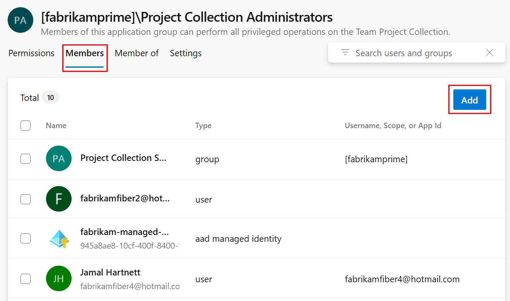

---
title: Change project-level permissions or group membership
titleSuffix: Azure DevOps
description: Quickstart guide to change project-level permissions or group membership in Azure DevOps
ms.subservice: azure-devops-security
ms.custom: security-refresh
ms.author: chcomley
author: chcomley
ms.topic: quickstart
monikerRange: '<= azure-devops'
ms.date: 05/21/2024
--- 


# Change project-level permissions 

[!INCLUDE [version-lt-eq-azure-devops](../../includes/version-lt-eq-azure-devops.md)]

Many permissions get set at the project level. You can grant these permissions by adding a user or group to the **Project Administrators** group. Or, you can grant specific project-level permissions to a custom security group or to a user. 

Consider adding users to the **Project Administrators** group when they're tasked with adding or managing teams, area and iteration paths, repositories, service hooks, and service end points.

## Project-level permissions 

[!INCLUDE [project-level-permissions](./includes/project-level-permissions.md)]

> [!NOTE]
> The permission to add or remove project-level security groups and add and manage project-level group membership is assigned to all members of the **Project Administrators** group. It isn't controlled by a permissions surfaced within the user interface. 

### Create tag definition permission

By default, members of the **Contributors** group are assigned the **Create tag definition** permission. Although the **Create tag definition** permission appears in the security settings at the project-level, tagging permissions are actually collection-level permissions that are scoped at the project level when they appear in the user interface. To scope tagging permissions to a single project when using a command-line tool, you must provide the GUID for the project as part of the command syntax. Otherwise, your change applies to the entire collection. For more information, see [Security groups, service accounts, and permissions, Work item tags](permissions.md#work-item-tags). 

## Prerequisites

|Category  | Requirements |
|-------------|-------------|
| **Permissions** | Member of the [**Project Administrators** security group](look-up-project-administrators.md). If you created the organization or collection, you're automatically a member of this group. |
| **Directory services** | [Security groups defined in Microsoft Entra ID or Active Directory](add-ad-aad-built-in-security-groups.md) before adding them to Azure DevOps. |

> [!NOTE]   
> Users granted **Stakeholder** access can't access select features even if granted permissions to those features. For more information, see [Stakeholder access quick reference](stakeholder-access.md).
 
<a id="add-user-group"></a>

## Add members to the Project Administrators group 

You can add users who are associated with a project, organization, or collection to the Project Administrators group. This group has specific permissions at the organizations or collection level. To add a custom security group, first create the group as described in [Add or remove users or groups, manage security groups](add-remove-manage-user-group-security-group.md).

Here we show how to add a user to the built-in **Project Administrators** group. The method is similar to adding a Microsoft Entra ID or Active Directory group. 

::: moniker range="azure-devops"

> [!NOTE]   
> To enable the **Project Permissions Settings Page** preview page, see [Enable preview features](../../project/navigation/preview-features.md).

#### [Preview page](#tab/preview-page) 

1. Sign in to your organization (```https://dev.azure.com/{yourorganization}```).

2. Select **Project settings** > **Permissions**.

    

3. Select **Project Administrators** group > **Members** > **Add**.  

    > [!div class="mx-imgBorder"]  
    >  

4. Enter the name of the user account or custom security group into the text box. You can enter several identities recognized by the system into the **Add users and/or groups** box. The system automatically searches for matches. Choose one or more matches. 

    > [!div class="mx-imgBorder"]  
    >   

5. Select **Save**. 

#### [Current page](#tab/current-page) 

1. Sign in to your organization (```https://dev.azure.com/{yourorganization}```).

2. Select **Project settings** > **Security**.

    [](media/view-permissions/open-security-project-level-vert-expanded.png#lightbox) 

3. Select **Project Administrators** group > **Members** > **Add**.  

    > [!div class="mx-imgBorder"]  
    >  

4. Enter the name of the user account into the text box. You can enter several identities into the text box, separated by commas. The system automatically searches for matches. Choose one or more matches. 

    > [!div class="mx-imgBorder"]  
    >   

5. Select **Save changes** > :::image type="icon" source="../../media/icons/refresh.png" border="false"::: refresh icon, and then view the additions.  

* * *

::: moniker-end 

::: moniker range=">= azure-devops-2019 < azure-devops"

1. Sign in to your organization (```https://dev.azure.com/{yourorganization}```).

2. Select **Project settings** > **Security**.

    [](media/view-permissions/open-security-project-level-vert-expanded.png#lightbox) 

3. Select **Project Administrators** group > **Members** > **Add**.  

    > [!div class="mx-imgBorder"]  
    >  

4. Enter the name of the user account into the text box. You can enter several identities into the text box, separated by commas. The system automatically searches for matches. Choose one or more matches. 

    > [!div class="mx-imgBorder"]  
    >   

    > [!NOTE]   
    > Users with limited access, such as Stakeholders, can't access select features even if granted permissions to those features. For more information, see [Permissions and access](permissions-access.md).

5. Select **Save changes**. Choose the :::image type="icon" source="../../media/icons/refresh.png" border="false"::: refresh icon,  and then view the additions.  

::: moniker-end 

## Change permissions for a group 

You can modify project-level permissions for any group associated with a project, except for the **Project Administrators** group. Also, each team that is added to a project is automatically included as a project-level group. To add security groups to a project, see [Add or remove users or groups, manage security groups](add-remove-manage-user-group-security-group.md). To understand permission assignments and inheritance, see [About permissions, Permission states](about-permissions.md#permission-states).
    
::: moniker range="azure-devops"

> [!NOTE]   
> To enable the **Project Permissions Settings Page** preview page, see [Enable preview features](../../project/navigation/preview-features.md).

#### [Preview page](#tab/preview-page) 

1. Open the **Permissions** page as described in the previous section, [Add a user or group to the Project Administrators group](#add-user-group). 

	> [!NOTE]   
	> You can't change the permission settings for the Project Administrators group. This is by design.  

2. From the **Permissions** page, choose the group whose permissions you want to change. 

    For example, we choose the **Contributors** group and change their permissions for **Delete and restore work items** to **Allow**.  

    > [!div class="mx-imgBorder"]  
    >   

    Your changes are automatically saved. 

    > [!TIP]   
    > If you add a user to the **Contributors** group, they can add and modify work items. You can restrict permissions of users or user groups to add and modify work items based on the **Area Path**. For more information, see [Modify work items under an area path](set-permissions-access-work-tracking.md#set-permissions-area-path).
 
#### [Current page](#tab/current-page) 

1. Open the **Security** page as described in the previous section, [Add a user or group to the Project Administrators group](#add-user-group). 

1. From the **Security** page, choose the group whose permissions you want to change. 

    For example, we grant permission to the **Contributors** group to **Delete and restore work items**.  

    > [!div class="mx-imgBorder"]  
    >   

2. Select **Save changes**.   

* * *

::: moniker-end

::: moniker range="< azure-devops"

1. From the **Security** page, choose the group whose permissions you want to change. 

    For example, we grant permission to the Contributors group to delete and restore work items.  

    > [!div class="mx-imgBorder"]  
    >   

    > [!TIP]   
    > If you add a user to the Contributors group, they can add and modify work items. You can restrict permissions of users or user groups to add and modify work items based on the area path. For more information, see [Modify work items under an area path](set-permissions-access-work-tracking.md#set-permissions-area-path).

    For a description of each permission, see [Permissions and groups reference, project-level permissions](permissions.md#project-level-permissions).

    > [!NOTE]   
    > You can't change the permission settings for the Project Administrators group. This is by design.  

2. Select **Save changes**.   

::: moniker-end

## Change permissions for a user 
 
You can change the project-level permissions for a specific user. To understand permission assignments and inheritance, see [About permissions, Permission states](about-permissions.md#permission-states).
   
::: moniker range="azure-devops"

> [!NOTE]   
> To enable the **Project Permissions Settings Page** preview page, see [Enable preview features](../../project/navigation/preview-features.md).

#### [Preview page](#tab/preview-page) 

1. Open the **Permissions** page as described in the previous section, [Add a user or group to the Project Administrators group](#add-user-group). 

1. From the **Permissions** page, select **Users**, and then choose the user whose permissions you want to change.

	:::image type="content" source="media/change-project-level/choose-users-select-user.png" alt-text="Screenshot of Users tab, choose a user.":::   

1.	From the **Permissions** page, change the assignment for one or more permissions. 

	For example, we change the **Edit project-level information** for Christie Church. 

	:::image type="content" source="media/change-project-level/change-project-level-permission-for-user.png" alt-text="Screenshot of selected users, Permissions.":::   

	Dismiss the dialog when you're done. Your changes are automatically saved. 

#### [Current page](#tab/current-page) 

1. Open the **Security** page as described in the previous section, [Add a user or group to the Project Administrators group](#add-user-group). 

1. From the **Security** page, in the **Filter users and groups** text box, enter the name of the user whose permissions you want to change. 

1. Change change the assignment for one or more permissions. 

	For example, we change the **Edit project-level information** for Christie Church. 

	:::image type="content" source="media/change-project-level/change-project-level-permission-for-user-current-page.png" alt-text="Screenshot of selected user, change Edit project-level information permission level.":::   

2. Select **Save changes**.   

* * *

::: moniker-end

::: moniker range="< azure-devops"

1. Open the **Security** page as described in the previous section, [Add a user or group to the Project Administrators group](#add-user-group). 

1. From the **Security** page, in the **Filter users and groups** text box, enter the name of the user whose permissions you want to change. 

1. Change change the assignment for one or more permissions. 

	For example, we change the **Edit project-level information** for Christie Church. 

	:::image type="content" source="media/change-project-level/change-project-level-permission-for-user-current-page.png" alt-text="Screenshot of selected user, change Edit project-level information permission level.":::   

2. Select **Save changes**.   

::: moniker-end

## Next steps

> [!div class="nextstepaction"]
> [Manage projects](../projects/about-projects.md)

## Related articles

- [Set object-level permissions](set-object-level-permissions.md)
- [Get started with permissions, access, and security groups](about-permissions.md)
- [Look up permissions](permissions-lookup-guide.md)
- [Learn about permissions and groups](permissions.md)
- [Manage teams and configure team tools](../../organizations/settings/manage-teams.md)
