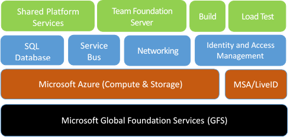
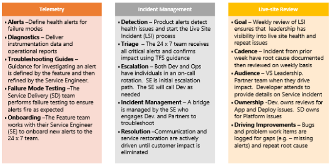

# Data protection overview

[!INCLUDE [temp](../../_shared/version-vsts-only.md)]

Azure DevOps Services is a cloud-hosted application for your development projects, from planning through deployment. Based on the capabilities of Team Foundation Server, with additional cloud services, Azure DevOps manages your source code, work items, builds, tests, and much more. Azure DevOps uses Azure's Platform as a Service infrastructure and many of Azure's services, including Azure SQL databases, to deliver a reliable, globally available service for your development projects. Because important data is at stake, this white paper discusses the steps that Microsoft takes to keep your projects safe, available, secure, and private. In addition, it describes the role you play in keeping your projects safe and secure.

This article is part of our effort to illuminate how we manage and protect your data and is intended for organization administrators and IT professionals who manage their project assets daily. It will be most useful to individuals who are already familiar with Azure DevOps and want to know more about how Microsoft protects the assets that are stored in Azure DevOps.

## Our commitment

Microsoft is committed to ensuring that your projects remain safe
and secure, without exception. When stored in Azure DevOps, your projects benefit
from multiple layers of security and governance technologies,
operational practices, and compliance policies. We enforce data privacy
and integrity both at rest and in transit.

As we look at the broader landscape of threats facing Azure DevOps customers,
they boil down to four basic categories: data availability, service
availability, service security, and data privacy. We will investigate
each of these categories to explore specific threats and explain what
Azure DevOps does to address them through both the technology that we use and the
way we put it into practice. However, we will first describe how data is
stored and how Azure DevOps manages access to your data.

Because proper data protection also requires active engagement of
customer administrators and users, we also discuss steps you should take
to protect your project assets from unauthorized disclosure and
tampering. Much of this has to do with being explicit about granting
permissions to user access points in order to have confidence that only
the right people are accessing data within Azure DevOps.

Regardless of your approach, you should consider all data potentially
"at risk" no matter where it is or how it is being used; this is true
for both data in the cloud as well as data stored in a private
data center. Thus, it is important to classify your data, its sensitivity
/ risk horizon, and the damage it could do if it is compromised. You
should also categorize your data relative to an overall information
security management policy.

## Built on Azure

Azure DevOps Services is hosted entirely in Azure data centers and uses many of the core Azure services including Compute, Storage, Networking, SQL Database, Identity and Access Management Services, and Service Bus. This lets us focus on the unique aspects of running Azure DevOps while taking advantage of the state-of-the-art capabilities, protection, and industry certifications available from the Azure platform.

Azure DevOps Services uses Azure Storage as the primary repository for service metadata and customer data. Depending on the type of data and the storage and retrieval needs, we use Azure Blob (binary large objects) storage and Azure SQL data storage. To provide a seamless experience, we work hard to abstract these details from the end user. However, to discuss the details surrounding Azure DevOps approach to data protection, some background in these elements is important.

**Azure Blob storage** is generally used to store large chunks of unstructured data. All projects use the Azure Blob storage service. This data includes potentially sensitive or private information such as the contents of source files and the attachments on work items. For most projects, the majority of storage in use is this type of unstructured blob storage.  For more information, see documentation on
[Azure Blob Storage](https://azure.microsoft.com/documentation/articles/storage-dotnet-how-to-use-blobs/).

**Azure SQL database storage** is used to store the structured and transactional aspects of your organization, including project metadata, the versioned source control history, and work item details. Database storage gives you fast access to the important elements of your project and provides indexes into the blob storage to look up files and attachments. For more information, see documentation on
[Azure SQL Database](/azure/sql-database/).

Administrators can manage access to resources by [granting or restricting permissions](../../reference/process-templates/configure-initial-groups-teams-members-permissions.md) on user identities or groups. Azure DevOps uses federated authentication of user identities [via Azure Active Directory](../accounts/access-with-azure-ad.md) (Azure AD) and Microsoft Accounts (MSA, formerly LiveID). During authentication, the user is routed to the authentication provider (Azure AD or MSA) where they provide their credentials. Once the authentication provider has verified the user's credentials, Azure DevOps issues an authentication cookie to the user, which allows them to remain authenticated against Azure DevOps. In this way, the user's credential information is never shared directly with Azure DevOps. For each Azure DevOps resource that the user attempts to access, permissions are validated based on the user's explicit permissions as well as permissions inherited through group membership. Administrators can leverage access controls to protect [access to organization](../accounts/connect-organization-to-azure-ad.md), project collection, team project, and team scoped data and functionality, as well as to more specific assets like version control folders and work item area paths.

## Data availability

Azure DevOps Services leverages many of the Azure storage features to ensure data availability in the case of hardware failure, service disruption, or region disaster. Additionally, the Azure DevOps team follows procedures to protect data from accidental or malicious deletion.

### Data redundancy

To protect data in the case of hardware or service failures, Microsoft Azure storage geo-replicates customer data between two locations within the same region that are hundreds of miles apart; for instance, between North and West Europe or between North and South United States (except Brazil). For Azure blobs, customer data is replicated three times within a single region and is replicated asynchronously to a second region hundreds of miles away. As such, Azure always maintains the equivalent of six copies of your data. This enables us to failover to a separate region in the case of a major outage or disaster while also providing local redundancy for hardware failures within a region. For Azure SQL database storage, daily backups are maintained offsite in the case of a regional disaster.

> [!NOTE]
> Note the following regarding data redundancy and fail over:
> * There is an inherent delta measured in minutes when we replicate your data between the primary and secondary region
> * Fail over to the secondary region is a decision that we must make centrally as it impacts all customers on the affected scale unit. Except in extreme circumstances, we’ll opt to not fail over so that customer data is not lost
> * Azure DevOps offers a 99.9% uptime SLA guarantee and will refund portion of the monthly charges if we miss the SLA in a specific month
> * Because there is only one region in Brazil, customer data in Brazil is replicated to South Central US for disaster recovery purposes

### Mistakes happen

To protect against accidental deletion of data, either by our customers or by our operation team, we also take point-in-time backups of both the Azure blob and the SQL databases. Our approach to these backups varies based on the storage type. For blobs, we have a separate copy of all blobs and regularly append new changes to each storage account. Since this data is immutable, we don't need to rewrite any existing storage as part of our backup procedures. SQL Azure, on the other hand, handles backups as a standard part of their service which we rely on. In both cases, these backups are also replicated in a paired region to ensure we can recover from a regional outage.

In addition, we perform a "soft delete" for organization deletion operations. This lets us recover entire organizations for up to 30 days after deletion.

### Practice is critical

Having multiple, redundant backups of your data is good but without practice, restoring can be unpredictable. It's been said that "backups never fail, it's the restores that do". While technically incorrect, the sentiment is right. The good news is that we regularly practice restoring various data sets from backup. The geo-redundant storage that we get from Azure is tested regularly. In addition, from time to time we restore from backups to recover from human error, such as when a customer has inadvertently deleted a project in Azure DevOps. We have the capability of restoring your organization’s data to any point in time over the last 30 days. While our turnaround time sometimes takes more than day, we have always been able to restore the customer's data given enough time. Since there are many permutations of disaster and data corruption scenarios, we continue to plan and execute new tests on a regular basis to ensure our systems and associated process are up to the challenge.

## Service availability

Ensuring that Azure DevOps Services is available for you to access your organization and associated assets is of utmost importance to us.

### DDoS protections

In some cases, a malicious distributed denial-of-service (DDoS) attack can affect service availability. Azure has a DDoS defense system that helps prevent attacks against our service. It uses standard detection and mitigation techniques such as SYN cookies, rate limiting and connection limits. The system is designed not only to withstand attacks from the outside but also from within Azure. For application-specific attacks that can penetrate the Azure defense systems, Azure DevOps establishes application and organization level quotas and throttling to prevent any overuse of key service resources during an attack or accidental misuse of resources.

### Live site response

While we strive for the service to be available 100% of the time, sometimes things happen that prevent us from meeting that goal. If this happens, we provide transparency to our users throughout the incident. Our 24x7 operations team is always on hand to rapidly identify the issue and to engage the necessary development team resources. Those resources then address the problem. They also aim to update the service status page and blog within minutes of detecting an issue that affects the service. Once the team has addressed an issue, our "live-site incident" process continues as we identify the root cause of the issue and track the necessary changes to ensure we prevent similar issues in the future.

Azure DevOps live-site management processes are crafted to ensure a deep focus on service health and customer experience. Our processes minimize our time to detect, respond to, and mitigate impacting issues. Ownership for Live site is shared across all engineering disciplines, so there are continual improvements evolving out of direct experience. This means that monitoring, diagnostics, resiliency, and quality assurance processes are improved over time. Live-site management in Azure DevOps is broken into three distinct tracks, shown as follows:

The operations team also monitors the availability metrics for individual organizations. These metrics provide insights into specific conditions that might affect only some of our customers. Investigations into this data can often result in targeted improvements to address customer-specific issues. In some cases, we will even contact the customer directly to understand their experience and work with them to improve the service from their vantage point.

We understand that availability of our service is an integral part of your team's success. Because of this, we publish a service level agreement (SLA) and provide a financial guarantee to ensure we meet this agreement each month. For more specifics on our SLA and financial guarantees, please see
[SLA for Azure DevOps](https://azure.microsoft.com/support/legal/sla/azure-devops/v2_0/).

Sometimes our partner teams or dependencies have incidents that affect Azure DevOps. All our partner teams follow similar approaches to identifying, resolving, and learning from these service outages.

## Service security

Ensuring a secure service requires constant vigilance, from proper design and coding techniques, all the way through to the way we operate the service. Along those lines, we actively invest in the prevention of security holes and in breach detection. In the event of a breach, we use security response plans to minimize data leakage, loss or corruption. To learn more about how security and identity are managed, see [About security and identity](about-security-identity.md).

### Secure by design

To implement industry best practices and stay on the forefront of information security, we engage with various teams within Microsoft including Azure, Global Foundation Services (GFS), and Trustworthy Computing. Microsoft's Security Development Lifecycle (SDL) is at the core of our development process and Microsoft's Operational Security Assurance (OSA) program guides our cloud operation procedures. The SDL and OSA methodologies address security threats throughout the development process and operation of Azure DevOps. They specify requirements that include threat modeling during service design, following design and code best practices, verifying security with standard tooling and testing, limiting access to operational and customer data, and gating rollout of new features through a rigid approval process.

Because the security landscape is continually changing, it is important for our team to keep current with the latest in best practices. We have annual training requirements for all engineers and operations personnel working on Azure DevOps. In addition, we sponsor informal "brownbag" meetings. These meetings are hosted by our own engineers. After they've solved an issue, they share what they've learned with the rest of the team.

A cloud service is only as secure as the host platform. Azure DevOps uses Azure's Platform as a Service (PaaS) offering for much of our infrastructure. PaaS automatically provides regular updates for known security vulnerabilities. When we host virtual machines in Azure using their Infrastructure as a Service (IaaS) offering, such as for our [hosted build service](../../pipelines/agents/hosted.md), we regularly update those images to include the latest security patches available from Windows Update. The same update rigor applies for our on-premises machines, including those used for deployment, monitoring, and reporting.

Our team conducts regular security-focused penetration testing of Azure DevOps. Using the same techniques and mechanisms as real malicious attackers, penetration testing tries to exploit the live production services and infrastructure of Azure DevOps. The goal is to identify real-world vulnerabilities, configurations errors or other security gaps in a controlled process. The team reviews the results to identify other areas of improvement and to increase the quality of the preventative systems and training.

### Credential security

Your credentials in Azure DevOps are stored using industry best practices. Learn more about [credential storage](credential-storage.md).

### Reporting security issues

If during your penetration testing you believe you have discovered a potential security flaw related to the Azure DevOps service, please report it to Microsoft within 24 hours by following the instructions on the [Report a Computer Security Vulnerability](https://technet.microsoft.com/organizations/security/ff852094) page.

>[!IMPORTANT]
>While notifying Microsoft of penetration testing activities is no longer required, customers must still comply with the [Microsoft Cloud Unified Penetration Testing Rules of Engagement](https://technet.microsoft.com/mt784683).

### Azure DevOps Bug Bounty Program

Azure DevOps participates in the [Microsoft Cloud Bounty Program](https://www.microsoft.com/en-us/msrc/bounty-microsoft-cloud) to reward security researchers who report issues to us, and to encourage more people to help us keep Azure DevOps secure. Please visit the [Azure DevOps Bounty Program](https://www.microsoft.com/en-us/msrc/bounty-azure-devops) page for more details. 

### Restricting access

We maintain strict control over who has access to our production environment and customer data. Access is only granted at the level of least privilege required and only after proper justifications are provided and verified. If a team member needs access to resolve an urgent issue or deploy a configuration change, they must apply for "just in time" access to the production service. Access is revoked as soon as the situation is resolved. Access requests and approvals are tracked and monitored in a separate system. All access to the system is correlated against these approvals and if unapproved access is detected, an alert is raised for the operations team to investigate.

If the username and password for one of our developers or operation staff were ever stolen, data is still protected because we use two-factor authentication for all remote system access. This means that additional authentication checks via smart card or a phone call to a pre-approved number must take place before any remote access to the service is permitted.

In addition, secrets that we use to manage and maintain the service, such as RDP passwords, SSL certificates, and encryption keys are managed, stored, and transmitted securely through the Azure Management Portal. Any access to these secrets requires specific permission, which is logged and recorded in a secure manner. All secrets are rotated on a regular cadence and can be rotated on-demand in the case of a security event.

The Azure DevOps operations team uses hardened administrator workstations to manage the service. These machines run a minimal number of applications and operate in a logically segmented environment. Operations team members must provide specific credentials with two-factor authentication to access the workstations and all access is monitored and securely logged. To isolate the service from outside tampering, applications such as Outlook and Office, which are often targets of spear-phishing and other types of attacks, are not permitted in this environment.

### Intrusion protection & response

To ensure data is not intercepted or modified while in transit between
you and Azure DevOps, we encrypt via HTTPS / SSL.

In addition, data we store on your behalf in Azure DevOps is encrypted as follows:

• For data stored in Azure SQL databases, Azure DevOps adopted [Transparent Data Encryption (TDE)](https://docs.microsoft.com/azure/sql-database/transparent-data-encryption-azure-sql?view=sql-server-2017) to protect against the threat of malicious activity by performing real-time encryption of the database, associated backups, and transaction log files at rest.

• Azure Blob Storage connections are encrypted to protect your data in transit. To protect data at rest stored in our Azure Blob Storage, we have adopted [Azure Storage Service Encryption (SSE)](https://docs.microsoft.com/azure/storage/common/storage-service-encryption).

To learn more about how we encrypt your data, please visit the following [blog post](https://blogs.msdn.microsoft.com/devops/2017/09/05/visual-studio-team-services-encryption-at-rest/).

To ensure that activities within the service are legitimate, as well as to detect breaches or attempted breaches, we leverage Azure's infrastructure to log and monitor key aspects of the service. In addition, all deployment and administrator activities are securely logged, as is operator access to production storage. Real-time alerts are raised because the log information is automatically analyzed to uncover potentially malicious or unauthorized behavior.

In the case where a possible intrusion has been detected or high priority security vulnerability has been identified, we have a clear security incident response plan. This plan outlines responsible parties, steps required to secure customer data, and how to engage with security experts in Microsoft Security Response Center (MSRC), Global Foundation Services (GFS), Azure and members of the Azure DevOps leadership team. We will also notify any organization owners if we believe their data was disclosed or corrupted so that they can take appropriate steps to remedy the situation.

Finally, to help combat emerging threats, we employ an Assume Breach strategy. A highly specialized group of security experts within Microsoft, known as the Red Team, assumes the role of sophisticated adversaries. This team tests our breach detection and response, enabling us to accurately measure our readiness and the impacts of real-world attacks. This strategy strengthens threat detection, response, and defense of the service. It also allows us to validate and improve the effectiveness of our entire security program.

## Data privacy

We want you to have confidence that your data is being handled appropriately and for legitimate uses. Part of that assurance involves appropriately restricting usage so that your data is used only for legitimate reasons.

### The General Data Protection Regulation (GDPR)

The General Data Protection Regulation (GDPR) is the biggest change in data protection laws in Europe since the 1995 introduction of the European Union (EU) Data Protection Directive 95/46/EC. The GDPR's main objective is to strengthen the protection and security of your personal data and replaced the Directive and all local laws relating to it. Azure DevOps is relied upon as a system of record with strict integrity, traceability, and audit rules. We view all information within Azure DevOps to be business critical and therefore cannot be modified from its original state. These existing obligations affect our delete and retention obligations for GDPR.
As such, we do not support GDPR delete requests from within Azure DevOps. We have ensured that when an entire organization is deleted that all associated data and telemetry about that organization and its members are removed from our system (after the requisite 30-day soft-delete period).

To learn more about how Azure DevOps honors Data Subject Requests (DSR), please visit the following [page](/microsoft-365/compliance/gdpr-dsr-vsts?toc=/microsoft-365/enterprise/toc.json).
To learn more about the GDPR regulation, please visit the following page in [Microsoft's Trust Center](https://www.microsoft.com/TrustCenter/Privacy/gdpr/default.aspx).

### Data residency and sovereignty

We know our customers care deeply about data security and privacy. Azure DevOps is available in the following 8 geographies across the world: United States, Canada, Europe, UK, India, Australia, Asia Pacific, and Brazil. While we default your organization to your closest region, you have the option to choose a different region. If you change your mind later, our CSS team can help you migrate your organization to a different region. Azure DevOps will not move or replicate customer data outside of the chosen geography. Our backup procedures geo-replicate customer data between a second region within the same geography except for organizations located in Brazil, these are replicated to South Central US for disaster recovery purposes.

To learn more about data location, see [Azure DevOps data location](data-location.md).

### Law enforcement access

In some cases, third parties such as law enforcement entities may approach us to obtain access to customer data stored within Azure DevOps. By policy, we will attempt to redirect the requests to the organization owner for resolution. When we are compelled by court order to disclose customer data to a third party, we will make a reasonable effort to notify the organization owner in advance unless we are legally prohibited from doing so.

Some customers require that their data be stored in a particular geographic location to ensure a specific legal jurisdiction for any law enforcement activities. At this time, Azure DevOps can host organizations in 8 geographies across the world: United States, Canada, Europe, UK, India, Australia, Asia Pacific, and Brazil. All customer data such as source code, work items, test results as well as the geo-redundant mirrors and offsite backups are maintained within the selected geography.

### Microsoft access

From time to time, Microsoft employees need to obtain access to customer data stored within Azure DevOps. As a precaution, all employees who have or may ever have access to customer data must pass a background check, which verifies previous employment and criminal convictions. In addition, we permit access to the production systems only when there's a live site incident or other approved maintenance activity, which is logged and monitored.

Since not all data within our system is treated the same, data is classified to distinguish between customer data (what you upload to Azure DevOps), organization data (information used when signing up for or administering your organization), and Microsoft data (information required for or collected through the operation of the service). Based on the classification we control usage scenarios, geolocation requirements, access restrictions and retention requirements.

### Microsoft promotional use

From time to time, we want to contact customers to let them know about additional features and services that might be useful. Since not all customers want to be contacted about these offers, we allow you to opt-in and opt-out of marketing email communications. We never use customer data to target specific offers for specific users or organizations. Instead, we leverage organization data and aggregate usage statistics at the organization level to determine groups of organizations that should receive specific offers.

## Building confidence

In addition to these protections, we have also taken steps outside of the service itself to help you decide to move forward with Azure DevOps. These include Microsoft's own internal adoption policies, the level of transparency that we provide into the state of our service, and our progress towards receiving certification of our information security management systems. All these efforts are designed to build your confidence in Azure DevOps.

## Internal adoption

Teams across Microsoft have begun adopting Azure DevOps internally. The Azure DevOps team moved into an organization in 2014 and uses it extensively. More broadly, we have established guidelines to enable the adoption plans for other teams. Obviously, large teams move more gradually than smaller ones, given their investments in existing DevOps systems. For teams able to move quickly, we have established a project classification approach. It assesses our risk tolerance, based on project characteristics, to determine if the project is appropriate for Azure DevOps. For larger teams, the adoption typically occurs in phases with more planning. Additional requirements for internal projects include associating the organization with the Microsoft.com Azure Active Directory to ensure proper user identity lifecycle and password complexity along with requiring the use of two-factor authentication for more sensitive projects.

### Transparency

We are convinced that transparency around how we design and operate our
service is critical to establishing trust with our customers. This white
paper is part of our effort to shed light on how we manage and protect
your data. In addition, we maintain a
[blog](https://blogs.msdn.com/b/vsoservice/) that provides real-time updates whenever a service disruption, planned or unplanned, takes place so you can adjust your activities as needed. Furthermore, Brian Harry, the corporate vice-president in charge of Azure DevOps, maintains an active
[blog](https://blogs.msdn.com/b/bharry/) addressing, among other things,
lessons learned by operating the service.

## Compliance certifications

For some customers, it is important to understand third-party
evaluation of our data security procedures. Towards that end, we have
achieved ISO 27001:2013, HIPAA (Health Insurance Portability and Accountability Act)
 BAA (Business Associate Agreement), EU Model Clauses, SOC 1 Type 2 and SOC 2 Type 2 certifications.
The SOC audit for Azure DevOps covers controls for data security, availability, 
processing integrity, and confidentiality. Azure DevOps' SOC reports are available via the [Microsoft's Service Trust Portal](https://servicetrust.microsoft.com/ViewPage/MSComplianceGuide?docTab=4ce99610-c9c0-11e7-8c2c-f908a777fa4d_SOC%20/%20SSAE%2016%20Reports).
If you dont have access to Microsoft's Service Trust Portal, you can contact [Azure DevOps ServicesSOCReports](mailto:Azure DevOps ServicesSOCReports@microsoft.com) to request a copy of Azure DevOps' SOC Reports.

## Steps you can take

Proper data protection requires active engagement of customer administrators and users. Your project data stored within Azure DevOps is only as secure as the end user access points. So, it is important to match the level of permission strictness and granularity for those organizations with the level of sensitivity of your project.

### Classify your data

The first step is to classify your data based on its sensitivity / risk
horizon, and the damage that could occur if it is compromised. Many
enterprises have existing classification methods that can be reused when
projects move to Azure DevOps. Refer to these
[materials](https://download.microsoft.com/download/0/A/3/0A3BE969-85C5-4DD2-83B6-366AA71D1FE3/Data-Classification-for-Cloud-Readiness.pdf)
for more information on how to classify your data.

### Adopt Azure Active Directory

Another action you can take to improve the security of your end users' credentials is to use Azure Active Directory (Azure AD) instead of Microsoft Accounts (MSA) to manage your organization's access to Azure DevOps. This allows your IT department to manage its end user access policy including password complexity, password refreshes and expiration if the user leaves your organization. Through Active Directory federation, you can directly link Azure Active Directory to your organization's central directory, so you have only one location to manage these details for your enterprise. See the following brief comparison between MSA and Azure AD characteristics relative to Azure DevOps access:

| Properties                            | MSA                        | Azure AD  |
| :-------------------------------------|:---------------------------|:-----|
| Identity creator      | User | Organization |
| Single user name / password for all work assets      | No      |   Yes |
| Password lifetime & complexity control | User      |    Organization|
| Azure DevOps membership limits | Any MSA | Organization's directory
| Traceable identity | No | Yes
| Organization & IP ownership | Unclear | Organization
| 2-factor authentication enrollment | User | Organization
| Device-based conditional access | No | Organization

You can learn more about how to
[configure this support for your organization](../accounts/access-with-azure-ad.md).

### Require two-factor authentication

In some cases, you might want to restrict access to your organization by requiring more than one factor to sign in. Azure AD lets you require multiple factors, 
such as phone authentication in addition to a username and password, for all authentication requests. You can [learn more](/azure/multi-factor-authentication/) about turning on multifactor authentication for Azure AD.

### Use BitLocker

For sensitive projects, we also recommend use of BitLocker on your Windows laptop or desktop computer. BitLocker encrypts the entire drive on which Windows and your data reside, keeping everything safe. Once BitLocker is enabled, it automatically encrypts any file you save on that drive. If your laptop or desktop machine were to fall into the wrong hands, BitLocker prevents unauthorized access of local copies of data from your projects.

### Limit use of Alternate Authentication Credentials

The default authentication mechanism for Git related tooling is alternate authentication (sometimes referred to as Basic Authentication). This mechanism allows the end user to set up an alternate username and password for use during Git command line operations. This username and password combination can also be used to access any other data for which that user has permissions. By its nature, alternate authentication credentials are less secure than the default federated authentication. However, we have taken steps to help you make secure choices. For example, all communication is sent over HTTPS and there are password complexity requirements. Nevertheless, your organization should evaluate if additional policies are required to meet your project security requirements. You can [learn more](../accounts/change-application-access-policies.md) about disabling alternate authentication credentials altogether for your organization if it doesn't meet your
security requirements.

### Secure access to your organization

Azure Active Directory (Azure AD) provides the capability for administrators to control access to Azure resources and applications such as Azure DevOps. With conditional access control in place, Azure AD checks for the specific conditions you set for a user to access an application. After access requirements are met, the user is authenticated and can access the application.
Visit the [Azure documentation site](/azure/active-directory/active-directory-conditional-access)
to learn more about conditional access policy (CAP).  Azure DevOps now enforces conditional access policies for custom Azure DevOps authentication mechanisms including personal access tokens (PATs), alternate authentication, OAuth and SSH keys. If accessing Azure DevOps through a third party client, like git.exe, only IP based policies will be honored; any other policy will automatically fail as the client doesn't pass the necessary information to validate the policy. For example, if a policy requires MFA and the client can't support MFA, the policy will fail and the user will automatically be blocked.

## Additional resources

In addition to this white paper, there are other resources available for
your review and education. These include:

- [Azure DevOps home page](https://azure.microsoft.com/en-us/services/devops/)
- [Azure DevOps status](https://blogs.msdn.com/b/vsoservice/)
- [Azure DevOps credential storage](credential-storage.md)
- [Azure DevOps data location](data-location.md)
- [Developer Services privacy statement](https://privacy.microsoft.com/privacystatement)
- [Azure DevOps support](https://azure.microsoft.com/en-us/support/devops/)
- [Developer Services Agreement](/azure/devops/user-guide/services)
- [Azure trust center](http://azure.microsoft.com/support/trust-center/)
- [Microsoft Security Development Lifecycle](http://www.microsoft.com/sdl/)
- [Create and revoke your PATs](../accounts/use-personal-access-tokens-to-authenticate.md)
- [Revoke user PATs - for admins](../accounts/admin-revoke-user-pats.md)
- [Token expiration](../accounts/admin-revoke-user-pats.md#token-expiration)

*(c) 2018 Microsoft Corporation. All rights reserved. This document is
provided "as-is." Information and views expressed in this document,
including URL and other Internet Web site references, may change without
notice. You bear the risk of using it.*

*This document does not provide you with any legal rights to any
intellectual property in any Microsoft product. You may copy and use
this document for your internal, reference purposes.*
