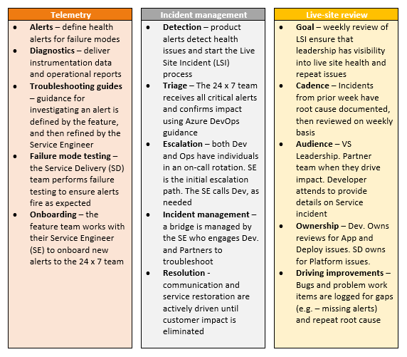

# Data protection overview

[!INCLUDE [temp](../../includes/version-vsts-only.md)]

Azure DevOps Services is a cloud-hosted application for your development projects, from planning through deployment. Based on the capabilities of Visual Studio Team Foundation Server, with additional cloud services, Azure DevOps manages your source code, work items, builds, and tests. It uses platform as a service (PaaS) infrastructure and many Azure services, including Azure SQL, to deliver a reliable, globally available service for your development projects. 

This article discusses the steps that Microsoft takes to help keep your projects safe, available, secure, and private. Also, it describes the role you play in keeping your projects safe and secure.

This article is intended for organization administrators and IT professionals who manage their project assets daily. It will be most useful to individuals who are already familiar with Azure DevOps and want to know more about how Microsoft protects assets stored in Azure DevOps.

## Our commitment

Microsoft helps to ensure that your projects remain safe
and secure, without exception. When stored in Azure DevOps, your projects benefit
from multiple layers of security and governance technologies,
operational practices, and compliance policies. Microsoft enforces data privacy
and integrity both at rest and in transit.

The threats you face boil down to four basic categories: data availability, service
availability, service security, and data privacy. This article explores specific threats within each category, and explains what Azure DevOps does to address them. First, the article describes how data is stored and how Azure DevOps manages access to your data.

Because proper data protection also requires the active engagement of
administrators and users, you need to know steps you should take
to protect your project assets from unauthorized disclosure and
tampering. You need to be explicit about granting
permissions to user access points in order to have confidence that only
the right people are accessing data within Azure DevOps.

Whatever your approach, you should consider all data potentially
"at risk", no matter where it is or how it is being used. This is true
for both data in the cloud as well as data stored in a private
datacenter. Thus, it's important to classify your data, its sensitivity and risk, and the damage it might do if it's compromised. Also, categorize your data relative to an overall information security management policy.

## Built on Azure

Azure DevOps Services is hosted entirely in Azure datacenters and uses many of the core Azure services, including compute, storage, networking, Azure SQL, identity and access management, and Azure Service Bus.

Azure DevOps Services uses Azure Storage as the primary repository for service metadata and customer data. Depending on the type of data and the storage and retrieval needs, Azure DevOps Services uses Azure Blob Storage (for binary large objects) and Azure SQL data storage. To understand the Azure DevOps Services approach to data protection, some background on these elements is important.

- **Azure Blob Storage** stores large chunks of unstructured data. All projects use the Azure Blob Storage service. This data includes potentially sensitive or private information, such as the contents of source files and the attachments on work items. For most projects, the majority of storage in use is this type of unstructured blob storage. For more information, see [Azure Blob Storage](/azure/storage/blobs/storage-quickstart-blobs-dotnet).

- **Azure SQL Database storage** stores the structured and transactional aspects of your organization, including project metadata, the versioned source control history, and work item details. Database storage gives you fast access to the important elements of your project, and provides indexes into the blob storage to look up files and attachments. For more information, see [Azure SQL Database](/azure/sql-database/).

Administrators can manage access to resources by [granting or restricting permissions](../../reference/process-templates/configure-initial-groups-teams-members-permissions.md) on user identities or groups. Azure DevOps uses federated authentication of user identities via [Azure Active Directory](../accounts/access-with-azure-ad.md) (Azure AD) and Microsoft accounts. 

During authentication, the user is routed to the authentication provider, where they provide their credentials. After the authentication provider has verified the user's credentials, Azure DevOps issues an authentication cookie to the user, which allows the user to remain authenticated against Azure DevOps.

In this way, the user's credential information is never shared directly with Azure DevOps. For each Azure DevOps resource that the user attempts to access, permissions are validated based on the user's explicit permissions, as well as permissions inherited through group membership. Administrators can use access controls to protect [access to the organization](../accounts/connect-organization-to-azure-ad.md), project collections, team projects, and team scoped data and functionality. Administrators can also protect more specific assets like version control folders and work item area paths.

## Data availability

Azure DevOps Services uses many of the Azure Storage features to ensure data availability in the case of hardware failure, service disruption, or region disaster. Additionally, the Azure DevOps team follows procedures to protect data from accidental or malicious deletion.

### Data redundancy

To protect data in the case of hardware or service failures, Azure Storage geo-replicates customer data between two regions in the same geography. For example, Azure can geo-replicate data between North and West Europe or between North and South United States. 

For Azure Blob Storage, customer data is replicated three times within a single region, and is replicated asynchronously to a second region in the same geography. As such, Azure always maintains the equivalent of six copies of your data. This enables you to fail over to a separate region if there's a major outage or disaster, while also having local redundancy for hardware failures within a region. For Azure SQL Database storage, daily backups are maintained offsite if there's a regional disaster.

> [!NOTE]
> Regarding data redundancy and failover:
> * There's an inherent delta, measured in minutes, when Microsoft replicates your data between the primary and secondary region.
> * Failover to the secondary region is a decision that Microsoft must make centrally, as it affects all customers on the affected scale unit. Except in extreme circumstances, Microsoft opts to not fail over so that customer data isn't lost.
> * Azure DevOps offers a 99.9 percent uptime SLA guarantee, and refunds a portion of the monthly charges if that SLA is missed in a specific month.
> * Because there is only one region in Brazil, customer data in Brazil is replicated to the South Central US region for disaster recovery purposes.

### Mistakes happen

To protect against accidental deletion of data, Microsoft also takes point-in-time backups of both the blobs in Azure Blob Storage, and the databases in Azure SQL Database. There's a separate copy of all blobs, and changes are appended to each storage account. Because this data is immutable, there's no need to rewrite any existing storage as part of the backup procedures. 

Backups are a standard part of Azure SQL Database, and Azure DevOps Services makes use of this. In both cases, these backups are also replicated in a paired region, helping to ensure that you recover from a regional outage.

A further protection is that Microsoft can recover entire organizations for up to 28 days after deletion. This is because Microsoft performs a "soft delete" for organization deletion operations.

### Practice is critical

Having multiple, redundant backups of your data is good but without practice, restoring can be unpredictable. It's been said that "backups never fail, it's the restores that do." While technically incorrect, the sentiment is right.

Microsoft regularly practices restoring various datasets from backup. Geo-redundant storage from Azure is tested regularly. Also, from time to time, Microsoft restores from backups to recover from human error, such as when a customer has inadvertently deleted a project in Azure DevOps. There are many permutations of disaster and data corruption scenarios, and Microsoft continues to plan and run new tests regularly.

## Service availability

Azure DevOps Services offers distributed denial-of-service (DDoS) protections and live site response to help ensure that you have access to your organization and associated assets.

### DDoS protections

In some cases, a malicious DDoS attack can affect service availability. Azure has a DDoS defense system that helps prevent attacks against our service. It uses standard detection and mitigation techniques such as SYN cookies, rate limiting, and connection limits. The system is designed to withstand attacks not only from the outside but also from within Azure. 

For application-specific attacks that can penetrate the Azure defense systems, Azure DevOps establishes application and organization level quotas and throttling. This helps prevent any overuse of key service resources during an attack or accidental misuse of resources.

### Live site response

In rare circumstances, you might require a live site response to a problem with service availability. Microsoft has an operations team available 24x7, to rapidly identify the issue and to engage the necessary development team resources. Those resources then address the problem. They also aim to update the service status page within minutes of detecting an issue that affects the service. After the team has addressed an issue, they identify the root cause of the issue and track the necessary changes to prevent similar issues in the future.

Azure DevOps live site management processes focus on your experience and the health of your service. These processes minimize the time to detect, respond to, and mitigate problems. All engineering disciplines are involved and responsible, so there are continual improvements evolving out of direct experience. This means that monitoring, diagnostics, resiliency, and quality assurance processes are improved over time. 

Live site management in Azure DevOps has  three distinct tracks: telemetry, incident management, and live site review. Here's what these tracks entail:

The operations team also monitors the availability metrics for individual organizations. These metrics provide insights into specific conditions that might affect only some of our customers. Investigations into this data can often result in targeted improvements to address customer-specific issues. In some cases, Microsoft might even contact you directly to understand your experience and work with you to improve the service.

Microsoft publishes a service-level agreement (SLA) and provides a financial guarantee to ensure that we meet this agreement each month. For more information, see [SLA for Azure DevOps](https://azure.microsoft.com/support/legal/sla/azure-devops/v2_0/).

Sometimes partner teams or dependencies have incidents that affect Azure DevOps. All partner teams follow similar approaches to identifying, resolving, and learning from these service outages.

## Service security

Service security requires constant vigilance, from proper design and coding techniques to operational factors. Microsoft actively invests in the prevention of security holes and in breach detection. If there's a breach, Microsoft uses security response plans to minimize data leakage, loss, or corruption. For more information, see [About security, authentication, and authorization](about-security-identity.md).

### Secure by design

Azure DevOps Services is designed to be secure. It makes use of the Microsoft Security Development Lifecycle at the core of its development process, and the Microsoft Operational Security Assurance program guides its cloud operation procedures. These methodologies specify the following requirements:

- Threat modeling during service design.
- Following design and code best practices.
- Verifying security with standard tooling and testing.
- Limiting access to operational and customer data.
- Gating rollout of new features through a rigid approval process.

The Azure DevOps Services team has annual training requirements for all engineers and operations personnel, and sponsors informal "brown bag" meetings hosted by Microsoft engineers. After they've solved an issue raised in a brown bag meeting, they share what they've learned with the rest of the team.

A cloud service is only as secure as the host platform. Azure DevOps uses PaaS for much of its infrastructure. PaaS automatically provides regular updates for known security vulnerabilities. VMs hosted in Azure use infrastructure as a service (IaaS), such as for a [hosted build service](../../pipelines/agents/hosted.md). Such images receive regular updates to include the latest security patches available from Windows Update. The same update rigor applies for on-premises machines, including those used for deployment, monitoring, and reporting.

The Azure DevOps Services team conducts regular, security-focused penetration testing of Azure DevOps. Using the same techniques and mechanisms as malicious attackers, penetration testing tries to exploit the live production services and infrastructure of Azure DevOps. The goal is to identify real-world vulnerabilities, configurations, errors, or other security gaps in a controlled process. The team reviews the results to identify other areas of improvement and to increase the quality of the preventative systems and training.

### Credential security

Your credentials in Azure DevOps are stored using industry best practices. Learn more about [credential storage](credential-storage.md).

### Reporting security issues

If during your penetration testing you believe you've discovered a potential security flaw related to the Azure DevOps service, report it to Microsoft within 24 hours. For more information, see [Report a computer security vulnerability](https://technet.microsoft.com/organizations/security/ff852094).

>[!IMPORTANT]
>Although notifying Microsoft of penetration testing activities is no longer required, you must still comply with the [Microsoft Cloud Unified Penetration Testing Rules of Engagement](https://technet.microsoft.com/mt784683).

### Bounty program

Azure DevOps participates in the [Microsoft Online Services Bounty Program](https://www.microsoft.com/msrc/bounty-microsoft-cloud). This program rewards security researchers who report issues to us, and encourages more people to help keep Azure DevOps secure. For more details, see the [Azure DevOps Bounty Program](https://www.microsoft.com/msrc/bounty-azure-devops). 

### Restricting access

Microsoft maintains strict control over who gets access to our production environment and customer data. Access is only granted at the level of least privilege required and only after proper justifications are provided and verified. If a team member needs access to resolve an urgent issue or deploy a configuration change, they must apply for "just-in-time" access to the production service. Access is revoked as soon as the situation is resolved. 

Access requests and approvals are tracked and monitored in a separate system. All access to the system correlates against these approvals and if unapproved access is detected, an alert is raised for the operations team to investigate.

If the username and password for one of our developers or operation staff were stolen, data is still protected because we use two-factor authentication for all remote system access. This means that additional authentication checks via smart card or a phone call to a pre-approved number must take place before any remote access to the service is permitted.

In addition, Microsoft uses secrets to manage and maintain the service, such as RDP passwords, SSL certificates, and encryption keys. These are all managed, stored, and transmitted securely through the Azure portal. Any access to these secrets requires specific permission, which is logged and recorded in a secure manner. All secrets are rotated on a regular cadence, and can be rotated on-demand if there's a security event.

The Azure DevOps operations team uses hardened administrator workstations to manage the service. These machines run a minimal number of applications and operate in a logically segmented environment. Operations team members must provide specific credentials with two-factor authentication to access the workstations. All access is monitored and securely logged. To isolate the service from outside tampering, applications such as Outlook and Office, which are often targets of spear-phishing and other types of attacks, aren't permitted in this environment.

### Intrusion protection and response

To ensure data isn't intercepted or modified while in transit between
you and Azure DevOps, we encrypt it via HTTPS and SSL.

Also, data we store on your behalf in Azure DevOps is encrypted as follows:

* For data stored in Azure SQL databases, Azure DevOps uses [Transparent Data Encryption (TDE)](/azure/sql-database/transparent-data-encryption-azure-sql?view=sql-server-2017&preserve-view=true). This protects against the threat of malicious activity by doing real-time encryption of the database, associated backups, and transaction log files at rest.

* Azure Blob Storage connections are encrypted to protect your data in transit. To protect data at rest stored in Azure Blob Storage, Azure DevOps uses [Azure Storage Service Encryption (SSE)](/azure/storage/common/storage-service-encryption).

The Azure infrastructure helps the Azure DevOps Services team to log and monitor key aspects of the service. This helps ensure that activities within the service are legitimate, and detects breaches or attempted breaches. In addition, all deployment and administrator activities are securely logged, as is operator access to production storage. Real-time alerts are raised because the log information is automatically analyzed to uncover potentially malicious or unauthorized behavior.

Where a possible intrusion has been detected or high priority security vulnerability has been identified, the team has a clear security incident response plan. This plan outlines responsible parties, steps required to secure customer data, and how to engage with security experts at Microsoft. The team also notifies any organization owners if data is potentially disclosed or corrupted, so that they can take appropriate steps to remedy the situation.

Finally, to help combat emerging threats, Azure DevOps Services employs an "Assume Breach" strategy. A highly specialized group of security experts within Microsoft, known as the Red Team, assumes the role of sophisticated adversaries. This team tests breach detection and response, to accurately measure readiness and the impacts of real-world attacks. This strategy strengthens threat detection, response, and defense of the service. It also allows the team to validate and improve the effectiveness of the entire security program.

## Data privacy

You should have confidence that your data is being handled appropriately and for legitimate uses. Part of that assurance involves appropriately restricting usage so that your data is used only for legitimate reasons.

### General Data Protection Regulation (GDPR)

The General Data Protection Regulation (GDPR) is the biggest change in data protection laws in Europe since the 1995 introduction of the European Union (EU) Data Protection Directive 95/46/EC. To learn more about the GDPR regulation, see the [overview page in the Microsoft Trust Center](https://www.microsoft.com/TrustCenter/Privacy/gdpr/default.aspx).

### Data residency and sovereignty

Azure DevOps is available in the following eight geographies across the world: United States, Canada, Europe, United Kingdom, India, Australia, Asia Pacific, and Brazil. By default, your organization is assigned to your closest geography, but you do have the option to choose a different geography. If you change your mind later, it's possible to migrate your organization to a different geography, with the assistance of Microsoft support.

Azure DevOps doesn't move or replicate customer data outside of the chosen geography. Instead, your data is geo-replicated to a second region within the same geography. The only exception is Brazil, which replicates data to the South Central US geography for disaster recovery purposes.

> [!NOTE]
> For builds and releases running on Microsoft-provided macOS agents, your data will be transferred to a third-party data center in the US.

To learn more, see [Azure DevOps data location](data-location.md).

### Law enforcement access

In some cases, third parties such as law enforcement entities might approach Microsoft to obtain access to customer data stored within Azure DevOps. Microsoft attempts to redirect the requests to the organization owner for resolution. When compelled by court order to disclose customer data to a third party, Microsoft makes a reasonable effort to notify the organization owner in advance, unless we are legally prohibited from doing so.

Some customers require their data storage in a particular geographic location to ensure a specific legal jurisdiction for any law enforcement activities. All customer data, such as source code, work items, test results, and geo-redundant mirrors and offsite backups, are maintained within the one of the geographies mentioned in the previous section.

### Microsoft access

From time to time, Microsoft employees need to obtain access to customer data stored within Azure DevOps. As a precaution, all employees who have or might ever have access to customer data must pass a background check, which verifies previous employment and criminal convictions. In addition, we permit access to the production systems only when there's a live site incident or other approved maintenance activity, which is logged and monitored.

Because not all data within our system is treated the same, data is classified to distinguish between customer data (what you upload to Azure DevOps), organization data (information used when signing up for or administering your organization), and Microsoft data (information required for or collected through the operation of the service). Based on the classification, Microsoft controls usage scenarios, geo-location requirements, access restrictions, and retention requirements.

### Microsoft promotional use

Microsoft occasionally wants to contact customers to let them know about additional features and services that might be useful. Because not all customers want to be contacted about these offers, you can opt in and opt out of marketing email communications.

Microsoft never uses customer data to target specific offers for specific users or organizations. Instead, we use organization data and aggregate usage statistics at the organization level to determine groups of organizations that should receive specific offers.

## Building confidence

In addition to these protections, you can be confident in other efforts Microsoft makes on behalf of Azure DevOps. These include internal adoption policies at Microsoft, the level of transparency provided into the state of our service, and progress towards receiving certification of our information security management systems.

### Internal adoption

Teams across Microsoft are adopting Azure DevOps internally. The Azure DevOps team moved into an organization in 2014 and uses it extensively. More broadly, we have established guidelines to enable the adoption plans for other teams. 

Obviously, large teams move more gradually than smaller ones, given their investments in existing DevOps systems. For teams able to move quickly, we have established a project classification approach. It assesses risk tolerance, based on project characteristics, to determine if the project is appropriate for Azure DevOps. For larger teams, the adoption typically occurs in phases, with more planning. 

Additional requirements for internal projects include associating the organization with the Microsoft.com Azure Active Directory to ensure proper user identity life cycle and password complexity. For more sensitive projects, two-factor authentication is also required.

### Compliance certifications

Some of you want to understand third-party
evaluation of our data security procedures. Azure DevOps has achieved the following certifications:

- ISO 27001:2013
- HIPAA (Health Insurance Portability and Accountability Act)
- BAA (Business Associate Agreement)
- EU Model Clauses
- SOC 1 Type 2
- SOC 2 Type 2 

The SOC audit for Azure DevOps covers controls for data security, availability, 
processing integrity, and confidentiality. The SOC reports for Azure DevOps are available through the [Microsoft Service Trust Portal](https://servicetrust.microsoft.com/ViewPage/MSComplianceGuide?docTab=4ce99610-c9c0-11e7-8c2c-f908a777fa4d_SOC%20/%20SSAE%2016%20Reports).
You can also request a copy of these SOC reports.

## Steps you can take

Proper data protection requires your active engagement, as well as that of your administrators and users. Your project data stored within Azure DevOps is only as secure as the end-user access points. It's important to match the level of permission strictness and granularity for those organizations with the level of sensitivity of your project.

### Classify your data

The first step is to classify your data based on its sensitivity and risk
horizon, and the damage that might occur if it's compromised. Many
enterprises have existing classification methods that can be reused when
projects move to Azure DevOps. For more information, you can download the "Data classification for cloud readiness" document from Microsoft Trustworthy Computing.

### Adopt Azure Active Directory

Another way to improve the security of your end users' credentials is to use Azure Active Directory (Azure AD) to manage your organization's access to Azure DevOps. Azure AD allows your IT department to manage its end-user access policy, including password complexity, password refreshes, and expiration if the user leaves your organization. Through Active Directory federation, you can directly link Azure AD to your organization's central directory, so you have only one location to manage these details for your enterprise. 

The following table compares Microsoft account and Azure AD characteristics relative to Azure DevOps access:

| Properties                            | Microsoft account                        | Azure AD  |
| :-------------------------------------|:---------------------------|:-----|
| Identity creator      | User | Organization |
| Single username / password for all work assets      | No      |   Yes |
| Password lifetime & complexity control | User      |    Organization|
| Azure DevOps membership limits | Any MSA | Organization's directory
| Traceable identity | No | Yes
| Organization & IP ownership | Unclear | Organization
| 2-factor authentication enrollment | User | Organization
| Device-based conditional access | No | Organization

Learn more about [configuring this support for your organization](../accounts/access-with-azure-ad.md).

### Require two-factor authentication

In some cases, you might want to restrict access to your organization by requiring more than one factor to sign in. You can require multiple factors with Azure AD. For example, you can require phone authentication, in addition to a username and password, for all authentication requests.

### Use BitLocker

For sensitive projects, you can use BitLocker on your Windows laptop or desktop computer. BitLocker encrypts the entire drive on which Windows and your data reside. When BitLocker is enabled, it automatically encrypts any file you save on that drive. If your laptop or desktop machine falls into the wrong hands, BitLocker prevents unauthorized access of local copies of data from your projects.

### Limit use of alternate authentication credentials

The default authentication mechanism for Git-related tooling is alternate authentication (sometimes referred to as basic authentication). This mechanism allows the end user to set up an alternate username and password for use during Git command-line operations. This username and password combination can also be used to access any other data for which that user has permissions. By its nature, alternate authentication credentials are less secure than the default federated authentication.

You can still make choices for increased security. For example, all communication is sent over HTTPS, and there are password complexity requirements. Nevertheless, your organization should evaluate if additional policies are required to meet your project security requirements. You can disable alternate authentication credentials altogether if you decide that it doesn't meet your organization's security requirements. For more information, see [Change application connection & security policies for your organization](../accounts/change-application-access-policies.md).

### Secure access to your organization

Azure AD provides the ability for administrators to control access to Azure resources and applications such as Azure DevOps. With conditional access control in place, Azure AD checks for the specific conditions you set for a user to access an application. After access requirements are met, the user is authenticated and can access the application.

Azure DevOps supports enforcing certain types of conditional access policies (for example, IP fencing) for custom Azure DevOps authentication mechanisms. These mechanisms include personal access tokens, alternate authentication, OAuth, and SSH keys. If your users are accessing Azure DevOps through a third-party client, only IP-based policies (IPv4 based only) are honored. 

## Additional resources

- [Azure DevOps home page](https://azure.microsoft.com/services/devops/)
- [Azure DevOps data location](data-location.md)
- [Microsoft privacy statement](https://privacy.microsoft.com/privacystatement)
- [Azure DevOps support](https://developercommunity.visualstudio.com/spaces/21/index.html)
- [What features and services do I get with Azure DevOps?](../../user-guide/services.md)
- [Azure trust center](https://azure.microsoft.com/support/trust-center/)
- [Microsoft Security Development Lifecycle](https://www.microsoft.com/sdl/)
- [Revoke personal access tokens for organization users](../accounts/admin-revoke-user-pats.md)
