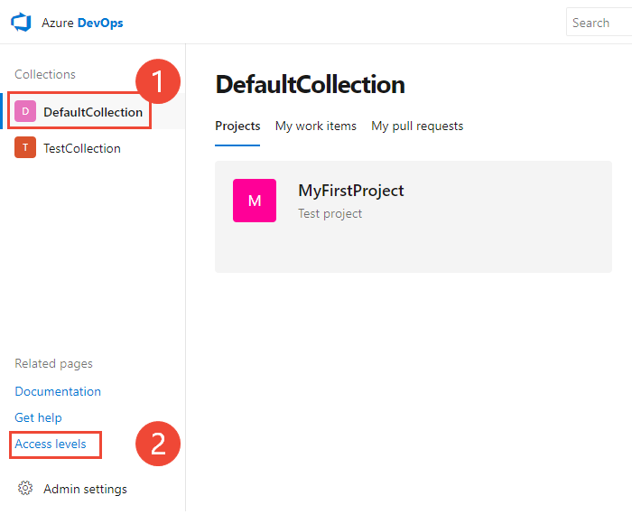
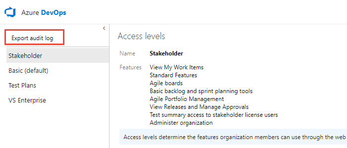

# Export a list of users and their access levels

[!INCLUDE [temp](../../_shared/version-vsts-tfs-all-versions.md)]

<a id="export-audit-log" >  </a>

::: moniker range="azure-devops" 
You can get a list of users and groups that have access to your organization in Azure DevOps by exporting users. The downloaded list also indicates which access level has been granted.
::: moniker-end    

::: moniker range="azure-devops-2019" 
You can get a list of users and groups that have access to your Azure DevOps Server instance by exporting the audit log. The audit log also indicates which access level has been granted.
::: moniker-end    

::: moniker range="<= tfs-2018" 
You can get a list of users and groups that have access to your Team Foundation Server (TFS) instance by exporting the audit log. The audit log also indicates which access level has been granted.
::: moniker-end    

## Prerequisites
::: moniker range="azure-devops" 
* You must be the organization owner or a member of the Project Collection Administrators group. If you aren't a member, get added now. See [Set permissions at the project- or collection-level](/azure/devops/organizations/security/set-project-collection-level-permissions).
  ::: moniker-end    

  ::: moniker range="<= azure-devops-2019" 
* You must be a member of the Team Foundation Administrators group. If you aren't a member, get added now. See [Add administrators to TFS](/azure/devops/server/admin/add-administrator-tfs).
  ::: moniker-end 

#### [Browser](#tab/browser)
 
::: moniker range="azure-devops"

1. Choose the  Azure DevOps logo to open **Projects**. Then choose **Admin settings**. 

	> [!div class="mx-imgBorder"]  
	>   

1. Choose **Users**, and then **Export users**. 

	> [!div class="mx-imgBorder"]  
	> 

::: moniker-end  


::: moniker range="azure-devops-2019"

You can get a list of users and groups that have accessed your Azure DevOps Server instance by exporting the audit log. The audit log also indicates which access level has been granted.  

1. From the web portal home page for a project, choose the  Azure DevOps logo, (1) the project collection, and (2) **Access levels**. 

	> [!div class="mx-imgBorder"]  
	>  

	> [!NOTE]   
	> If you're not a member of the Team Foundation Server Administrators group, the **Access levels** page won't appear. 
	
1. Choose **Export audit log**. 

	> [!div class="mx-imgBorder"]  
	>   

1. The user log file is saved as a .csv file to your Download folder.  

	To determine the access level assigned to each user or group, open the file in Excel.

::: moniker-end


::: moniker range=">= tfs-2017 <= tfs-2018"

You can get a list of users and groups that have access to your TFS instance by exporting the audit log. The audit log also indicates which access level has been granted.  

1. From the web portal home page for a project, choose the  gear icon and select **Server settings**. 

	  

1. Choose **Access levels**, and then **Export audit log**. 

	  

	> [!NOTE]   
	> If you're not a member of the Team Foundation Server Administrators group, the link to the **Access levels** page won't appear. 

2. The user log file is saved as a .csv file to your Download folder.  
	To determine the access level assigned to each user or group, open the file in Excel.

::: moniker-end


::: moniker range="<= tfs-2015"

You can get a list of users and groups that have access to your TFS instance by exporting the audit log. The audit log also indicates which access level has been granted.  

1. From the web portal home page for a project, choose the  gear icon. The URL is similar to `http://myserver:8080/tfs`.

	

1. Choose **Access levels**, and then **Export audit log**. 

	 

	> [!NOTE]   
	> If you're not a member of the Team Foundation Server Administrators group, the **Access levels** page won't appear. 

2. The user log file is saved as a .csv file to your Download folder.  
	To determine the access level assigned to each user or group, open the file in Excel.

::: moniker-end

#### [Azure DevOps CLI](#tab/azure-devops-cli)

::: moniker range="azure-devops"  

<a id="list-users" /> 

### List users

You can list the users in an organization with [az devops user list](/cli/azure/ext/azure-devops/devops/user#ext-azure-devops-az-devops-user-list) command. This does not apply to users that are added via AAD groups.

```CLI
az devops user list [--skip] [--top]
```

#### Parameters

- **skip**: Optional. Number of users to skip.  
- **top**: Optional. Maximum number of users to return. The max value is 10000; the default value is 100.  

#### Other optional parameters

The following parameters are optional for all commands, and not listed in the examples provided in this section. 

- **detect**: Automatically detect organization. Accepted values: false, true. Default is true.
- **org**: Azure DevOps organization URL. You can configure the default organization using az devops configure -d organization=ORG_URL. Required if not configured as default or picked up via git config. Example: `--org https://dev.azure.com/MyOrganizationName/`. 

#### Example

For example, the following command returns 25 users in your organization without skipping any.

```CLI
az devops user list --skip 0 --top 25
```

::: moniker-end

[!INCLUDE [temp](../../_shared/note-cli-not-supported.md)]

* * *

## Related articles

::: moniker range="azure-devops"

- [About access levels](access-levels.md)
- [Manage users and access in Azure DevOps](../accounts/add-organization-users.md) 
- [Azure DevOps Feature Matrix](https://visualstudio.microsoft.com/pricing/visual-studio-online-feature-matrix-vs)
- [Default permissions and access](permissions-access.md). 

::: moniker-end

::: moniker range="<= azure-devops-2019"

- [About access levels](access-levels.md)
- [Change access levels](change-access-levels.md)
- [Azure DevOps Feature Matrix](https://visualstudio.microsoft.com/pricing/visual-studio-online-feature-matrix-vs)
- [Default permissions and access](permissions-access.md). 

::: moniker-end