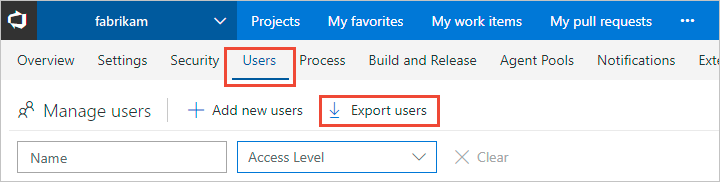

# Export a list of users and their access levels

[!INCLUDE [temp](../../_shared/version-vsts-tfs-all-versions.md)]

::: moniker range="vsts" 

You can get a list of users and groups that have access to your Azure DevOps Services account by exporting the audit log. The audit log also indicates which access level has been granted.   

[!INCLUDE [temp](../../_shared/new-navigation.md)]  

::: moniker-end   

# [New navigation](#tab/new-nav)

::: moniker range="vsts"  

0. Choose the  Azure DevOps logo to open **Projects**. Then choose **Admin settings**. 

	> [!div class="mx-imgBorder"]  
	>   

0. Choose **Users**, and then **Export users**. 

	> [!div class="mx-imgBorder"]  
	> 

::: moniker-end  

::: moniker range="<= tfs-2018"  
[!INCLUDE [temp](../../_shared/new-navigation-not-supported.md)]  

::: moniker-end  

# [Previous navigation](#tab/previous-nav)

::: moniker range="vsts"  

0. Choose the  gear icon and select **Organization settings**.

	> [!div class="mx-imgBorder"]  
	>   

	> [!IMPORTANT]  
	>If you don't see the **Organization settings** option, then you're working from an on-premises TFS. 
	
0. Choose **Users** and **Export users**. 

	  

0. The user log file is saved as a .csv file to your Download folder.   
	To determine the access level assigned to each user or group, open the file in Excel.

::: moniker-end

::: moniker range=">= tfs-2013 <= tfs-2018"

You can get a list of users and groups that have access to your Team Foundation Server (TFS) by exporting the audit log. The audit log also indicates which access level has been granted.  

0. From the web portal home page for a project, choose the  gear icon and select **Server settings**. 

	  

0. Choose **Access levels**, and then **Export audit log**. 

	  

0. The user log file is saved as a .csv file to your Download folder.  
	To determine the access level assigned to each user or group, open the file in Excel.

::: moniker-end

## Related articles

- For a description of access levels, see [About access levels](access-levels.md)
- To manage access levels for Azure DevOps, see [Manage users and access in Azure DevOps](../accounts/add-organization-users.md) 
- To manage access levels for TFS, see [Change access levels](change-access-levels.md)
- For Azure DevOps feature availability, see the [Azure DevOps Feature Matrix](https://visualstudio.microsoft.com/pricing/visual-studio-online-feature-matrix-vs)
- For default feature permission and access assignments, see [Default permissions and access](permissions-access.md). 
