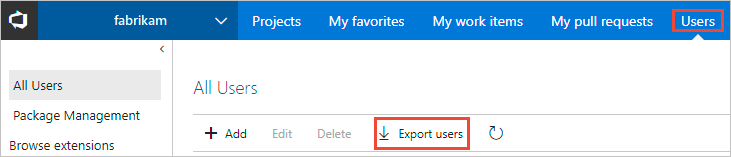

# Export a list of users and their access levels

[!INCLUDE [temp](../../_shared/version-vsts-tfs-all-versions.md)]

<a id="export-audit-log" >  </a>

::: moniker range="vsts" 

You can get a list of users and groups that have access to your Visual Studio Team Services (VSTS) account by exporting the audit log. The audit log also indicates which access level has been granted.   

0. From your web browser, open your VSTS account and click the **Users** hub. 

	For [**Streamlined User Management**](../../project/navigation/preview-features.md), the URL follows this pattern: ```https://{account name}.visualstudio.com/_admin/_users```  

	  

	Otherwise, the URL follows this pattern: ```https://{account name}.visualstudio.com/_users```  

	  

0. The user log file is saved as a .csv file to your Download folder.   
	To determine the access level assigned to each user or group, open the file in Excel.

::: moniker-end

::: moniker range=">= tfs-2013 <= tfs-2018"

You can get a list of users and groups that have access to your Team Foundation Server (TFS) by exporting the audit log. The audit log also indicates which access level has been granted.  

0. From the web portal home page for a team project (for example, ```http://MyServer:8080/tfs/DefaultCollection/MyProject/```), open the Server Settings administration context. 

	  

0. Click **Access levels**, and then click **Export audit log**. 

	  

0. The user log file is saved as a .csv file to your Download folder.  
	To determine the access level assigned to each user or group, open the file in Excel.

::: moniker-end

## Related articles

- For a description of access levels, see [About access levels](access-levels.md)
- To manage access levels for VSTS, see [Manage users and access in VSTS](../accounts/add-account-users-from-user-hub.md) 
- To manage access levels for TFS, see [Change access levels](change-access-levels.md)
- For VSTS feature availability, see the [VSTS Feature Matrix](https://visualstudio.microsoft.com/pricing/visual-studio-online-feature-matrix-vs)
- For default feature permission and access assignments, see [Default permissions and access for VSTS and TFS](permissions-access.md). 
