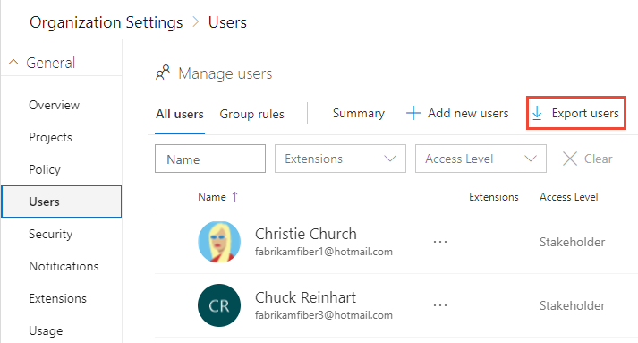
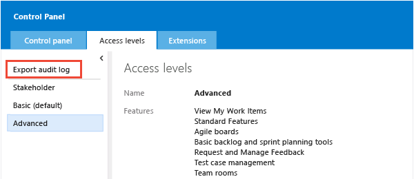

# Export a list of users and their access levels

[!INCLUDE [temp](../../_shared/version-vsts-tfs-all-versions.md)]

::: moniker range="azure-devops" 
You can get a list of users and groups that have access to your organization in Azure DevOps by exporting the audit log. The audit log also indicates which access level has been granted.
::: moniker-end    

::: moniker range="<= azure-devops-2019" 
You can get a list of users and groups that have access to your TFS instance by exporting the audit log. The audit log also indicates which access level has been granted.
::: moniker-end    

## Prerequisites
::: moniker range="azure-devops" 
* You must be the organization owner or a member of the Project collection Administrators group. If you aren't a member, get added now. See [Set permissions at the project- or collection-level](/azure/devops/organizations/security/set-project-collection-level-permissions).
::: moniker-end    
::: moniker range="<= azure-devops-2019" 
* You must be a member of the Team Foundation Administrators group. If you aren't a member, get added now. See [Add administrators to TFS](/azure/devops/server/admin/add-administrator-tfs).
::: moniker-end 

::: moniker range=">= azure-devops-2019"

1. Choose the  Azure DevOps logo to open **Projects**. Then choose **Admin settings**. 

	> [!div class="mx-imgBorder"]  
	>   

0. Choose **Users**, and then **Export users**. 

	> [!div class="mx-imgBorder"]  
	> 

::: moniker-end  

::: moniker range=">= tfs-2017 <= tfs-2018"

You can get a list of users and groups that have access to your TFS instance by exporting the audit log. The audit log also indicates which access level has been granted.  

0. From the web portal home page for a project, choose the  gear icon and select **Server settings**. 

	  

0. Choose **Access levels**, and then **Export audit log**. 

	  

	> [!NOTE]   
	> If you're not a member of the Team Foundation Server Administrators group, the **Access levels** page won't appear. 

0. The user log file is saved as a .csv file to your Download folder.  
	To determine the access level assigned to each user or group, open the file in Excel.

::: moniker-end

::: moniker range="<= tfs-2015"

You can get a list of users and groups that have access to your TFS instance by exporting the audit log. The audit log also indicates which access level has been granted.  

0. From the web portal home page for a project, choose the  gear icon. The URL is similar to `http://myserver:8080/tfs`.

	

0. Choose **Access levels**, and then **Export audit log**. 

	 

	> [!NOTE]   
	> If you're not a member of the Team Foundation Server Administrators group, the **Access levels** page won't appear. 

0. The user log file is saved as a .csv file to your Download folder.  
	To determine the access level assigned to each user or group, open the file in Excel.

::: moniker-end

## Related articles

- For a description of access levels, see [About access levels](access-levels.md)
- To manage access levels for Azure DevOps Services, see [Manage users and access in Azure DevOps](../accounts/add-organization-users.md) 
- To manage access levels for TFS, see [Change access levels](change-access-levels.md)
- For Azure DevOps feature availability, see the [Azure DevOps Feature Matrix](https://visualstudio.microsoft.com/pricing/visual-studio-online-feature-matrix-vs)
- For default feature permission and access assignments, see [Default permissions and access](permissions-access.md). 
