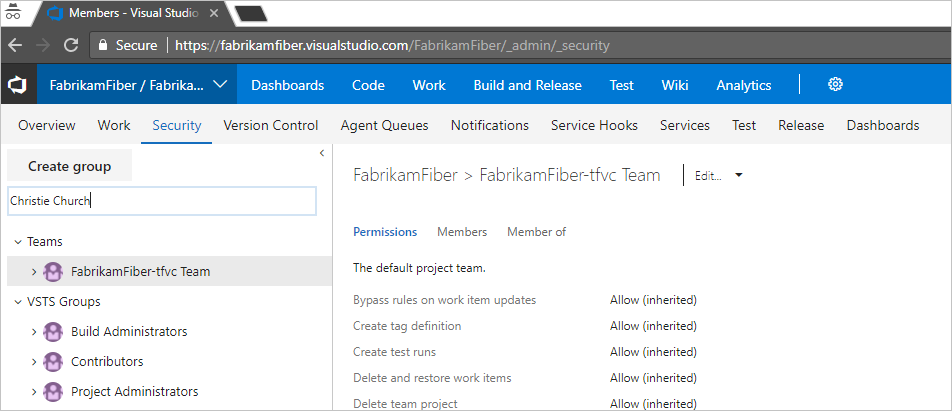
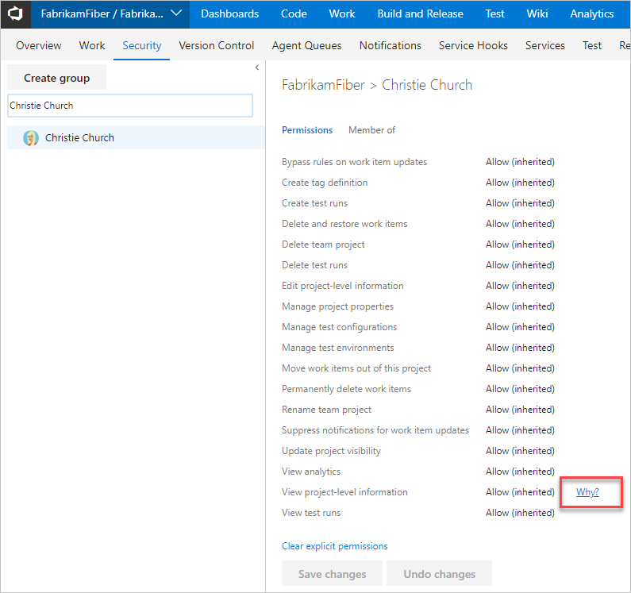

# Troubleshoot tracing permissions

**Azure DevOps**

### Q: Why doesn't a user have access to something?

A 1: Their permissions are specified by multiple groups

If one of your users is having permissions issues and you make use of default security groups or custom groups for permissions, administrators can investigate where those permissions are coming from by making use of our permissions tracing. Users can receive their effective permissions either directly or via groups. By following these steps, administrators can understand where exactly those permissions are coming from and adjust them as needed.

1. Go to the **Security** page for the project that the user is having access problems.

2. Enter their name into the box in the upper left-hand corner.

   

3. You should now have a user-specific view which shows what permissions they have. To trace why a user does or does not have any of the listed permissions, hover over the permission and choose **Why**.

   

4. The resulting trace lets you know how they are inheriting the listed permission. You can then adjust the user's permissions by adjusting those provided to the groups which they are in.

   

A 2: Their permissions haven't propagated yet

It can take from 1 hour to 24 hours for Azure AD group memberships or permissions changes to propagate throughout Azure DevOps. If a user is having issues that do not seem to clear up immediately, please wait a day to see if they resolve.

A 3: The user does not have the necessary access level

Access levels enable administrators to provide their users base access to the features they need, and only pay for those features. Several features can only be accessed with a Basic access level or higher. To assign access levels or check the access level of a user in your account, see the following topics:

* For cloud Azure DevOps: [Manage users and access in Azure DevOps](../accounts/add-organization-users.md) 
* For on-premises Azure DevOps: [Change access levels](/azure/devops/organizations/security/change-access-levels?view=azure-devops)

## Related articles

* [Grant or restrict access to select features and functions](/azure/devops/organizations/security/restrict-access?view=azure-devops)
* [Change individual permissions](/azure/devops/organizations/security/change-individual-permissions?view=azure-devops)