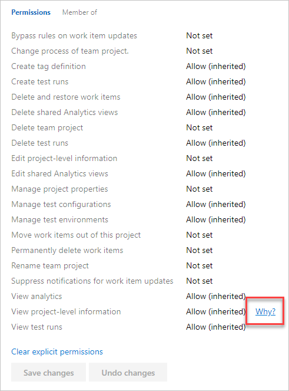

# Trace permissions

[!INCLUDE [version-all](../../includes/version-all.md)]

You use permission tracing to determine why a user's permissions aren't allowing them access. In this article, learn how a user or an administrator can investigate the inheritance of permissions.

For more information, see [About permissions](about-permissions.md).

## Trace a user's specific permission

If a user's having permissions issues and you use default security groups or custom groups for permissions, you can investigate where those permissions are coming from by using our permissions tracing. Permissions issues could be due to one of the following scenarios:

- Their permissions haven't propagated yet. It can take up to 1 hour for Azure AD group memberships or permissions changes to propagate throughout Azure DevOps. If a user's having issues that don't resolve immediately, wait a day to see if they resolve.

- The user doesn't have the necessary access level. Access levels enable administrators to provide their users base access to the features they need, and only pay for those features. Several features can only be accessed with a Basic access level or higher. To assign access levels or check the access level of a user in your account, see the following article.

::: moniker range="azure-devops"

[Manage users and access in Azure DevOps](../accounts/add-organization-users.md) 

::: moniker-end

::: moniker range="< azure-devops"

[Change access levels](/azure/devops/organizations/security/change-access-levels?view=azure-devops)

::: moniker-end

Users can receive their effective permissions either directly or via groups.

By following these steps, administrators can understand where exactly those permissions are coming from and adjust them, as needed.

::: moniker range="azure-devops"

1. Select **Project settings** > **Permissions** > **Users**, and then select the user.

   :::image type="content" source="media/permissions-page-enter-user-name.png" alt-text="Enter user name into filter box":::

   You should now have a user-specific view that shows what permissions they have.

2.  To trace why a user does or doesn't have any of the listed permissions, select the information icon next to the permission in question.

   :::image type="content" source="media/select-information-icon.png" alt-text="Select the information icon next to the permission in question":::

The resulting trace lets you know how they're inheriting the listed permission. You can then adjust the user's permissions by adjusting the permissions that are provided to the groups they're in.

::: moniker-end

::: moniker range="azure-devops-2019 || azure-devops-2020"

1. Select **Project settings** > **Security**, and then enter the user name into the filter box.

   :::image type="content" source="media/security-page-enter-user-name-2019.png" alt-text="Enter user name into the filter box":::

2. You should now have a user-specific view that shows what permissions they have. To trace why a user does or doesn't have any of the listed permissions, hover over the permission and choose **Why**.

   

The resulting trace lets you know how they're inheriting the listed permission. You can then adjust the user's permissions by adjusting the permissions that are provided to the groups they're in.

   :::image type="content" source="media/trace-permission-group-member-inheritance-2019.png" alt-text="Trace showing inherited permissions":::

::: moniker-end

::: moniker range="<= tfs-2018"

1.	Go to the Security page for the project that the user is having access problems.
2.	Enter their name into the box in the upper left-hand corner.
   
   

3.	You should now have a user-specific view that shows what permissions they have. To trace why a user does or doesn't have any of the listed permissions, hover over the permission and choose **Why**.

   :::image type="content" source="media/permissions-list-view-project-level-information.png" alt-text="Select Why to trace the permissions":::

The resulting trace lets you know how they're inheriting the listed permission. You can then adjust the user's permissions by adjusting those provided to the groups they're in.

::: moniker-end

## Related articles

* [Grant or restrict access to select features and functions](/azure/devops/organizations/security/restrict-access?view=azure-devops)
* [Change individual permissions](/azure/devops/organizations/security/change-individual-permissions?view=azure-devops)

