# Get started as a Stakeholder

[!INCLUDE [temp](../../_shared/version-vsts-tfs-all-versions.md)]

::: moniker range="azure-devops" 
With Stakeholder access, you can add and modify work items, manage build and release pipelines, and view dashboards. You can check project status and provide direction, feedback, feature ideas, and business alignment to a team. Stakeholder access is one of several supported access levels. To understand the full set of features Stakeholders have access to, see [About access levels](access-levels.md#stakeholder-access).

> [!NOTE]   
> For public projects, Stakeholder access gives users greater access to work tracking features. To learn more, see [Default roles and access for public projects](../public/default-roles-access-public.md#pipelinesbuild-and-release).
::: moniker-end  

::: moniker range=">= tfs-2017 <= azure-devops-2019"
With Stakeholder access, you can add and modify work items, view and approve pipelines, and view dashboards. You can check project status and provide direction, feedback, feature ideas, and business alignment to a team. Stakeholder access is one of several supported access levels. To understand the full set of features Stakeholders have access to, see [About access levels](access-levels.md#stakeholder-access).
::: moniker-end  

::: moniker range=">= tfs-2013 <= tfs-2015"
With Stakeholder access, you can add and modify work items. You can check project status and provide direction, feedback, feature ideas, and business alignment to a team. Stakeholder access is one of several supported access levels. To understand the full set of features Stakeholders have access to, see [About access levels](access-levels.md#stakeholder-access).

::: moniker-end  

Use this topic to learn:

> [!div class="checklist"]
> * How to sign-in to a project
> * How to add a work item
> * How to view the product backlog and add new work to it
> * How to view work in progress on the Kanban board
> * Find work assigned to you, or query for other work items

For information about working with pipelines, see these articles: 
- [Build your GitHub repository](../../pipelines/get-started-yaml.md)
- [Build OSS repositories](../../pipelines/build/ci-public.md)


## First time signing in

1. Choose the link provided in the email invitation you should have received. Or, open a browser window and enter the URL for the web portal.
	::: moniker range="azure-devops"  
	`http://dev.azure.com/OrganizationName/ProjectName`
	::: moniker-end
	::: moniker range="<= azure-devops-2019"
  	`http://ServerName:8080/tfs/DefaultCollection/ProjectName`  	
  	For example, to connect to the server named *FabrikamPrime* and project named *Contoso*, enter ```http://FabrikamPrime:8080/tfs/DefaultCollection/Contoso```.
	::: moniker-end

2.  Enter your credentials. If you aren't able to sign in, ask the organization owner or project administrator to add you as a member of the project with Stakeholder access. 


<a id="create-work-item">  </a>

## View and add work items
You can start viewing and adding work items once you connect to a project. 

<a id="browser" /> 

::: moniker range=">= azure-devops-2019"
0. (1) Check that you have selected the right project, then (2) choose **Boards>Work Items**. 

	> [!div class="mx-imgBorder"]
	> 

0. Using the drop-down menu, you can focus on relevant items inside a project using one of the seven pivots as described next.  
	<table>
	<tbody valign="top">
	<tr>
	<td>
	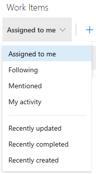
	</td>
	<td>
	<ul>
	<li>**Assigned to me**: lists all work items assigned to you in the project in the order they were last updated. To open or update a work item, simply click its title.</li>
	<li>**Following**: lists work items that you've elected to [follow](../../boards/work-items/follow-work-items.md). </li>
	<li>**Mentioned**: lists work items in which you've been mentioned in the last 30 days. </li>
	<li>**My activity**: lists work items that you have recently viewed or updated.</li>
	<li>**Recently updated**: lists work items recently updated in the project. </li>
	<li>**Recently completed**: lists work items completed or closed in the project.</li>
	<li>**Recently created**: lists work items created within the last 30 days in the project.</li>
	</ul>
	</td>
	</tr>
	</tbody>
	</table>

0. To add a work item, simply choose the work item type from the **New Work Item** drop down menu.  

	For example, here we choose User Story. 

	> [!div class="mx-imgBorder"]
	> 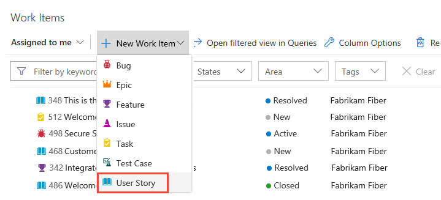

0.	Enter a title and then save the work item. Before you can change the State from its initial default, you must save it. 

	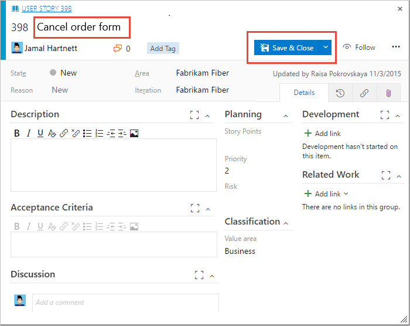

> [!NOTE]  
> A caution icon on a tab indicates values that violate validation rules. You must correct information on that tab in order to save the work item.     
::: moniker-end

::: moniker range="tfs-2017 || tfs-2018"

0. Choose **Work**, choose a work item, for example User Story, from the New Work Item list of options. Choose the  pin icon to have it show up within the **Work** drop down menu.   

	

0. Enter a title and then save the work item. Before you can change the State from its initial default, you must save it. 

	

	> [!NOTE]  
	> A caution icon on a tab indicates values that violate validation rules. You must correct information on that tab in order to save the work item. 
	
	Work items you add are automatically scoped to your team's default area and iteration paths. To change the team context, see [Switch project or team focus](../../project/navigation/go-to-project-repo.md#switch-team-context).    
::: moniker-end

::: moniker range="<= tfs-2015"

0. Choose **Work>Queries**, choose a work item from the **New** drop down menu.

	  

0. Enter a title and then save the work item. Before you can change the State from its initial default, you must save it. 

	Work items you add are automatically scoped to your team's default area and iteration paths. To change the team context, see [Switch project or team focus](../../project/navigation/go-to-project-repo.md#switch-team-context).
::: moniker-end

For descriptions of each field, see [Work item field index](../../boards/work-items/guidance/work-item-field.md). 

> [!NOTE]    
> Depending on the process chosen when the project was created, the types of work items you can create may differ. For example, backlog items may be called user stories ([Agile](../../boards/work-items/guidance/agile-process-workflow.md)), product backlog items ([Scrum](../../boards/work-items/guidance/scrum-process-workflow.md)), or requirements ([CMMI](../../boards/work-items/guidance/cmmi-process-workflow.md)). All three are similar&mdash;they describe the customer value to deliver and the work to be performed. For an overview of all three processes, see [Choose a process](../../boards/work-items/guidance/choose-process.md). 

## Add tags to a work item

Tags are useful for filtering backlogs, boards, and queries

All users granted Stakeholder access for a private project can only [add existing tags to work items](../../boards/queries/add-tags-to-work-items.md), not add new tags. Even if the **Create tag definition** permission for the user is set to Allow. This is part of the Stakeholder access settings. 

::: moniker range="azure-devops"
Azure DevOps Services users granted Stakeholder access for a public project can add new and existing tags to work items. 
::: moniker-end

<a id="check-backlog">  </a> 
## Check the backlog, add work items to the backlog 

Work appears in the backlog in priority order. Work item types may include bugs depending on the settings made for the team. 

::: moniker range=">= azure-devops-2019"

0. (1) Check that you have selected the right project, (2) choose **Boards>Backlogs**, and then (3) select the correct team from the team selector menu. 

	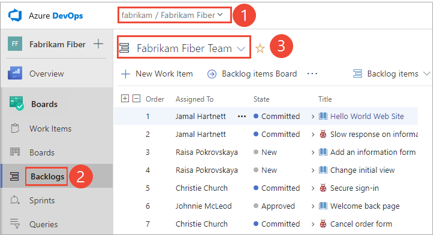

	To choose another team, open the selector and select a different team or choose the  **Browse all sprints** option. Or, you can enter a keyword in the search box to filter the list of team backlogs for the project.

	> [!div class="mx-imgBorder"]  
	> 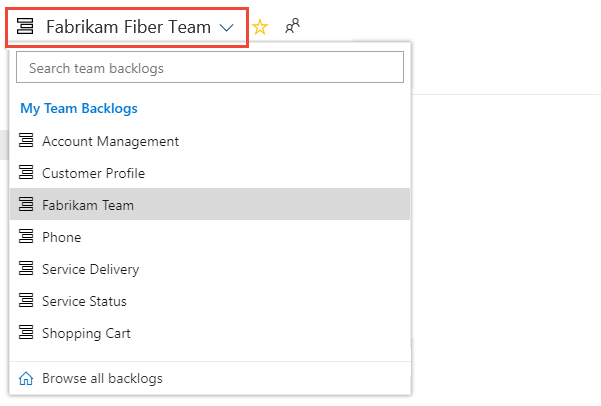 

	> [!TIP]    
	> Choose the  star icon to favorite a team backlog. Favorited artifacts ( favorited icon) appear at the top of the team selector list. 

0. Check that you have selected **Backlog items** (for Scrum), **Stories** (for Agile), or **Requirements** (for CMMI) as the backlog level. 

	> [!div class="mx-imgBorder"]  
	>  

0. (Optional) To choose which columns should display and in what order, choose the  actions icon and select **Column options**. To learn more, see [Change column options](../../boards/backlogs/set-column-options.md). 

	> [!div class="mx-imgBorder"]  
	>  

0. To view or edit a work item, select it and choose **Enter**.

0. To add a work item, choose the **New Work Item**, enter a title and then press the Enter key or choose **Add to top**. 

	> [!div class="mx-imgBorder"]
	> 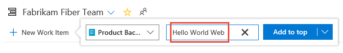 

	Repeat this step to capture all your ideas as work items.  
::: moniker-end


::: moniker range=">= tfs-2017 <= tfs-2018"

0. From your web browser, open your team's product backlog. (1) Select the team from the project/team selector, choose (2) **Work**, (3) **Backlogs**, and then (4) the product backlog, which is **Backlog items** (for Scrum), **Stories** (for Agile), or **Requirements** (for CMMI). 

	> [!div class="mx-imgBorder"]
	>  

	To choose another team, open the project/team selector and select a different team or choose the **Browse** option. 

	> [!div class="mx-imgBorder"]  
	>  

0. To view or edit a work item, select it and choose **Enter**.

0. Add a work item to your backlog by entering a title and choosing **Add**. If you don't see the **Add** link, choose **New** to open the quick add panel. Repeat this step until you've captured all your main ideas. 

	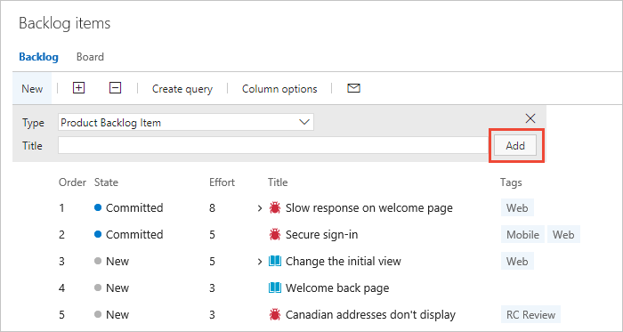 

::: moniker-end
::: moniker range="<= tfs-2015"

0. From your web browser, open your team's product backlog. Select **Boards>Backlogs**. 

	

0. To view or edit a work item, select it and choose **Enter**.

0. To add a work item to your backlog, enter a title and choose **Add**. If you don't see the **Add** link, choose **New** to open the quick add panel. Your items are added to the bottom of the list.  

	 

	Repeat this step until you've captured all your main ideas. 
::: moniker-end


<!---
::: moniker range=">= tfs-2017"
> [!TIP]    
> If you don't see the team or project you want, choose the  Azure DevOps logo to [browse all projects](../../project/navigation/work-across-projects.md). 
::: moniker-end

To add a new item, select the type and then name it. Your items are added to the bottom of the list.  

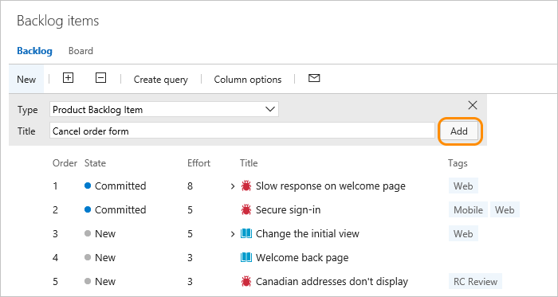  

-->

## Check work in progress

To view the team's progress, open the Kanban board. To view or edit a work item, choose a title and press **Enter**, or double-click the title. 

::: moniker range=">= azure-devops-2019"

0. (1) Check that you have selected the right project, (2) choose **Boards>Boards**, and then (3) select the correct team from the team selector menu. 

	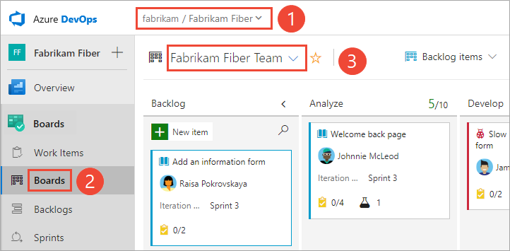  

	To choose another team's board, open the selector and select a different team or choose the  **Browse all team boards** option. Or, you can enter a keyword in the search box to filter the list of team backlogs for the project.

	> [!div class="mx-imgBorder"]  
	>  

	> [!TIP]    
	> Choose the  star icon to favorite a team board. Favorited artifacts ( favorited icon) appear at the top of the team selector list.

0. Check that you have selected **Backlog items** (for Scrum), **Stories** (for Agile), or **Requirements** (for CMMI) as the backlog level. 

	> [!div class="mx-imgBorder"]  
	>  

::: moniker-end


::: moniker range=">= tfs-2017 <= tfs-2018"

0. To view your Kanban board, open your (1) project from a web browser and choose (2) **Work**, (3) **Backlogs**, (4) **Stories**, and then (5) **Board**. 

	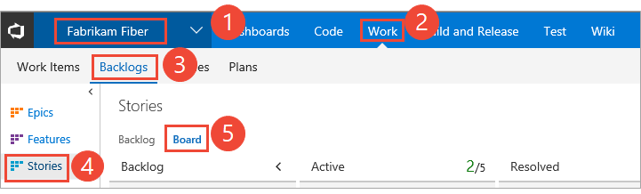

	If you don't see **Work**, your screen size may be reduced. Choose the three dots (), then choose **Work**, **Backlogs**, and then **Board**.   

	   

0.	To choose another team, open the project/team selector and select a different team or choose the **Browse** option.  
	
	> [!div class="mx-imgBorder"]  
	>   

0. Your Kanban board displays. 
	
	   

::: moniker-end   

::: moniker range="<= tfs-2015"

0. To view your Kanban board, open your (1) project from a web browser and choose (2) **Work**, (3) **Backlogs**, (4) **Stories**, and then (5) **Board**. 

	

	If you don't see **Work**, your screen size may be reduced. Choose the three dots (), then choose **Work**, **Backlogs**, and then **Board**.   
	   

0.	To choose another team, open the project/team selector and select a different team or choose the **Browse** option.  

	
	
0. Your Kanban board displays. 
	 
	> [!div class="mx-imgBorder"]  
	>        
	
::: moniker-end   


<a id="query">  </a>

## Find work assigned to you, or query for other work items 

::: moniker range=">= azure-devops-2019"

0. Choose **Boards>Work Items**, and then select **Assigned to me**. 

	> [!div class="mx-imgBorder"]
	> 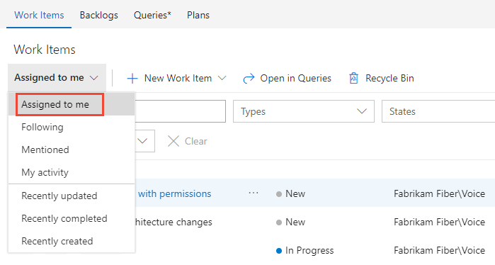

	You can focus on relevant items inside a project using one of the seven pivots as described next. Additionally, you can filter and sort each pivot view. For details, see [View and add work items using the Work Items page](../../boards/work-items/view-add-work-items.md).

0. To query for work items, see [View, run, or email a work item query](../../boards/queries/view-run-query.md).
::: moniker-end    

::: moniker range="<= tfs-2018"

0. Open **Work>Queries** and select **Assigned to me** to see the list of work items assigned to you.  

	  

0. Or, open any of the queries defined in the Shared Queries folder.  

	   

0. And, you can [create new queries or edit existing queries](../../boards/queries/using-queries.md) and save them under My Queries folder.  

	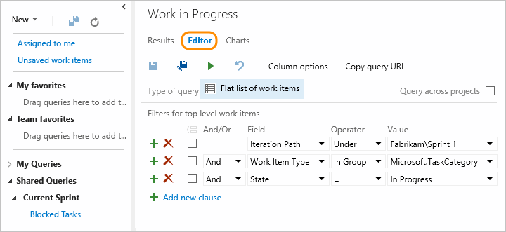  

::: moniker-end

## Related articles

For a comparison chart of Stakeholder vs Basic access, see this [feature matrix](https://azure.microsoft.com/en-us/services/devops/compare-features/). See also these quickstart guides: 

- [Add work items](../../boards/backlogs/add-work-items.md)  
- [Create your backlog](../../boards/backlogs/create-your-backlog.md)
- [Kanban quickstart](../../boards/boards/kanban-quickstart.md) 
- [Provide Stakeholders access to edit build and release pipelines](provide-stakeholder-pipeline-access.md) 

If you want to provide a group of users access to provide feedback, then you don't need to give them Stakeholder access. Instead, simply [give reviewers permissions to provide feedback](../../project/feedback/give-permissions-feedback.md). 