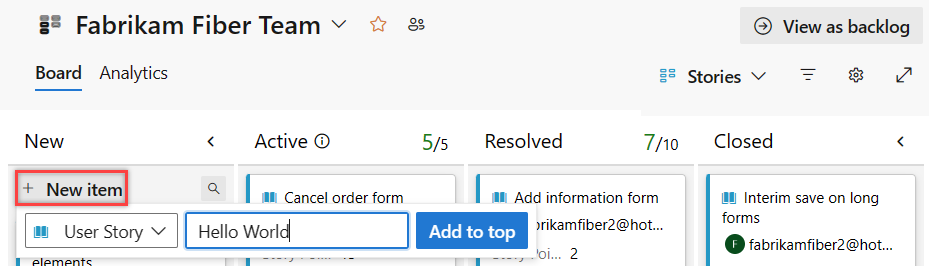
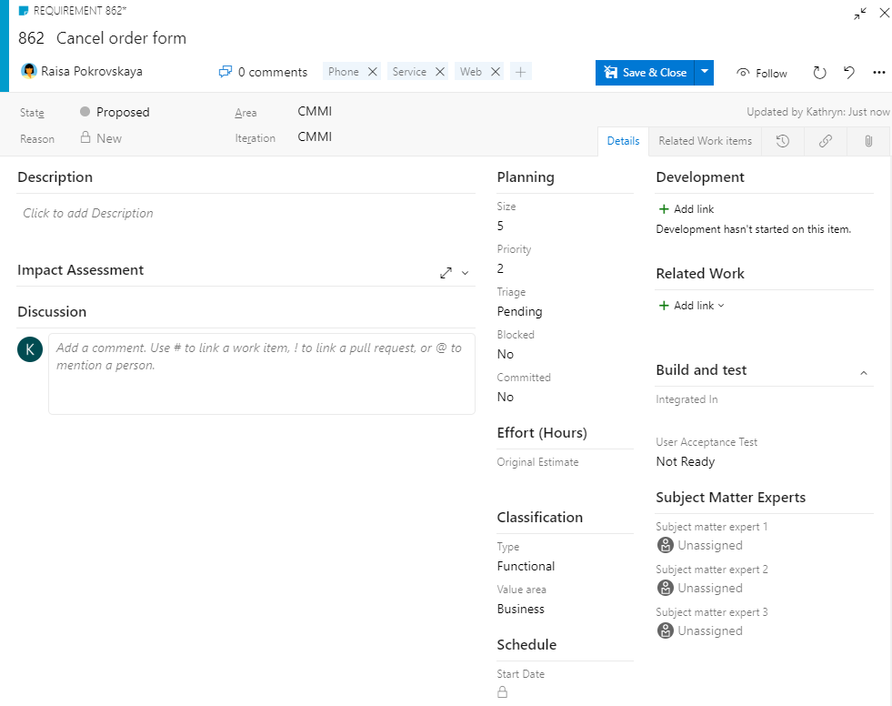
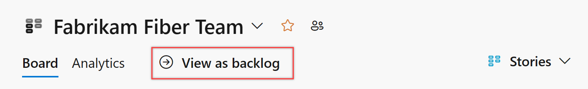
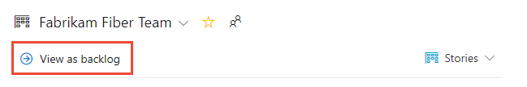
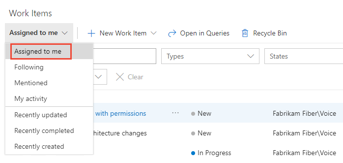
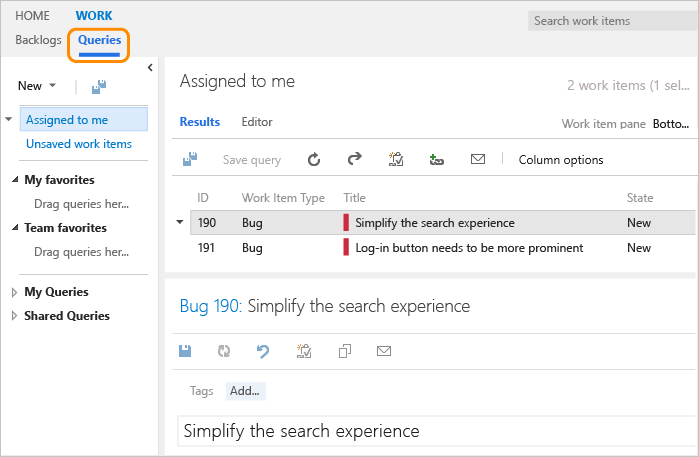

# Get started as a Stakeholder

[!INCLUDE [version-all](../../includes/version-all.md)]

::: moniker range="azure-devops" 

Stakeholders are users with free but limited access to Azure DevOps features and functions. With Stakeholder access, you can add and modify work items, manage build and release pipelines, and view dashboards. You can check project status and provide direction, feedback, feature ideas, and business alignment to a team. For a quick overview of the features available to Stakeholders, see the [Features and functions available to Stakeholders](#features) later in this article.

> [!NOTE]   
> For public projects, Stakeholder access gives users greater access to features. To learn more, see [Default roles and access for public projects](../public/default-roles-access-public.md#pipelinesbuild-and-release). For information about working with pipelines, see these articles: [Build your GitHub repository](../../pipelines/create-first-pipeline.md) and [Build OSS repositories](../../pipelines/repos/index.md).

::: moniker-end  

::: moniker range=">= tfs-2017 < azure-devops"

Stakeholders are users with free but limited access to Azure DevOps features and functions. With Stakeholder access, you can add and modify work items, view and approve pipelines, and view dashboards. You can check project status and provide direction, feedback, feature ideas, and business alignment to a team. 
::: moniker-end  

::: moniker range=">= tfs-2013 <= tfs-2015"

Stakeholders are users with free but limited access to Azure DevOps features and functions. With Stakeholder access, you can add and modify work items. You can check project status and provide direction, feedback, feature ideas, and business alignment to a team. 

::: moniker-end  

::: moniker range="azure-devops"

Stakeholder access is one of several supported access levels as described in [About access levels](access-levels.md#stakeholder-access). To get access as a Stakeholder, ask your organization owner or Project Collection Administrator to [add you to a project with Stakeholder access](../accounts/add-organization-users.md). 

::: moniker-end  

::: moniker range="< azure-devops"

Stakeholder access is one of several supported access levels as described in [About access levels](access-levels.md#stakeholder-access). To get access as a Stakeholder, ask your server administrator to [add you to a security group that has Stakeholder access](change-access-levels.md). 

::: moniker-end  


> [!NOTE]   
> Azure Boards supports several Agile methods such as Kanban and Scrum. Depending on what methods your team uses, you'll want to become familiar with other tools that Azure Boards supports. This article focuses on getting familiar with work items and the Kanban board. For additional information, see [Related articles](#related-articles) at the end of this article.

Use this tutorial to learn how to do the following tasks:

> [!div class="checklist"]
> * Sign in to a project
> * Understand which work item types are available to your project
> * Open the Kanban board and open a work item
> * Add details, tags, or comments to a work item
> * View the product backlog 
> * Find work assigned to you, or query for other work items
> * Understand what features are and aren't available to users with Stakeholder access


## Connect to the web portal of a project 

You must have been added to the Azure DevOps project and been granted Stakeholder or higher access level. 

1. Choose the link provided in the email invitation you should have received. Or, open a browser window and enter the URL for the web portal.
	::: moniker range="azure-devops"  
	`https://dev.azure.com/OrganizationName/ProjectName`
	::: moniker-end
	::: moniker range="< azure-devops"
  	`http://ServerName:8080/tfs/DefaultCollection/ProjectName`  	
  	For example, to connect to the server named *FabrikamPrime* and project named *Contoso*, enter ```http://FabrikamPrime:8080/tfs/DefaultCollection/Contoso```.
	::: moniker-end

2. Enter your credentials. If you can't sign in, ask the organization owner or Project Administrator to add you as a member of the project with Stakeholder access. 


<a id="create-work-item">  </a>

## Understand work items and work item types

Work items support planning and tracking work. Each work item represents an object stored in the work item data store. Each work item is based on a work item type and is assigned an identifier which is unique within an organization or project collection.  Different work items are used to track different types of work as described in [About work items](../../boards/work-items/about-work-items.md). The work item types available to you are based on the [process used when your project was created](../../boards/work-items/guidance/choose-process.md)&mdash;Agile, Basic, Scrum, or CMMI&mdash;as illustrated in the following images.  

[!INCLUDE [temp](../../boards/includes/work-item-types.md)]


## Open your Kanban board from the web portal

You can start viewing work items once you connect to a project.

::: moniker range="azure-devops"

1. Check that you selected the right project, and select **Boards** > **Boards**. Then select the correct team from the team selector menu. 

	> [!div class="mx-imgBorder"]  
	>   

	To select another team's board, open the selector. Then select a different team, or select the  **Browse all team boards** option. Or, you can enter a keyword in the search box to filter the list of team backlogs for the project.

	> [!div class="mx-imgBorder"]  
	>  

	> [!TIP]    
	> Select the :::image type="icon" source="/azure/devops/media/icons/icon-favorite-star.png" border="false"::: star icon to make a team board a favorite. Favorite artifacts (:::image type="icon" source="/azure/devops/media/icons/icon-favorited.png" border="false"::: favorite icon) appear at the top of the team selector list.

1. Check that you selected **Stories** for Agile, **Issues** for Basic, **Backlog items** for Scrum, or **Requirements** for CMMI as the backlog level. 

	> [!div class="mx-imgBorder"]  
	>  

::: moniker-end


::: moniker range="azure-devops-2019 || azure-devops-2020"

1. Check that you selected the right project, and select **Boards** > **Boards**. Then select the correct team from the team selector menu. 

	  

	To select another team's board, open the selector. Then select a different team, or select the  **Browse all team boards** option. Or, you can enter a keyword in the search box to filter the list of team backlogs for the project.

	> [!div class="mx-imgBorder"]  
	>  

	> [!TIP]    
	> Select the :::image type="icon" source="/azure/devops/media/icons/icon-favorite-star.png" border="false"::: star icon to make a team board a favorite. Favorite artifacts (:::image type="icon" source="/azure/devops/media/icons/icon-favorited.png" border="false"::: favorite icon) appear at the top of the team selector list.

1. Check that you selected **Stories** for Agile, **Issues** for Basic, **Backlog items** for Scrum, or **Requirements** for CMMI as the backlog level. 
	Here we have selected **Backlog Items** for the Scrum process.

	> [!div class="mx-imgBorder"]  
	>  

::: moniker-end


::: moniker range=">= tfs-2017 <= tfs-2018"

1. To view your Kanban board, open your project from a web browser. Select **Work** > **Backlogs** > **Stories**, and then select **Board**. 

	

	If you don't see **Work**, your screen size might be reduced. Select the three dots (:::image type="icon" source="/azure/devops/media/ellipses-reduced-screen-size.png" border="false":::) icon. Then select **Work** > **Backlogs** > **Board**.   

	   

1. To select another team, open the project and team selector. Select a different team, or select the **Browse** option.  

   > [!div class="mx-imgBorder"]  
   >   

   Your Kanban board appears. 
	  
      

::: moniker-end   

::: moniker range="<= tfs-2015"

1. To view your Kanban board, open your project from a web browser. Select **Work** > **Backlogs** > **Stories**, and then select **Board**. 

	

	If you don't see **Work**, your screen size might be reduced. Select the three dots (:::image type="icon" source="/azure/devops/media/ellipses-reduced-screen-size.png" border="false":::) icon. Then select **Work** > **Backlogs** > **Board**.   

	   

1. To select another team, open the project and team selector. Select a different team, or select the **Browse** option.  

     

   Your Kanban board appears. 
	 
   > [!div class="mx-imgBorder"]  
   >   

::: moniker-end   


## Add work items 

::: moniker range="azure-devops"

From the Kanban board, you can add work items, open them, and modify them. To add work items, open the backlog by choosing the **Backlog** link. To add a work item, select the :::image type="icon" source="../../media/icons/add-icon.png" border="false"::: plus sign, enter a title, and then press Enter.  

> [!div class="mx-imgBorder"]  
>  

Or, you can add work items to the bottom of the product backlog. Open the backlog by choosing the **Backlog** link.  

::: moniker-end  

::: moniker range="<= azure-devops-2020"

From the Kanban board, you can't add work items, but you can open them and annotate them. To add work items, open the backlog by choosing the **Backlog** link. Also, you can't update the status of a work item by drag-and-drop to a different column or reorder cards within a column. 

::: moniker-end  

<a id="update-status">  </a> 

::: moniker range=">= azure-devops-2020"

## Update status of work items 

As work completes in one stage, update the status of an item by dragging it to a downstream stage. 

  

::: moniker-end  

::: moniker range="azure-devops-2020"
> [!NOTE]   
> The drag-and-drop feature to update the work item state requires installation of Azure DevOps Server 2020.1 update. To learn more, see [Azure DevOps Server 2020 Update 1 RC1 Release Notes, Boards](/azure/devops/server/release-notes/azuredevops2020u1#stakeholders-can-move-work-items-across-board-columns).  
::: moniker-end

## Add details to a work item

::: moniker range=">= tfs-2017" 

To add information to a work item, open it by double-clicking the title or by selecting it and then typing Enter. Change one or more field values, add a description, [add a tag](#tag), or add a comment in the [**Discussion** section](#discussion). You can also choose the  **Attachments** tab and drag-and-drop or upload a file to share with others.  

::: moniker-end

::: moniker range="<= tfs-2015" 

To add information to a work item, open it by double-clicking the title or by selecting it and then typing Enter. Add a description, change one or more field values, or [add a tag](#tag). You can also choose the  **Attachments** tab and upload a file to the work item to share with others.  

::: moniker-end

You can only assign work to a user who has been added to the project. 

> [!NOTE]  
> The work item form you see may differ from those shown in the following images. The basic functionality is the same, however, changes have been made with different versions of Azure DevOps. 
 
#### [Agile process](#tab/agile-process) 

For example, here we assign the story to Raisa Pokrovskaya and we add a discussion note, at-mentioning Raisa. Choose **Save & Close** when done. 

> [!div class="mx-imgBorder"]
> 


#### [Basic process](#tab/basic-process) 

For example, here we assign the issue to Raisa Pokrovskaya and we add a discussion note, at-mentioning Raisa. Choose **Save & Close** when done. 

> [!div class="mx-imgBorder"]
> 


#### [Scrum process](#tab/scrum-process) 

For example, here we assign the Product Backlog Item to Jamal Hartnett and add a description and tags. Choose **Save & Close** when done. 

> [!div class="mx-imgBorder"]
> 


#### [CMMI process](#tab/cmmi-process) 

For example, here we assign the Requirement to Jamal Hartnett. Choose **Save & Close** when done. 

> [!div class="mx-imgBorder"]  
>  

#### CMMI-specific field descriptions

[!INCLUDE [temp](../../boards/includes/section-cmmi-field-descriptions.md)] 

***

### Field descriptions


[!INCLUDE [temp](../../boards/includes/section-basic-field-descriptions.md)] 


<a id="tag" /> 

## Add tags to a work item

Tags are useful for filtering backlogs, boards, and queries. As a Stakeholder, you can add existing tags to a work item, however, you can't add new tags. 

From the web portal, open a work item and choose **Add tag** and type a keyword of an existing tag. Or, select from the list of previously assigned tags.  

::: moniker range=">= tfs-2017"

> [!div class="mx-imgBorder"]
> 
::: moniker-end

::: moniker range=">= tfs-2013 <= tfs-2015"

  
::: moniker-end

Tags that appear in the tag bar are already assigned to the work item. To unassign a tag, choose the x on the tag,.   

::: moniker range="azure-devops"

> [!NOTE]   
> By default, all Contributors and Stakeholders of public projects are granted permissions to add new and existing 
> tags. Stakeholders in private projects can add tags that are already defined, but not add 
> new tags. To grant or restrict permissions to create new tags, you set 
> the permission **Create tag definition** at the project-level. To learn
> more, see [Add administrators, set permissions at the project-level or project collection-level](../security/set-project-collection-level-permissions.md).

::: moniker-end	


[!INCLUDE [temp](../../boards/includes/discussion-tip.md)]


<a id="check-backlog">  </a> 

## Check the backlog and prioritized work  

You can check the product backlog to see how the team has prioritized work. Backlog items appear in priority order. Work item types may include bugs depending on the settings made for the team. 

::: moniker range="azure-devops"

From the Kanban board, choose **View as backlog**.  

> [!div class="mx-imgBorder"]  
>  

::: moniker-end

::: moniker range="azure-devops-2019 || azure-devops-2020"

From the Kanban board, choose **View as backlog**.  

> [!div class="mx-imgBorder"]  
>  

::: moniker-end


::: moniker range="<= tfs-2018"

From the Kanban board, choose **Backlog**.  

> [!div class="mx-imgBorder"]  
>  

::: moniker-end

You should see the list of backlog items listed in priority order. You can add a backlog item which will be placed at the bottom of the list. With Stakeholder access, you can't re-prioritize work. 

To view or edit a work item, select it and choose **Enter**.


<a id="query">  </a>

## Find work assigned to you, or query for other work items 

::: moniker range=">= azure-devops-2019"

1. Choose **Boards>Work Items**, and then select **Assigned to me**. 

	> [!div class="mx-imgBorder"]
	> 

	You can focus on relevant items inside a project using one of the seven pivots as described next. Additionally, you can filter and sort each pivot view. For details, see [View and add work items using the Work Items page](../../boards/work-items/view-add-work-items.md).

1. To query for work items, see [View, run, or email a work item query](../../boards/queries/view-run-query.md).
   ::: moniker-end    

::: moniker range="<= tfs-2018"

1. Open **Work>Queries** and select **Assigned to me** to see the list of work items assigned to you.  

	  

1. Or, open any of the queries defined in the Shared Queries folder.  

	   

2. And, you can [create new queries or edit existing queries](../../boards/queries/using-queries.md) and save them under My Queries folder.  

	  

::: moniker-end

<a id="features" /> 

## Features and functions available to Stakeholders

With Stakeholder access, users can create and modify work items and create and save queries. They have limited access to many of the Azure Boards features. They also can view and approve release pipelines and perform administrative tasks when granted administrative permissions or added to an administrative group. 
 
> [!NOTE]
> Stakeholders that choose a feature that's not available to them may in some instances receive an error message indicating that they don't have permissions to complete a task.

::: moniker range="azure-devops"

### Public versus private feature access

Stakeholder access grants access to features differently depending on whether you're working from a private or a public project. To learn more about public projects, see [What is a public project?](../public/about-public-projects.md).  

[!INCLUDE [temp](../../includes/stakeholder-access-table.md)]

::: moniker-end

[!INCLUDE [temp](../../includes/features-not-available-stakeholder.md)]

<a id="related-articles" /> 

## Related articles

For a comparison chart of Stakeholder versus Basic access, see this [feature matrix](https://azure.microsoft.com/services/devops/compare-features/). See also these quickstart guides: 

- [Add work items](../../boards/backlogs/add-work-items.md)  
- [Create your backlog](../../boards/backlogs/create-your-backlog.md)
- [Kanban quickstart](../../boards/boards/kanban-quickstart.md) 
- [Access levels](access-levels.md)
- [Change access levels](change-access-levels.md)