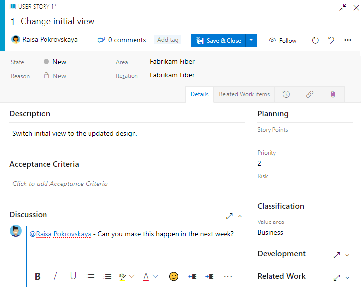

# Get started as a Stakeholder

[!INCLUDE [temp](../../_shared/version-vsts-tfs-all-versions.md)]

::: moniker range="azure-devops" 

Stakeholders are users with free but limited access to Azure DevOps features and functions. With Stakeholder access, you can add and modify work items, manage build and release pipelines, and view dashboards. You can check project status and provide direction, feedback, feature ideas, and business alignment to a team. For a quick overview of the features available to Stakeholders, see the [Features and functions available to Stakeholders](#features) later in this article.

> [!NOTE]   
> For public projects, Stakeholder access gives users greater access to features. To learn more, see [Default roles and access for public projects](../public/default-roles-access-public.md#pipelinesbuild-and-release). For information about working with pipelines, see these articles: [Build your GitHub repository](../../pipelines/get-started-yaml.md) and [Build OSS repositories](../../pipelines/build/ci-public.md).

::: moniker-end  

::: moniker range=">= tfs-2017 <= azure-devops-2019"

Stakeholders are users with free but limited access to Azure DevOps features and functions. With Stakeholder access, you can add and modify work items, view and approve pipelines, and view dashboards. You can check project status and provide direction, feedback, feature ideas, and business alignment to a team. 
::: moniker-end  

::: moniker range=">= tfs-2013 <= tfs-2015"

Stakeholders are users with free but limited access to Azure DevOps features and functions. With Stakeholder access, you can add and modify work items. You can check project status and provide direction, feedback, feature ideas, and business alignment to a team. 

::: moniker-end  

Stakeholder access is one of several supported access levels as described in [About access levels](access-levels.md#stakeholder-access). 
 

> [!NOTE]   
> Azure Boards supports several Agile methods such as Kanban and Scrum. Depending on what methods your team uses, you'll want to become familiar with other tools that Azure Boards supports. This article focuses on getting familiar with work items and the Kanban board. For additional information, see [Related articles](#related-articles) at the end of this article.

Use this tutorial to learn how to do the following tasks:

> [!div class="checklist"]
> * Sign in to a project
> * Understand which work item types are available to your project
> * Open the Kanban board and add a work item
> * Add details, tags, or comments to a work item
> * View the product backlog 
> * Find work assigned to you, or query for other work items
> * Understand what features are and aren't available to users with Stakeholder access


## Connect to the web portal of a project 

You must have been added to the Azure DevOps project and been granted Stakeholder or higher access level. 

1. Choose the link provided in the email invitation you should have received. Or, open a browser window and enter the URL for the web portal.
	::: moniker range="azure-devops"  
	`http://dev.azure.com/OrganizationName/ProjectName`
	::: moniker-end
	::: moniker range="<= azure-devops-2019"
  	`http://ServerName:8080/tfs/DefaultCollection/ProjectName`  	
  	For example, to connect to the server named *FabrikamPrime* and project named *Contoso*, enter ```http://FabrikamPrime:8080/tfs/DefaultCollection/Contoso```.
	::: moniker-end

2. Enter your credentials. If you can't sign in, ask the organization owner or Project Administrator to add you as a member of the project with Stakeholder access. 


<a id="create-work-item">  </a>

## Understand work items and work item types

Work items support planning and tracking work. Each work item represents an object stored in the work item data store. Each work item is based on a work item type and is assigned an identifier which is unique within an organization or project collection.  Different work items are used to track different types of work as described in [About work items](../../boards/work-items/about-work-items.md). The work item types available to you are based on the [process used when your project was created](../../boards/work-items/guidance/choose-process.md)&mdash;Agile, Basic, Scrum, or CMMI&mdash;as illustrated in the following images.  

[!INCLUDE [temp](../../boards/_shared/work-item-types.md)]


## Open your Kanban board from the web portal

You can start viewing and adding work items once you connect to a project. The easiest way to add work items is through the backlog or Kanban board.  Here we show how to add work through a Kanban board. 

::: moniker range="azure-devops"

1. Check that you selected the right project, and select **Boards** > **Boards**. Then select the correct team from the team selector menu. 

	> [!div class="mx-imgBorder"]  
	>   

	To select another team's board, open the selector. Then select a different team, or select the  **Browse all team boards** option. Or, you can enter a keyword in the search box to filter the list of team backlogs for the project.

	> [!div class="mx-imgBorder"]  
	>  

	> [!TIP]    
	> Select the  star icon to make a team board a favorite. Favorite artifacts ( favorite icon) appear at the top of the team selector list.

1. Check that you selected **Stories** for Agile, **Issues** for Basic, **Backlog items** for Scrum, or **Requirements** for CMMI as the backlog level. 
	> [!div class="mx-imgBorder"]  
	>  

::: moniker-end


::: moniker range="azure-devops-2019"

1. Check that you selected the right project, and select **Boards** > **Boards**. Then select the correct team from the team selector menu. 

	  

	To select another team's board, open the selector. Then select a different team, or select the  **Browse all team boards** option. Or, you can enter a keyword in the search box to filter the list of team backlogs for the project.

	> [!div class="mx-imgBorder"]  
	>  

	> [!TIP]    
	> Select the  star icon to make a team board a favorite. Favorite artifacts ( favorite icon) appear at the top of the team selector list.

1. Check that you selected **Stories** for Agile, **Issues** for Basic, **Backlog items** for Scrum, or **Requirements** for CMMI as the backlog level. 
	Here we have selected **Backlog Items** for the Scrum process.

	> [!div class="mx-imgBorder"]  
	>  

::: moniker-end


::: moniker range=">= tfs-2017 <= tfs-2018"

1. To view your Kanban board, open your project from a web browser. Select **Work** > **Backlogs** > **Stories**, and then select **Board**. 

	

	If you don't see **Work**, your screen size might be reduced. Select the three dots () icon. Then select **Work** > **Backlogs** > **Board**.   

	   

1. To select another team, open the project and team selector. Select a different team, or select the **Browse** option.  

   > [!div class="mx-imgBorder"]  
   >   

   Your Kanban board appears. 
	  
      

::: moniker-end   

::: moniker range="<= tfs-2015"

1. To view your Kanban board, open your project from a web browser. Select **Work** > **Backlogs** > **Stories**, and then select **Board**. 

	

	If you don't see **Work**, your screen size might be reduced. Select the three dots () icon. Then select **Work** > **Backlogs** > **Board**.   

	   

1. To select another team, open the project and team selector. Select a different team, or select the **Browse** option.  

     

   Your Kanban board appears. 
	 
   > [!div class="mx-imgBorder"]  
   >   

::: moniker-end   


## Add work items to a product backlog 

From the Kanban board, you can add work items. However, with Stakeholder access, you can't update the status of a work item by drag and drop to a different column. 

#### [Agile process](#tab/agile-process) 

1. From the User Stories board, choose **New item** and start adding those stories you want to track. 

	> [!div class="mx-imgBorder"]  
	>  

1. Enter return and the system assigns a work item ID to the user story. 

	> [!div class="mx-imgBorder"]  
	>  

2. Add as many user stories that you want to track. 

#### [Basic process](#tab/basic-process) 

1. From the Issues board, choose **New item** and start adding those issues you want to track. 

	> [!div class="mx-imgBorder"]  
	>  

2. Enter return and the system assigns a work item ID to the issue. 

	> [!div class="mx-imgBorder"]  
	>  

3. Add as many issues that you want to track.  

#### [Scrum process](#tab/scrum-process) 

1. From the Product Backlog Items board, choose **New item** and start adding those Product Backlog Items you want to track. 

	> [!div class="mx-imgBorder"]  
	>  

2. Enter return and the system assigns a work item ID to the issue. 

	> [!div class="mx-imgBorder"]  
	>  

3. Add as many product backlog items that you want to track.  


#### [CMMI process](#tab/cmmi-process) 

1. From the Issues board, choose **New item** and start adding those issues you want to track. 

	> [!div class="mx-imgBorder"]  
	>  

2. Enter return and the system assigns a work item ID to the issue. 

	> [!div class="mx-imgBorder"]  
	>  

3. Add as many requirements that you want to track.  


* * *


## Add details to a work item

::: moniker range=">= tfs-2017" 

To add information to a work item, open it by double-clicking the title or by selecting it and then typing Enter. Change one or more field values, add a description, [add a tag](#tag), or add a comment in the [**Discussion** section](#discussion). You can also choose the  **Attachments** tab and drag-and-drop or upload a file to share with others.  

::: moniker-end

::: moniker range="<= tfs-2015" 

To add information to a work item, open it by double-clicking the title or by selecting it and then typing Enter. Add a description, change one or more field values, or [add a tag](#tag). You can also choose the  **Attachments** tab and upload a file to the work item to share with others.  

::: moniker-end

You can only assign work to a user who has been added to the project. 

> [!NOTE]  
> The work item form you see may differ from those shown in the following images. The basic functionality is the same, however, changes have been made with different versions of Azure DevOps. 
 
#### [Agile process](#tab/agile-process) 

For example, here we assign the story to Raisa Pokrovskaya and we add a discussion note, at-mentioning Raisa. Choose **Save & Close** when done. 

> [!div class="mx-imgBorder"]
> 


#### [Basic process](#tab/basic-process) 

For example, here we assign the issue to Raisa Pokrovskaya and we add a discussion note, at-mentioning Raisa. Choose **Save & Close** when done. 

> [!div class="mx-imgBorder"]
> 


#### [Scrum process](#tab/scrum-process) 

For example, here we assign the Product Backlog Item to Jamal Hartnett and add a description and tags. Choose **Save & Close** when done. 

> [!div class="mx-imgBorder"]
> 


#### [CMMI process](#tab/cmmi-process) 

For example, here we assign the Requirement to Jamal Hartnett. Choose **Save & Close** when done. 

> [!div class="mx-imgBorder"]  
>  

### CMMI-specific field descriptions

<table>
<tbody valign="top">
  <tr>
    <th width="22%">Field</th>
    <th>Usage</th>
  </tr>
  <tr>
    <td>
      <p><a href="../../boards/work-items/guidance/cmmi/guidance-requirements-field-reference-cmmi.md">Impact Assessment</a></p>
    </td>
    <td>
      <p>The customer impact of not implementing this requirement. You might include details from the Kano model about whether this requirement is in the surprise, required, or obvious categories. You capture this information in the rich-text HTML field which corresponds to Impact Assessment.</p>
      <p>
      </p>
    </td>
  </tr>
  <tr>
    <td>
      <p><a href="../../boards/work-items/guidance/cmmi/guidance-requirements-field-reference-cmmi.md">Requirement Type</a> (Required) </p>
    </td>
    <td>
      <p>The kind of requirement to implement. You can specify one of the following values: </p>
      <ul>
        <li><strong>Business Objective</strong></li>
        <li><strong>Feature</strong></li>
        <li><strong>Functional</strong></li>
        <li><strong>Interface</strong></li>
        <li><strong>Operational</strong></li>
        <li><strong>Quality of Service</strong></li>
        <li><strong>Safety</strong></li>
        <li><strong>Scenario</strong></li>
        <li><strong>Security</strong></li>
      </ul>
    </td>
  </tr>
<tr>
    <td><p><a href="../../boards/queries/planning-ranking-priorities.md">Value area</a></p></td>
	<td><p>The area of customer value addressed by the epic, feature, requirement, or backlog item. Values include:</p>
        <ul>
        <li>
            <strong>Architectural </strong>: Technical services to implement business features that deliver solution 
        </li>
        <li>
            <strong>Business</strong>: Services that fulfill customers or stakeholder needs that directly deliver customer value to support the business (Default)
        </li>
      </ul>
</td></tr>
<tr>
    <td><p><a href="../../boards/queries/query-numeric.md">Original Estimate</a> </p></td>
    <td><p>The amount of estimated work required to complete a task. Typically, this field doesn&#39;t change after it is assigned.</p>
<p>You can specify work in hours or in days. There are no inherent time units associated with this field.</p>
</td>
</tr>
<tr>
    <td><p><a href="../../boards/queries/query-by-date-or-current-iteration.md">Start Date/Finish Date</a> </p></td>
    <td><p>The target dates for when the work will start or finish. These fields are filled in by <a href="../../boards/backlogs/office/create-your-backlog-tasks-using-project.md" >Microsoft Project</a> when you use it for scheduling.</p>
<p>You can specify work in hours or in days. There are no inherent time units associated with this field.</p>
</td>
</tr>
  <tr>
    <td>
      <p>
       <a href="../../boards/queries/planning-ranking-priorities.md" >Triage</a> (Required) </p>
    </td>
    <td>
      <p>Indicates the type of triage decision that is pending for the work item. Use this field when the work item is in the Proposed state and specify one of the following values: <strong>Pending</strong> (default), <strong>More Info</strong>, <strong>Info Received</strong>, and <strong>Triaged</strong>.</p>
    </td>
  </tr>
  <tr>
    <td>
      <p>
        <a href="../../boards/queries/planning-ranking-priorities.md">Blocked</a></p>
    </td>
    <td>
      <p>Indicates whether a team member is prevented from making progress toward implementing a requirement or task or resolving a bug, change request, or risk. If an issue has been opened to track a blocking problem, you can create a link to the issue. You can specify <strong>Yes</strong> of <strong>No</strong>.</p>
    </td>
  </tr>
  <tr>
    <td>
      <p>
        <a href="../../boards/queries/planning-ranking-priorities.md" >Committed</a> (Required) </p>
    </td>
    <td>
      <p>Indicates whether the requirement is committed in the project or not. You can specify <strong>Yes</strong> or <strong>No</strong> (default).</p>
    </td>
  </tr>
  <tr>
    <td>
      <p>
        <a href="../../boards/queries/build-test-integration.md" >Integrated In</a>  </p>
    </td>
    <td>
      <p>Product build number that incorporates the requirement, change request, or fixes a bug.</p>
    </td>
  </tr>
  <tr>
    <td>
      <p>
        <a href="../../boards/work-items/guidance/cmmi/guidance-requirements-field-reference-cmmi.md">User Acceptance Test</a> (Required) </p>
    </td>
    <td>
      <p>The status of the user acceptance test for a requirement. You can specify one of the following values:   </p>
          <ul>
            <li><strong>Pass</strong></li>
            <li><strong>Fail</strong></li>
            <li><strong>Not Ready</strong></li>
            <li><strong>Ready</strong></li>
            <li><strong>Skipped</strong></li>
            <li><strong>Info Received</strong></li>
          </ul>
	<p>You specify <strong>Not Ready</strong> when the requirement is in the Active state, and you specify <strong>Ready</strong>when the requirement is in the Resolved state.</p>
    </td>
  </tr>
  <tr>
    <td>
      <p>
        <a href="../../boards/work-items/guidance/cmmi/guidance-requirements-field-reference-cmmi.md">Subject Matter Experts</a> 
      </p>
    </td>
    <td>The names of team members who are familiar with the customer area that this requirement represents.
    </td>
  </tr>
</tbody>
</table>

* * *


### Field descriptions

<table valign="top" width="100%">
<tbody valign="top" >
<tr>
<th width="20%">Field</th>
<th width="80%">Definition</th>
</tr>
<tr>
    <td width="18%"><p><a href="/azure/devops/boards/queries/titles-ids-descriptions">Title</a> </p></td>
	<td><p>Enter a description of 255 characters or less. You can always modify the title later.</p></td></tr>
<tr>
    <td><p><a href="/azure/devops/boards/queries/query-by-workflow-changes">Assigned To</a></p></td>
	<td><p>Assign the work item to the team member responsible for performing the work. Depending on the context you are working in, the drop-down menu will list only team members or contributors to the project.</p></td></tr>
<tr>
    <td><p><a href="/azure/devops/boards/queries/query-by-workflow-changes">State</a></p></td>
	<td><p>When the work item is created, the State defaults to the first state in the workflow. As work progresses, update it to reflect the current state.</p></td></tr>
<tr>
    <td><p><a href="/azure/devops/boards/queries/query-by-workflow-changes">Reason</a></p></td>
	<td><p>Use the default first. Update it when you change state as need. Each State is associated with a default reason.</p></td></tr>
<tr>
    <td><a href="../../boards/queries/query-by-area-iteration-path.md">Area</a></td>
    <td>Choose the area path associated with the product or team, or leave blank until assigned during a planning meeting. To change the dropdown list of areas, see <a href="../settings/set-area-paths.md">Define area paths and assign to a team</a>.</td>
</tr>
<tr>
    <td><a href="../../boards/queries/query-by-area-iteration-path.md">Iteration</a></td>
    <td>Choose the sprint or iteration in which the work is to be completed, or leave it blank and assign it later during a planning meeting. To change the drop-down list of iterations, see <a href="../settings/set-iteration-paths-sprints.md">Define iteration paths (aka sprints) and configure team iterations</a>.</td>
</tr>
<tr>
<td><a href="../../boards/queries/titles-ids-descriptions.md" >Description</a></td> 
<td>Provide enough detail to create shared understanding of scope and support estimation efforts. Focus on the user, what they want to accomplish, and why. Don't describe how to develop the product. Do provide sufficient details so that your team can write tasks and test cases to implement the item.</td> 
</tr>
<tr>
    <td><p><a href="../../boards/queries/titles-ids-descriptions.md">Acceptance Criteria</a> </p></td>
    <td><p>Provide the criteria to be met before the user story can be closed. Before work begins, describe the customer acceptance criteria as clearly as possible. Conversations between the team and customers to define the acceptance criteria will help ensure that your team understands your customers&#39; expectations. The acceptance criteria can be used as the basis for acceptance tests so that you can more effectively evaluate whether an item has been satisfactorily completed.</p>
</td>
</tr>
<tr>
    <td><p><a href="../../boards/queries/planning-ranking-priorities.md">Priority</a></p></td>
	<td><p>A subjective rating of the issue or task it relates to the business. You can specify the following values:</p>
<p><strong>1</strong>: Product cannot ship without the successful resolution of the work item, and it should be addressed as soon as possible.</p>
<p><strong>2</strong>: Product cannot ship without the successful resolution of the work item, but it does not need to be addressed immediately.</p>
<p><strong>3</strong>: Resolution of the work item is optional based on resources, time, and risk.</p>
<p><strong>4</strong>: Resolution of the work item is not required.</p>
</td>
</tr>
<tr>
<tr>
    <td><p><a href="../../boards/queries/planning-ranking-priorities.md">Value Area</a></p></td>
	<td><p>The area of customer value addressed by the epic, feature, requirement, or backlog item. Values include:</p>
        <ul>
        <li>
          <p>
            <strong>Architectural </strong>: Technical services to implement business features that deliver solution 
          </p>
        </li>
        <li>
          <p>
            <strong>Business</strong>: Services that fulfill customers or stakeholder needs that directly deliver customer value to support the business (Default)
          </p>
        </li>
      </ul>
</td>
</tr>
<tr>
<td><a href="../../boards/queries/query-numeric.md">Effort</a><br/>
<a href="../../boards/queries/query-numeric.md">Story Points</a><br/>
<a href="../../boards/queries/query-numeric.md">Size</a>
<td>
<a name="estimates"></a>
Provide a relative estimate of the amount of work required to complete an issue.
<p>Most Agile methods recommend that you set estimates for backlog items based on relative size of work. Such methods include powers of 2 (1, 2, 4, 8) and the Fibonacci sequence (1, 2, 3, 5, 8, etc.). Use any numeric unit of measurement your team prefers. </p>
<p>The estimates you set are used to calculate <a href="../../report/dashboards/team-velocity.md">velocity</a> and <a href="../../boards/sprints/forecast.md">forecast sprints</a>.</p>
</td> 
</tr>
</tbody>
</table>


<a id="tag" /> 

## Add tags to a work item

Tags are useful for filtering backlogs, boards, and queries. As a Stakeholder, you can add existing tags to a work item, however, you can't add new tags. 

From the web portal, open a work item and choose **Add tag** and type a keyword of an existing tag. Or, select from the list of previously assigned tags.  

::: moniker range=">= tfs-2017"

> [!div class="mx-imgBorder"]
> 
::: moniker-end

::: moniker range=">= tfs-2013 <= tfs-2015"

  
::: moniker-end

Tags that appear in the tag bar are already assigned to the work item. To unassign a tag, simply choose the x on the tag,.   

::: moniker range="azure-devops"

> [!NOTE]   
> By default, all Contributors and Stakeholders of public projects are granted permissions to add new and existing 
> tags. Stakeholders in private projects can add tags that are already defined, but not add 
> new tags. To grant or restrict permissions to create new tags, you set 
> the permission **Create tag definition** at the project-level. To learn
> more, see [Add administrators, set permissions at the project-level or project collection-level](../security/set-project-collection-level-permissions.md).

::: moniker-end	


[!INCLUDE [temp](../../boards/_shared/discussion-tip.md)]


<a id="check-backlog">  </a> 

## Check the backlog and prioritized work  

You can check the product backlog to see how the team has prioritized work. Backlog items appear in priority order. Work item types may include bugs depending on the settings made for the team. 

::: moniker range="azure-devops"

From the Kanban board, choose **View as backlog**.  

> [!div class="mx-imgBorder"]  
>  

::: moniker-end

::: moniker range="azure-devops-2019"

From the Kanban board, choose **View as backlog**.  

> [!div class="mx-imgBorder"]  
>  

::: moniker-end


::: moniker range="<= tfs-2018"

From the Kanban board, choose **Backlog**.  

> [!div class="mx-imgBorder"]  
>  

::: moniker-end

You should see the list of backlog items listed in priority order. You can add a backlog item which will be placed at the bottom of the list. With Stakeholder access, you can't re-prioritize work. 

To view or edit a work item, select it and choose **Enter**.


<a id="query">  </a>

## Find work assigned to you, or query for other work items 

::: moniker range=">= azure-devops-2019"

1. Choose **Boards>Work Items**, and then select **Assigned to me**. 

	> [!div class="mx-imgBorder"]
	> 

	You can focus on relevant items inside a project using one of the seven pivots as described next. Additionally, you can filter and sort each pivot view. For details, see [View and add work items using the Work Items page](../../boards/work-items/view-add-work-items.md).

1. To query for work items, see [View, run, or email a work item query](../../boards/queries/view-run-query.md).
   ::: moniker-end    

::: moniker range="<= tfs-2018"

1. Open **Work>Queries** and select **Assigned to me** to see the list of work items assigned to you.  

	  

1. Or, open any of the queries defined in the Shared Queries folder.  

	   

2. And, you can [create new queries or edit existing queries](../../boards/queries/using-queries.md) and save them under My Queries folder.  

	  

::: moniker-end

<a id="features" /> 

## Features and functions available to Stakeholders

With Stakeholder access, users can create and modify work items and create and save queries. They have limited access to many of the Azure Boards features. They also can view and approve release pipelines and perform administrative tasks when granted administrative permissions or added to an administrative group. 
 
> [!NOTE]
> Stakeholders that choose a feature that's not available to them may in some instances receive an error message indicating that they don't have permissions to complete a task.

::: moniker range="azure-devops"

### Public versus private feature access

Stakeholder access grants access to features differently depending on whether you're working from a private or a public project. To learn more about public projects, see [What is a public project?](../public/about-public-projects.md).  

[!INCLUDE [temp](../../_shared/stakeholder-access-table.md)]

::: moniker-end


### Features not available to users with Stakeholder access 

If a Stakeholder needs access to one or more of the following features&mdash;which support the daily work of product owners, team leads, developers, testers, and project administrators&mdash;you need to have <strong>Basic</strong> access.  

::: moniker range="azure-devops"

#### For Private projects:

- Change the priority of an item within a backlog  
- Delete work items or move work items to another project
- Create shared queries, view charts, and modify the home page  
- View Delivery Plans (a Marketplace extension)    
- Access the full set of features under <strong>Pipelines</strong>, <strong>Repos</strong> or <strong>Test Plans</strong>.  

#### For Public projects:

- View Delivery Plans (a Marketplace extension)    
- Access the full set of features under <strong>Repos</strong> or <strong>Test Plans</strong>.

::: moniker-end

::: moniker range="azure-devops-2019"

- Change the priority of an item within a backlog  
- Delete work items or move work items to another project
- Create shared queries, view charts, and modify dashboards 
- View Delivery Plans (a Marketplace extension)
- Access the full set of features under <strong>Pipelines</strong>, <strong>Repos</strong>, <strong>Test Plans</strong>, or <strong>Artifacts</strong>.  

::: moniker-end

::: moniker range="tfs-2018"
- Change the priority of an item within a backlog
- Delete work items 
- Create shared queries, view charts, and modify dashboards  
- View Delivery Plans (a Marketplace extension)    
- Access the full set of features under <strong>Code</strong>, <strong>Build and Release</strong> or <strong>Test</strong>.  
::: moniker-end

::: moniker range="tfs-2017"

- Change the priority of an item within a backlog
- Delete work items 
- Create shared queries, view charts, and modify dashboards  
- View Delivery Plans (a Marketplace extension)
- Access the full set of features provided under <strong>Code</strong>, <strong>Build and Release</strong> or <strong>Test</strong>
- Participate in team rooms, which capture interactive, detailed conversations about the project.  

::: moniker-end

::: moniker range="<= tfs-2015"

- Change the priority of an item within a backlog
- Delete work items 
- Create shared queries, view charts, and modify the home page  
- Access the full set of features provided under <strong>Code</strong>, <strong>Build and Release</strong> or <strong>Test</strong>
- Participate in team rooms, which capture interactive, detailed conversations about the project.  

::: moniker-end

<a id="related-articles" /> 

## Related articles

For a comparison chart of Stakeholder vs Basic access, see this [feature matrix](https://azure.microsoft.com/services/devops/compare-features/). See also these quickstart guides: 

- [Add work items](../../boards/backlogs/add-work-items.md)  
- [Create your backlog](../../boards/backlogs/create-your-backlog.md)
- [Kanban quickstart](../../boards/boards/kanban-quickstart.md) 
- [Access levels](access-levels.md)
- [Change access levels](change-access-levels.md)