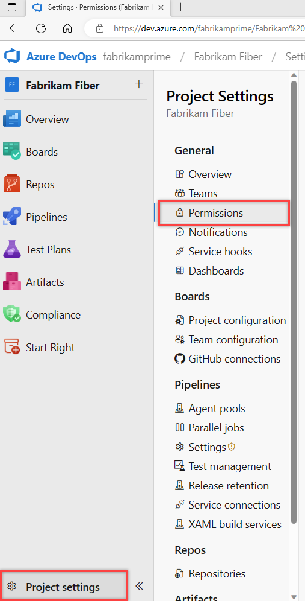
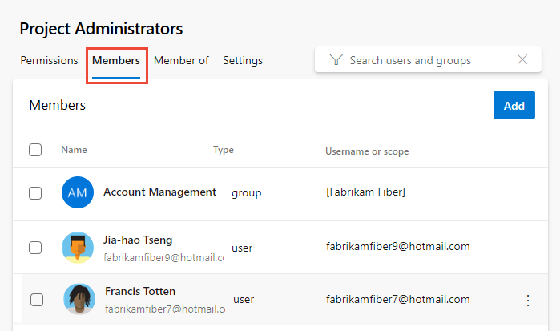
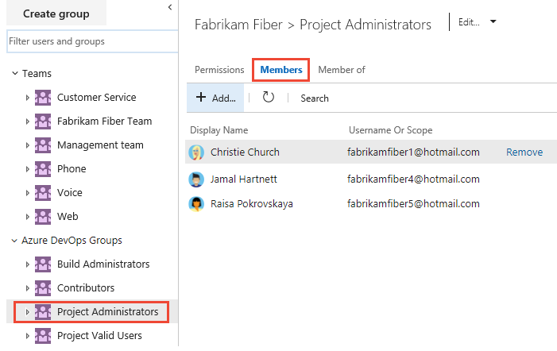

# Look up a project administrator 

[!INCLUDE [version-lt-eq-azure-devops](../../includes/version-lt-eq-azure-devops.md)]

The **Project Administrators** group is the primary administrative security group for a project. Members of this group are authorized to perform the following tasks:

- Delete or rename a project
- Add users and teams to a project
- Manage area paths and iteration paths
- Organize shared query folders
- Adjust group memberships, including adding members to the **Project Administrators** group or other project-level groups
- Control permissions at the project level and for project-defined objects

To add users to the **Project Administrators** group or change a project-level permission, see [Change project-level permissions](change-project-level-permissions.md). 
 
## Prerequisites

[!INCLUDE [prerequisites-project-collection-valid-users-group](../../includes/prerequisites-project-collection-valid-users-group.md)]

## Identify members of the Project Administrators group

Follow these steps to identify members of the **Project Administrators** group.

::: moniker range="azure-devops"

1. Sign in to your project (```https://dev.azure.com/{Your_Organization}/{Your_Project}```).

2. Select **Project settings** > **Permissions**.

	

3. Select **Project Administrators** > **Members**.  

	> [!div class="mx-imgBorder"]  
	>  

::: moniker-end    

::: moniker range="< azure-devops"

1. Sign in to your project (```https://dev.azure.com/{Your_Organization}/{Your_Project}```).

2. Select **Project Settings** > **Security**.

	[](media/view-permissions/open-security-project-level-vert-expanded.png#lightbox) 

3. Select **Members**.

	> [!div class="mx-imgBorder"]  
	>  

The display presents a list of the **Project Administrators** group's members.

::: moniker-end
 
## Next step

> [!div class="nextstepaction"]
> [Add users to a project or team](add-users-team-project.md) 

## Related content

- [Change project-level permissions](change-project-level-permissions.md)
- [Permissions lookup guide](permissions-lookup-guide.md)
- [Default permissions and access](permissions-access.md) 
